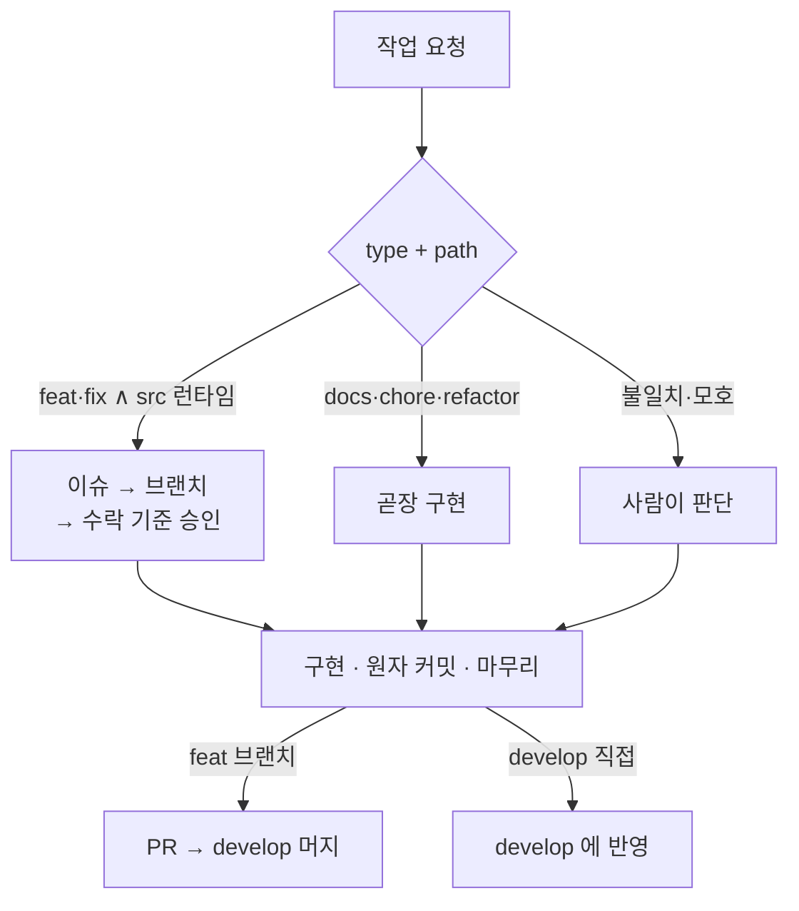
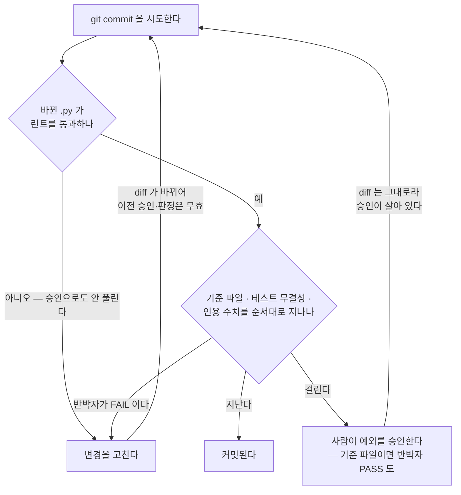

# CLAUDE.md

이 파일은 Claude Code가 이 프로젝트를 이해하기 위한 가이드이다.

## 프로젝트 개요

**다국어 NER(Named Entity Recognition) 파이프라인** — 멀티 백엔드 LLM 지원(OpenAI 호환 API) + BERT 토큰 분류 파인튜닝 + PII 증강 + 크롤링 기반 학습 데이터 생성.

- 한국어: canonical 10종 평면 완성 — NER 5종(PER/LOC/ORG/PROD/EVT) + DAT 은 KLUE 유래(PROD/EVT LLM 재라벨 증분, TI/QT 드롭), PII 4종(EMAIL/PHONE/ID_NUM/CREDIT_CARD)은 합성 주입
- 일본어·베트남어: canonical 10종 평면 = NER 5종(PER/LOC/ORG/PROD/EVT) + PII 5종(DAT/EMAIL/PHONE/ID_NUM/CREDIT_CARD)
- 단일 출처: `docs/manual/data/canonical-entity-schema.md`

## 개발 환경

- **호스트에서 직접 개발** (Docker는 vLLM 등 외부 서비스·server 배포 전용 — 개발 컨테이너는 두지 않는다)
- 패키지 관리자: **UV** (`uv sync` 또는 `uv pip install -e .` 으로 editable install)
- `PYTHONPATH` **설정·주입 금지** — uv editable install이 `.pth`로 `src/`를 `sys.path`에 자동 등록한다
- import 형태(모두 src 접두어 없이): 라이브러리는 `from ner.<모듈>.xxx import Xxx`(labelers·classifier·llm_eval·augmenters·metrics), REST API 서비스는 `from server.xxx import Xxx` (`ner` 와 분리된 top-level 패키지)
- 상세 원리·설정: `docs/wiki/concepts/src-layout-packaging.md`

## 핵심 디렉토리 구조

모듈별 파일·역할은 각 디렉토리의 `CLAUDE.md` 에 있다. 여기는 최상위 배치와 그 문서로 가는 입구만 둔다 — 같은 목록을 두 곳에 두면 한쪽이 반드시 낡는다.

| 경로 | 무엇 | 상세 |
|---|---|---|
| `src/ner/` | NER 라이브러리 — `labelers`·`llm_eval`·`metrics`·`validity`·`augmenters`·`classifier`·`scripts` | `src/ner/CLAUDE.md` (모듈별 문서로 다시 분기) |
| `src/server/` | ja·vi NER REST API — FastAPI · 웹 데모 UI(`static/`). `ner` 와 분리된 top-level 패키지 | `src/server/CLAUDE.md` |
| `docker/` | vLLM 서비스 · server 배포 (개발 컨테이너는 없다) | `docker/CLAUDE.md` |
| `tests/` | 테스트 (`hooks/` 는 검사 게이트 자체의 회귀 안전망) | `tests/ner/CLAUDE.md` · `tests/server/` · `tests/hooks/` |
| `results/` | 벤치마크 산출물 scratch — gitignore·휘발 | §하네스 |
| `certified/` | 커밋된 결과 원장 — 인용 근거 metric JSON (숫자 검사 기준) | §하네스 |
| `docs/wiki/` | 프로젝트 독립적 도메인 지식 | `docs/wiki/schema.md` |
| `docs/specs/` | 개발 규약 | `docs/specs/coding-conventions.md` |
| `docs/manual/` | 구현 레퍼런스 — `src/` 모듈 API·알고리즘 맵 | — |
| `docs/manual/data/` | 데이터 스키마·엔티티 정의·데이터셋 스펙·검증 | `canonical-entity-schema.md` |
| `docs/reports/` | 자유 형식 벤치마크·실험 리포트 (GitHub Issue 무관) | — |
| `docs/issues/` | GitHub Issue별 설계·구현 스냅샷 | `docs/issues/README.md` |

## 개발 3원칙

세 원칙은 **워크플로(진행)**와 **하네스(집행)**의 공통 뿌리다 — 지킬 값만 정하고, 집행 기제는 아래 두 섹션이 맡는다. 다만 **셋 중 무엇도 하네스가 통째로 집행하지는 않는다.** 게이트는 diff 의 글자만 읽으므로, 원칙이 깨졌을 때 diff 에 흔적이 남는 경우(테스트를 지웠나 · 기준 파일을 건드렸나 · 라벨과 브랜치가 어긋나나)만 잡는다. 원칙 자체를 지켰는지는 사람과 에이전트가 본다.

- **원자 단위**: 한 번의 요청은 검증 가능한 최소 기능 단위로 처리한다.
- **검증 의무**: 테스트 통과 + `docs/` 반영 없이는 완료가 아니다. 게이트는 둘 다 확인하지 않으므로(§하네스) 직접 돌려서 확인한다.
- **분해는 사람 주도**: 단일 단계로 검증이 어려우면 작업자에게 먼저 분해 방식을 묻는다.

## 워크플로 (작업 진행)

워크플로는 작업 하나가 할당돼 끝날 때까지의 **진행 경로**다. "다음에 뭘 하지?"에만 답한다 — 무엇을 통과시킬지는 §하네스가 따로 맡는다. §개발 3원칙이 이 진행 전체에 적용된다.



갈래는 작업자가 아니라 **type + path** 가 정한다 — type 은 커밋 종류(`feat` 새 기능·`fix` 버그·`docs` 문서·`chore` 잡무·`refactor` 구조 개선, 뒤 셋은 동작 불변), path 는 `src/**` 런타임(`ner` 라이브러리·`server` 서비스)을 건드리나.

**feat·fix ∧ src 런타임** 갈래는 이슈가 전제된다 — 브랜치명이 `issue-N` 을 참조하기 때문이다. `feat/issue-N-slug` 로 분기해 PR 로 `develop` 에 머지한다. **docs·chore·refactor** 는 크기와 무관하게 `develop` 에 직접 커밋하고 PR 을 만들지 않는다 — 별도 리뷰어가 안 붙어 PR 오버헤드가 추적 이득보다 크고, 회귀 게이트는 반박자가 맡기 때문이다. 이 갈래에서 이슈는 선택이라, 추적 가치가 있으면 등록해 `refs #N` 으로 잇고(종결은 수동 close) 아니면 바로 커밋한다. **type↔path 가 어긋나거나**(`feat` 인데 src 런타임을 안 건드렸다, `chore` 인데 건드렸다) 추적 가치가 모호하면 사람에게 넘긴다 — 과소추적은 조용하고 비싼 실패인 반면 과다추적은 시끄럽고 싼 실패라, 모호하면 이슈 쪽으로 기운다.

**작업 단위 결정(이슈 등록 여부)과 수락 기준 승인은 사람이 쥔다** — 에이전트가 자기 작업을 자기 기준으로 채점하지 않게 하기 위해서다. 에이전트는 위 default 를 실행하되, **이 갈래는 기계가 확인하지 않는다** — 브랜치를 팠는지도, 라벨이 옳은지(동작이 바뀌는데 `refactor` 라 붙였나)도 사람이 본다.

구현·원자 커밋·마무리는 공통, 이슈·브랜치·수락 기준만 feat 전용이다. 상세는 §이슈 진행 절차.

## 하네스 (집행)

하네스는 **AI 가 증거를 조작하는 걸 막는 장치**다. 이 프로젝트의 결과물은 실험 점수인데, 점수를 올리는 가장 쉬운 길은 실력이 아니라 재는 자를 바꾸는 것이다 — 정답지를 고치거나, 실패한 테스트를 지우거나, 문서에 없는 숫자를 적거나. 기준을 소유한 사람은 이걸 안 하지만 AI 는 완수 압력을 받으면 한다. 그래서 **아래 규칙은 하나같이 "AI 는 못 하고 사람은 된다"로 갈린다.**

워크플로와는 다른 축이다 — 워크플로가 "무슨 작업이냐"로 갈릴 때 하네스는 **"무엇을 건드렸냐"로 켜진다.** 갈래를 스스로 고르게 두면 이름표를 잘못 붙여 지나칠 수 있으므로, 무엇을 바꿨든 커밋 전 같은 검사를 지난다.

움직이는 부품은 셋뿐이다 — **기계 검사**(게이트가 diff 를 직접 읽는다) · **사람 승인**(막힌 걸 푸는 유일한 수단) · **반박자**(기계가 못 세는 것을 보는 격리 서브에이전트).



### 기계 검사 — 커밋을 실제로 막는 것

`git commit` 직전(`commit_gate.py`, PreToolUse)과 커밋 없이 턴이 끝날 때(`refuter_gate.py`, Stop), 게이트가 diff 를 **직접 읽어** 아래 넷을 순서대로 본다. 모델을 부르지 않으므로 0토큰이고 결과가 매번 같다. **승인이 아니라 반증**이다 — 결정 가능한 것은 모델에게 맡기지 않는다.

| 검사 | 무엇을 | 언제 도나 | 사람 승인으로 풀리나 |
|---|---|---|---|
| ruff | 바뀐 `.py` 린트 | 항상 · 맨 먼저 | ✕ 기계로 고칠 결함이라 예외 대상이 아니다 |
| 기준 파일 | 아래 §기준 파일만 2단계인 이유 의 경로가 바뀜 | ruff 통과 후 항상 | 승인 + 반박자 PASS **둘 다** |
| 테스트 무결성 | `tests/` 에서 **파일별로** test 함수 순삭제 · 무조건 `skip`/`xfail` 추가 · assert 순삭제 (`skipif` 는 환경 조건부라 제외). 전체를 합산하면 한 파일에서 지운 만큼 다른 파일에 채워 상쇄시킬 수 있다 | 기준 파일 미변경 ∧ 승인 파일 없음 | ○ |
| 인용 수치 | `docs/reports`·`docs/issues` **표 안에 새로 등장한** 0–1 소수(0.00–1.9999) ↔ 그 표가 선언한 `certified/` 출처. 이미 그 문서에 있던 값은 새 주장이 아니라 지나간다 (퍼센트·정수 metric 도 대조 밖) | 〃 | ○ |

**넷은 순차라 뒤 둘은 안 돌 수 있다** — 기준 파일을 건드린 diff 는 승인 + 반박자 PASS 로 바로 통과하고, 안 건드렸어도 승인 파일이 있으면 거기서 끝난다. 승인 파일 하나가 그 diff 의 테스트 무결성·인용 수치를 통째로 면제하는 셈인데, 그 면제는 승인받은 변경분에만 붙는다(§막히면).

**게이트가 실행하는 프로그램은 `git` 과 `ruff` 둘뿐이다** — 테스트를 돌리지도, `docs/` 갱신을 보지도 않는다. 깨진 테스트를 둔 커밋은 그대로 통과하므로 통과 여부는 직접 돌려 확인한다.

**게이트는 고장 나면 열린 채 빠진다** — `git` 호출이 실패하면 "변경 없음"으로 읽고 통과시킨다. 게이트 오작동이 커밋을 영구 봉쇄해선 안 되기 때문인데, 그러면 통과가 *검사를 통과했다*인지 *검사가 못 돌았다*인지 구별되지 않는다. 그래서 그때는 사유를 화면(`[gate] Some checks could not run…`)과 `log.jsonl` 양쪽에 남긴다 — 이 문구가 보이면 통과를 신뢰하지 말고 diff 를 직접 본다.

**커밋 직전이 주 진입점이다** — 커밋을 마친 턴에는 미커밋 diff 가 없어, Stop 만으로는 한 턴에 고치고 커밋까지 하면 검사 대상이 사라진다. 커밋 직전에는 `git add` 된 새 파일도 diff 에 잡혀, 새로 만드는 이슈 문서의 인용 표까지 범위에 든다.

### 막히면 — 사람 승인 파일 하나

오탐이거나 정당한 예외면 **사람이** 파일을 만들어 푼다. 차단 메시지가 명령을 그대로 찍어주므로 복사해 실행하면 된다.

```bash
touch .omc/state/refuter/human-allow-<diff_hash>
```

이름의 해시가 그 변경분의 지문이라 **코드가 한 글자만 바뀌어도 이전 승인은 자동 무효**다 — 한 번 풀어두고 계속 우회할 수 없다. AI 의 Write/Edit 은 `settings.json` deny 지만 셸 `touch` 는 안 막히므로 speed-bump 이지 기계 보증은 아니다(`certified/**` 편집 거부도 같은 성격 — 둘 다 도구만 막고 셸 경로는 열려 있다).

### 기준 파일만 2단계인 이유

정답·채점규칙·분할은 실험을 재는 **자**다 — 바뀌면 전후 점수를 나란히 못 놓으므로 비교하려면 고정돼야 한다(코드: `src/ner/validity/CLAUDE.md`).

- **정답(gold)**: 라벨 인벤토리·경계. 판별 — *같은 문장의 정답이 달라지나?*
- **채점규칙(metric)**: 매치 기준(strict span)·집계(pooled micro-avg)·분산 게이트. 판별 — *예측을 안 바꾸고 이것만 바꿔도 숫자가 움직이나?*
- **분할(split)**: 파티션·group-key·누출. 판별 — *test 문장이 train 으로 가거나 정보가 새나?*

어느 쪽인지는 사람이 아니라 **기준 파일**이 정한다. 목록은 좁게 잡는다 — 넓히면 리팩터·주석까지 매번 잠겨 확인이 허울이 된다.

| 무엇 | 잠그는 것 (정본: `gate_core.py` 의 `RULER_PATHS`·`RULER_DIRS`) |
|---|---|
| 정답 | `docs/manual/data/canonical-entity-schema.md` — **절 단위 면제 없이 파일 전체**. 면제 구간을 변경 후 파일에서 구하는 이상 면제될 절을 새로 만들며 그 안에 정의를 넣는 경로가 열리므로, 오탐을 줄이는 방법은 면제가 아니라 이 문서에 기록·맥락 절을 두지 않는 것이다 |
| 채점규칙 | `src/ner/metrics/`·`src/ner/validity/` **패키지 안의 모든 `.py`** — 파일을 열거하면 새 파일이 생겨도 목록이 조용히 낡는다. 둘 다 변경이 드물어 통째로 잡아도 과잉 잠금이 안 된다 |
| 분할 | `src/ner/classifier/data_utils.py`, `kfold_pool.py` — 이 패키지는 학습·분석 코드가 섞여 있어 파일로 적는다. **채점에 닿는 파일을 새로 만들면 목록도 함께 갱신해야 한다** |

**결과 장부(`certified/`)는 이 표에 없다 — 다른 기제로 잠긴다.** 게이트가 아니라 `settings.json` 이 AI 의 Write/Edit 을 거부하며(정본은 그 permission deny 목록), 거부 범위는 인용 대조가 증거로 *읽는* 형식(`gate_core.py` 의 `CATALOG_EXT`)과 같아야 하고 어긋나면 `tests/hooks` 가 잡는다. 원장의 설명 문서(`README.md`)는 증거가 아니라 안 잠긴다. **그래서 원장 변경은 2단계를 안 탄다** — 셸 경로(`cp`·`git rm`)는 열려 있어 승인 파일도 반박자 판정도 요구되지 않는다. 앵커는 게이트가 아니라 커밋 diff 를 사람·PR·반박자가 보는 것이다. 원장을 늘리거나 줄이는 커밋은 그래서 diff 에 이유를 남겨야 한다.

기준 파일 셋만 2단계인 것은 반박자가 잡아야 할 위험(gold 변조·분할 누수·"올랐다=개선"의 순환)이 여기 몰려 있고, 어차피 사람이 멈춰 서는 지점이라 추가 마찰이 작기 때문이다. 승인 전에 — 점수를 본 뒤 유리한 정의를 고르지 못하도록 — 새 정의를 먼저 못 박고, 옛 모델을 새 기준으로 다시 재(`clean 동일-test`) 안 건드린 엔티티만 무회귀를 본다. **안 건드리면** 값만 바꾸는 일이라 에이전트가 자율 누적한다.

반박자가 보는 축은 기계가 못 세는 것뿐이다 — 코드 정합성·회귀(숨은 회귀·엣지케이스) · 측정 타당성(gold 변조·시드/분할 누수·"올랐다=개선"의 순환, 표 밖 산문의 Δ·σ). **FAIL 은 "결함이 있나"가 아니라 "잘못된 통과를 만드나"로 정한다** — 안전한 쪽으로 실패하는 것(과도한 차단·현 데이터에서 미발현·공개된 불일치)은 통과시키고 기록만 남기며, 애매하면 FAIL 이다(한 라운드 더 도는 비용이 잘못 통과시키는 비용보다 싸다). 판정 파일은 모델이 쓰므로 위조 가능하며 기계 검사를 대체하지 않는다. 절차·전체 기준은 `refuter` 스킬.

**부르는 지점이 둘이다.** 위는 *결과 시점* — 만들어진 diff 를 반증하고 판정 파일을 남긴다. 기준 파일을 건드릴 이슈는 그 전에 *정의 시점* 으로도 한 번 부른다(§이슈 진행 절차 3단계): 수락 기준에 집행 주체가 있나·기준끼리 모순되지 않나·자를 바꾸고 그 자로 재는 구조가 아닌가. **결과 시점만 두면 잡히는 결함이 이미 만들어진 뒤라 되돌리는 값이 크다** — 특히 "새 규칙을 기준 파일에 넣었는데 그걸 볼 탐지기가 없다" 는 구현이 끝난 다음에야 드러난다.

### 인용 수치의 원장 — `certified/`

리포트가 인용하는 실험만 그 metric JSON 을 `results/`(gitignore·휘발 scratch)에서 `certified/` 로 verbatim 복사해 커밋하고, 이 **커밋된 원장**이 모든 숫자 검사의 기준이다. 표 위에 출처를 선언하면 게이트가 **그 파일·디렉토리 안에서만** 대조한다 — 원장이 커져도 검출력이 유지되고, 그 수치가 어느 실행에서 나왔는지가 문서에 남는다.

**원장은 작게 유지된다 — 크면 검사가 죽는다.** 대조는 "이 값이 원장 어딘가에 있나"를 묻는 존재 검사라, 원장이 커질수록 지어낸 값도 무관한 실험의 값과 우연히 맞아 통과한다. 그래서 채택한 실험만 승격하고, **이미 문서에 실린 수치는 대조 대상이 아니다** — 표를 옮기거나 서식·오타를 고칠 때 그 행이 diff 에 새로 실리지만 새 주장은 아니기 때문이다. 이걸 막으면 옛 리포트를 손볼 때마다 걸리고, 풀려고 과거 실험을 몽땅 승격하면 원장이 부풀어 대조가 무력해진다. 값을 *바꾸면* 바뀐 값은 커밋된 판에 없으므로 그대로 걸린다.

```markdown
<!-- certified: classifier/ko/<run-slug>/pooled_metrics.json -->

| 타입 | P | R | F1 | support |
```

경로는 `certified/` 기준 상대경로이며 디렉토리도 된다. 표 바로 앞 선언이 우선이고, 없으면 문서에 있는 선언 전체가 쓰인다(문서 머리에 한 번만 쓰는 형태). 선언을 아예 안 하면 원장 전체를 뒤지는데, 그러면 무관한 값과 우연히 일치해도 통과하므로 — 원장이 쌓일수록 심해진다 — 선언을 붙이는 편이 낫다. 선언한 경로가 아직 승격돼 있지 않으면 그것도 차단 사유다. 진짜 앵커는 커밋 diff 를 사람·PR·반박자가 보는 것이다(인용 대조 자체도 존재 검사라 거짓 인용을 줄이되 없애진 못한다).

### 게이트를 고칠 때

**`tests/hooks/test_gate.py` 를 먼저 돌린다.** 게이트가 깨지면 조용하다 — 아무것도 안 막히면 평소처럼 커밋될 뿐이라 사람이 못 알아챈다. 그래서 임시 git 저장소에서 차단→승인→해제를 실제로 태워 검사 넷과 승인 파일의 수명(변경분이 바뀌면 무효)을 고정해 둔다.

나머지 내부 동작(연속 차단 상한·재진입 처리·반박자를 자동으로 요구하는 조건)은 두 훅의 docstring 에 있다. 판정·승인 파일은 `.omc/state/refuter/`, 이력은 그 안 `log.jsonl`, 끄기는 `OMC_SKIP_HOOKS=refuter-gate`(두 훅 공통).

## 코딩 컨벤션 (주석/문서 언어)

- `print()` / `logger.*` / 예외 메시지 / argparse `help`: **영문**
- 함수·클래스·모듈 docstring, 인라인 `#` 주석: **한국어**
- **코드·주석·식별자에 이슈/PR 번호·날짜·사람 이름 금지** — 영구 맥락은 커밋 메시지 `refs #N` 또는 `docs/issues/`에만
- 상세 규칙 및 예시: `docs/specs/coding-conventions.md`

## 커밋 컨벤션

- 제목·본문은 **한국어**로 작성
- `type` 접두사만 영문 허용 (`feat`, `fix`, `chore`, `docs`, `build`, `refactor`, `test`)

### 커밋 입도 (granularity)

- **기본값은 "합치기"**: 구현 + 그에 딸린 테스트 + 관련 문서 갱신은 같은 커밋이 기본이다. 분할은 아래 "분할이 정당한 경우" 중 하나에 해당할 때만 한다. 의심스러우면 합친다.
- **하위 작업 체크박스 ≠ 커밋 1개**: 이슈 계획의 체크박스는 *진행 추적 단위*이지 *커밋 단위*가 아니다. 동일 관심사·동일 모듈에서 발생한 변경은 체크박스가 여러 개여도 한 커밋으로 묶는다.
- **파일 수 휴리스틱(3파일=2커밋, 5파일=3커밋 등) 금지**: `git-master` 에이전트 또는 OMC 기본 정책의 파일 수 기반 자동 분할은 이 프로젝트에서 비활성화한다. 분할 기준은 *관심사*와 *독립 revert 가능성*뿐이다.
- **분할이 정당한 경우**(아래 중 하나라도 해당될 때만 분리):
  - 서로 다른 모듈/패키지(`labelers/` vs `classifier/` vs `augmenters/` 등)에 걸친 변경
  - 코드 변경과 무관한 대규모 문서 정리(라벨 영문화 일괄 치환 등)
  - 의존성·빌드 설정 변경(`pyproject.toml`, `uv.lock`)이 코드 변경과 분리해도 빌드가 깨지지 않을 때
  - 한 커밋이 ~500 LOC를 크게 넘고 의미 단위로 나뉠 수 있을 때
- **합치는 것이 옳은 경우**:
  - 같은 모듈의 로직 + 그에 딸린 테스트 + 그에 딸린 문서/스펙 갱신
  - 오타 수정, 링크 채움 같은 수커밋(<5줄) — 다음 의미 있는 커밋에 squash 하거나 일과 종료 시 `docs:` 한 커밋으로 묶기
  - 계획 단계의 체크박스 1·2·3이 모두 같은 함수/CLI 한 개를 만드는 데 필요했을 때
- **서브에이전트 위임 시 커밋 권한 회수**: `executor`·`git-master` 등 서브에이전트에 작업을 위임할 때는 프롬프트에 "커밋은 수행하지 말고 변경만 완료하라"를 명시한다. 커밋은 메인 세션에서 사용자 승인 후 일괄 수행하여, 에이전트 자체 판단으로 인한 잦은 자동 분할을 구조적으로 방지한다.

## docs 운영

- `docs/wiki/` 운영 규칙은 `docwiki` 스킬과 `docs/wiki/schema.md`에 위임. **스킬 본체는 이 저장소가 아니라 전역(`~/.claude/skills/docwiki/SKILL.md`)에 한 벌만 둔다** — 위키 저장소를 `ocr-pipeline` 과 공유하므로, 저장소별 사본을 두면 한쪽만 고쳐진 사본이 같은 위키를 다른 규칙으로 운영하게 된다.
- 코드 변경 후 `docs/manual/`(구현 맵)과 `docs/manual/data/`(데이터 스키마) 최신화 확인.
- **문서 서술 기준과 mermaid 작성 규칙은 이 파일에 두지 않는다.** 저장소마다 같은 문장을 복제하면 사본이 갈라지므로 전역 output style `plain-docs`(`~/.claude/output-styles/plain-docs.md`)에 한 벌만 둔다 — 쉬운 말로 풀어쓰기와 그 판정 기준, 전문용어 첫 등장 풀이, 인과로 풀어쓰기와 형제 섹션 구조, mermaid 로 그리기·흐름도 칸 작성법·CJK 라벨 줄 길이, 터미널 답변에는 mermaid 를 쓰지 않기가 거기 있다.

## 이슈 관리

- **GitHub Issues**(`groovallstar/ner-pipeline`)로 작업 단위를 관리한다. 자동 채번으로 중복을 방지한다. 무엇이 이슈가 되는지는 §워크플로의 type+path 표가 정한다.
- 이슈·리포트 문서의 **표 안** 수치는 `certified/` 원장과 대조된다 — 출처 선언 문법과 대조 범위는 §하네스. 산문·링크·오타만 바꾸는 docs 커밋은 해당 없음.
- 마일스톤은 사용하지 않는다. 영역은 라벨로 구분한다 (`area:labelers`, `area:classifier`, `area:augmenters`, `area:llm-eval`, `area:infra`, `docs` 등).
- 이슈 등록: `gh issue create --title "제목" --body "설명" --label <area>`. 본문 칸은 `.github/ISSUE_TEMPLATE/task.yml` 이 정하지만 **폼은 웹 UI 에서만 강제된다** — `--body` 로 만들면 폼을 지나가므로 왜·목적·성공 기준을 본문에 직접 적는다
- 브랜치명: `feat/issue-{번호}-{짧은-슬러그}` 예) `feat/issue-12-vi-crawler`
- 커밋 메시지: 기존 컨벤션(한국어 제목 + `type(스코프):` 접두사) 유지, 본문 끝에 `refs #12` 참조. 최종 PR 또는 마지막 커밋에는 `closes #12`로 이슈 종결.
- **계획·보고 문서는 GitHub Issue와 `docs/issues/` 양쪽에 모두 남긴다.** Issue는 실시간 협의·승인 기록, `docs/issues/`는 기능 설계·구현 히스토리의 영구 보관 용도. 이슈와 무관한 자유 형식 벤치마크·실험 리포트는 `docs/reports/`에 둔다.
- 이슈 문서는 `docs/issues/issue-{번호}-{슬러그}.md` 단일 파일 — 섹션 구조·템플릿·커밋 시점은 `docs/issues/README.md`.

### 이슈 진행 절차 (경량 5단계, 승인 1회)

1. **등록**: GitHub Issue 작성 — **왜 만드나**(지금 무엇이 문제·공백인가), 목적, 성공 기준(테스트/메트릭), 범위 정리. **왜가 없으면 등록하지 않는다** — 도달 상태만 적힌 이슈는 범위가 흔들릴 때 무엇을 지켜야 하는지, 끝난 뒤 그 작업이 실제로 문제를 없앴는지를 판단할 근거가 없다. 자리·필수 여부는 `docs/issues/README.md` 의 tier 표가 정본이다
2. **브랜치**: `develop`에서 `feat/issue-{N}-slug` 분기
3. **수락 기준 확정 → 정의-시점 반박자 → 승인 요청**: 검증 가능한 acceptance criteria 3~6개를 Issue 본문에 적고 **이 기준 목록에 대해서만** 승인받는다 — 사람이 읽는 게이트는 산문 계획이 아니라 이 짧은 목록이다. test·metric이 걸린 이슈면 기준에 **목표 수치를 명시**한다(형식은 이슈마다 다름 — `certified/*.json` 강제 아님). 하위 작업은 같은 본문에 체크박스로 분해.

   **기준 파일(§하네스)을 건드릴 이슈는 승인 전에 반박자를 정의-시점으로 한 번 부른다**(`refuter` 스킬 §정의-시점 모드). diff 가 아직 없어 게이트가 아니라 리뷰이고 판정 파일도 안 남긴다 — 기준 목록의 *형식*만 본다. 세 가지를 묻는다:
   - **집행 주체** — 기준마다 "무엇이 이걸 검사하나"에 답이 있나. 없으면 구현자가 자기 기준을 자기가 판정하게 되고, 그건 통과한다.
   - **기준 간 모순** — 한 기준이 다른 기준을 불가능하게 만들지 않나.
   - **순환** — 자를 바꾸고 그 자로 재는 구조가 아닌가.

   지적은 사람에게 보고되고 사람이 기준에 반영한 뒤 승인한다. 5단계·커밋 직전의 결과-시점 반박자와는 **다른 호출**이다 — 그쪽은 만들어진 diff 를 반증하지만 이쪽은 만들기 전에 기준의 형식을 반증한다. 앞에서 한 번 부르는 값이 뒤에서 여러 라운드 되돌리는 값보다 싸다.
4. **구현 & 원자 커밋**: 의미 단위로 커밋(체크박스 개수와 무관), 각 커밋 본문에 `refs #N`. 입도 기준은 위 "커밋 입도" 섹션 참조. 구현을 ralph 등 자율 루프로 돌리는 것은 3단계 기준이 기계검증 가능·신뢰되고 작업이 다회차/반복-shape일 때만 — 단발은 "분해는 내가 → 한 스텝만 위임 → 내가 기준으로 검증"이 기본.
5. **마무리**: 테스트 통과 + `docs/` 갱신 확인 → **게이트 통과 확인**(검사는 4단계 각 커밋에서 이미 걸렸다. 기준 파일을 안 건드린 이슈는 마무리에 반박자를 한 번 부를지 사람이 정한다 — FAIL이면 4단계 회귀) → `docs/issues/issue-{N}-{slug}.md`에 설계 + 구현 결과·검증 작성·**최초 커밋** → PR 생성(`closes #N`) → 머지 전 `git status`로 미커밋 파일 확인
