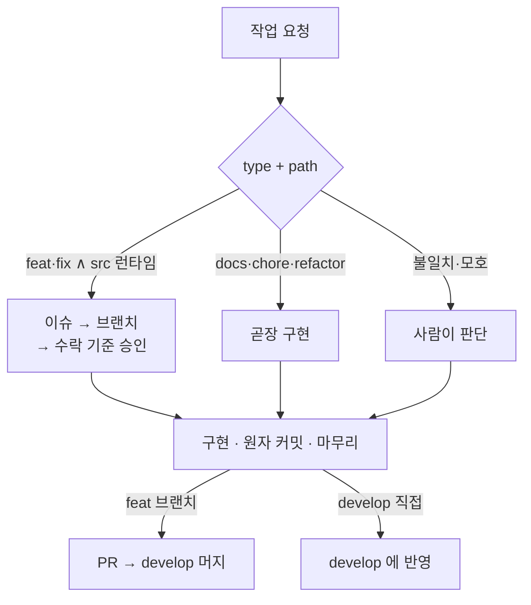
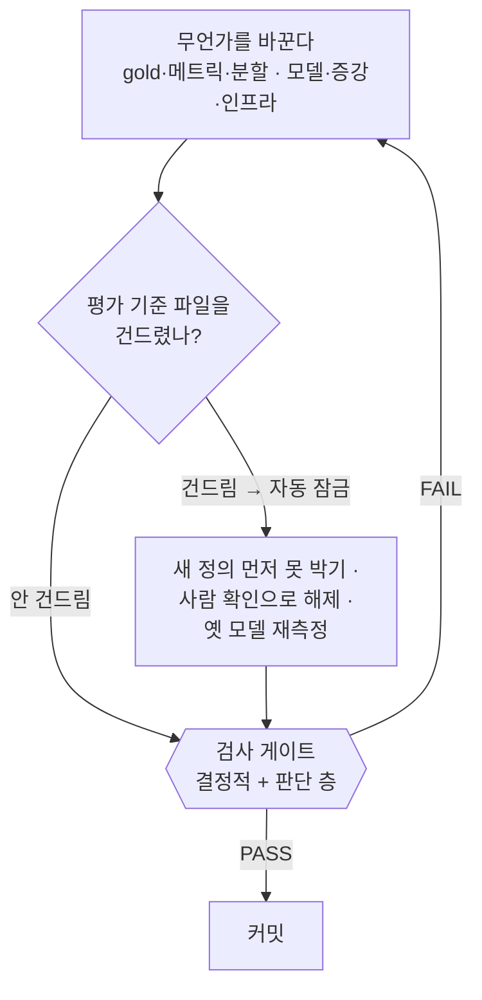

# CLAUDE.md

이 파일은 Claude Code가 이 프로젝트를 이해하기 위한 가이드이다.

## 프로젝트 개요

**다국어 NER(Named Entity Recognition) 파이프라인** — 멀티 백엔드 LLM 지원(OpenAI 호환 API) + BERT 토큰 분류 파인튜닝 + PII 증강 + 크롤링 기반 학습 데이터 생성.

- 한국어: canonical 10종 평면 완성 — NER 5종(PER/LOC/ORG/PROD/EVT) + DAT 은 KLUE 유래(PROD/EVT LLM 재라벨 증분, TI/QT 드롭), PII 4종(EMAIL/PHONE/ID_NUM/CREDIT_CARD)은 합성 주입
- 일본어·베트남어: canonical 10종 평면 = NER 5종(PER/LOC/ORG/PROD/EVT) + PII 5종(DAT/EMAIL/PHONE/ID_NUM/CREDIT_CARD)
- 단일 출처: `docs/manual/data/canonical-entity-schema.md`

## 개발 환경

- **호스트에서 직접 개발** (Docker는 vLLM 등 외부 서비스·server 배포 전용 — 개발 컨테이너는 두지 않는다)
- 패키지 관리자: **UV** (`uv sync` 또는 `uv pip install -e .` 으로 editable install)
- `PYTHONPATH` **설정·주입 금지** — uv editable install이 `.pth`로 `src/`를 `sys.path`에 자동 등록한다
- import 형태(모두 src 접두어 없이): 라이브러리는 `from ner.<모듈>.xxx import Xxx`(labelers·classifier·llm_eval·augmenters·metrics), REST API 서비스는 `from server.xxx import Xxx` (`ner` 와 분리된 top-level 패키지)
- 상세 원리·설정: `docs/wiki/concepts/src-layout-packaging.md`

## 핵심 디렉토리 구조

```
src/ner/
├── labelers/          # NER 라벨링 모듈 (상세: src/ner/labelers/CLAUDE.md)
│   ├── ko/            # 한국어 (vllm, openai)
│   ├── ja/            # 일본어 (vllm, openai)
│   ├── vi/            # 베트남어 (vllm, openai)
│   ├── dataset_loader.py
│   ├── labeler_base.py
│   ├── tag_aligner.py     # BIO 태그 정렬/정규화/span 추출
│   └── hf_ner_labeler.py  # HuggingFace BERT NER 라벨러
├── llm_eval/          # 벤치마크 오케스트레이션 + 리포트 (상세: src/ner/llm_eval/CLAUDE.md)
│   ├── __main__.py
│   ├── benchmark_runner.py  # BenchmarkRunner (한국어 BIO / JA·VI offset-span 공용 러너)
│   ├── report.py            # ReportGenerator (span-match, seqeval, per-entity 테이블)
│   ├── error_analysis.py    # 문장별 오류 유형 분류 CLI
│   └── span_evaluator.py / span_evaluator_cli.py
├── metrics/           # span/BIO 메트릭 공용 구현 (classifier·llm_eval 공유)
│   ├── bio_metrics.py       # seqeval 기반 BIO 레벨 메트릭
│   └── span_metrics.py      # compute_offset_span_f1 등 span 레벨 메트릭
├── augmenters/        # 학습 데이터 증강 (상세: src/ner/augmenters/CLAUDE.md)
│   ├── pii/           # 합성 PII 주입 (suffix/llm 모드, vLLM 교차 검증)
│   └── wikiann_vi/    # WikiANN-vi → canonical 10종 평면 재라벨 + Wikidata 검증
├── classifier/        # JA·VI·KO canonical 10종 평면 BERT 파인튜닝 (상세: src/ner/classifier/CLAUDE.md)
│   ├── __main__.py
│   ├── data_utils.py       # JSONL 로딩, fast(offset-trim)·PhoBERT(pyvi)·JA(slow) tokenizer 분기, BIO↔span 변환
│   └── train_eval.py       # HF Trainer 래퍼, char-offset span F1 (metrics 공용)
└── scripts/           # 보조 스크립트 (eval_ja_ner_test.py 등)
src/server/            # ja·vi NER REST API 서비스 (ner 라이브러리 소비; 상세: src/server/CLAUDE.md)
├── __main__.py
├── app.py             # FastAPI /v1/ner(단일·배치)·/health·/(웹 데모 UI)
├── static/            # 웹 데모 UI (index.html — 자족적 HTML+vanilla JS, 동일 출처)
├── inference.py       # LangModel·ModelRegistry (모델 1회 로드·재사용, char-offset span)
├── config.py          # ServerConfig (환경변수 로드)
├── concurrency.py     # ConcurrencyGuard (동시성 세마포어·과부하 429)
├── detect.py          # 언어 자동감지 (가나→ja, vi 전용 결합부호→vi, 그 외→unsupported)
├── chunking.py        # 긴 입력 문장분할 + offset 보존
└── scripts/           # 로컬 실행·스모크·처리량·언어감지 벤치 스크립트
docker/
├── server/            # ja·vi NER REST API 배포 (상세: docker/server/CLAUDE.md)
└── vllm/              # vLLM 서비스
results/               # 벤치마크 산출물 scratch (gitignore·휘발)
certified/             # 커밋된 결과 원장 — 인용 근거 metric JSON (숫자 검사 기준)
tests/                 # 테스트 (ner: tests/ner/CLAUDE.md · server: tests/server/)
docs/                  # 문서
│   ├── wiki/          # 프로젝트 독립적 도메인 지식 (상세: docs/wiki/schema.md)
│   ├── specs/         # 개발 규약 (코딩 컨벤션)
│   ├── manual/        # 프로젝트 구현 레퍼런스 (src/ 모듈 API·알고리즘 맵)
│   │   └── data/      # 데이터 스키마·엔티티 정의·데이터셋 스펙·데이터 검증
│   ├── reports/       # 자유 형식 벤치마크·실험 리포트 (GitHub Issue 무관)
│   └── issues/        # GitHub Issue별 plan/report 스냅샷
```

## 주요 CLI 엔트리포인트

**모든 `python -m` 진입점의 단일 색인이다** — 사람이 직접 돌리는 워크플로 명령어를 여기 모은다. 위 디렉토리 트리는 구조만 보여줄 뿐 실행 명령어를 담지 않으니, 새 진입점이 생기면 이 목록에 더한다.

- `python -m ner.llm_eval` — LLM NER 벤치마크 (ko/ja/vi 공용)
- `python -m ner.classifier --lang {ja,vi,ko}` — BERT 파인튜닝·평가 (canonical 10종 평면; `--group-key orig` 로 누출 없는 group K-fold)
- `python -m ner.validity {std,repro,compare}` — K-fold 분산·비교타당성 게이트 (fold σ · 시드-반복 σ_repro · 비교 판정; 상세: `src/ner/validity/CLAUDE.md`)
- `python -m ner.augmenters.pii` — 합성 PII 주입
- `python -m ner.augmenters.wikiann_vi` — WikiANN-vi canonical 10종 평면 재라벨 (상세: `docs/manual/data/canonical-entity-schema.md`)
- `python -m server` — ja·vi NER REST API 서버 (uvicorn; 상세: `src/server/CLAUDE.md`)

상세 옵션은 각 모듈의 `--help` 또는 `src/**/CLAUDE.md` 참조.

## 개발 3원칙

세 원칙은 **워크플로(진행)**와 **하네스(집행)**의 공통 뿌리다 — 지킬 값만 정하고, 집행 기제는 아래 두 섹션이 맡는다. 그래서 셋의 성격이 갈린다 — 검증 의무·분해는 사람 주도는 하네스가 그대로 집행하고, 원자 단위는 하네스가 안 보는 커밋 입도(워크플로)에서 산다.

- **원자 단위**: 한 번의 요청은 검증 가능한 최소 기능 단위로 처리한다.
- **검증 의무**: 테스트 통과 + `docs/` 반영 없이는 완료가 아니다.
- **분해는 사람 주도**: 단일 단계로 검증이 어려우면 작업자에게 먼저 분해 방식을 묻는다.

## 워크플로 (작업 진행)

워크플로는 작업 하나가 할당돼 끝날 때까지의 **진행 경로**다. "다음에 뭘 하지?"에만 답한다 — 무엇을 통과시킬지는 §하네스가 따로 맡는다. §개발 3원칙이 이 진행 전체에 적용된다.



갈래는 작업자가 아니라 **type + path** 가 정한다 — type 은 커밋 종류(`feat` 새 기능·`fix` 버그·`docs` 문서·`chore` 잡무·`refactor` 구조 개선, 뒤 셋은 동작 불변), path 는 `src/**` 런타임(`ner` 라이브러리·`server` 서비스)을 건드리나.

- **feat·fix ∧ src 런타임** → 이슈 + 브랜치 + 수락 기준 + PR
- **docs·chore·refactor** → `develop` 직접 커밋 (이슈·PR 선택)
- **불일치·모호** → 사람이 판단

구현·원자 커밋·마무리는 공통, 이슈·브랜치·수락 기준만 feat 전용이다. 상세는 §이슈 진행 절차.

## 하네스 (집행)

하네스는 워크플로와 **다른 축**이다 — 워크플로가 "무슨 작업이냐"로 갈릴 때, 하네스는 **"무엇을 건드렸냐"로 켜진다.** 갈래를 스스로 고르게 두면 이름표를 잘못 붙여 게이트를 지나치기 때문이다. 그래서 라우팅과 분리돼, 무엇을 바꿨든 커밋 전 같은 게이트를 지난다. 믿지 않는 쪽은 AI(점수 조작 방지)이고 믿는 쪽은 기준을 소유한 사람이라, 아래 규칙은 하나같이 "AI 는 못 하고 사람은 된다"로 갈린다.



### 평가 기준을 건드렸나 — 앞부분(Front)

정답·채점규칙·분할은 실험을 재는 **자**다 — 바뀌면 전후 점수를 나란히 못 놓으므로 비교하려면 고정돼야 한다(코드: `src/ner/validity/CLAUDE.md`).

- **정답(gold)**: 라벨 인벤토리·경계. 판별 — *같은 문장의 정답이 달라지나?*
- **채점규칙(metric)**: 매치 기준(strict span)·집계(pooled micro-avg)·분산 게이트. 판별 — *예측을 안 바꾸고 이것만 바꿔도 숫자가 움직이나?*
- **분할(split)**: 파티션·group-key·누출. 판별 — *test 문장이 train 으로 가거나 정보가 새나?*

어느 쪽인지는 사람이 아니라 **기준 파일**이 정한다. 목록은 좁게 잡는다 — 넓히면 리팩터·주석까지 매번 잠겨 확인이 허울이 된다.

| 무엇 | 잠그는 파일 (정본: `gate_core.py` 의 `RULER_PATHS`) |
|---|---|
| 정답 | `docs/manual/data/canonical-entity-schema.md` (변경 이력·배경 절은 면제 — 정의가 안 움직인다) |
| 채점규칙 | `src/ner/metrics/{bio_metrics,span_metrics}.py`, `src/ner/validity/{gate,comparability,leakage,variance}.py` |
| 분할 | `src/ner/classifier/data_utils.py`, `kfold_pool.py` |
| 결과 장부(편집 거부) | `certified/**` |

**건드리면** 커밋 직전 진행이 막힌다. 잠금은 **사람 확인 파일**(`ack-<diff_hash>`)과 **반박자 PASS 판정** 둘 다 있어야 풀린다 — ack 는 사람만 만들고(AI 의 ack 생성은 `settings.json` deny), 판정은 격리 반박자가 쓴다. 판단 층 자동 강제는 이 구간뿐이다: 반박자가 잡아야 할 위험(gold 변조·분할 누수·"올랐다=개선"의 순환)이 여기 몰려 있고, 어차피 사람이 멈춰 서는 지점이라 추가 마찰이 작기 때문이다. 사람 확인 전에, 점수를 본 뒤 유리한 정의를 고르지 못하도록 새 정의를 먼저 못 박고, 옛 모델을 새 기준으로 다시 재(`clean 동일-test`) 안 건드린 엔티티만 무회귀를 본다. **안 건드리면** 값만 바꾸는 일이라 에이전트가 자율 누적한다.

### 검사 게이트 — 결정적 + 판단 층

게이트는 두 시점에 걸린다. **승인이 아니라 반증**이다 — 결정 가능한 것은 모델에게 맡기지 않는다.

| 언제 | 훅 | 무엇을 |
|---|---|---|
| `git commit` 직전 | `commit_gate.py` (PreToolUse) | 결정적 층 — FAIL 이면 커밋 명령 자체가 실행되지 않는다 |
| 커밋 없이 턴 종료 | `refuter_gate.py` (Stop) | 결정적 층 + 판단 층 |

**커밋 직전이 주 진입점이다** — 커밋을 마친 턴에는 미커밋 diff 가 남지 않아, Stop 만으로는 한 턴에서 고치고 커밋까지 하면 검사 대상 자체가 사라진다. 반대로 판단 층은 반박자 서브에이전트를 요구해 커밋 명령 중간에 걸 수 없으므로 Stop 에만 있다. 커밋 직전에는 `git add` 된 새 파일도 diff 에 잡히므로, 새로 만드는 이슈 문서의 인용 표까지 검사 범위에 든다. 둘은 같은 diff 해시를 쓰기에 사람이 만든 ack 하나가 양쪽에 듣고, 검사 구현은 `gate_core.py` 공용이다.

- **결정적 층** (기계·0토큰·**두 트랙 전 커밋 상시**): 게이트가 diff 를 직접 읽어 — 기준 파일 건드림 + ack 없음 → 차단 · ruff · 테스트 무결성(순삭제·무조건 `skip`/`xfail`·assert 약화, `skipif` 제외) · 인용 **표 안** 0–1 소수(0.00–1.9999)만 ↔ 그 표가 선언한 출처(없으면 `certified/**` 전체; 퍼센트·정수 metric 은 대조 밖). 오탐은 사람이 ack 로 해제한다. `certified/**` 편집 거부는 훅이 아니라 `settings.json` permission deny 다(ack 생성 차단도 동일).
- **판단 층** (격리 반박자·**마무리·Front** 구간; **Front 는 게이트가 상시 요구**, 그 밖은 루프 모드만 자동): 코드 정합성·회귀(숨은 회귀·엣지케이스) · 측정 타당성(gold 변조·시드/분할 누수·"올랐다=개선"의 순환, 표 밖 산문의 Δ·σ).

리포트가 인용하는 실험만 그 metric JSON 을 `results/`(gitignore·휘발 scratch)에서 `certified/` 로 verbatim 복사해 커밋하고, 이 **커밋된 원장**이 모든 숫자 검사의 기준이다. 표 위에 출처를 선언하면 게이트가 **그 파일·디렉토리 안에서만** 대조한다 — 원장이 커져도 검출력이 유지되고, 그 수치가 어느 실행에서 나왔는지가 문서에 남는다.

```markdown
<!-- certified: classifier/ko/<run-slug>/pooled_metrics.json -->

| 타입 | P | R | F1 | support |
```

경로는 `certified/` 기준 상대경로이며 디렉토리도 된다. 표 바로 앞 선언이 우선이고, 없으면 문서에 있는 선언 전체가 쓰인다(문서 머리에 한 번만 쓰는 형태). 선언을 아예 안 하면 원장 전체를 뒤지는데, 그러면 무관한 값과 우연히 일치해도 통과하므로 — 원장이 쌓일수록 심해진다 — 선언을 붙이는 편이 낫다. 선언한 경로가 아직 승격돼 있지 않으면 그것도 차단 사유다. AI 의 Write/Edit 은 `settings.json` 이 막지만 복사는 subprocess 라 가능하다 — 손저작을 막는 speed-bump 이지 기계 보증이 아니다. 진짜 앵커는 커밋 diff 를 사람·PR·반박자가 보는 것이다(인용 대조 자체도 존재 검사라 거짓 인용을 줄이되 없애진 못한다).

백스톱(재진입·연속 차단 상한 — 통과 시 리셋, 상한 도달은 화면·이력에 표시)·판정 경로(`.omc/state/refuter/`)·`log.jsonl` 이력 등 게이트 내부 동작은 `.claude/hooks/`(`gate_core.py` 검사 구현 · 두 훅의 docstring)에 있고, 절차는 `refuter` 스킬, 끄기는 `OMC_SKIP_HOOKS=refuter-gate`(두 훅 공통).

## 코딩 컨벤션 (주석/문서 언어)

- `print()` / `logger.*` / 예외 메시지 / argparse `help`: **영문**
- 함수·클래스·모듈 docstring, 인라인 `#` 주석: **한국어**
- **코드·주석·식별자에 이슈/PR 번호·날짜·사람 이름 금지** — 영구 맥락은 커밋 메시지 `refs #N` 또는 `docs/issues/`에만
- 상세 규칙 및 예시: `docs/specs/coding-conventions.md`

## 커밋 컨벤션

- 제목·본문은 **한국어**로 작성
- `type` 접두사만 영문 허용 (`feat`, `fix`, `chore`, `docs`, `build`, `refactor`, `test`)

### 커밋 입도 (granularity)

- **기본값은 "합치기"**: 구현 + 그에 딸린 테스트 + 관련 문서 갱신은 같은 커밋이 기본이다. 분할은 아래 "분할이 정당한 경우" 중 하나에 해당할 때만 한다. 의심스러우면 합친다.
- **하위 작업 체크박스 ≠ 커밋 1개**: 이슈 계획의 체크박스는 *진행 추적 단위*이지 *커밋 단위*가 아니다. 동일 관심사·동일 모듈에서 발생한 변경은 체크박스가 여러 개여도 한 커밋으로 묶는다.
- **파일 수 휴리스틱(3파일=2커밋, 5파일=3커밋 등) 금지**: `git-master` 에이전트 또는 OMC 기본 정책의 파일 수 기반 자동 분할은 이 프로젝트에서 비활성화한다. 분할 기준은 *관심사*와 *독립 revert 가능성*뿐이다.
- **분할이 정당한 경우**(아래 중 하나라도 해당될 때만 분리):
  - 서로 다른 모듈/패키지(`labelers/` vs `classifier/` vs `augmenters/` 등)에 걸친 변경
  - 코드 변경과 무관한 대규모 문서 정리(라벨 영문화 일괄 치환 등)
  - 의존성·빌드 설정 변경(`pyproject.toml`, `uv.lock`)이 코드 변경과 분리해도 빌드가 깨지지 않을 때
  - 한 커밋이 ~500 LOC를 크게 넘고 의미 단위로 나뉠 수 있을 때
- **합치는 것이 옳은 경우**:
  - 같은 모듈의 로직 + 그에 딸린 테스트 + 그에 딸린 문서/스펙 갱신
  - 오타 수정, 링크 채움 같은 수커밋(<5줄) — 다음 의미 있는 커밋에 squash 하거나 일과 종료 시 `docs:` 한 커밋으로 묶기
  - 계획 단계의 체크박스 1·2·3이 모두 같은 함수/CLI 한 개를 만드는 데 필요했을 때
- **서브에이전트 위임 시 커밋 권한 회수**: `executor`·`git-master` 등 서브에이전트에 작업을 위임할 때는 프롬프트에 "커밋은 수행하지 말고 변경만 완료하라"를 명시한다. 커밋은 메인 세션에서 사용자 승인 후 일괄 수행하여, 에이전트 자체 판단으로 인한 잦은 자동 분할을 구조적으로 방지한다.

## docs 운영

- `docs/wiki/` 운영 규칙은 `docwiki` 스킬과 `docs/wiki/schema.md`에 위임.
- 코드 변경 후 `docs/manual/`(구현 맵)과 `docs/manual/data/`(데이터 스키마) 최신화 확인.
- 보고·이슈 문서는 빽빽한 평평한 불릿 한 덩어리 대신 같은 문서의 형제 섹션 구조를 따르고, 압축된 논리는 인과(A라서 B)로 풀어쓴다 — 가독성 우선이며 분량 증가가 목적이 아니다(무엇을 남길지는 축약형 유지).
- **그림은 mermaid로 그린다.** 흐름·구조·관계를 보여줄 땐 `│ ▼ ├─` 같은 글자 그림 대신 mermaid `flowchart`를 쓴다 — GitHub·VSCode에서 바로 그림으로 보인다. 칸 안의 글자는 큰따옴표로 감싼다(괄호·기호가 깨지지 않게). 다만 단순 비교나 표로 될 것(결정표·목록·폴더 구조)까지 굳이 그림으로 바꾸지 않는다.
- **흐름도 칸에는 함수 이름 말고 '무슨 일을 하는지'를 쓴다.** 칸마다 함수·파일 이름을 늘어놓으면 전체 흐름이 안 보인다. 그 단계가 실제로 하는 일을 쉬운 말로 풀어 쓰고, 함수·파일 이름은 그림 아래 설명이나 표에 적는다. BIO·span·silver·재라벨처럼 이 분야에서 늘 쓰는 말은 그대로 둔다. 얼마나 쉽게 쓸지 기준은 — 그 코드를 직접 짜지 않은 사람이 함수 속을 열어보지 않고도, 각 칸만 읽고 무슨 일이 일어나는지 그려지면 충분하다.

## 이슈 관리

- **GitHub Issues**(`groovallstar/ner_pipeline`)로 작업 단위를 관리한다. 자동 채번으로 중복을 방지한다.
- **무엇이 이슈가 되는가 — 사람이 소유, 에이전트는 default 실행.** 작업 단위 결정(이슈 등록 여부)·수락 기준 승인은 사람이 쥔다(에이전트 자기 채점 금지). 에이전트는 type+path 기반 default를 실행한다:
  - `feat`·`fix` ∧ `src/**` 런타임 변경(`ner`·`server` 공통) → **feat 브랜치 분기 + 이슈 + PR** (추적 가치 있는 제품 진화). 브랜치명이 `issue-N`을 참조하므로 이슈가 전제된다. 커밋 게이트가 커밋 라벨과 브랜치를 대조해 이 갈래만 확인한다 — 라벨 자체가 옳은지(동작이 바뀌는데 `refactor`라 붙였나)는 판단 문제라 사람 몫이다.
  - `docs`·`chore`·`refactor` (동작 불변·구조·문서·도구) → **develop 직접 커밋** (크기 무관). **PR 은 없다** — 별도 리뷰어가 안 붙어 PR 오버헤드가 추적 이득보다 크고, 회귀 게이트는 refuter 다. **이슈는 선택** — 추적 가치 있으면 등록해 `refs #N`으로 잇고(종결은 수동 close), 아니면 바로 커밋한다.
  - **type↔path 불일치**(예: `feat`인데 src 런타임 미변경, `chore`인데 src 런타임 변경) **또는 추적가치 모호** → 사람에게 에스컬레이션. 과소추적(조용한·비싼 실패) > 과다추적(시끄러운·싼 실패)이므로 모호하면 이슈 쪽으로 기운다.
- **문서 숫자는 결과 파일과 맞아야 한다.** `docs/reports/`·`docs/issues/`의 **표 안** 수치가 `certified/**`과 어긋나면 하네스 검사 게이트의 결정적 층이 자동으로 잡는다 — 숫자가 diff 에 드는 *사건*이 트리거다. 표 위에 `<!-- certified: <경로> -->` 로 출처를 선언하면 그 파일 안에서만 대조한다(상세: §하네스). 산문·링크·오타만 바꾸는 docs 커밋은 해당 없음.
- 마일스톤은 사용하지 않는다. 영역은 라벨로 구분한다 (`area:labelers`, `area:classifier`, `area:augmenters`, `area:llm-eval`, `area:infra`, `docs` 등).
- 이슈 등록: `gh issue create --title "제목" --body "설명" --label <area>`
- 브랜치명: `feat/issue-{번호}-{짧은-슬러그}` 예) `feat/issue-12-vi-crawler`
- 커밋 메시지: 기존 컨벤션(한국어 제목 + `type(스코프):` 접두사) 유지, 본문 끝에 `refs #12` 참조. 최종 PR 또는 마지막 커밋에는 `closes #12`로 이슈 종결.
- **계획·보고 문서는 GitHub Issue와 `docs/issues/` 양쪽에 모두 남긴다.** Issue는 실시간 협의·승인 기록, `docs/issues/`는 기능 설계·구현 히스토리의 영구 보관 용도. 이슈와 무관한 자유 형식 벤치마크·실험 리포트는 `docs/reports/`에 둔다.

### 이슈 문서 구조

이슈별로 `docs/issues/issue-{번호}-{슬러그}.md` 단일 파일을 만든다. 상세 규칙과 템플릿은 `docs/issues/README.md` 참조.

```
docs/issues/
├── README.md
└── issue-12-vi-crawler.md   # 설계 + 구현 결과 통합 단일 파일
```

- 실시간 게이트는 Issue 본문의 **수락 기준 목록**이다(3단계). `docs/issues/...md`는 산문 설계 + 구현 결과·검증을 합친 **영구 아카이브**로, 구현 완료(5단계) 후 작성·**최초 커밋**한다 — 재독용이 아니며 숫자 정합성은 검사 게이트가 보증한다.

### 이슈 진행 절차 (경량 5단계, 승인 1회)

1. **등록**: GitHub Issue 작성 — 목적, 성공 기준(테스트/메트릭), 범위 정리
2. **브랜치**: `develop`에서 `feat/issue-{N}-slug` 분기
3. **수락 기준 확정 → 승인 요청**: 검증 가능한 acceptance criteria 3~6개를 Issue 본문에 적고 **이 기준 목록에 대해서만** 승인받는다 — 사람이 읽는 게이트는 산문 계획이 아니라 이 짧은 목록이다. test·metric이 걸린 이슈면 기준에 **목표 수치를 명시**한다(형식은 이슈마다 다름 — `certified/*.json` 강제 아님). 하위 작업은 같은 본문에 체크박스로 분해. **eval·metric 이슈는 기준 파일을 건드리므로 앞부분(Front)에서 잠긴다** — 잠금은 사람 확인(ack)과 반박자 PASS 판정이 **둘 다** 있어야 풀리므로, 누출·조작 점검을 미루지 말고 커밋 전에 돌린다(상세: §하네스).
4. **구현 & 원자 커밋**: 의미 단위로 커밋(체크박스 개수와 무관), 각 커밋 본문에 `refs #N`. 입도 기준은 위 "커밋 입도" 섹션 참조. 구현을 ralph 등 자율 루프로 돌리는 것은 3단계 기준이 기계검증 가능·신뢰되고 작업이 다회차/반복-shape일 때만 — 단발은 "분해는 내가 → 한 스텝만 위임 → 내가 기준으로 검증"이 기본.
5. **마무리**: 테스트 통과 + `docs/` 갱신 확인 → **게이트 통과 확인**(결정적 층은 4단계 각 커밋에서 이미 걸렸고, 기준 파일을 건드린 이슈면 판단 층도 커밋마다 함께 걸렸다. 그 밖의 이슈는 마무리에 반박자를 한 번 부를지 사람이 정한다 — 자동은 루프 모드만; FAIL이면 4단계 회귀) → `docs/issues/issue-{N}-{slug}.md`에 설계 + 구현 결과·검증 작성·**최초 커밋** → PR 생성(`closes #N`) → 머지 전 `git status`로 미커밋 파일 확인
