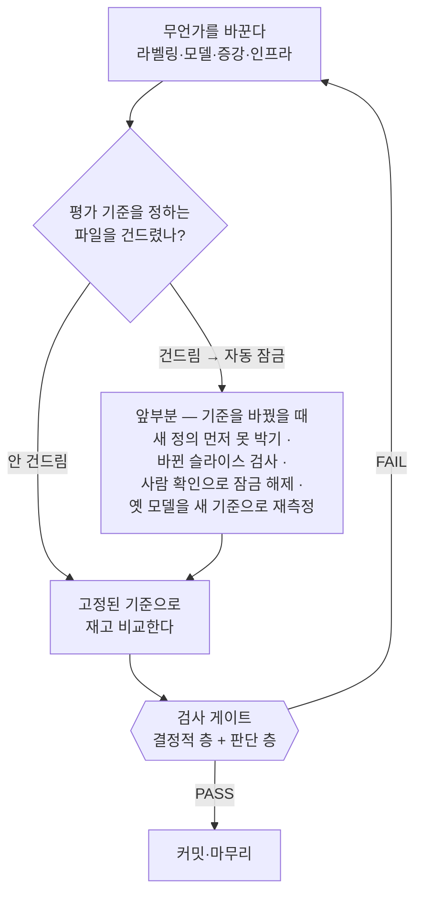

# CLAUDE.md

이 파일은 Claude Code가 이 프로젝트를 이해하기 위한 가이드이다.

## 프로젝트 개요

**다국어 NER(Named Entity Recognition) 파이프라인** — 멀티 백엔드 LLM 지원(OpenAI 호환 API) + BERT 토큰 분류 파인튜닝 + PII 증강 + 크롤링 기반 학습 데이터 생성.

- 한국어: canonical 10종 평면 완성 — NER 5종(PER/LOC/ORG/PROD/EVT) + DAT 은 KLUE 유래(PROD/EVT LLM 재라벨 증분, TI/QT 드롭), PII 4종(EMAIL/PHONE/ID_NUM/CREDIT_CARD)은 합성 주입
- 일본어·베트남어: canonical 10종 평면 = NER 5종(PER/LOC/ORG/PROD/EVT) + PII 5종(DAT/EMAIL/PHONE/ID_NUM/CREDIT_CARD)
- 단일 출처: `docs/manual/data/canonical-entity-schema.md`

## 개발 환경

- **호스트에서 직접 개발** (Docker는 vLLM 등 외부 서비스·server 배포 전용 — 개발 컨테이너에 진입하지 않는다)
- 패키지 관리자: **UV** (`uv sync` 또는 `uv pip install -e .` 으로 editable install)
- `PYTHONPATH` **설정·주입 금지** — uv editable install이 `.pth`로 `src/`를 `sys.path`에 자동 등록한다
- import 형태(모두 src 접두어 없이): 라이브러리는 `from ner.<모듈>.xxx import Xxx`(labelers·classifier·llm_eval·augmenters·metrics), REST API 서비스는 `from server.xxx import Xxx` (`ner` 와 분리된 top-level 패키지)
- 상세 원리·설정: `docs/wiki/concepts/src-layout-packaging.md`

## 핵심 디렉토리 구조

```
src/ner/
├── labelers/          # NER 라벨링 모듈 (상세: src/ner/labelers/CLAUDE.md)
│   ├── ko/            # 한국어 (vllm, openai)
│   ├── ja/            # 일본어 (vllm, openai)
│   ├── vi/            # 베트남어 (vllm, openai)
│   ├── dataset_loader.py
│   ├── labeler_base.py
│   ├── tag_aligner.py     # BIO 태그 정렬/정규화/span 추출
│   └── hf_ner_labeler.py  # HuggingFace BERT NER 라벨러
├── llm_eval/          # 벤치마크 오케스트레이션 + 리포트 (상세: src/ner/llm_eval/CLAUDE.md)
│   ├── __main__.py          # CLI (python -m ner.llm_eval --lang ko|ja|vi ...)
│   ├── benchmark_runner.py  # BenchmarkRunner (한국어 BIO / JA·VI offset-span 공용 러너)
│   ├── report.py            # ReportGenerator (span-match, seqeval, per-entity 테이블)
│   ├── error_analysis.py    # 문장별 오류 유형 분류 CLI
│   └── span_evaluator.py / span_evaluator_cli.py
├── metrics/           # span/BIO 메트릭 공용 구현 (classifier·llm_eval 공유)
│   ├── bio_metrics.py       # seqeval 기반 BIO 레벨 메트릭
│   └── span_metrics.py      # compute_offset_span_f1 등 span 레벨 메트릭
├── augmenters/        # 학습 데이터 증강 (상세: src/ner/augmenters/CLAUDE.md)
│   ├── pii/           # 합성 PII 주입 (suffix/llm 모드, vLLM 교차 검증)
│   └── wikiann_vi/    # WikiANN-vi → canonical 10종 평면 재라벨 + Wikidata 검증
├── classifier/        # JA·VI·KO canonical 10종 평면 BERT 파인튜닝 (상세: src/ner/classifier/CLAUDE.md)
│   ├── __main__.py         # CLI (python -m ner.classifier --lang ja|vi|ko ...)
│   ├── data_utils.py       # JSONL 로딩, fast(offset-trim)·PhoBERT(pyvi)·JA(slow) tokenizer 분기, BIO↔span 변환
│   └── train_eval.py       # HF Trainer 래퍼, char-offset span F1 (metrics 공용)
└── scripts/           # 보조 스크립트 (eval_ja_ner_test.py 등)
src/server/            # ja·vi NER REST API 서비스 (ner 라이브러리 소비; 상세: src/server/CLAUDE.md)
├── __main__.py        # CLI (python -m server) — uvicorn 기동
├── app.py             # FastAPI /v1/ner(단일·배치)·/health
├── inference.py       # LangModel·ModelRegistry (모델 1회 로드·재사용, char-offset span)
├── config.py          # ServerConfig (환경변수 로드)
├── concurrency.py     # ConcurrencyGuard (동시성 세마포어·과부하 429)
├── detect.py          # 언어 자동감지 (가나→ja, vi 전용 결합부호→vi, 그 외→unsupported)
├── chunking.py        # 긴 입력 문장분할 + offset 보존
└── scripts/           # 로컬 실행·스모크·처리량·언어감지 벤치 스크립트
docker/
├── dev/               # 개발 컨테이너 (상세: docker/CLAUDE.md)
├── server/            # ja·vi NER REST API 배포 (상세: docker/server/CLAUDE.md)
└── vllm/              # vLLM 서비스
results/               # 벤치마크 결과 JSON + 리포트
tests/                 # 테스트 (ner: tests/ner/CLAUDE.md · server: tests/server/)
docs/                  # 문서
│   ├── wiki/          # 프로젝트 독립적 도메인 지식 (상세: docs/wiki/schema.md)
│   ├── specs/         # 개발 규약 (코딩 컨벤션)
│   ├── manual/        # 프로젝트 구현 레퍼런스 (src/ 모듈 API·알고리즘 맵)
│   │   └── data/      # 데이터 스키마·엔티티 정의·데이터셋 스펙·데이터 검증
│   ├── reports/       # 자유 형식 벤치마크·실험 리포트 (GitHub Issue 무관)
│   └── issues/        # GitHub Issue별 plan/report 스냅샷
```

## 주요 CLI 엔트리포인트

- `python -m ner.llm_eval` — LLM NER 벤치마크 (ko/ja/vi 공용)
- `python -m ner.classifier --lang {ja,vi,ko}` — BERT 파인튜닝·평가 (canonical 10종 평면; `--group-key orig` 로 누출 없는 group K-fold)
- `python -m ner.augmenters.pii` — 합성 PII 주입
- `python -m ner.augmenters.wikiann_vi` — WikiANN-vi canonical 10종 평면 재라벨 (상세: `docs/manual/data/canonical-entity-schema.md`)
- `python -m server` — ja·vi NER REST API 서버 (uvicorn; 상세: `src/server/CLAUDE.md`)

상세 옵션은 각 모듈의 `--help` 또는 `src/**/CLAUDE.md` 참조.

## 개발 3원칙

- **원자 단위**: 한 번의 요청은 검증 가능한 최소 기능 단위로 처리한다.
- **검증 의무**: 테스트 통과 + `docs/` 반영 전까지 '완료'로 간주하지 않는다.
- **분해는 사람 주도**: 단일 단계로 검증이 어려우면 작업자에게 먼저 분해 방식을 묻는다.

## 시작 전 점검 — 평가 기준을 건드리나

정답·채점규칙·분할은 실험을 재는 **평가 기준**이다 — 바뀌면 그 전후 점수를 나란히 못 놓으므로 비교하려면 고정돼 있어야 한다(코드: `src/ner/validity/CLAUDE.md`).

- **정답(gold)**: 라벨 인벤토리·경계 정의. 판별: *같은 문장의 정답이 달라지나?*
- **채점규칙(metric)**: 매치 기준(strict span)·집계(pooled micro-avg)·분산 게이트. 판별: *예측을 안 바꾸고 이것만 바꿔도 숫자가 움직이나?*
- **분할(split)**: 파티션·group-key·누출. 판별: *test 문장이 train으로 가거나 정보가 새나?*

**하나라도 건드리면** 실험 전에 새 정의를 먼저 못 박는다(점수를 본 뒤 유리한 정의를 골라 숫자만 올리는 걸 막으려고 — 이후 점수로는 고치지 않는다). 옛 점수와 비교가 사라지니 옛 모델을 새 기준으로 다시 재고(`clean 동일-test`) 안 건드린 엔티티만 무회귀를 본다. **안 건드리면** 값만 바꾸는 일이라 에이전트가 자율 누적한다. 어느 쪽인지는 사람이 아니라 기준 파일이 정한다(자동 잠금 상세: "작업 흐름").

## 작업 흐름 (하네스)

**하네스는 하나뿐이다.** 작업 종류에 따라 안전 절차를 갈라놓지 않는다 — 어느 갈래냐를 고르는 순간 그건 스스로 붙이는 이름표가 되고, 이름표를 잘못 붙이면 게이트를 그냥 지나치기 때문이다. 그래서 **검사는 "무슨 작업이냐"가 아니라 "무엇을 건드렸냐"로 켜진다.** 흐름은 하나의 뼈대다 — 무언가 바꾸고, 기준 파일을 건드렸으면 앞부분을 거친 뒤(안 건드렸으면 건너뛰고), 고정된 기준으로 재서 비교하고, 검사 게이트를 지나 커밋한다.



각 단계를 흐름 순서대로 푼다.

**믿음 구조 (규칙이 갈리는 축)** — 이 하네스가 믿지 않는 쪽은 AI 다. 목적 자체가 AI 의 점수 조작을 막는 것이라서다. 믿는 쪽은 기준을 소유한 사람이고, 아래 규칙이 하나같이 "AI 는 못 하고 사람은 된다"로 갈리는 까닭이 여기 있다.

**① 무엇을 건드렸나 (갈림)** — **라벨링·gold 재라벨·메트릭이나 분할 변경**은 기준을 건드리니 앞부분이 켜지고, **모델 교체·하이퍼파라미터·증강**은 기준을 안 건드려 앞부분 없이 곧장 Run 으로 간다. **서버·인프라**는 실험 숫자조차 안 나와 게이트도 대부분 비운 채 지난다. 무엇이 "기준 파일"인지는 좁게 잡는다 — 넓게 잡으면 리팩터링이나 주석까지 매번 잠겨 확인을 남발하게 되고, 그러면 잠금이 허울이 된다. 목록 밖에서 기준을 바꾸는 드문 경우는 커밋과 diff 를 읽는 사람 눈에 맡긴다.

| 무엇 | 잠그는 파일 |
|---|---|
| 정답 | `docs/manual/data/canonical-entity-schema.md` |
| 채점규칙 | `src/ner/metrics/{bio_metrics,span_metrics}.py`, `src/ner/validity/{gate,comparability,leakage,variance}.py` |
| 분할 | `src/ner/classifier/data_utils.py`, `kfold_pool.py` |
| 결과 장부(편집 거부) | `results/**/*.json` |

작업별 "레시피"(재라벨 체크리스트 등)는 둬도 되지만, 그건 사람이 참고하는 설명서일 뿐 안전장치가 아니다. 갈래를 쳐선 안 되는 건 안전이고, 여럿이어도 괜찮은 건 설명서다.

**② 앞부분 — 잠금·해제 (기준을 건드렸을 때)** — 기준 파일이 diff 에 들어오면 커밋 직전에 진행이 막힌다. 이 잠금은 **사람만 풀 수 있다** — 사람이 **확인 파일**을 남겨야 풀리며, AI 가 확인 파일을 만드는 것은 `settings.json` 의 deny 로 막아둔다. 사람이 그 확인을 남기기 전에 하는 일이 바로 앞부분(Front)이다. 정답 md 는 산문이라 "데이터가 기준에 맞는가"를 기계가 자동으로 통과시킬 수 없어, 그 판단과 해제를 사람이 맡는다.

**③ 검사 게이트 — 결과 장부** — 테스트가 돌 때마다 실제 결과가 `results/` 에 쌓이고, 모든 숫자 검사는 이 장부를 기준으로 삼는다. AI 는 이 장부를 직접 편집하지 못하고(deny) 오직 실제 실행만 기록을 남긴다. 사람은 고칠 수 있는데, 그래야 "AI 는 위조 못 하고 사람은 된다"가 성립한다. 게이트가 실제로 무엇을 보는지는 아래 "검사 게이트" 섹션에 있다.

## 코딩 컨벤션 (주석/문서 언어)

- `print()` / `logger.*` / 예외 메시지 / argparse `help`: **영문**
- 함수·클래스·모듈 docstring, 인라인 `#` 주석: **한국어**
- **코드·주석·식별자에 이슈/PR 번호·날짜·사람 이름 금지** — 영구 맥락은 커밋 메시지 `refs #N` 또는 `docs/issues/`에만
- 상세 규칙 및 예시: `docs/specs/coding-conventions.md`

## 커밋 컨벤션

- 제목·본문은 **한국어**로 작성
- `type` 접두사만 영문 허용 (`feat`, `fix`, `chore`, `docs`, `build`, `refactor`, `test`)

### 커밋 입도 (granularity)

- **기본값은 "합치기"**: 구현 + 그에 딸린 테스트 + 관련 문서 갱신은 같은 커밋이 기본이다. 분할은 아래 "분할이 정당한 경우" 중 하나에 해당할 때만 한다. 의심스러우면 합친다.
- **하위 작업 체크박스 ≠ 커밋 1개**: 이슈 계획의 체크박스는 *진행 추적 단위*이지 *커밋 단위*가 아니다. 동일 관심사·동일 모듈에서 발생한 변경은 체크박스가 여러 개여도 한 커밋으로 묶는다.
- **파일 수 휴리스틱(3파일=2커밋, 5파일=3커밋 등) 금지**: `git-master` 에이전트 또는 OMC 기본 정책의 파일 수 기반 자동 분할은 이 프로젝트에서 비활성화한다. 분할 기준은 *관심사*와 *독립 revert 가능성*뿐이다.
- **분할이 정당한 경우**(아래 중 하나라도 해당될 때만 분리):
  - 서로 다른 모듈/패키지(`labelers/` vs `classifier/` vs `augmenters/` 등)에 걸친 변경
  - 코드 변경과 무관한 대규모 문서 정리(라벨 영문화 일괄 치환 등)
  - 의존성·빌드 설정 변경(`pyproject.toml`, `uv.lock`)이 코드 변경과 분리해도 빌드가 깨지지 않을 때
  - 한 커밋이 ~500 LOC를 크게 넘고 의미 단위로 나뉠 수 있을 때
- **합치는 것이 옳은 경우**:
  - 같은 모듈의 로직 + 그에 딸린 테스트 + 그에 딸린 문서/스펙 갱신
  - 오타 수정, 링크 채움 같은 수커밋(<5줄) — 다음 의미 있는 커밋에 squash 하거나 일과 종료 시 `docs:` 한 커밋으로 묶기
  - 계획 단계의 체크박스 1·2·3이 모두 같은 함수/CLI 한 개를 만드는 데 필요했을 때
- **서브에이전트 위임 시 커밋 권한 회수**: `executor`·`git-master` 등 서브에이전트에 작업을 위임할 때는 프롬프트에 "커밋은 수행하지 말고 변경만 완료하라"를 명시한다. 커밋은 메인 세션에서 사용자 승인 후 일괄 수행하여, 에이전트 자체 판단으로 인한 잦은 자동 분할을 구조적으로 방지한다.

## docs 운영

- `docs/wiki/` 운영 규칙은 `docwiki` 스킬과 `docs/wiki/schema.md`에 위임.
- 코드 변경 후 `docs/manual/`(구현 맵)과 `docs/manual/data/`(데이터 스키마) 최신화 확인.
- 보고·이슈 문서는 빽빽한 평평한 불릿 한 덩어리 대신 같은 문서의 형제 섹션 구조를 따르고, 압축된 논리는 인과(A라서 B)로 풀어쓴다 — 가독성 우선이며 분량 증가가 목적이 아니다(무엇을 남길지는 축약형 유지).
- **그림은 mermaid로 그린다.** 흐름·구조·관계를 보여줄 땐 `│ ▼ ├─` 같은 글자 그림 대신 mermaid `flowchart`를 쓴다 — GitHub·VSCode에서 바로 그림으로 보인다. 칸 안의 글자는 큰따옴표로 감싼다(괄호·기호가 깨지지 않게). 다만 단순 비교나 표로 될 것(결정표·목록·폴더 구조)까지 굳이 그림으로 바꾸지 않는다.
- **흐름도 칸에는 함수 이름 말고 '무슨 일을 하는지'를 쓴다.** 칸마다 함수·파일 이름을 늘어놓으면 전체 흐름이 안 보인다. 그 단계가 실제로 하는 일을 쉬운 말로 풀어 쓰고, 함수·파일 이름은 그림 아래 설명이나 표에 적는다. BIO·span·silver·재라벨처럼 이 분야에서 늘 쓰는 말은 그대로 둔다. 얼마나 쉽게 쓸지 기준은 — 그 코드를 직접 짜지 않은 사람이 함수 속을 열어보지 않고도, 각 칸만 읽고 무슨 일이 일어나는지 그려지면 충분하다.

## 이슈 관리

- **GitHub Issues**(`groovallstar/ner_pipeline`)로 작업 단위를 관리한다. 자동 채번으로 중복을 방지한다.
- **무엇이 이슈가 되는가 — 사람이 소유, 에이전트는 default 실행.** 작업 단위 결정(이슈 등록 여부)·수락 기준 승인은 사람이 쥔다(에이전트 자기 채점 금지). 에이전트는 type+path 기반 default를 실행한다:
  - `feat`·`fix` ∧ `src/ner/**` 런타임 변경 → **이슈+브랜치+PR** (추적 가치 있는 제품 진화)
  - `docs`·`chore`·`refactor` (동작 불변·구조·문서·도구) → **develop 직접** (이슈/PR 없이, 크기 무관). PR이 별도 리뷰어를 붙이지 않아 이 부류엔 PR 오버헤드가 추적 이득보다 크다 — 실제 회귀 게이트는 refuter.
  - **type↔path 불일치**(예: `feat`인데 src 런타임 미변경, `chore`인데 src 런타임 변경) **또는 추적가치 모호** → 사람에게 에스컬레이션. 과소추적(조용한·비싼 실패) > 과다추적(시끄러운·싼 실패)이므로 모호하면 이슈 쪽으로 기운다.
- **문서 숫자는 결과 파일과 맞아야 한다.** `docs/reports/`·`docs/issues/`의 **표 안** 수치가 `results/**/*.json`과 어긋나면 `검사 게이트`의 결정적 층이 자동으로 잡는다 — 숫자가 diff 에 드는 *사건*이 트리거다(상세: "검사 게이트"). 산문·링크·오타만 바꾸는 docs 커밋은 해당 없음.
- 마일스톤은 사용하지 않는다. 영역은 라벨로 구분한다 (`area:labelers`, `area:classifier`, `area:augmenters`, `area:llm-eval`, `area:infra`, `docs` 등).
- 이슈 등록: `gh issue create --title "제목" --body "설명" --label <area>`
- 브랜치명: `feat/issue-{번호}-{짧은-슬러그}` 예) `feat/issue-12-vi-crawler`
- 커밋 메시지: 기존 컨벤션(한국어 제목 + `type(스코프):` 접두사) 유지, 본문 끝에 `refs #12` 참조. 최종 PR 또는 마지막 커밋에는 `closes #12`로 이슈 종결.
- **계획·보고 문서는 GitHub Issue와 `docs/issues/` 양쪽에 모두 남긴다.** Issue는 실시간 협의·승인 기록, `docs/issues/`는 기능 설계·구현 히스토리의 영구 보관 용도. 이슈와 무관한 자유 형식 벤치마크·실험 리포트는 `docs/reports/`에 둔다.

### 이슈 문서 구조

이슈별로 `docs/issues/issue-{번호}-{슬러그}.md` 단일 파일을 만든다. 상세 규칙과 템플릿은 `docs/issues/README.md` 참조.

```
docs/issues/
├── README.md
└── issue-12-vi-crawler.md   # 설계 + 구현 결과 통합 단일 파일
```

- 실시간 게이트는 Issue 본문의 **수락 기준 목록**이다(3단계). `docs/issues/...md`는 산문 설계 + 구현 결과·검증을 합친 **영구 아카이브**로, 구현 완료(5단계) 후 작성·**최초 커밋**한다 — 재독용이 아니며 숫자 정합성은 검사 게이트가 보증한다.

### 이슈 진행 절차 (경량 5단계, 승인 1회)

1. **등록**: GitHub Issue 작성 — 목적, 성공 기준(테스트/메트릭), 범위 정리
2. **브랜치**: `develop`에서 `feat/issue-{N}-slug` 분기
3. **수락 기준 확정 → 승인 요청**: 검증 가능한 acceptance criteria 3~6개를 Issue 본문에 적고 **이 기준 목록에 대해서만** 승인받는다 — 사람이 읽는 게이트는 산문 계획이 아니라 이 짧은 목록이다. test·metric이 걸린 이슈면 기준에 **목표 수치를 명시**한다(형식은 이슈마다 다름 — `results/*.json` 강제 아님). 하위 작업은 같은 본문에 체크박스로 분해. **eval·metric 이슈는 기준 파일을 건드리므로 앞부분(Front)에서 잠긴다** — 사람 확인 전 반박자를 미리 불러 누출·조작 가능성을 점검할 수 있다(상세: "작업 흐름"·"검사 게이트").
4. **구현 & 원자 커밋**: 의미 단위로 커밋(체크박스 개수와 무관), 각 커밋 본문에 `refs #N`. 입도 기준은 위 "커밋 입도" 섹션 참조. 구현을 ralph 등 자율 루프로 돌리는 것은 3단계 기준이 기계검증 가능·신뢰되고 작업이 다회차/반복-shape일 때만 — 단발은 "분해는 내가 → 한 스텝만 위임 → 내가 기준으로 검증"이 기본.
5. **마무리**: 테스트 통과 + `docs/` 갱신 확인 → **검사 게이트**(결정적 층 + 판단 층; PASS만 진행, FAIL이면 4단계 회귀) → `docs/issues/issue-{N}-{slug}.md`에 설계 + 구현 결과·검증 작성·**최초 커밋** → PR 생성(`closes #N`) → 머지 전 `git status`로 미커밋 파일 확인

## 검사 게이트 (결정적 층 + 판단 층)

게이트는 **승인이 아니라 반증**이다. Stop 훅(`refuter_gate.py`)이 미커밋 diff 에 두 층을 건다. 결정 가능한 것은 모델에게 맡기지 않는다.

**결정적 층 — 기계가 직접, 0토큰**(위조 불가, 항상 돎):

- 기준 파일 건드림 + 확인 파일 없음 → **차단** · AI 의 결과 장부(`results/**/*.json`) 편집 → **거부**
- ruff · 테스트 무결성(순삭제·무조건 `skip`/`xfail`·assert 약화; `skipif` 제외) · 인용 **표 안** 수치 ↔ `results/**/*.json`

오탐은 **사람**이 확인 파일(`ack-<diff_hash>`)로 해제하고, 모든 판정·해제는 `log.jsonl` 에 append-only 로 쌓인다. 인용 대조는 *존재* 검사라 우연 일치를 못 거른다 — 거짓 인용을 줄이되 없애진 못한다(`results/` 는 실험과 함께 휘발하므로 값이 살아 있는 시점에만 성립).

**판단 층 — 격리 반박자(모델)**, 도구가 확정 못 하는 축만:

- **코드 정합성·회귀** — 숨은 회귀·엣지케이스 누락은?
- **측정 타당성** — 숫자가 다 맞아도 결론이 틀리나: gold 변조·시드/분할 누수·"올랐다=개선"의 순환/교란, 표 밖 산문의 파생값(Δ·σ).

판정 `.omc/state/refuter/<diff_hash>.json`(PASS 만 진행)은 반박자(모델)가 쓴다 — 신선도는 보증하되 진정성은 못 한다. 위조 불가능한 건 결정적 층뿐. 자동 호출은 루프 모드(ralph/ultrawork)만, 단발·앞부분(확인 전 미리 부르기)은 수동. 절차는 `refuter` 스킬. 끄기: `OMC_SKIP_HOOKS=refuter-gate`.
