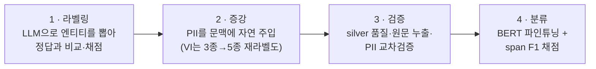

# NER Pipeline

다국어 Named Entity Recognition(NER) 파이프라인. 멀티 백엔드 LLM 라벨링 + BERT 토큰 분류 + PII 증강.

## 지원 언어

| 언어 | 데이터셋 | 라벨 공간 |
|------|---------|----------|
| 한국어 | KLUE NER (PROD/EVT LLM 재라벨 + PII 합성 주입) | canonical 10종 평면 |
| 일본어 | Stockmark NER Wikipedia (PII 합성 주입) | canonical 10종 평면 |
| 베트남어 | WikiANN-vi (silver 재라벨 + PII 합성 주입) | canonical 10종 평면 |

세 언어 공통 **canonical 10종 평면** = NER 5종(`PER/LOC/ORG/PROD/EVT`) + PII 5종(`DAT/EMAIL/PHONE/ID_NUM/CREDIT_CARD`). 한국어는 `DAT`가 KLUE 유래, `PROD/EVT`는 KLUE 문장 LLM 재라벨 증분이며 KLUE `TI/QT`는 드롭, PII 4종(`EMAIL/PHONE/ID_NUM/CREDIT_CARD`)은 합성 주입이다.

라벨 정의·매핑·경계 규칙: [`docs/manual/data/canonical-entity-schema.md`](docs/manual/data/canonical-entity-schema.md)

## 파이프라인

원천 데이터가 네 단계를 거쳐 학습된 BERT 분류기가 된다.



단계별 상세: [`docs/manual/pipeline/`](docs/manual/pipeline/)

## 백엔드

vLLM (로컬 GPU), HuggingFace BERT baseline.

## 프로젝트 구조

```
src/ner/
├── labelers/{ko,ja,vi}/   # 언어별 LLM 라벨러
├── llm_eval/              # 벤치마크 오케스트레이션·리포트
├── augmenters/{pii,wikiann_vi}/  # 학습 데이터 증강
├── classifier/            # BERT 토큰 분류 파인튜닝
├── metrics/               # span/BIO 메트릭 공용 구현
├── validity/              # K-fold 분산·비교타당성 게이트 (재학습 0회)
└── scripts/               # 보조 스크립트
src/server/                # ja·vi NER REST API 서비스 (FastAPI)
docker/{server,vllm}/      # REST API 배포 + vLLM
results/                   # 벤치마크 산출물 scratch (gitignore·휘발)
tests/{ner,server,migration}/  # 제품 회귀 및 Codex 지침 검사
docs/                      # manual·reports·issues·wiki·specs
```

상세 가이드: [`AGENTS.md`](AGENTS.md), 모듈 레퍼런스: [`docs/manual/`](docs/manual/)

## 설치

```bash
uv sync                # 또는: uv pip install -e .
```

## REST API 서비스

학습된 ja·vi 분류기를 FastAPI 로 감싸 HTTP 추론을 제공한다.

```bash
python -m server   # uvicorn 기동 (기본 0.0.0.0:8008)
```

| 엔드포인트 | 하는 일 |
|---|---|
| `POST /v1/ner` | 단일 `{text}` · 배치 `{texts:[...]}` 추론 |
| `GET /health` | 언어별 모델 로드 상태 |
| `GET /` | 웹 데모 UI |
| `POST /v1/translate` · `GET /v1/translate/status` | 데모 전용 한국어 번역 (기본 비활성) |

`lang` 을 안 주면 텍스트마다 자동감지하고, ja·vi 신호가 없으면 에러가 아니라
빈 결과를 준다 — 배치에 다른 언어가 섞여도 나머지가 처리되게 하려는 것이다.
데모 전용 둘은 소비자 계약을 `/v1/ner` 하나로 좁히려고 OpenAPI 에 안 내놓는다.

스키마·상태코드는 [`docs/manual/rest-api-spec.md`](docs/manual/rest-api-spec.md),
연동 절차는
[`rest-api-integration-guide.md`](docs/manual/rest-api-integration-guide.md),
환경변수·모듈 구조는 [`docs/manual/server-implementation.md`](docs/manual/server-implementation.md), 컨테이너
배포는 `docker/server/`.

## 테스트

```bash
uv run pytest tests/ -v
```

## 벤치마크 리포트

[`docs/reports/`](docs/reports/) — 언어·실험별 최신 측정치.
