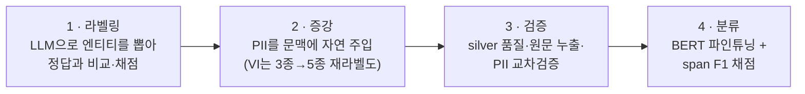

# NER Pipeline

다국어 Named Entity Recognition(NER) 파이프라인. vLLM LLM 라벨링 + BERT 토큰 분류 + PII 증강 + REST API 서빙.

## 지원 언어

| 언어 | 원천 데이터셋 | 원천 위에 얹는 것 |
|------|---------|----------|
| 한국어 | KLUE NER | `PROD/EVT` LLM 재라벨 + PII 4종 합성 주입 |
| 일본어 | Stockmark NER Wikipedia | PII 5종 합성 주입 |
| 베트남어 | WikiANN-vi | 3종 → NER 5종 silver 재라벨 + PII 5종 합성 주입 |
| 영어 | OntoNotes5 (tner 판) | PII 4종 합성 주입 (재라벨 없음) |

네 언어 모두 **canonical 10종 평면**으로 수렴한다 — NER 5종(`PER/LOC/ORG/PROD/EVT`) + `DAT` + PII 4종(`EMAIL/PHONE/ID_NUM/CREDIT_CARD`).

갈리는 것은 `DAT` 의 출처다. 한국어는 KLUE 의 날짜를, 영어는 OntoNotes 의 `DATE` 를 그대로 쓰므로 주입할 PII 가 4종이고, 일본어·베트남어는 원천에 날짜가 없어 `DAT` 까지 5종을 주입한다. 재라벨도 원천이 무엇을 이미 갖고 있는지에 따라 갈린다 — 영어는 원천이 `PRODUCT`·`WORK_OF_ART`·`EVENT` 를 이미 담고 있어 재라벨할 대상이 없고, 한국어는 KLUE 에 없는 `PROD/EVT` 만 증분으로 얹으며(KLUE `TI/QT` 는 드롭), 베트남어는 3종밖에 없어 5종 전체를 다시 단다.

라벨 정의·매핑·경계 규칙: [`docs/manual/data/canonical-entity-schema.md`](docs/manual/data/canonical-entity-schema.md)

## 파이프라인

원천 데이터가 네 단계를 거쳐 학습된 BERT 분류기가 된다.



**영어는 1단계를 건너뛴다.** OntoNotes5 가 사람 gold 라 LLM 으로 다시 뽑을 대상이 없어, 형식 변환을 거쳐 2단계로 바로 들어간다. 영어 라벨러가 따로 있긴 하지만 용도가 하나다 — PII 주입 결과의 교차 검증.

단계별 상세: [`docs/manual/pipeline/`](docs/manual/pipeline/)

## 백엔드

LLM 라벨링은 **vLLM 하나**다 — 로컬 GPU 에 띄운 vLLM 의 OpenAI 호환 API 를 호출한다. 벤치마크 비교용으로 HuggingFace BERT 베이스라인(`hf:` 접두)을 함께 돌릴 수 있다.

## 프로젝트 구조

```
src/ner/
├── labelers/{ko,ja,vi,en}/  # 언어별 LLM 라벨러
├── llm_eval/              # 벤치마크 오케스트레이션·리포트
├── augmenters/{pii,wikiann_vi,ontonotes_en}/  # 학습 데이터 증강
├── classifier/            # BERT 토큰 분류 파인튜닝
├── metrics/               # span/BIO 메트릭 공용 구현
├── validity/              # K-fold 분산·비교타당성 게이트 (재학습 0회)
└── scripts/               # 보조 스크립트
src/server/                # ja·ko·vi·en NER REST API 서비스 (FastAPI)
docker/{server,vllm}/      # REST API 배포 + vLLM
results/                   # 벤치마크 산출물 scratch (gitignore·휘발)
certified/                 # 커밋된 결과 원장 — 인용 근거 metric JSON (숫자 검사 기준)
tests/{ner,server,hooks}/  # pytest 테스트 (hooks 는 커밋 게이트 자체의 회귀 안전망)
docs/                      # manual·reports·issues·wiki·specs
```

상세 가이드: [`CLAUDE.md`](CLAUDE.md), 모듈 레퍼런스: [`docs/manual/`](docs/manual/)

## 설치

Python 3.13 이상이 필요하다. 호스트에서 직접 개발하며 개발용 컨테이너는 두지 않는다.

```bash
uv sync        # 런타임 + dev(pytest·ruff) 의존성까지 한 번에
```

`uv pip install -e .` 도 되지만 dev 그룹이 빠져 `pytest` 가 안 깔린다. 테스트를 돌릴 환경이면 `uv sync` 를 쓴다.

## REST API 서비스

학습된 ja·ko·vi·en 분류기를 FastAPI 로 감싸 HTTP 추론을 제공한다.

```bash
python -m server   # uvicorn 기동 (기본 0.0.0.0:8008)
```

| 엔드포인트 | 하는 일 |
|---|---|
| `POST /v1/ner` | 단일 `{text}` · 배치 `{texts:[...]}` 추론 |
| `GET /health` | 언어별 모델 로드 상태 |
| `GET /` | 웹 데모 UI |
| `POST /v1/translate` · `GET /v1/translate/status` | 데모 전용 한국어 번역 (기본 비활성) |

`lang` 을 안 주면 텍스트마다 자동감지한다. 가나→ja, 한글→ko, 베트남어 변별
부호→vi 로 잡고, 셋이 모두 실패하면 라틴 글자가 있는지 보고 en 으로 보낸다.
라틴 글자마저 없으면 에러가 아니라 빈 결과를 준다 — 배치에 다른 언어가 섞여도
나머지가 처리되게 하려는 것이다.
OpenAPI 에 나오는 것은 `/v1/ner` 하나뿐이다 — 소비자 계약을 그 하나로 좁히려고
나머지 넷을 스키마에서 뺐다. FastAPI 기본 문서 경로(`/docs`·`/openapi.json`)는
그대로 열려 있어 브라우저로 확인할 수 있다.

스키마·상태코드는 [`docs/manual/rest-api-spec.md`](docs/manual/rest-api-spec.md),
연동 절차는
[`rest-api-integration-guide.md`](docs/manual/rest-api-integration-guide.md),
환경변수·모듈 구조는 [`src/server/CLAUDE.md`](src/server/CLAUDE.md), 컨테이너
배포는 `docker/server/`.

## 테스트

```bash
uv run pytest tests/ -v
ruff check
```

로컬 자원이 없으면 조용히 skip 되는 테스트가 있다. `integration` 마커는 HuggingFace 데이터셋 캐시를, `live` 마커는 `/data` 아래 배포 모델을 요구한다.

## 벤치마크 리포트

[`docs/reports/`](docs/reports/) — 언어·실험별 최신 측정치.
