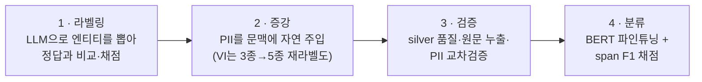

# NER Pipeline

다국어 Named Entity Recognition(NER) 파이프라인. 멀티 백엔드 LLM 라벨링 + BERT 토큰 분류 + PII 증강.

## 지원 언어

| 언어 | 데이터셋 | 라벨 공간 |
|------|---------|----------|
| 한국어 | KLUE NER (PROD/EVT LLM 재라벨 + PII 합성 주입) | canonical 10종 평면 |
| 일본어 | Stockmark NER Wikipedia (PII 합성 주입) | canonical 10종 평면 |
| 베트남어 | WikiANN-vi (silver 재라벨 + PII 합성 주입) | canonical 10종 평면 |

세 언어 공통 **canonical 10종 평면** = NER 5종(`PER/LOC/ORG/PROD/EVT`) + PII 5종(`DAT/EMAIL/PHONE/ID_NUM/CREDIT_CARD`). 한국어는 `DAT`가 KLUE 유래, `PROD/EVT`는 KLUE 문장 LLM 재라벨 증분이며 KLUE `TI/QT`는 드롭, PII 4종(`EMAIL/PHONE/ID_NUM/CREDIT_CARD`)은 합성 주입이다.

라벨 정의·매핑·경계 규칙: [`docs/manual/data/canonical-entity-schema.md`](docs/manual/data/canonical-entity-schema.md)

## 파이프라인

원천 데이터가 네 단계를 거쳐 학습된 BERT 분류기가 된다.



단계별 상세: [`docs/manual/pipeline/`](docs/manual/pipeline/)

## 백엔드

vLLM (로컬 GPU), HuggingFace BERT baseline.

## 프로젝트 구조

```
src/ner/
├── labelers/{ko,ja,vi}/   # 언어별 LLM 라벨러
├── llm_eval/              # 벤치마크 오케스트레이션·리포트
├── augmenters/{pii,wikiann_vi}/  # 학습 데이터 증강
├── classifier/            # BERT 토큰 분류 파인튜닝
├── metrics/               # span/BIO 메트릭 공용 구현
├── validity/              # K-fold 분산·비교타당성 게이트 (재학습 0회)
└── scripts/               # 보조 스크립트
src/server/                # ja·vi NER REST API 서비스 (FastAPI)
docker/{server,vllm}/      # REST API 배포 + vLLM
results/                   # 벤치마크 산출물 scratch (gitignore·휘발)
certified/                 # 커밋된 결과 원장 — 인용 근거 metric JSON (숫자 검사 기준)
tests/{ner,server,hooks}/  # pytest 테스트 (hooks 는 커밋 게이트 자체의 회귀 안전망)
docs/                      # manual·reports·issues·wiki·specs
```

상세 가이드: [`CLAUDE.md`](CLAUDE.md), 모듈 레퍼런스: [`docs/manual/`](docs/manual/)

## 설치

```bash
uv sync                # 또는: uv pip install -e .
```

## REST API 서비스

ja·vi NER 추론을 FastAPI 로 서빙한다 — `POST /v1/ner` 단일·배치, `GET /health`,
`GET /` 웹 데모 UI, 그리고 데모 전용 `POST /v1/translate`·
`GET /v1/translate/status`. 언어 자동감지(가나→ja, vi 전용 결합부호→vi,
그 외 unsupported), 동시성 세마포어(과부하 429), fp32 배치 추론을 지원한다 —
fp32 고정이라 배치화가 단건 결과를 바꾸지 않는다. 모든 에러는 구조화 봉투
(`{error:{status,message}}`) 하나로 통일돼 있어 소비자는 파싱 경로를 하나만
둔다. 한국어 번역 글로스는 웹 데모 전용이라 외부 소비자용 OpenAPI 명세
(=`/v1/ner`)에 노출되지 않고, 기본 비활성이라 켜지 않으면 503 이다 — PII 는
마스킹-복원으로 원문 보존, 고유명사는 한글 음차.

```bash
python -m server   # uvicorn 기동
```

컨테이너 배포는 `docker/server/`, 상세는
[`src/server/CLAUDE.md`](src/server/CLAUDE.md) 참조.

## 테스트

```bash
uv run pytest tests/ -v
```

## 벤치마크 리포트

[`docs/reports/`](docs/reports/) — 언어·실험별 최신 측정치.
