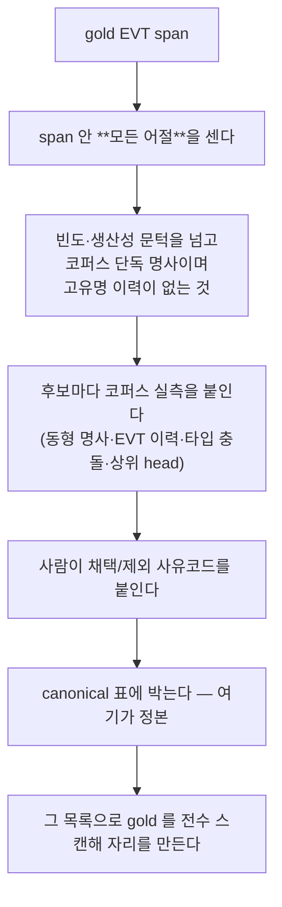

# issue-202: 한국어 EVT 축1-복합(고유명 + 사건 head) 원칙화·회수

- Issue: https://github.com/groovallstar/ner-pipeline/issues/202
- PR: https://github.com/groovallstar/ner-pipeline/pull/204
- 브랜치: `feat/issue-202-ko-evt-named-event-fp-recovery`
- 승인일: 2026-08-03

## 배경 (왜)

한국어 gold 에 **복합 named 사건이 누락된 채 남아 있다** — `보스턴 마라톤`·`후쿠시마
사고` 같이 고유명을 낀 1회성 사건이다. #198 실측에서 EVT FP 761 건 중 gold 무라벨
자리 388 건을 성분별로 가르면 이 부류가 98 건(28%)으로 뭉쳤다.

**기존 회수 경로 둘 다 이걸 구조적으로 못 잡는다.** #198 의 표면형 스캔은 탐색 공간이
`기존 EVT 표면형 ∪ R2 형` 으로 닫혀 있어 gold 에 한 번도 라벨된 적 없는 사건은 후보가
되지 않고, #201 의 head 스캔은 R2 회의체 head 로 닫혀 있어 `~마라톤`·`~사고` 가 범위
밖이다.

그런데 규칙 자체는 canonical 이 이미 갖고 있었다. §5.3 축2 행은 `조사`·`대회`·`사고`
단독을 비-entity 로 두면서 **"named·수식 시에만 EVT"** 라고 못 박았고, 축1 행은 named
사건이 **"개방집합이라 완전성은 회수로 보강"** 이라고 적었다. 즉 **규칙은 있는데 그걸
집행할 수 있는 형태(head 목록 + 고유명 동반 조건)가 없었다.** 그래서 회수도 감사도
사람의 눈대중에 걸렸고, 눈대중은 여집합을 검토하지 않는다.

## 목적

canonical 축1-복합 규칙을 명문화하고, 그 규칙으로 gold 를 전수 스캔해 복합 named
사건을 회수한다. 게이트는 **일관성**이다 — 규칙이 EVT 라 하는 자리 중 어디에도
분류되지 않은 것이 0. **EVT F1 은 목적도 게이트도 아니다**(gold 를 바꾸면 자가 바뀐다).

## 범위

**포함** — canonical §5.3 축1-복합 규칙 + 경계 조건절 명문화(기준 파일 — 2단계) ·
규칙 기반 전수 스캔 → 사람 자리별 전수 판정 → 회수 · 자리 단위 미분류 게이트 ·
canonical 파싱 동기 테스트 · 잔여 불일치 계수기 · 10-fold 재학습 두 팔 + 비순환 측정

**제외** — R2 회의체 규칙(#201 완료) · **타입 충돌 교정**(건수·목록만, 불변 9종
byte-identical 과 정면 충돌) · **기존 gold 경계 불일치의 소급 교정**(계수·보고만) ·
축2 head(`대회`·`선거`·`조사`) · 단일 낱말 132 건 · 경계 오류 265 FP / 227 FN ·
F1 을 게이트로 거는 것

## 현 상태 (fact)

| 측정 | 값 |
|---|---:|
| gold `data/klue/pii_all.jsonl` — 행 | 25,989 |
| gold EVT — 회수 전 / 후 | 1,717 / **1,731** |
| EVT ↔ 고유명(PER/LOC/ORG/PROD) span 겹침 | **0** |
| 다어절 EVT span (회수 후) | 731 |

gold sha256 — 회수 전 `2645d26b…`, 후 `30bd861a…`. gold 는 버전 관리 밖이라 이 지문과
`src/ner/labelers/ko/data/evt_axis1_apply.json` 이 유일한 감사 흔적이다.

## 성공 기준 (승인본 v2)

정의-시점 반박자(critic/opus)가 초안을 REJECT 하고 8 건을 지적해 v2 로 다시 썼다.
지적과 반영은 §정의-시점 반박자 참조.

1. canonical 축1-복합 규칙 명문화 — head 후보를 **결정적 절차로 열거**하고 그 전부에
   채택/제외 사유코드를 붙인다
2. 경계 규칙 — 평면 BIO 가 이미 정한 답을 조건절로 적고, 소급 교정 대신 **잔여 불일치
   계수기**를 둔다
3. 모집단 결정 파라미터의 유일 출처는 canonical — 파싱 결과 ≠ 코드 상수면 실패
4. **주 게이트** — 축1-복합 자리 미분류 0, 단위는 (row, span)
5. 모델 FP 는 사각 진단 전용, 순서는 해시로 사전등록
6. 불변 타입 9 종 byte-identical + 10-fold 무회귀 + 비순환 EVT F1 보고(게이트 아님)

## 설계

### 후보 집합을 저자가 고르지 않는다

이 이슈의 핵심 위험은 F1 이 아니라 **모집단**이다. 저자가 떠올린 head 만 표에 올리면
표는 엄밀해 보이는데 여집합이 검토되지 않고, head 를 좁힐수록 그것을 분모로 쓰는
감사가 쉬워진다 — 자기 규칙을 자기 자로 재는 구조다. 그래서 후보를 gold 가 제안한다.

**마지막 어절만 보면 안 된다.** 축1-복합이 head 로 끝나는 것은 맞지만 gold 가 그 복합을
더 긴 span 으로 잡아 두면 head 가 중간에 묻힌다 — `마라톤` 은 `보스턴 마라톤 대회 폭발
사건` 안에 4 회 있는데 어떤 span 에서도 마지막이 아니라, 마지막 어절 집계로는 **존재
자체가 안 보인다**. `폭발`·`붕괴`·`화재` 도 같은 이유로 문턱 아래로 흩어진다.

고유명 판정은 **그 행의 동행 라벨 ∪ 코퍼스 전역 라벨 이력**(PER/LOC/ORG/PROD)이다.
동행 라벨만 쓰면 이 이슈의 대표 사례가 모집단 밖으로 빠진다 — row 19773 의 `보스턴` 은
그 행에서 무라벨이다. 전역 이력에는 가드 둘(길이 ≥2 · 고유명 라벨 비율 ≥0.3)을 걸어
1 글자 성씨와 `경찰` 류 저비율 표면형을 막고, **선행 고유명에 조사가 붙어 있으면
제외**한다 — `파리에서 테러` 는 복합명사가 아니라 문장 성분이다.

### 경계는 택일이 아니라 조건절

canonical §5.3 의 축3 최대-span 과 겹침 정책이 "라벨된 고유명을 낀 복합 사건" 에서 서로
다른 답을 준다. 그런데 gold 는 평면 BIO 라 **중첩 span 을 표현할 수 없고** 실측 겹침이
0 이므로, 답은 이미 정해져 있었다 — 적기만 하면 됐다.

| 인접 고유명 상태 | EVT span | 실례 |
|---|---|---|
| 그 행에서 라벨돼 있다 | 삼키지 않고 head 만 | row 15496 형 → `마라톤` |
| 라벨돼 있지 않다 | 포함한 최대-span | row 19773 → `보스턴 마라톤` |
| head 까지 다른 타입이 덮는다 | 삽입 불가 — 타입 충돌로 기록 | 5 자리 |

소급 트림은 하지 않는다(canonical 584). 트림 경계 판정은 #163 이 폐기한 비결정 구간이라
다시 열면 같은 자리에서 같은 것을 잃는다. 대신 **잔여 불일치 계수기**를 두고 보고 자체를
게이트로 삼는다.

### 왜 계수기가 필요한가 — 회수는 스스로를 못 본다

회수된 자리는 gold EVT 이력을 얻어 자리 스캔의 모집단에서 **영구히** 빠진다. 그래서
오삽입은 회수를 몇 번 더 돌려도 스스로는 안 보인다. 계수기만 그 뒤를 본다. 모집단을
축1 head 로 좁히지 않는 이유도 같다 — 좁히면 규칙이 못 보는 곳을 규칙의 시야로 재게 된다.

## 구현 결과

### canonical (기준 파일 — 사람 승인 + 반박자 PASS)

§5.3 KO 표에 축1-복합 원칙 1 행(head 30 종 · 고유명 판정 · 가드 임계 · 조사 제외) +
사유코드 제외 13 행 + 축3 경계 조건절 1 행을 넣고, 축1 행을 고쳐 **단일어 named 사건**
(`임진왜란`·`외환위기`)이 이 규칙에 제외되지 않음을 명시했다. 축1-복합 행에 근거 실측
을 행 번호와 함께 적었다 — 자리 186 과 그 자리들이 기존 gold EVT span 과 맺는 관계
(`exact` 115 · `inside_longer` 39 · `none` 27 · `partial` 5). 이 넷은 **축3 경계 조건절을
적용하기 전, 탐지 span 기준**의 수다. `partial` 5 가 조건절이 왜 필요한지의 근거이고,
조건절을 적용하면 `partial` 이 0 이 되면서 118/41/27 이 된다(회수 뒤엔 132/41/13).

**canonical 커밋을 코드·테스트 커밋과 분리했다** — 승인 파일 하나가 그 diff 의 테스트
무결성·인용 대조를 통째로 면제하므로, 승인 해시가 규칙 diff 만 덮게 했다. 순서는
코드(`fa3b11c`) → canonical(`0027c26`) 이다. 반대로 하면 canonical 이 아직 없는 모듈
경로를 인용하게 된다(§결정 로그 2026-08-03 ③).

### 하네스 — `ko_evt_axis1_audit.py` 서브커맨드 8

| 명령 | 하는 일 | 게이트인가 |
|---|---|---|
| `head-survey` | gold EVT span 의 **모든 어절**을 집계해 head 후보를 결정적으로 열거 | ✕ 근거표 |
| `sites` | head 목록으로 `고유명 + head` 자리를 전수 열거 (겹침을 버리지 않고 잰다) | ✕ 모집단 |
| `codes` | 후보 전부에 canonical 사유코드가 붙었나 | ○ `--gate` |
| `gate` | **주 게이트** — 자리마다 다섯 버킷 중 하나, 미분류 0 | ○ |
| `apply` | 판정 원장의 EVT 를 gold 에 삽입 | ○ |
| `residue` | 경계 조건절을 기존 EVT span 전수에 대조 | 보고 = 게이트 |
| `fp-blindspot` | 모델 FP 중 모집단 밖 복합 named 자리 | ✕ 진단 |
| `rescore` | 두 팔을 같은 gold 로 재채점 + 회수 무관 Δ | ✕ 보고 |

`parse_canonical_axis1()` 이 §5.3 에서 모집단 파라미터 **넷**(head 목록 · 고유명 타입
집합 · 길이/비율 가드 · 사유코드 이름)을 읽고, 테스트가 그것을 모듈 상수와 대조한다.
head 를 좁히는 것뿐 아니라 **채택 → 제외로 조용히 옮기는 것**도 여기서 걸린다 —
사유코드 게이트만 있으면 그 이동은 그냥 통과한다(반박자가 실증했다).

**그 넷 밖은 안 읽는다.** §5.3 이 산문으로 정하는 나머지(head 매칭 방식 · 고유명 판정
근거의 구성 · 인접 조건 · 축3 경계 조건절 · 제외 어휘 목록)는 이 모듈이 코드로 집행할
뿐 파싱되지 않으며, **닫힌 목록도 아니다** — 산문이라 조항 수 자체가 열려 있다. 그래서
그 조항들에 기대는 작업은 이 대조로 잠기지 않는다(§후속 작업 `인접 정의 완화`).

### 주 게이트 결과 — 자리 186, 미분류 0

| 버킷 | 자리 | 뜻 |
|---|---:|---|
| 이미 gold EVT | 118 | 규칙과 gold 가 이미 일치 |
| 더 긴 EVT 안 | 41 | 흡수 — 회수량과 구별해 센다 (22%) |
| **회수** | **14** | 사람이 EVT 로 판정 |
| 판정 NOT | 8 | 사람이 비-EVT 로 판정 |
| 타입 충돌 기록 | 5 | gold 가 ORG/DAT/PROD — 범위 밖 선언 + 목록 보존 |

**집계 단위를 표면형이 아니라 자리로 옮긴 것이 결정적이었다.** 같은 표면형이 행마다 다른
판정을 받는 것이 실측된다 — `세월호 사고` 는 한 행에서 재난이고 다른 행에서 대책위 이름의
일부다. 표면형으로 접으면 한 행의 정당한 판정이 다른 행을 사면한다.

타입 충돌 버킷을 신설한 이유는 그 출구가 없으면 게이트를 통과시키는 유일한 길이 "원장에
NOT 이라고 쓰는 것" 뿐이고, 그러면 사람이 판정해도 결론이 강제돼 판정이 형식이 되기
때문이다.

### 사람 전수 판정 22 건 (EVT 14 / NOT 8)

규칙만으로는 안 갈리는 것들을 사람이 갈랐다:

- **시설명** — `서울월드컵경기장 북측 매표소`·`시드니 올림픽 공원 올폰 아레나` 는 대회가
  아니라 장소다 (NOT)
- **동음이의** — `민족경제협력위원회 참사` 는 參事(외교 직급)이지 재해가 아니다 (NOT)
- **고유명 어휘 오탐** — `소요`(騷擾)·`공안`(公安)이 길이·비율 가드를 통과했다. 가드의
  오류율이 보이게 원장에 그대로 기록했다 (NOT)
- **탐지 파편** — `세월호' 침몰` 은 인용부호가 실제 사건명을 잘랐다. 판정 문제가 아니라
  탐지 문제라 경계를 고친 뒤 다시 봐야 한다 (NOT)

### 잔여 불일치 8 건 (전부 과축소, 삼킴 0)

| 무엇 | 값 |
|---|---:|
| EVT span 전수 / 다어절 | 1,731 / 731 |
| 과축소 (인접 무라벨 고유명을 안 품음) | 8 |
| 고유명삼킴 (라벨된 고유명과 겹침) | **0** |

8 건은 `국회 인사청문회`·`상원 전체회의` 같은 소속 기관 수식, `라스베이거스
북미무선통신박람회`·`워싱턴 핵안보정상회의` 같은 개최지 수식, 그리고 `코파 델
레이(스페인국왕컵` 의 괄호 파편이다. 소급 교정은 범위 밖이라 보고만 한다.

삼킴 0 은 계수기가 하드 게이트로 잡는다 — 평면 BIO 가 표현할 수 없는 상태라 실측 0 이
전제이고, 0 이 깨졌다면 우리 삽입이 만든 것이다.

### 모델 FP 사각 진단 — 711 → 52 → 35

모델 예측이 이 이슈에서 유일하게 들어오는 자리이고 쓰임은 진단뿐이다. head 후보의
출처로 쓰면 gold 가 모델이 이미 발화한 자리에서만 늘어 recall 상승이 구조적으로
보장된다. 그래서 반대로 묻는다 — 규칙이 만든 모집단 **밖**에 있는 복합 named FP 는?

| 무엇 | 값 |
|---|---:|
| base 팔 EVT FP | 711 |
| 그중 `고유명 + head` 모양 | 52 |
| 그중 자리 모집단 밖 | **35** |

35 의 내역: 사유코드 제외 5 · 낱말 조각 11(FP 경계가 낱말을 잘라 head 가 `(EAS`·`원회`
같은 조각이 된 것 — 없는 head 가 아니라 경계 오류다) · **인접이 깨진 3**(`2014 소치
동계올림픽`·`파리 음악축제` — head 는 목록에 있는데 고유명과 head 사이에 `동계`·`음악`
같은 generic 수식이 끼어 있다) · 목록에 없는 head 16.

목록에 없는 16 중 절반은 다른 조항 소관이다(`평가전`·`유로파리그` → R3·리그,
`주민투표`·`모창대회` → 축2, `실무접촉` → R2). 남는 새 형태는 `패션쇼`·`컬렉션`·
`산불`·`대란`·`국지전`·`정쟁` 정도다.

**모양 판정에 head 목록을 쓰지 않았다.** 목록으로 모양을 가리면 목록이 못 본 head 는
세기 전에 빠져 사각이 늘 0 으로 나온다.

### 사전등록 — 순서를 지문으로 집행한다

"커밋 diff 로 본다" 는 집행이 아니다. 실행 순서는 diff 에 남지 않고 `results/` 는
휘발이다. 그래서 head 팔 학습 **전에** canonical·head 목록·판정 원장·σ·base 예측의
sha256 을 `evt_axis1_prereg.json` 에 박고, 테스트가 그 지문을 매번 다시 계산해 대조한다.
나중에 F1 을 보고 head 를 넓히면 산출물이 스스로 어긋난다.

**canonical 만 대조 방식이 다르다(#206).** 파일 전체 해시는 규칙 변경과 실측 주석
추가를 구별하지 못해, 문서를 정당하게 손볼 때마다 깨지고 푸는 유일한 길이 지문 갱신이
된다 — 그러면 사전등록이 집행이 아니라 장식이 된다. 그래서 대조는 규칙 **내용** 지문
(`canonical_rule_sha256()`, 위 넷)으로 하고, 파일 전체 `canonical_sha256` 은 그때 문서가
어땠는지의 기록으로만 남는다(어떤 테스트도 대조하지 않는다).

**base 예측 덤프를 저장소에 따로 뒀었다.** #201 의 fold 예측 덤프가 `results/` 휘발로
사라져 이번 base 를 재학습해야 했다 — 잃은 것은 파일이 아니라 비교 가능성이다. 그렇다고
`certified/` 에 넣으면 인용 대조가 죽는다(존재 검사라 정수 수만 개를 부으면 지어낸 값도
우연히 맞는다). 그래서 원장 밖 셋째 자리에 재채점 최소분(예측 span 만, 2.0 MB)만 뒀다.
**그 자리는 이후 제거했다**(`2756305`) — 재채점이 이미 끝나 남는 값이 감사 능력뿐이라
관리 비용이 더 크다고 판단해서다. 그래서 위 표의 base(재채점) 열은 지금 재현되지 않는다.

### 회수는 모델 FP 를 되먹인 것이 아니다

회수한 14 자리를 base 팔이 어떻게 예측했나 — **정확 일치 2 · 겹침만 7 · 아예 미발화 5**.
후보 출처를 규칙으로 바꾼 효과가 여기서 보인다. 모델 FP 를 출처로 썼다면 이 14 중 5 는
후보조차 되지 못했고, 7 은 모델의 잘못된 경계로 들어갔을 것이다.

### 10-fold 두 팔 — 비순환 재채점

base 팔은 회수 전 gold 로, head 팔은 회수 후 gold 로 학습했다. 두 pooled 표를 그대로
나란히 놓으면 자가 둘이라 비교가 성립하지 않는다 — 회수가 EVT 분모를 1,717 → 1,731 로
바꿨기 때문이다. 그래서 **base 예측을 회수 후 gold 로 다시 채점해** 같은 자로 맞춘다.

| 타입 | base (재채점) | head | Δ | \|Δ\|/σ_pre | support |
|---|---:|---:|---:|---:|---:|
| **overall** | 0.9192 | **0.9203** | +0.0011 | 0.18 | 77463 |
| EVT | 0.7049 | 0.7141 | +0.0092 | 0.2 | 1731 |
| PER | 0.9186 | 0.9185 | -0.0001 | 0.02 | 18131 |
| LOC | 0.8565 | 0.8571 | +0.0006 | 0.04 | 7499 |
| ORG | 0.8502 | 0.8485 | -0.0017 | 0.11 | 2797 |
| PROD | 0.7100 | 0.7006 | -0.0094 | 0.3 | 3554 |
| DAT | 0.8411 | 0.8509 | +0.0098 | 0.44 | 9934 |

σ_pre 는 base 팔 fold σ 로 head 팔 학습 **전에** 승격했다 — 값은
`certified/classifier/ko/issue202-axis1-base/fold_sigma.json`, 비는 위 표의 산출물이
함께 낸다(문서가 손으로 나누면 원장에 없는 수가 표에 앉는다).

**PII 4 종은 표에서 생략했지만 최대치는 그쪽에 있다.** \|Δ\| 자체는 전부 ≤ 0.0007 로
작은데 σ 도 그만큼 작아(EMAIL σ 0.0005) 비로는 EMAIL **0.62** · PHONE 0.42 ·
ID_NUM 0.38 · CREDIT_CARD 0.27 이다. 축약표에서 최대를 읽으면 안 된다 — 전 타입의
비는 산출물에 있다.

**회수 무관 부분집합**(회수가 손댄 14 행 제외, 25,975 행) — EVT base 0.7089 → head
0.7185, Δ **+0.0096**. 전체 Δ(+0.0092)와 사실상 같다. 상승이 "답을 넣어 준 자리" 에
몰려 있지 않다는 뜻이지만, **어느 쪽도 노이즈 밴드 안이라 상승을 주장하지 않는다.**

### 읽기 — F1 은 이 이슈의 결과가 아니다

**모든 타입의 Δ 가 σ_pre 안이다** — 10 종 전체에서 가장 큰 것이 EMAIL 0.62σ(\|Δ\|
0.0003, σ 가 작아 비가 큰 것), 그다음 DAT 0.44σ 이고 EVT 는 0.2σ 라 노이즈와
구별되지 않는다. 이건 실패가 아니라 예상된 결과다: 회수 14 건은 EVT 1,731 의 0.8%,
전체 span 77,463 의 0.02% 라 F1 을 움직일 크기가 아니다. 이 이슈의 goal 은 §목적대로
**일관성**(규칙이 EVT 라 하는 자리 중 미분류 0)이었고 그것은 달성됐다. 무회귀는
확인됐다 — 불변 9 종 중 σ 를 넘은 것이 없다.

### paired Δ 를 내지 않은 이유

**gold 를 바꾸면 층화 분할이 통째로 움직인다.** 두 팔의 fold 를 대조하니 같은 이름의
fold 가 공유하는 행이 평균 **9.5%** — 무작위 수준이다(10 fold 니 우연도 10%). 14 행의
라벨이 바뀌면서 층화 키가 달라져 분할 전체가 재배열됐다.

그래서 fold 를 짝지어 계산한 Δ 는 **서로 다른 문장 집합을 비교한 수**가 된다. 값은
그럴듯한 모습으로 나오므로 조용히 지나갈 수 있어, `rescore` 가 대응을 검사해 깨졌으면
paired 통계를 내지 않고 못 낸 이유와 실측 겹침을 대신 남긴다. pooled Δ 는 영향받지
않는다 — 두 팔이 같은 행 집합을 한 번씩 덮으면 성립하고, 그건 확인했다(25,989 행,
`cross_fold_group_dups` 0).

> **선행 이슈 점검이 필요하다.** #201 의 `noncircular.json` 은 `paired_evt`
> (wins 7 / losses 3)를 담고 있는데, 그 이슈도 gold 를 바꾼 두 팔을 비교했다. 같은
> 이유로 분할이 어긋났다면 그 통계도 서로 다른 문장 집합의 비교다. 이번 이슈의 범위
> 밖이라 §후속 작업으로 넘긴다.
>
> **점검 결과(#206): 판정 불가다.** 여기 적힌 "gold 를 바꿨으니 분할이 움직였다" 는
> **층화를 쓴 경우에만** 성립하는데, #201 의 head 팔이 층화였는지가 어디에도 기록돼
> 있지 않다. `--no-stratify` 면 층이 하나뿐이라 분할이 라벨과 무관해져 두 팔의 fold
> 가 완전히 같아지고, 그러면 그 `paired_evt` 는 유효하다. 두 경우가 정반대 답을
> 주므로 그 값은 어느 쪽으로도 인용할 수 없다 — 자세한 것은
> `docs/issues/issue-206-paired-split-audit-and-sites-dist.md`.

## 결정 로그 (append-only)

- **2026-08-03 ①**: 후보 출처를 모델 FP → **규칙**으로 바꿨다. 최초 계획은 남는 유일한
  후보 출처가 모델 FP 라고 봤으나, 그러면 선택 편향(gold 가 모델이 이미 발화한 자리에서만
  늘어 recall 상승이 구조적으로 보장)·경계 미검증·비순환 붕괴가 함께 딸려온다. #201 이
  R2 에 한 것과 같은 shape 로 간다.
- **2026-08-03 ②**: head 열거를 gold span 의 **마지막 어절** → **모든 어절**로 바꿨다.
  실측이 결정했다 — `마라톤` 은 마지막 어절로 0 회, 모델 FP 로도 0 회지만 전 어절 열거로
  4 회다. 이 변경으로 모델을 head 발견에 쓸 필요가 완전히 사라졌다.
- **2026-08-03 ③**: canonical 커밋을 코드 커밋 **뒤**로 옮겼다. 반박자가 "canonical 이
  아직 커밋되지 않은 모듈 경로를 인용한다" 를 잡았고, 반박자는 두 커밋을 합치자고 제안했다.
  합치면 승인 해시가 코드 diff 까지 덮어 승인된 기준(규칙 diff 만 덮는다)이 깨지므로,
  합치는 대신 순서를 뒤집었다.
- **2026-08-03 ④**: 경계 조건절 구현을 부착 형태(선행어절/어절내)로 가리던 것을 걷어냈다.
  `서울월드컵` 처럼 한 어절 안에서도 gold 가 앞부분만 LOC 로 잡아 두는 자리가 있어,
  좁게 구현하면 `partial` 겹침 5 건이 남는다. 일반화하니 0 이 됐다 — 조건절이 gold 가
  이미 지키고 있던 것을 적은 것이라는 근거다.
- **2026-08-03 ⑤**: σ 승격 시점이 기준 6 의 문구("회수 전에")를 어겼다. 실제 순서는
  회수(apply) 뒤다. σ 가 회수에 영향받지 않았다는 근거는 확인 가능하고(σ 는 base 팔 fold
  metrics 만의 함수이고 그 파일들은 apply 보다 앞서 고정돼 있으며 사전등록이 그 지문을
  담는다) 판정 대상인 head 팔 수치는 그 시점에 아직 관측되지 않았지만, 문구를 어긴 것은
  어긴 것이라 남긴다.
- **2026-08-03 ⑥**: FP 사각 진단에서 head 목록을 넓히지 않기로 했다. F1 관측 전이라
  허용되는 시점이지만, canonical 을 다시 여는 일이라 사람 승인·반박자가 붙고 사각 16 중
  절반이 축2·R3·리그 소관이라 이 이슈의 §범위와 겹친다. 남는 새 형태(`패션쇼`·`산불` 류)는
  후속으로 넘긴다.
- **2026-08-03 ⑦**: 결과-시점 반박자(critic/opus) round 1 이 FAIL 2 건을 냈고 둘 다
  이 문서의 산문 오류였다. ⓐ σ 최대치를 **PII 를 생략한 축약표에서 읽어** DAT 0.44σ 라
  적었다 — 실제 최대는 EMAIL 0.62σ 다. 코드가 `sigma_ratio` 를 산출물 필드로 옮긴 이유가
  "문서가 손으로 나누면 원장에 없는 수가 표에 앉는다" 인데, 그 실패를 산문이 다른 형태로
  재현했다. 표를 줄이면 그 표에서 최대·최소를 읽지 말아야 한다. ⓑ canonical 의
  115/39/27 을 **겹침 종류가 아니라 부착 형태**로 이름 붙였다. 둘 다 정정했다.
- **2026-08-03 ⑧**: 결과-시점 반박자 round 2 가 FAIL 1 건 — 내가 넣은 few-shot
  (`천안함 침몰` + `추모식` 두 span)이 **세 줄 위 예시**(`소치올림픽 폐막식` 한 span)와
  같은 모양에 반대를 가르쳤다. canonical L619 는 고유명을 낀 것을 축3 최대-span 으로
  이미 정해 뒀다. 예시 문장에서 의식 head 를 빼 축1-복합만 보이게 고쳤다.

  **이걸 잡는 검사가 하나도 없었다** — `tests/` 에 `ner_prompts` 를 읽는 테스트가 0 건이고
  게이트는 diff 의 글자만 본다. 그래서 프롬프트 테스트를 신설했다(예시 span 이 입력에
  실제로 있나 · 같은 타입 span 이 공백만 두고 붙어 있나 · 축1 head 목록 ↔ 모듈 상수 ·
  양 백엔드가 같은 규칙을 담나). 그 테스트가 **같은 결함을 하나 더 잡았다** — `서울 강남구`
  를 LOC 둘로 쪼갠 옛 예시가 프롬프트 자신의 "복합 행정지명 절대 분리 금지" 와 어긋났다.

- **2026-08-03 ⑨**: round 3 이 **⑧ 에서 만든 안전망의 절반이 장식**임을 실증했다.
  `양 백엔드가 같은 규칙을 담나` 라고 적은 검사가 실제로는 `"사건 head" in template`
  존재 확인이었고, 그 문자열이 PROD 절에도 있어 **SYSTEM_PROMPT 의 축1 절을 통째로
  지워도 통과**했다. head 집합을 실제로 대조하는 검사는 vLLM 템플릿만 읽고 있었다.
  두 템플릿 각각에서 `사건·재해 head(...)`·`대회·행사 head(...)` 묶음을 뽑아 모듈
  상수와 집합 비교하도록 고쳤고, 반박자가 통과시킨 돌연변이 넷(SYSTEM 절 삭제 · SYSTEM
  head 30→1 · SINGLE 에서 head 제거 · SINGLE 에 없는 head 추가)이 전부 잡히는 것을
  확인했다. 예시 개수도 `>= 8` 하한에서 원문 대조로 바꿨다 — 하한만 두면 **파서가**
  예시를 빠뜨려도 통과한다. 다만 이 검사는 원문을 기준으로 세므로 예시를 템플릿에서
  통째로 지우는 것은 못 잡는다(양쪽이 같이 준다). 잡는 것은 파싱 누락뿐이다.

  **교훈은 결함 자체보다 크다.** 검사를 만든 커밋이 그 검사가 무엇을 덮는지 과장하면,
  다음 사람은 덮여 있다고 믿고 그쪽을 안 본다. 없는 안전망보다 나쁘다.

- **2026-08-03 ⑩**: round 4 가 **이 문서의 §검증 줄 자체**에서 FAIL 2 를 냈다. ⓐ 아직
  받지 않은 `→ PASS` 를 사슬 끝에 적었다 — 그 시점 판정 파일은 셋뿐이고 전부 FAIL 이었다.
  ⓑ `581 pass` 가 낡았다(실제 588). 하필 581 은 ⑧·⑨ 가 만들었다고 적은 안전망이 하나도
  안 들어간 실행이다.

  ⓐ 는 ⑨ 의 교훈이 대상만 바꿔 재발한 것이다 — ⑨ 는 *검사가 무엇을 덮는지* 를 과장했고
  ⓐ 는 *판정 자체* 를 앞질러 적었다. **문서는 판정을 따라가야 하고 앞질러 적으면 문서가
  판정을 만든다.** 종결 판정은 PASS 파일이 생긴 뒤 그 diff_hash 와 함께 적기로 했다.

## 정의-시점 반박자

기준 파일을 건드릴 이슈라 승인 전에 반박자를 한 번 불렀다(critic/opus). 초안을 REJECT
하고 8 건을 지적했으며 전부 참으로 확인돼 기준을 v2 로 다시 썼다. 가장 값이 컸던 것:

- **B1** — 모집단을 gold 라벨로 정박하면 이 이슈의 대표 사례(row 19773)가 모집단 밖으로
  빠진다. 그 행의 `보스턴` 은 무라벨이기 때문이다. → 고유명 판정을 `동행 라벨 ∪ 전역
  이력` 으로 바꾸고 가드를 명시했다.
- **집행 주체** — "새 규칙을 기준 파일에 넣는데 그걸 볼 탐지기가 없다" 는 구현이 끝난
  다음에야 드러난다. → 기준마다 무엇이 검사하는지를 목록에 적었다.

결과-시점 반박자와는 다른 호출이다. 앞에서 한 번 부르는 값이 뒤에서 여러 라운드
되돌리는 값보다 쌌다 — 실제로 지적 8 건 중 다수가 구현 후였다면 모집단 재산출을
요구했을 것이다.

## 검증

- 테스트 — `pytest tests/ner` **588 pass**, `ruff check` clean
- 주 게이트 — 자리 186 **미분류 0**, 회수 14, 사유코드 원장 192 후보 **미부여 0**
- 적용 무결성 — 불변 타입 9 종 byte-identical, span↔원문 불일치 0, 겹침 0,
  `insert_clash` 0. gold sha256 전·후를 provenance 에 기록
- 잔여 계수 — EVT span 1,731 중 과축소 8, **삼킴 0**
- 누출 — `leak_check_basis: group`, `cross_fold_group_dups: 0` (양 팔 25,989 문장 / 10 fold)
- 무회귀 — 불변 9 종 전부 |Δ| < σ_pre (최대 EMAIL 0.62σ, 그다음 DAT 0.44σ). EVT 는 0.2σ
- 사전등록 — head·판정 원장·σ·base 예측은 sha256 을, canonical 은 규칙 내용 지문
  (#206 이후 — §구현 이 적은 모집단 파라미터 넷)을 테스트가 재계산해 대조
- 결과-시점 반박자(critic/opus) — round 1 **FAIL 2**(이 문서의 산문 수치 오기, §결정 로그
  ⑦) → round 2 **FAIL 1**(프롬프트 few-shot 자기모순, ⑧) → round 3 **FAIL 1**(그 수정으로
  만든 검사의 검출력 부족, ⑨) → round 4 **FAIL 2**(이 §검증 줄 자체 — 받지 않은 판정을
  적었고 테스트 수가 낡았다, ⑩) → round 5 **PASS**(`.omc/state/refuter/0c484a9cbd00.json`).
  그 해시는 **판정 시점의 diff** 를 가리키고 이 줄을 더한 편집은 그 뒤라, 적힌 해시가
  자기 자신을 덮지는 않는다(구조상 불가피하다). canonical 커밋의 판정은 별개 사슬이고
  위 §canonical 에 있다. 반박자가 독립 확인한 것 중 값이 컸던 것: 원장의
  EVT 14 건을 되돌리니 gold sha256 이 `2645d26b…` 로 **정확히 복원**됐고(회수분이 정확히
  그 14 span 임을 gold 밖에서 확인), 재채점기의 EVT 0.7140917·overall 0.9203152 가 학습
  하네스의 pooled 와 소수점까지 일치했으며, 억지로 짝지은 paired EVT Δ 가 wins 5/losses 5
  로 유불리가 없어 **불리한 통계를 뺀 것이 아님**이 확인됐다

## 관련 커밋

- `fa3b11c`: head 결정적 열거 + 자리 스캔 + 사유코드 원장
- `0027c26`: canonical 축1-복합 원칙·head 목록·축3 경계 조건절 (기준 파일)
- `3d32869`: 한국어 NER 프롬프트 반영
- `1c5b895`: 모집단 파라미터의 유일 출처를 canonical 로 고정
- `d2eff4a`: 주 게이트 — 자리 단위 미분류 0 + 경계 조건절 구현
- `a558081`: 사람 전수 판정 22 건 + 주 게이트 종결
- `91d5792`: 회수 적용 — 원장·현 규칙 양측 동의 경계 + 무결성 검증
- `c293b3d`: 축3 경계 잔여 불일치 계수기
- `cbbdc6b`: 모델 FP 사각 진단 + 해시 사전등록
- `02d5432`: base 팔 σ·예측 사전등록 + 예측 덤프 별도 보관(이후 `2756305` 로 제거)
- `d8d4539`: 비순환 재채점
- `56730f5`: 재채점이 gold 에 없는 예측 행을 조용히 빼지 않게 한다

## 후속 작업

- **타입 충돌 5 자리 교정** — 규칙은 EVT 인데 gold 가 ORG/DAT/PROD 다. 불변 9 종
  byte-identical 과 정면 충돌해 이 이슈에서 분리했다
- **head 목록 확장** — FP 사각이 이름을 준 `패션쇼`·`컬렉션`·`산불`·`대란`·`국지전`·
  `정쟁`. canonical 을 다시 여는 일이라 별도 이슈
- **인접 정의 완화** — 고유명과 head 사이에 generic 수식이 끼는 형태(`소치 동계올림픽`·
  `파리 음악축제`)가 모집단 밖이다. 완화하면 정밀도가 어떻게 되는지 먼저 측정해야 한다.
  **여는 사람이 먼저 알아야 할 것** — 이 이슈의 사전등록은 #206 이후
  `canonical_rule_sha256()` 로 대조되는데 그것은 head 목록·고유명 타입·가드·사유코드
  **넷만** 잰다. 인접 조건은 §5.3 산문이라 지문 밖이고, **완화해도 사전등록이 안
  깨진다.** 즉 "관측된 FP 로부터의 모집단 확대는 F1 을 보기 전에만" 이라는 집행이 이
  방향으로는 없다 — 잠글 수단을 따로 만들고 열어야 한다
  (`docs/issues/issue-206-paired-split-audit-and-sites-dist.md` §후속 작업)
- **경계 과축소 8 건** — 소급 교정은 #163 이 폐기한 비결정 구간이라 열려면 근거가 필요하다
- ~~**#201 `paired_evt` 재검토**~~ — #206 에서 처리했다. 결론은 **판정 불가** —
  head 팔의 층화 여부가 기록되지 않아 유효(겹침 1.0000)와 무효(0.1012) 중 어느
  쪽인지 고를 수 없다 (§paired Δ 를 내지 않은 이유)
- **부착 형태 분포를 산출물로 남기기** — 위 `인접 정의 완화` 를 재려면 `어절내`/`선행어절`
  과 `동행라벨`/`전역이력` 의 분포가 커밋된 수여야 하는데 지금은 어디에도 없다.
  `sites` 산출물에 넣으면 된다
- **canonical 축1-복합 행에 기준 시점 한 줄** — 거기 적힌 115/39/27/5 는 조건절 적용
  *전* 탐지 span 기준이라, 오늘 `sites` 를 돌리면 다른 수가 나온다. 어느 기준의 수인지가
  적혀 있지 않으면 다음 사람이 낡음과 어긋남을 구별할 수 없다. 기준 파일이라 사람 승인이
  붙는다 (반박자가 지적했으나 차단 사유는 아니었다)
