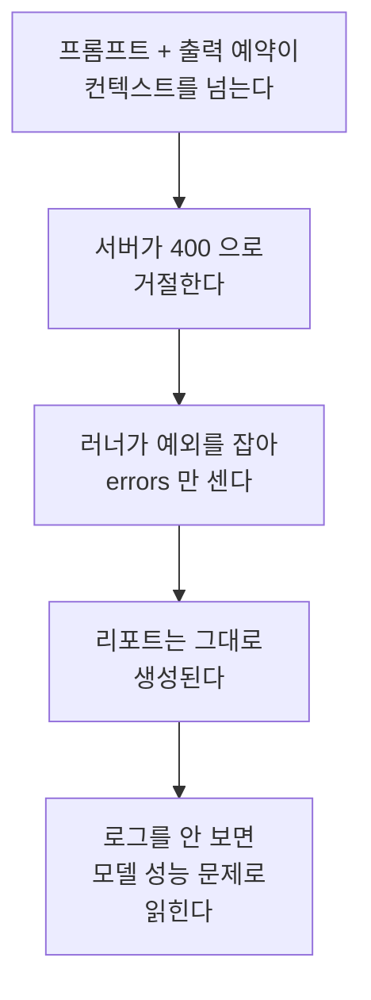

# issue-210: ko llm_eval 전건 400 수정 + ko 프롬프트 중복 정리·openai 경로 제거

- Issue: https://github.com/groovallstar/ner-pipeline/issues/210
- PR: <!-- 머지 직전 채움 -->
- 브랜치: `feat/issue-210-ko-prompt-token-budget`
- 승인일: 2026-08-19

## 배경 (왜)

`python -m ner.llm_eval --lang ko` 가 **전건 400 으로 실패했다.** 한국어 프롬프트가
5623 토큰(문장을 뺀 고정 지시문 기준)인데 라벨러가 출력 자리로 4096 토큰을 예약해,
합계가 서버 `max-model-len` 8192 를 넘었다. `max_tokens` 는 실제로 쓴 양이 아니라 **미리 잡아두는 자리**라, 실측
출력이 77 토큰이어도 예약분 전체가 한도 계산에 들어간다. gemma·Qwen3.6·Qwen3.8 세
서버 모두에서 재현됐다.

**그런데 두 달 가까이 아무도 몰랐다.** 실패가 조용했기 때문이다.

프롬프트가 예산을 넘긴 시점은 2026-07-02(narrow-ORG 재정의)였다. 그 커밋이 잘못된 게
아니라, **예산을 넘겼는데 알려주는 것이 아무것도 없었다**는 것이 문제다. 기존
프롬프트 테스트는 few-shot 예시의 자기정합성만 보고 길이는 보지 않았다.

막힌 원인은 예약값 하나지만, 예약을 1024 로 낮춰도 여유가 1545 토큰(7168 − 5623)밖에
안 남는 이유는 프롬프트가 계속 자란 쪽에 있다. 그래서 예약값 수정과 프롬프트 점검을 한 이슈로 묶었다 — 앞만 고치면 다음
규칙 추가에서 같은 자리로 돌아온다.

## 목적

1. ko 벤치마크가 **현재 서버 설정 그대로**(`max-model-len 8192`) `errors=0` 으로 돈다
2. 프롬프트가 다시 예산을 잠식하면 **커밋 전에 걸린다**
3. 쓰지 않는 openai 경로를 걷어 **규칙을 한 벌만 유지한다**
4. 중복 규칙의 품질 기여를 재고 그 근거를 원장에 남긴다

## 범위

- **포함**: `max_tokens` 기본값, 프롬프트 길이 회귀 테스트, ko 지시문 중복 제거,
  openai 라벨러·프롬프트 3언어 제거, 그 과정에서 드러난 이벤트 루프 재사용 결함
- **제외**:
  - **조용한 실패 처리 자체** — 전건 실패가 정상 리포트로 나오는 동작은 `llm_eval`
    전반의 오류 처리 설계라 범위가 다르다
  - **CLI `--max-tokens` 노출** — 기본값을 고치면 당장 필요하지 않다
  - **few-shot 예시 16개 정리** — 예시는 반복이 정상이라 지시문 중복과 성격이 다르다

## 성공 기준

- [x] `max_tokens` 기본값 4096 → 1024 (base + ko·ja·vi 서브클래스)
- [x] ko 프롬프트 렌더 결과가 예산 상한을 넘으면 실패하는 테스트 신설
- [x] `python -m ner.llm_eval --lang ko --max-samples 20` 이 `errors=0` 으로 완주,
      ja·vi 무회귀
- [x] openai 라벨러·프롬프트를 ko·ja·vi 세 언어 모두 제거하고 전체 테스트 통과
- [x] 중복 규칙 ablation 으로 F1 기여를 재고, 하락이 유의하지 않은 블록만 제거.
      채택 구성의 metric 을 `certified/` 에 승격

## 현 상태 (fact)

| 항목 | 값 |
|---|---|
| `max_tokens` 기본값 | 1024 (실측 출력 77 토큰의 13배) |
| 예산 상한 | 6144 토큰 = `max-model-len 8192` − 출력 예약 1024 × 2 |
| ko 지시문 | 5268 토큰 (같은 기준, 중복 두 덩어리 제거 후) — 예산까지 876 여유 |
| 프롬프트 변화 | 5623 → 5320(규칙 5번) → 5268(ORG 중복) 토큰 — 문장을 뺀 고정 지시문, gemma 기준 |
| ja · vi 지시문 | 2256 · 2276 토큰 |
| ablation | 상세는 `docs/reports/korean-prompt-dedup-ablation.md` |

**임계값을 벽에 붙이지 않은 이유** — 실제 벽은 `max-model-len − 출력 예약` = 7168 인데
거기 맞춰 잡으면 넘는 순간에야 걸려 고칠 여유가 없다. 출력 예약 한 벌만큼 더 물러나면
걸린 시점에도 실제 요청은 아직 200 이다. 두 값을 상수로 베끼지 않고 compose 와 라벨러
서명에서 읽어, 서버 설정이나 예약값이 바뀌면 예산이 따라 움직인다.

## 결정 로그 (append-only)

- 2026-08-19: ablation 판정 기준을 측정 **전에** 등록 — `|Δ평균| < 2σ`, σ 는 50샘플
  블록별 Δ 의 표준편차. 블록 크기를 바꿔 유리한 결과를 만들 수 없게 먼저 고정했다.
- 2026-08-19: 예비 측정(200샘플·4블록)의 σ 는 자유도 3 이라 신뢰도가 낮아 1000샘플
  20블록으로 재측정. "샘플을 늘려도 밴드는 안 좁아진다" 던 앞선 설명을 정정 — σ 의
  기댓값은 블록 크기에만 의존하지만 추정치는 블록 수가 늘수록 정확해진다.
- 2026-08-20: 길이 회귀 테스트를 문자 수 근사가 아니라 **토큰 직접 계산**으로 정함.
  400 을 만드는 것은 토큰이고 한국어는 문자당 토큰 비율이 흔들려 근사가 벽 근처에서
  빗나간다. 토크나이저 캐시가 없으면 `skipif` 로 건너뛴다(저장소 관례).
- 2026-08-20: 이벤트 루프 재사용 결함을 **이 이슈에서 고치기로** 함. 별도 이슈로 미룰
  수도 있었으나 기준 3(`errors=0`)이 이것 때문에 달성 불가였다.
- 2026-08-20: ORG 절 중복 제거가 버는 양이 52 토큰(규칙 5번의 1/6)임을 측정 전에
  확인하고도 같은 절차로 측정 — 예산이 아니라 "중복을 걷어도 되나" 를 다음 판단의
  근거로 남기기 위해서다.
- 2026-08-20: ORG 중복은 사전 등록 기준(2σ)을 통과해 **제거**. 참고 지표 2SE 는
  아슬아슬하게 초과했으나(0.00242 vs 0.00239) 결과를 본 뒤 더 엄격한 쪽으로 갈아타면
  기준을 미리 못 박는 장치가 무의미해진다. 경계였다는 사실은 리포트에 남겼다.

## 검증

- **테스트**: `pytest tests/` → 799 passed / 3 skipped · `ruff check .` 통과
- **ko 20샘플**: gemma4·Qwen3.6 양쪽에서 `errors=0`. 400 이 나던 서버(gemma4)에서
  그대로 완주하는 것이 이 이슈의 핵심 확인이다. 부수 효과로 재시도가 20회 → 0회,
  샘플당 1.42s → 0.92s (Qwen3.6 기준)
- **ja · vi 무회귀**: 각 20샘플 `errors=0` (span F1 0.8815 · 0.9051)
- **ablation**: `docs/reports/korean-prompt-dedup-ablation.md` — 두 덩어리 모두 사전
  등록 기준 통과, 원본 산출물은 `certified/llm_labeler/ko/issue210-prompt-dedup/`

## 관련 커밋

- `176872f`: 예산 초과 해소 · 예산 회귀 테스트 · 규칙 5번 제거 · openai 경로 제거 ·
  이벤트 루프 재사용 수정
- 본 문서를 추가한 커밋: ORG 절 중복 제거 · ablation 원장 승격 · 리포트

## 후속 작업

- **조용한 실패 처리** — 전건 실패가 정상 리포트로 나오는 동작. 이 버그가 오래 안 보인
  이유의 절반이지만 `llm_eval` 전반의 오류 처리 설계라 별도 판단이 필요하다.
