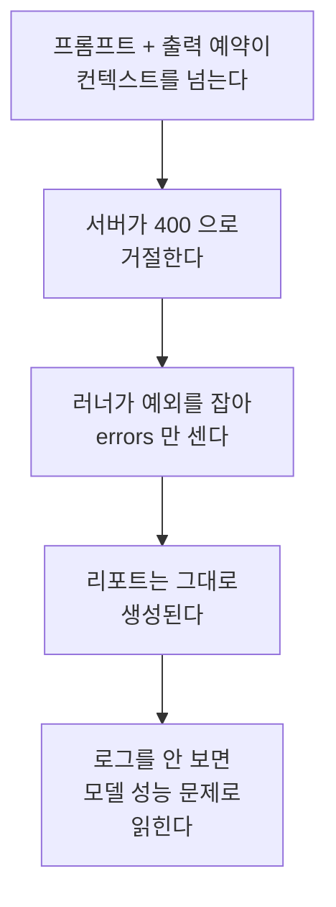
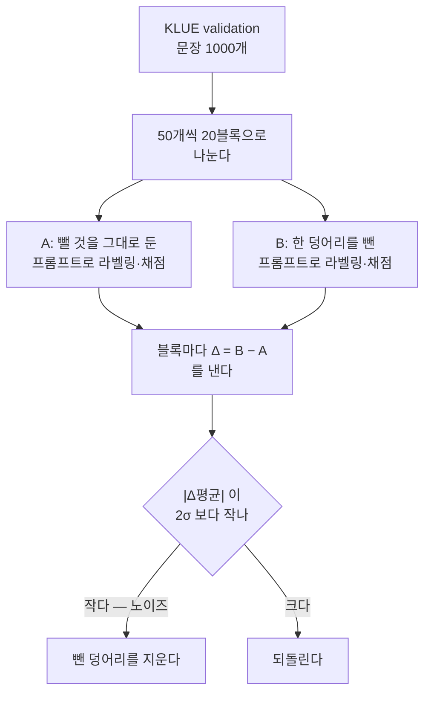

# issue-210: ko llm_eval 전건 400 수정 + ko 프롬프트 중복 정리·openai 경로 제거

- Issue: https://github.com/groovallstar/ner-pipeline/issues/210
- PR: https://github.com/groovallstar/ner-pipeline/pull/211
- 브랜치: `feat/issue-210-ko-prompt-token-budget`
- 승인일: 2026-08-19

## 배경 (왜)

`python -m ner.llm_eval --lang ko` 가 **전건 400 으로 실패했다.** 한국어 프롬프트가
5623 토큰(문장을 뺀 고정 지시문 기준)인데 라벨러가 출력 자리로 4096 토큰을 예약해,
합계가 서버 `max-model-len` 8192 를 넘었다. `max_tokens` 는 실제로 쓴 양이 아니라 **미리 잡아두는 자리**라, 실측
출력이 77 토큰이어도 예약분 전체가 한도 계산에 들어간다. gemma·Qwen3.6·Qwen3.8 세
서버 모두에서 재현됐다.

**그런데 두 달 가까이 아무도 몰랐다.** 실패가 조용했기 때문이다.



**예산을 넘긴 시점은 토크나이저마다 다르다.** 당시 벽(8192 − 예약 4096 = 4096)에 대고
각 시점의 고정 지시문을 재면 gemma 는 2026-06-23 `5ba397b`(4100)에서 이미 넘고,
Qwen3.6 은 한 달 뒤 2026-07-31 `34c40fb`(4459)에서 넘는다. 어느 커밋이 잘못됐다는
뜻이 아니라, **예산을 넘겼는데 알려주는 것이 아무것도 없었다**는 것이 문제다. 넘은
시점이 서버마다 다르다는 사실 자체가 사람 눈으로는 안 보이는 종류의 경계임을 말한다. 기존
프롬프트 테스트는 few-shot 예시의 자기정합성만 보고 길이는 보지 않았다.

막힌 원인은 예약값 하나지만, 예약을 1024 로 낮춰도 여유가 1545 토큰(7168 − 5623)밖에
안 남는 이유는 프롬프트가 계속 자란 쪽에 있다. 그래서 예약값 수정과 프롬프트 점검을 한 이슈로 묶었다 — 앞만 고치면 다음
규칙 추가에서 같은 자리로 돌아온다.

## 목적

1. ko 벤치마크가 **현재 서버 설정 그대로**(`max-model-len 8192`) `errors=0` 으로 돈다
2. 프롬프트가 다시 예산을 잠식하면 **커밋 전에 걸린다**
3. 쓰지 않는 openai 경로를 걷어 **규칙을 한 벌만 유지한다**
4. 중복 규칙의 품질 기여를 재고 그 근거를 원장에 남긴다

## 범위

- **포함**: `max_tokens` 기본값, 프롬프트 길이 회귀 테스트, ko 지시문 중복 제거,
  openai 라벨러·프롬프트 3언어 제거, 그 과정에서 드러난 이벤트 루프 재사용 결함
- **제외**:
  - **조용한 실패 처리 자체** — 전건 실패가 정상 리포트로 나오는 동작은 `llm_eval`
    전반의 오류 처리 설계라 범위가 다르다
  - **CLI `--max-tokens` 노출** — 기본값을 고치면 당장 필요하지 않다
  - **few-shot 예시 16개 정리** — 예시는 반복이 정상이라 지시문 중복과 성격이 다르다

## 성공 기준

- [x] `max_tokens` 기본값 4096 → 1024 (base + ko·ja·vi 서브클래스)
- [x] ko 프롬프트 렌더 결과가 예산 상한을 넘으면 실패하는 테스트 신설
- [x] `python -m ner.llm_eval --lang ko --max-samples 20` 이 `errors=0` 으로 완주,
      ja·vi 무회귀
- [x] openai 라벨러·프롬프트를 ko·ja·vi 세 언어 모두 제거하고 전체 테스트 통과
- [x] 중복 규칙 ablation 으로 F1 기여를 재고, 하락이 유의하지 않은 블록만 제거.
      채택 구성의 metric 을 `certified/` 에 승격

## 현 상태 (fact)

| 항목 | 값 |
|---|---|
| `max_tokens` 기본값 | 1024 (실측 출력 77 토큰의 13배) |
| 예산 상한 | 6144 토큰 = `max-model-len 8192` − 출력 예약 1024 × 2 |
| ko 지시문 | 5268 토큰 (같은 기준, 중복 두 덩어리 제거 후) — 예산까지 876 여유 |
| 프롬프트 변화 | 5623 → 5320(규칙 5번) → 5268(ORG 중복) 토큰 — 문장을 뺀 고정 지시문, gemma 기준 |
| ja · vi 지시문 | 2256 · 2276 토큰 |
| ablation | 두 덩어리 모두 사전등록 기준 통과 — 아래 §ablation |

**임계값을 벽에 붙이지 않은 이유** — 실제 벽은 `max-model-len − 출력 예약` = 7168 인데
거기 맞춰 잡으면 넘는 순간에야 걸려 고칠 여유가 없다. 출력 예약 한 벌만큼 더 물러나면
걸린 시점에도 실제 요청은 아직 200 이다. 두 값을 상수로 베끼지 않고 compose 와 라벨러
서명에서 읽어, 서버 설정이나 예약값이 바뀌면 예산이 따라 움직인다.

## ablation — 중복 지시문 제거


| | |
|---|---|
| 측정 서버 | gemma4 (`localhost:8081`, `cyankiwi/gemma-4-31B-it-AWQ-8bit`, GPU 1) |
| 데이터 | KLUE validation 앞 1000 문장 |
| 채점 | `BenchmarkRunner`(`eval_mode=bio`) pooled strict span F1 |
| 원본 산출물 | `certified/llm_labeler/ko/issue210-prompt-dedup/` |

### 왜 쟀나

한국어 프롬프트가 규칙 추가로 계속 자라 컨텍스트 예산을 넘겼고, ko 벤치마크가 전건
400 으로 실패했다(§배경). 예산을 되찾는 가장 값싼 길은 **지시문 안에서 같은 규칙을 두 번
말하는 자리**를 걷는 것이다 — 그런 자리가 실제로 있었다. 다만 LLM 프롬프트에서 중요
규칙의 반복은 준수율을 올리기도 하므로, 빼도 되는지는 **빼보고 F1 을 재야** 안다.

재야 하는 또 다른 이유가 있다. 원장(`certified/`)에는 classifier 와 번역 벤치마크만
있고 **LLM 라벨러 프롬프트 자체의 metric 이 없었다.** 그래서 프롬프트를 손볼 때마다
"이게 나빠졌나" 를 판단할 기준이 매번 없었다. 이 측정이 그 첫 기준이다.

### 어떻게 쟀나 — 기준을 재기 전에 못 박았다

같은 문장으로 A(그 덩어리를 그대로 둔 구성)와 B(그 덩어리를 뺀 구성)를 각각 돌려
블록마다 Δ 를 낸다. 재고 나서 기준을 정하면 유리한 쪽을 고르게 되므로, 판정식과 블록
크기를 **측정 전에 이슈에 등록했다.**

**두 측정은 이어 붙였다 — ORG 쪽은 증분 측정이다.** 규칙 5번 측정의 A 는 손대지 않은
원본이지만, ORG 측정의 A 는 **규칙 5번을 이미 뺀 구성**(= 앞 측정의 B)이다. 그래서 ORG
측정이 답하는 것은 *채택 구성 위에서* ORG 중복을 더 걷어도 되는가이다.



- **σ 는 50샘플 블록별 Δ 의 표준편차**다. 블록을 키우면 σ 가 작아져 기준이 엄격해지고
  줄이면 헐거워지므로, 크기를 바꿔 유리한 결과를 만들 수 없게 50 으로 먼저 고정했다.
- `band_k = 2.0` 은 이 저장소가 노이즈 밴드에 이미 쓰는 값이다(`src/ner/validity/`).
- `temperature=0` 이지만 **완전 결정적이지는 않다.** 같은 프롬프트(규칙 5번 측정의 B 와
  ORG 측정의 A)를 다른 실행에서 돌린 결과가 20블록 중 6블록에서 갈렸다 — 차의 평균
  −0.00089, 표준편차 0.00220 으로 ORG 효과의 3분의 1쯤 된다. 배치 구성이 달라지며 생기는
  부동소수점 비결정성이다. 이 노이즈는 블록 간 σ 에 섞여 들어가는데, **그 방향은 통과를
  쉽게 만드는 쪽이다** — σ 가 커지면 2σ 밴드가 넓어진다. 그러니 "노이즈가 σ 안에 있으니
  괜찮다" 는 판정의 근거가 못 된다. 판정이 서는 근거는 따로다: 사전 등록식을 결과를 본 뒤에
  바꾸지 않았다는 것, 그리고 더 엄격한 2SE 로 재면 ORG 쪽이 통과하지 못한다는 사실
  (0.00242 vs 0.00239)을 감추지 않고 함께 적었다는 것이다.

#### 무엇을 뺐나 — 프롬프트 수술의 정확한 자리

측정 스크립트는 `results/`(gitignore·휘발) 에 있었으므로, 재현에 필요한 정의를 여기 남긴다.
두 경우 모두 원문을 문자열 치환 한 번으로 바꿨고 나머지는 손대지 않았다.

| 측정 | A | B = A 에서 바꾼 것 |
|---|---|---|
| 규칙 5번 | 원본 | "핵심 규칙" 5번 항목을 통째로 삭제하고 6·7번을 5·6번으로 재번호 |
| ORG 중복 | 규칙 5번 제거본 | ORG 절 마지막 주의줄의 목록·예시를 걷고 가리키는 문장만 남김 (아래) |

```
- 주의: 민간 회사·기업·은행("삼성전자")·언론/방송사("엠비씨")·스포츠 구단/리그("두산 베어스",
  "프리미어리그", "LPGA")·군·군부대·법원·검찰·종교조직은 ORG 아님(아래 비-entity).
  사건명("부림사건")·대회명은 EVT, 프로그램명("황금어장")·작품명·상품명은 PROD
+ 주의: 정부·정치 기관이 아닌 조직은 ORG 아님 — 목록은 아래 비-entity (2).
  사건명("부림사건")·대회명은 EVT, 프로그램명("황금어장")·작품명·상품명은 PROD
```

토큰 수는 **문장을 뺀 고정 지시문** 기준이다(gemma 토크나이저): 원본 5623 → 규칙 5번
제거 5320 → ORG 중복 제거 5268. 문장을 넣어 재면 그 문장의 토큰만큼 일제히 올라가므로,
어느 기준으로 재는지를 섞으면 차이가 안 맞는다.

### 결과 — 두 덩어리 모두 노이즈 안


| 뺀 덩어리 | 뺀 토큰 | Δ평균 | σ | 2σ | 판정 |
|---|---|---|---|---|---|
| 핵심 규칙 5번 | 303 | −0.00059 | 0.00342 | 0.00685 | 통과 |
| ORG 절의 중복 목록 | 52 | −0.00242 | 0.00533 | 0.01067 | 통과 |

#### 핵심 규칙 5번 — EVT·PROD 절의 재진술

"핵심 규칙" 섹션 512 토큰 중 5번 한 항목이 303 토큰이었다 — 그 섹션의 59% 다. 내용은 위 EVT·PROD 절을
통째로 다시 쓴 것이고, 거기서만 나오는 새 정보는 *"모호하면 우선순위
LOC→ORG→PROD→EVT"* 한 줄뿐이었다. 블록별 Δ 의 부호가 양 7 · 음 8 · 동일 5 로 거의
균등하게 갈렸고, 더 엄격한 2SE(0.00153)로 재도 통과한다. **제거 확정.**

#### ORG 절의 중복 목록 — 비-entity 절이 이미 적고 있다

ORG 절이 *"민간 회사·언론/방송·스포츠 구단… 은 ORG 아님(아래 비-entity)"* 라고
가리키면서 목록을 다 적고, 바로 아래 비-entity 절이 같은 목록을 또 적었다. 목록·예시만
걷고 가리키는 문장과 그 줄에만 있는 정보(사건명→EVT, 프로그램·작품·상품명→PROD)는
남겼다.

**사전 등록 기준으로는 통과라 제거했다. 다만 규칙 5번과 모양이 다르다.** 점추정이
4배 크고 음수이며, 부호가 음으로 기울었고(양 3 · 음 8 · 동일 9), 규칙 5번이 여유롭게
넘긴 참고 지표 2SE 를 아슬아슬하게 못 넘는다(0.00242 vs 0.00239).

그럼에도 제거한 것은 **판정식을 결과를 본 뒤에 바꾸지 않기 위해서**다. 2σ 는 측정 전에
등록한 기준이고 2SE 는 참고로 함께 본 값이다. 결과가 나온 다음 더 엄격한 쪽을 골라
결론을 뒤집으면, 다음번에는 반대 방향으로 고를 수 있게 된다 — 기준을 미리 못 박는
장치가 그 순간 무의미해진다.

**대신 이 경계는 기록으로 남긴다.** 이 정리로 F1 이 실제로 0.002 남짓 내려갔을
가능성은 배제되지 않았다. 얻은 것은 52 토큰이고, 프롬프트를 더 손볼 때 이 표를 기준선
삼아 같은 절차로 재면 된다.

### 이 결과의 한계

**52 토큰은 예산 문제가 아니다.** `max_tokens` 를 1024 로 낮추면 실제 한계는 7168
토큰이고 규칙 5번을 뺀 지시문이 5320 이라 1848 여유가 있다. ORG 중복 제거가 버는
52 토큰은 그 여유의 3% 다 — 이 측정이 답한 것은 예산이 아니라 **중복 진술을 걷어도
준수율이 안 떨어지나** 라는 프롬프트 위생 문제다.

**절대 F1 이 0.46 대인 것은 모델이 나빠서가 아니다.** KLUE gold 에 있는 QT·TI 를
프롬프트가 아예 뽑지 않아 생기는 구조적 miss 이며, A·B 양쪽에 똑같이 걸리므로 Δ 비교는
유효하다.

**두 측정 모두 라벨러 결함이 고쳐지기 전에 돌았다.** 동기 API 가 호출마다 이벤트 루프를
새로 만들어 연결 풀이 첫 루프에 묶이는 결함 때문에 1000 샘플 중 몇 건이 전송 오류로
빠졌다. 다만 **A·B 가 같은 블록에서 같은 개수만큼 빠져** paired 구조는 유지됐다(순차
처리라 실패 위치가 결정적이다). 재측정하지 않은 것은 이 때문이다.

**토크나이저마다 토큰 수가 다르다.** 위 토큰 수는 gemma 기준이며, 최종 지시문 5268 이
Qwen3.6 에서는 4947 토큰이다. 예산 검사는 이 차이를 흡수하도록 벽에서 한 벌 물러나
잡는다(`tests/ner/labelers/test_prompt_token_budget.py`).

### 손대지 않은 것

- 엔티티 설명 절의 편중(EVT 1238 · PROD 668 토큰으로 원본 지시문 5623 의 34%)은
  손대지 않았다. 중복이 아니라 규칙 자체의 양이라, 줄이려면 규칙을 바꿔야 한다.
- **다음 정리의 기준선은 두 제거의 합이다.** 원본(규칙 5번 측정의 A)과 최종(ORG 측정의
  B)을 블록마다 직접 빼면 −0.00389 이고, 두 Δ 를 더한 값 −0.00300 과는 다르다 — 그
  차이가 위에서 말한 재실행 드리프트(−0.00089)다. 셋 다 반올림 전 값으로 계산해서, 위
  표의 −0.00059 와 −0.00242 를 손으로 더한 −0.00301 과는 마지막 자리가 다르다. 같은 방식으로 낸 밴드(2σ 0.01080)
  안이지만 **이것은 사전 등록된 판정이 아니라 사후 확인**이다. 프롬프트를 더 손볼 때는
  이 end-to-end 값에서부터 재는 것이 맞다.

## 결정 로그 (append-only)

- 2026-08-19: ablation 판정 기준을 측정 **전에** 등록 — `|Δ평균| < 2σ`, σ 는 50샘플
  블록별 Δ 의 표준편차. 블록 크기를 바꿔 유리한 결과를 만들 수 없게 먼저 고정했다.
- 2026-08-19: 예비 측정(200샘플·4블록)의 σ 는 자유도 3 이라 신뢰도가 낮아 1000샘플
  20블록으로 재측정. "샘플을 늘려도 밴드는 안 좁아진다" 던 앞선 설명을 정정 — σ 의
  기댓값은 블록 크기에만 의존하지만 추정치는 블록 수가 늘수록 정확해진다.
- 2026-08-20: 길이 회귀 테스트를 문자 수 근사가 아니라 **토큰 직접 계산**으로 정함.
  400 을 만드는 것은 토큰이고 한국어는 문자당 토큰 비율이 흔들려 근사가 벽 근처에서
  빗나간다. 토크나이저 캐시가 없으면 `skipif` 로 건너뛴다(저장소 관례).
- 2026-08-20: 이벤트 루프 재사용 결함을 **이 이슈에서 고치기로** 함. 별도 이슈로 미룰
  수도 있었으나 기준 3(`errors=0`)이 이것 때문에 달성 불가였다.
- 2026-08-20: ORG 절 중복 제거가 버는 양이 52 토큰(규칙 5번의 1/6)임을 측정 전에
  확인하고도 같은 절차로 측정 — 예산이 아니라 "중복을 걷어도 되나" 를 다음 판단의
  근거로 남기기 위해서다.
- 2026-08-20: ORG 중복은 사전 등록 기준(2σ)을 통과해 **제거**. 참고 지표 2SE 는
  아슬아슬하게 초과했으나(0.00242 vs 0.00239) 결과를 본 뒤 더 엄격한 쪽으로 갈아타면
  기준을 미리 못 박는 장치가 무의미해진다. 경계였다는 사실은 §ablation 에 남겼다.

## 검증

- **테스트**: `pytest tests/` → 799 passed / 3 skipped · `ruff check .` 통과
- **ko 20샘플**: gemma4·Qwen3.6 양쪽에서 `errors=0`. 400 이 나던 서버(gemma4)에서
  그대로 완주하는 것이 이 이슈의 핵심 확인이다. 부수 효과로 재시도가 20회 → 0회,
  샘플당 1.42s → 0.92s (Qwen3.6 기준)
- **ja · vi 무회귀**: 각 20샘플 `errors=0` (span F1 0.8815 · 0.9051)
- **ablation**: 두 덩어리 모두 사전 등록 기준(2σ) 통과 — 절차·결과·한계는 위
  §ablation, 원본 산출물은 `certified/llm_labeler/ko/issue210-prompt-dedup/`

## 관련 커밋

- `176872f`: 예산 초과 해소 · 예산 회귀 테스트 · 규칙 5번 제거 · openai 경로 제거 ·
  이벤트 루프 재사용 수정
- 본 문서를 추가한 커밋: ORG 절 중복 제거 · ablation 원장 승격 · 측정 리포트
  (리포트는 이후 본 문서 §ablation 으로 흡수)

## 후속 작업

- **조용한 실패 처리** — 전건 실패가 정상 리포트로 나오는 동작. 이 버그가 오래 안 보인
  이유의 절반이지만 `llm_eval` 전반의 오류 처리 설계라 별도 판단이 필요하다.
