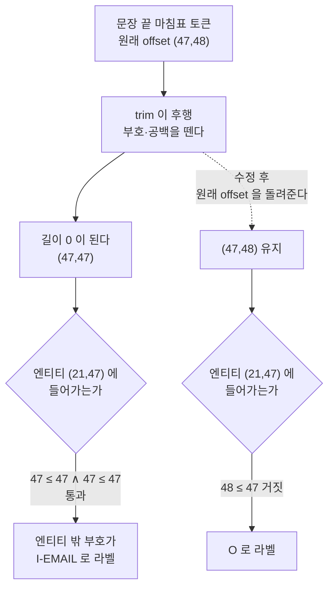

# issue-225: 정답표 경계 결함 — 길이 0 offset 이 엔티티 밖 문장부호를 삼킨다

- Issue: https://github.com/groovallstar/ner-pipeline/issues/225
- PR: https://github.com/groovallstar/ner-pipeline/pull/230
- 브랜치: `feat/issue-225-zero-length-span-boundary`
- 승인일: 2026-08-26

## 배경 (왜)

정답표(BIO 라벨 — 토큰마다 `B-`/`I-`/`O` 를 붙여 엔티티 구간을 표시한 것)가 엔티티 밖 문장부호를 엔티티 안으로 라벨한다. en 코퍼스 전수에서 **80,288건**이 이렇게 라벨되며 canonical 10종 전부에 걸쳐 있다.

원인은 두 지점이 겹치는 데 있다. `_trim_offset` 이 토큰의 char offset(원문에서 그 토큰이 차지하는 글자 구간) 끝에서 `.`·`,`·공백을 떼어내는데, 토큰이 그것만으로 이뤄지면 결과가 **길이 0** 이 된다. 그리고 `_bio_labels_from_offsets` 의 포함 검사가 `es <= s and e <= ee` 로 양끝을 포함하므로, 길이 0 조각이 엔티티가 끝나는 지점에서 그 조건을 통과한다.

같은 함수가 반대 방향으로도 틀린다. 엔티티가 마침표로 끝나면(`Inc.`·`Wyo.`·`R.I.`) trim 이 그 마침표를 엔티티 밖으로 밀어내, gold 라벨을 그대로 디코드해도 span 이 한 글자 짧게 나온다. 그러면 **모델이 완벽해도 strict(시작·끝·타입이 모두 일치해야 정답) 로 맞힐 수 없는** 엔티티가 생긴다.

이 손실의 크기는 왕복 복원율로 잰다 — gold 라벨을 `decode_bio_to_spans` 에 그대로 넣어 원래 엔티티가 되살아나는 비율이다. 이 값은 학습·시드와 무관한 결정적 값이라, 어떤 실험을 하든 그 위에 얹힌다. **en LOC 은 정답표만으로 이미 6% 를 잃고 있었다**(§검증의 표).

### EMAIL 시드 진폭을 근거에서 뺀 이유

이 결함을 처음 발견한 계기는 `roberta-base` 3-seed 의 EMAIL strict F1 이 크게 갈린 것이었으나, 원장이 그 귀속을 지지하지 않는다. `certified/classifier/en/backbone-bench/` 의 16개 런은 전부 같은 결함을 안고 학습됐는데(`offset_trim=True`, 동일 `data_fingerprint`) 백본별로 결과가 갈린다.

<!-- certified: classifier/en/backbone-bench -->

| 백본 | seed 42 | seed 43 | seed 44 |
|---|---|---|---|
| bert_base_cased | 0.9849 | 0.9826 | 0.9855 |
| electra_base | 0.9845 | 0.9855 | 0.9837 |
| modernbert_base | 0.9816 | 0.9820 | 0.9851 |
| xlmr_base | 0.9868 | 0.9680 | 0.9827 |
| roberta_base | 0.9853 | 0.7305 | 0.9839 |

(EMAIL strict F1. deberta_v3_base_seed42 는 overall 0.0000 인 완전 발산이라 뺐다.)

같은 결함을 안고 15개 정상 런 중 14개가 EMAIL 약 0.98 을 냈고, 백본 5종 중 4종은 seed 간 폭이 0.02 아래다. 0.7305 는 단일 런 붕괴이며, 학습 발산은 이 하네스의 알려진 실패모드다.

게다가 `roberta_base_seed42` 와 `deploy-trainseed42` 는 기록된 설정 필드 28개 중 27개가 일치하는데(다른 하나는 `train_time_sec`) overall strict F1 이 0.9190 과 0.8982 로 0.0208 벌어진다. 이 하네스의 재현 격차가 그만큼이라, 학습된 모델 점수에 건 임계는 이 결함의 수정 여부를 판정할 수 없다. 그래서 이 이슈는 **학습 없이 결정적으로 재는 것만 기준으로 삼았다.**

## 목적

길이 0 char span 이 엔티티 경계에서 삼켜지지 않게 하고, 그로 인해 깎인 gold 왕복 복원 상한을 되돌린다.

## 범위

- 포함: `_trim_offset` 수정 · 감사 스크립트 · en 회귀 테스트 · en 코퍼스 전수 감사 · 고정 체크포인트의 자 변경 효과 측정
- 제외: **재학습·재배포** — 모델을 출하하지 않는다. 모델 수준 무회귀는 재학습을 맡는 쪽이 진다
- 제외: **ja·vi 검증** — `_trim_offset` 은 fast 토크나이저 공용이라 vi·ko 라벨도 함께 바뀌지만(ja 는 slow 경로라 안 바뀜) 이 이슈는 그 둘을 평가하지 않는다
- 제외: EMAIL 시드 진폭 (위 §EMAIL 시드 진폭을 근거에서 뺀 이유)

## 성공 기준

- [x] **경계 위반 라벨 소거** — 엔티티 라벨을 받은 토큰이 엔티티 밖 char 를 포함하거나(`s < es` ∨ `e > ee`) 엔티티 종료 경계의 길이 0 조각(`s == e` ∧ `s == ee`)인 건수가 en 전체 코퍼스에서 0
- [x] **왕복 상한 회복** — 왕복 복원율이 en 전체에서 0.993 이상이고 수정 전 값을 넘으며, canonical 10종 어느 타입도 수정 전 값 미만이 되지 않는다
- [x] **회귀 테스트** — `roberta-base` fixture 를 신설해 네 케이스를 고정
- [x] **자 변경 효과 고립** — 고정 체크포인트를 같은 test 로 수정 전후 재평가했을 때 토큰별 예측 label id 시퀀스 해시가 완전히 같다
- [x] **감사 산출물 원장화** — 감사 스크립트를 커밋하고 산출 JSON 을 `certified/` 로 승격한다

## 현 상태 (fact)

- 수정은 `_trim_offset` 한 함수, 3줄이다. 변경 표면을 그 함수로 한정했다.
- 서버 추론(`src/server/inference.py`)은 `encode_row` 를 거쳐 같은 정렬 경로를 쓰지만, 서버가 지원하는 두 언어는 이 경로를 타지 않는다 — ja 는 `_encode_ja`(slow), vi 는 배포 모델이 PhobertTokenizer 라 `_encode_phobert` 로 간다. 운영 중인 REST API 는 영향을 받지 않는다.
- en 배포 패키지(`/data/ner/en/`)만 영향권이다. 그 체크포인트는 결함 라벨로 학습돼 새 정렬과 불일치하므로, **재학습 전에는 이 코드와 함께 서비스하면 안 된다.** 서버의 `SUPPORTED_LANGS` 는 현재 `('ja', 'vi')` 라 아직 연결돼 있지 않다.
- `tests/ner/labelers/test_ko_locorg_ledger.py::test_live_gold_matches_the_ledger` 가 실패한다. `data/` 의 KO gold 파일 지문이 커밋된 원장과 달라서인데, 이 이슈의 diff 에는 그 gold 도 원장 파일도 없다. develop 의 pytest 경로 수정이 들어오면서 이제야 수집돼 드러난 기존 실패라 손대지 않았다.

## 결정 로그 (append-only)

- 2026-08-26: 이슈 본문의 수정 후보 중 **C(생산자 수정)** 를 채택하고 가드(소비자 수정)를 버렸다. 가드는 삼킴만 고치고 잘림을 못 고쳐 왕복 상한이 하나도 안 오른다(측정: 0.9848 그대로). 반면 C 는 양방향을 다 고친다.
- 2026-08-26: 이슈 본문의 가드 형태(`start < end` 면만 매칭)는 그대로 쓸 수 없음을 확인했다. ja 엔티티 안쪽 UNK 까지 `O` 가 되어 엔티티가 쪼개진다. 쓰려면 "엄격 내부(`es < p < ee`)" 로 완화해야 하는데, ja 가 범위 밖이 되면서 이 갈래 자체를 버렸다.
- 2026-08-26: 정의-시점 반박자가 EMAIL 진폭 기준을 반증했다. 원장 전수 대조로 확인해 진폭을 성과 지표에서 빼고, 기준을 학습 없이 결정적으로 재는 것만으로 다시 짰다.
- 2026-08-26: 초안의 "라벨이 안 바뀐 타입은 무회귀" 기준을 폐기했다. en 전수 측정 결과 10종 전부가 라벨 변경에 닿아 검사 대상이 공집합이었다.
- 2026-08-26: 초안의 "옛 체크포인트 재평가에서 어떤 타입도 하락 없음" 기준을 폐기했다. 옛 모델은 결함 라벨로 학습돼 새 자에서 하락하는 것이 정상이라, 그 조건은 정당한 수정을 차단한다. 대신 예측 해시 동일성으로 바꿨다.

## 구현 결과

`_trim_offset` 이 공백·문장부호를 떼어낸 결과가 비면 원래 offset 을 돌려준다. 그러면 그 조각이 엔티티 밖 char 를 들고 있어 포함 검사에서 떨어지고, 엔티티가 문장부호로 끝나는 경우에는 마지막 char 가 살아 있어 gold 라벨을 디코드했을 때 원래 span 이 복원된다. 애초에 길이 0 인 offset(토크나이저가 연속 공백 자리에 주는 것)과 `(0,0)` 특수토큰은 그대로 둔다.

감사 스크립트 `src/ner/scripts/audit_offset_alignment.py` 를 새로 뒀다. 경계 위반 건수와 왕복 복원율을 학습된 모델 없이 결정적으로 재고, `--model-dir` 을 주면 고정 체크포인트를 재평가하면서 토큰별 예측 label id 시퀀스의 해시를 함께 남긴다.

## 검증

### 경계 위반과 왕복 상한

<!-- certified: classifier/en/issue225-offset-audit -->

| 타입 | 수정 전 상한 | 수정 후 상한 |
|---|---|---|
| LOC | 0.9395 | 0.9788 |
| ORG | 0.9364 | 0.9700 |
| PROD | 0.9889 | 0.9935 |
| DAT | 0.9976 | 0.9989 |
| PER | 0.9965 | 0.9978 |
| CREDIT_CARD | 0.9999 | 0.9999 |
| EMAIL · EVT · ID_NUM · PHONE | 1.0000 | 1.0000 |
| **전체** | **0.9848** | **0.9937** |

en 코퍼스 76,378행 / 엔티티 167,871 전수. 경계 위반 라벨은 80,288건에서 0건이 됐고, 위반 종류는 전부 `zero_at_end` 였다. 왕복 상한은 열 타입 중 하나도 내려가지 않았다.

**위반이 아닌데 라벨을 잃은 토큰도 832개 있다.** 엔티티 라벨을 받은 토큰 수가 81,114개 줄었는데 그중 80,282개가 위반이고 나머지가 이들이다. `Inc.,` 처럼 토크나이저가 문장부호 둘을 한 토큰으로 병합해 그 토큰이 엔티티 종료 경계를 가로지르는 경우다 — 앞 부호는 엔티티 안이고 뒤 부호는 밖이라, 원래 offset 을 돌려받으면 엔티티 밖 char 를 물어 라벨에서 떨어진다. 표면형은 `.,` 811건과 `..` 21건 둘뿐이다. 두 자 어디에서도 디코드된 span 은 그 토큰 앞에서 끝나므로 왕복 복원에는 영향이 없고, 실제로 열 타입 상한이 모두 올랐다.

### 자 변경 효과

<!-- certified: classifier/en/issue225-ruler-shift -->

| | 수정 전 자 | 수정 후 자 |
|---|---|---|
| overall strict F1 | 0.8982 | 0.4647 |
| LOC | 0.8713 | 0.5857 |
| ORG | 0.8233 | 0.6095 |
| EMAIL | 0.8480 | 0.4112 |
| CREDIT_CARD | 0.9615 | 0.3180 |

같은 체크포인트(`/data/ner/en/model`)를 같은 test 7,637행에 두 번 재평가했다. 토큰별 예측 label id 시퀀스의 해시가 두 평가에서 동일해(`404b536e…`) 점수 차이가 정렬 변경에서만 왔음이 확인된다. 입력 토큰 id 해시도 같다.

이 하락은 수정의 결함이 아니라 **옛 모델이 결함 라벨로 학습된 결과다.** 그 모델은 "엔티티 뒤 마침표는 엔티티 안" 이라고 배웠고, 옛 자에서는 그 토큰의 offset 이 비어 있어 span 이 안 늘어나 오류가 가려져 있었다. 새 자에서는 같은 예측이 span 을 한 글자 늘려 strict 가 어긋난다. 수정 전 자의 값은 원장의 `classifier/en/deploy-trainseed42` 와 일치해, 감사 스크립트가 기존 평가 경로와 같은 답을 낸다는 것도 함께 확인됐다.

**이 표의 두 열은 서로 다른 자로 잰 값이라 개선·회귀 판정에 쓰지 않는다.** 재학습 후의 비교는 수정 후 자끼리만 한다.

### 테스트

`uv run pytest tests/` 에서 968 passed · 3 skipped · 1 failed. 실패한 하나는 KO gold 지문 대조로, 이 이슈와 무관한 기존 실패다(§현 상태). 이 이슈가 건드리는 `tests/ner/classifier/` 는 전부 통과한다.

en 회귀 테스트 네 건을 `tests/ner/classifier/test_encode.py` 에 `roberta-base` fixture 로 추가했다.

| 테스트 | 무엇을 고정하나 | 수정 전 정렬에서 |
|---|---|---|
| `test_encode_en_trailing_punct_stays_outside_entity` | 엔티티 바로 뒤 문장부호가 `O` 로 남는다 | 실패 |
| `test_encode_en_internal_punct_stays_inside_entity` | 엔티티 내부 문장부호가 엔티티 라벨을 유지해 span 이 안 쪼개진다 | 통과 |
| `test_encode_en_entity_ending_with_period_roundtrip` | `Inc.` 로 끝나는 엔티티의 마침표가 span 에 남는다 | 실패 |
| `test_encode_en_numeric_pii_trailing_period` | 숫자형 PII 뒤 문장부호가 엔티티 밖으로 남는다 (다른 엔티티 타입·표면형으로 첫 행과 같은 명제) | 실패 |

오른쪽 칸은 `_trim_offset` 을 수정 전 형태로 갈아끼우고 실제로 태워 확인한 결과다. 통과하는 하나는 **과교정 방지 가드**라 그것이 정상이다 — 경계 밖 삼킴을 막겠다고 엔티티 *내부* 문장부호까지 `O` 로 만들면 span 이 쪼개지는데, 그 실패 모드는 수정 전 정렬에는 없다.

**삼킴을 보는 두 가드**(`..._en_trailing_punct_stays_outside_entity`·`..._en_numeric_pii_trailing_period`)와 **과교정을 보는 가드**(`..._en_internal_punct_stays_inside_entity`)는 마침표 토큰의 **라벨**을 단언한다. 삼킴은 span 층에 안 드러나기 때문이다 — 길이 0 조각은 `max(end)` 를 못 올려 span 이 안 늘어난다. **잘림을 보는 가드**(`..._entity_ending_with_period_roundtrip`)만 반대로 디코드된 span 으로 잡힌다. 잘림은 엔티티 마지막 char 를 span 에서 빼앗는 것이라 span 층에 그대로 나온다.

**기준 (d) 의 집행 주체는 en 테스트가 아니라 손대지 않은 `test_encode_deberta_numeric_pii_trailing_period` 다.** roberta 는 `836394225258.` 을 숫자 조각들과 `.` 로 따로 떼므로, 숫자형 PII 에 한해 entity 끝과 문장부호가 한 토큰으로 병합되는 조건을 en fixture 로는 만들 수 없다. (문장부호끼리의 병합은 en 에서도 일어난다 — 위 `.,` 811건.) 병합 교정은 SentencePiece 계열 테스트가 맡고 그쪽은 이 diff 가 건드리지 않았다.

기존 `test_encode_deberta_multiword_entity_roundtrip` 의 불변식 하나를 좁혔다. "trim 후 어떤 토큰 offset 도 공백을 포함하지 않는다" 는 공백 전용 토큰이 원래 offset 을 되찾으면서 성립하지 않는다. 내용을 가진 토큰에 대한 원래 명제는 그대로 두고 공백·문장부호 전용 토큰만 면제했다. **이 축소로 잃는 검출력은 없다** — 면제 집합(모든 char 가 공백이거나 `.`·`,`)이 수정으로 동작이 바뀐 토큰 집합과 정확히 같기 때문이다. 그 토큰들이 엔티티 밖 char 를 물어 라벨에서 떨어지는지는 같은 테스트의 왕복 복원 단언이 이미 본다.

## 후속 작업

- en 배포 모델 재학습·재출하. 지금 패키지는 결함 라벨로 학습돼 새 정렬과 불일치한다.
- **자 세대를 기록하는 필드 추가.** `ner.validity.comparability` 의 `RULER_FIELDS` 는 `("lang", "data_fingerprint", "kfold", "group_key", "seed", "stratify")` 뿐이라 **정렬 세대를 아예 보지 않는다.** `data_fingerprint` 는 test gold 의 내용 지문이라 이 수정으로 안 바뀌고, `metrics.json` 이 적는 `offset_trim` 은 수정 전후 모두 `True` 인 데다 애초에 비교 판정에 안 쓰인다. 그래서 재학습한 런과 결함 라벨로 학습된 backbone-bench 런을 나란히 놓아도 비교가능성 검사가 "같은 자"로 통과시킨다. 지금은 이 이슈 문서가 그 사실을 적어 두는 것이 유일한 방어이고 집행 주체는 사람뿐이다. 재학습 이슈의 수락 기준에 **정렬 리비전 필드를 `RULER_FIELDS` 에 추가**하는 항목을 넣어야 한다 — 필드를 만들기만 하고 `RULER_FIELDS` 에 넣지 않으면 게이트가 읽지 않아 아무것도 집행되지 않는다.
- vi·ko 는 다음에 학습할 때 새 정렬이 적용된다. 배포 중인 vi 모델은 PhoBERT 경로라 이 수정과 무관하다.

## 관련 커밋

- `7601ade`: `_trim_offset` 수정 + 감사 스크립트 + en 회귀 테스트 4건 + 원장 승격 + 문서 갱신
