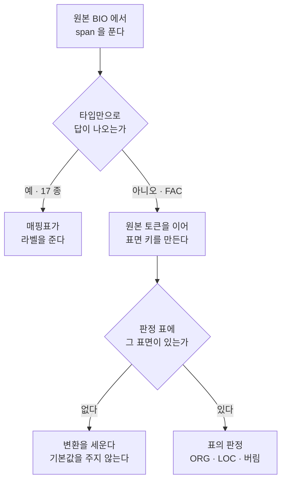

# issue-236: EN OntoNotes FAC 경로·구조물 분할

- Issue: https://github.com/groovallstar/ner-pipeline/issues/236
- PR: <!-- 머지 직전 채움 -->
- 브랜치: `feat/issue-236-en-fac-route-split`
- 승인일: 2026-08-31

## 배경

canonical §3 은 인프라를 두 갈래로 가른다. **개별 구조물**(역·공항·교량·터널)은
`ORG`, **여러 지점을 잇는 경로**(철도·지하철 노선·도로·고속도로)는 `LOC` 다.
이 규칙은 원래 §3 에 있었지만 §2.3 JA 절이 "철도 노선·역·공항 → ORG" 로
뒤집고 있었고, 그 충돌을 §3 쪽으로 닫으면서 EN 변환기가 결정 이전 상태로
남았다.

EN 변환기는 `FAC` 를 span 종류와 무관하게 전부 `ORG` 로 태우고 있었다. 그런데
OntoNotes 의 `FAC` 한 타입에 구조물(`the Golden Gate Bridge`)과 경로
(`East Third Ring Road`)가 함께 들어 있어, **경로형 span 만큼 canonical 과
어긋난 채 gold 가 만들어졌다.** 규모는 `FAC` 1,110 span 중 경로형이 277 span
이며, 이 이슈 전에는 그 전량이 `ORG` 였다.

지금 고치는 이유는 EN 만 되돌릴 비용이 없기 때문이다. JA·VI 는 gold 가 이미
만들어져 있어 이번 결정으로 재분류하지 않기로 했고(VI 는 노선 63 중 62 가
이미 `LOC` 라 §3 대로다), EN 은 아직 결정 전 구현이라 지금 고치면 만들어진
gold 를 되돌리는 값을 치르지 않는다.

## 목적

EN gold 의 `FAC` 를 canonical §3 인프라 규칙대로 `ORG`(구조물)와 `LOC`(경로)로
가른다. 판정은 규칙이 아니라 **표면을 전량 열거한 표**가 갖고, 표에 없는
표면은 기본값 없이 변환을 세운다.

## 범위

- 포함: 변환기의 `FAC` 판정 경로 · 판정 표 · 기준 파일 §4.3 · 라벨러 프롬프트의
  경계 선언 · 위 다섯을 보는 테스트
- 제외:
  - **디스크 코퍼스 이동** — #239 가 옮긴다. 그 사이 `data/ontonotes_en/pii/`
    산출물이 옛 라벨을 갖고도 양쪽 테스트가 초록이므로, EN 학습·평가를
    돌리지 않는다
  - **JA·VI·KO gold 재분류** — canonical 결정에서 명시적으로 제외했다
  - **EN 재학습·재측정** — gold 지문이 바뀌어 `comparability` 가 기존 실험과의
    비교를 자동 거부한다. 별건이다
  - **잔여 판정의 무오류성** — 기계는 피복·술어·대조·열거·가시성을 보증하고,
    잔여 코드가 붙은 표면의 개별 판정은 PR diff 를 사람이 본다

## 판정이 흐르는 길



표면 키를 자연문이 아니라 **원본 토큰의 공백 조인**으로 만드는 것이 요점이다.
자연문 복원은 붙여쓰기·따옴표 처리가 바뀔 수 있는 코드라, 그게 바뀌면 같은
span 이 다른 키를 내어 표 전체가 한꺼번에 미판정으로 돌아선다. 토큰 배열은
원천이 준 그대로라 안 흔들린다.

## 현 상태 (fact)

### 판정 표의 내용

원본 `FAC` 표면은 unique 634 개, span 1,110 개(train 860 · valid 115 ·
test 135)다. 표는 그 634 개를 전량 열거하고 표면마다 판정·사유코드·두 모델
합의 여부·split 별 등장 수를 적는다.

| 판정 | 표면 | span |
|---|---|---|
| `ORG` (개별 구조물) | 449 | 816 |
| `LOC` (경로) | 172 | 277 |
| 버림 (canonical 상 비-entity) | 13 | 17 |

사유코드는 어휘·형태로 반증 가능한 것과 그렇지 않은 **잔여**(`*:world`)로
갈린다. 잔여는 230 표면(438 span)이고, 기준이 소유한 하한은 16 표면이다.

| 사유코드 | 표면 | 술어 |
|---|---|---|
| `structure:head` | 267 | 마지막 낱말이 구조물 머리 |
| `structure:world` | 182 | 없다 (잔여) |
| `route:head` | 102 | 마지막 낱말이 경로 머리 |
| `route:world` | 48 | 없다 (잔여) |
| `route:lead` | 16 | 첫 낱말이 경로 표지 |
| `noise:source` | 8 | 없다 (원본 태깅 오류) |
| `route:number` | 6 | 번호 도로 형태 |
| `nonentity:other` | 5 | 없다 (canonical 상 다른 범주) |

### 두 모델 합의

두 로컬 모델에 표면과 그 표면이 실제로 쓰인 문장을 함께 주어 판정시켰다.
634 표면 중 602 가 일치하고 32 가 갈렸으며, Cohen's kappa 는 0.883 이다.
갈린 32 는 전부 사람이 판정했고 표에 `decided_by: human` 으로 남는다. 규칙이
없던 범주(광장·국립공원·국경검문소)는 사람이 규칙을 정해 일괄 적용했으므로
사람이 정한 자리는 36 표면이다.

**표본 여섯을 전량 판정 전에 먼저 태웠고, 첫 판에서 한 자리가 틀렸다.**
`Vermont - Slauson`(교차로 이름을 딴 쇼핑센터)을 두 모델이 모두 `LOC` 로
읽었다. 표면 형태가 `지명 - 지명` 이라 철도 노선(`the Beijing - Kowloon`)과
같아서인데, 두 모델이 같은 방향으로 틀린 것이므로 합의만 봐서는 안 잡힌다.
프롬프트를 "이름이 무엇을 가리키는가" 를 먼저 묻는 형태로 고치고 그 모양이
양쪽 다 될 수 있음을 명시한 뒤 다시 태우자 둘 다 `ORG` 로 바뀌었고, 그때
나머지 다섯도 유지됐다.

**그래서 이 표본의 반증력은 프롬프트에 그 모양을 적은 만큼 줄었다.** 남는
증거는 두 가지다. 하나는 사전 점검이 실제로 신호를 냈다는 것 — 못 맞춘 것이
판정의 어려움이 아니라 프롬프트가 규칙을 못 전달한 결과였고, 고치니 바뀌었다.
다른 하나는 기계가 지키는 쪽이 모델 실행이 아니라 **표에 박힌 판정**이라는
것이다(`test_fac_labels.py::test_probe_surfaces_hold`). 표본 여섯의 답을
뒤집으면 모델을 다시 돌리지 않아도 테스트가 붉어진다.

### 변환 결과

| 라벨 | train | valid | test |
|---|---|---|---|
| `LOC` | 17,136 | 2,488 | 2,463 |
| `ORG` | 13,448 | 1,838 | 1,885 |

전량 span 은 75,733 에서 75,716 으로 17 줄었다. 줄어든 몫이 표가 버린 `FAC`
17 span 과 정확히 같다. `PER`·`DAT`·`PROD`·`EVT` 는 한 span 도 안 움직였다.

### 갈림 후보 두 그물

같은 이름이 자리마다 다른 답을 요구할 수 있는 자리를 두 그물로 뽑았다.

| 그물 | 무엇 | 표면 | `FAC` span |
|---|---|---|---|
| ① 다른 타입 겸용 | 원본이 `FAC` 와 다른 타입으로도 태그 | 56 | 239 |
| ② 다회 등장 | `FAC` 로 2 회 이상 등장 | 162 | 638 |
| ②' ① 제외분 | 교집합을 ① 우선으로 뺀 나머지 | 133 | 426 |

①은 없애지 않고 규모만 고정한다. 다른 타입은 매핑표가 따로 라벨을 내므로
판정 표가 못 건드리고, 최종 데이터에 남는 섞임은 규칙의 불일치가 아니라
**원본 태그의 불일치**이기 때문이다.

②에서 볼 것은 같은 이름이 별개 실체 둘을 가리키는가이며(§3 이 그 경우만
§2.1 로 보낸다), 해당하는 자리는 표가 답을 하나만 담으므로 사람이 개별로
정해 표의 `separate_entities` 에 남긴다. 지금 셋이다.

| 표면 | 판정 | 왜 |
|---|---|---|
| `Great Wall` | 버림 | 만리장성과 별개로 신용카드 브랜드가 같은 이름을 쓴다. 관측된 세 문맥이 모두 브랜드거나 비유다 |
| `" Shenzhen Expressway "` | `ORG` | 고속도로와 별개로 같은 이름의 상장 회사가 있다. 두 문맥 모두 회사이고 원본도 `ORG` 로 1 회 태그했다 |
| `` `` the West Wing '' `` | 버림 | 백악관 서관과 별개로 같은 이름의 TV 프로그램이 있다. 관측 문맥이 프로그램이다 |

**그물은 후보를 뽑을 뿐 답을 가두지 않는다.** 셋 중 `` `` the West Wing '' ``
은 `FAC` 로 한 번만 등장하고 다른 타입 태그도 없어 두 그물 어디에도 안 걸린다.
판정을 그물 안에서만 돌렸다면 이 자리는 안 보였다는 뜻이라, 634 전량에 돌린
것이 옳았다. 테스트는 세 자리 중 몇이 그물 안에서 나왔는지를 함께 고정해,
그 비율이 뒤집히면 판정을 전량이 아니라 그물 안에서만 돌렸다는 신호로 읽는다.

## 결정 로그 (append-only)

- 2026-08-28: 판별을 규칙이 아니라 전수 표면 사전으로 바꿨다. 정의-시점
  반박자 1 라운드가 잡은 것은 사전 설계 자체가 #218 의 실패 모드를 이름만
  바꿔 유지할 수 있다는 것이었다 — 사전 634 줄을 "어휘가 분명한 것만 `LOC`,
  나머지 전량 `ORG`" 로 채워도 초안 기준이 전부 통과하고 결과 gold 는
  #218 과 사실상 같아진다. 차이는 기본값이 코드 fallback 이 아니라 사전의
  명시 줄이라는 것뿐이었다.
- 2026-08-28: 사유코드에 기계 술어를 붙이고 잔여 하한을 기준이 소유하게 했다.
  3 라운드 지적 — 술어를 구현자가 사전과 같은 커밋에서 쓰므로 느슨하게 짜면
  잔여가 세탁되고, 잔여 수가 낮게 나와 **적극적으로 오도한다**(사람이 읽어야
  할 양의 지표인데 "다 기계로 뒷받침됐다" 로 읽힌다). 반증은 표본 둘이 이미
  쥐고 있었다 — `the Beijing - Kowloon` 과 `Vermont - Slauson` 은 표면 형태가
  같아 어떤 표면 술어도 못 가르므로 둘 다 잔여여야 한다.
- 2026-08-28: 디스크 코퍼스 이동을 #239 로 뺐다. 위험 축이 다르고(변환은
  "판정이 옳은가", 디스크는 재생 경로 오염·원장 지문 부재·행 안 대응 모호),
  같은 승인에 묶으면 사람이 읽는 게이트가 두 겹이 된다.
- 2026-08-28: `LOC`·`ORG` 개별 수를 골든에서 뺐다. 그 둘은 판정 표가 정하는
  값이라 표를 고치면 함께 움직이고, 골든에 박으면 골든이 표의 사본이 되어
  원본을 검사하지 못한다. 대신 표에서 도출한 기대 수와 대조한다.
- 2026-08-31: 낡은 문구 금지 목록을 자리별로 묶고 이력 검사를 붙였다.
  결과-시점 반박자 1 라운드가 잡은 것은 금지 문구 하나가 **유령 문자열**
  이라는 것이었다 — §4.3 원문이 `` `FAC` 를 전량 ORG 로 태운다 `` 인데
  백틱 없이 적어 부분문자열이 안 걸렸고, 그래서 선언 자리 다섯 중
  `mapping.py` docstring 과 기준 파일 §4.3 두 곳이 감시 없이 지나갔다.
  목록이 길어 보이니 빈 자리가 안 보인 것이라 자리별 사전으로 바꾸고,
  `git log -S` 로 그 문구가 그 파일에 실제로 있었는지를 이력에서 확인하게
  했다. 이력 검사는 붙이자마자 두 번째 유령을 잡았다 — 원문에서 줄이 나뉜
  문구는 `-S` 가 못 찾으므로 한 줄 안에서 이어지는 조각으로 적어야 한다.
- 2026-08-31: `--partial-corpus` 를 CLI 에 뒀다. 피복 검사의 "표에만 있는 줄"
  방향은 입력이 코퍼스 전량일 때만 뜻이 있는데, 21 문장 골든 픽스처로 CLI 를
  태우는 테스트가 그 방향에서 늘 붉었다. 부분 입력임을 선언하는 자리를 만들고
  **껐다는 사실을 화면과 `conversion_meta.json` 양쪽에 남긴다** — 안 남기면
  통과가 "검사를 지났다" 인지 "검사가 안 돌았다" 인지 구별되지 않는다.

## 구현 결과

커밋 셋으로 나눴다. 기준 파일을 건드리는 커밋이 둘(⓪·②)이고 각각 사람 승인과
반박자 PASS 를 탄다.

**⓪ canonical §3 환유 조항** — 표는 이름당 답이 하나라 같은 이름이 문맥마다
다른 답을 요구하면 표현할 수 없다. §3 에 환유 항을 넣어 "표면형이 가리키는
실체가 하나뿐이면 환유로 써도 실체의 판정을 유지한다" 를 규칙으로 못 박아
이름당 답이 하나로 닫히게 했다. 문맥은 "이 이름이 가리키는 실체가 경로인가
구조물인가" 를 정하는 데만 쓰고 "환유인가" 는 판정하지 않는다.

**① 판정 표 634 표면** — 표면 추출·모델 판정 스크립트와 표, 그리고 표를
검사하는 테스트를 넣었다. 어휘 목록은 판정자가 아니라 **검사자**로 테스트에만
둔다. 표가 gold 를 정하고 어휘가 표를 되짚으므로, 어휘를 고쳐도 gold 는 안
움직이고 어긋나면 테스트가 붉어진다. 어긋난 둘은 예외로 사유를 적었다 —
`" Shenzhen Expressway "`(상장 회사)와 `Stone Harbor`(해변 마을)다.

**② `resolve` 와 §4.3** — 변환 경로가 표를 실제로 읽게 했다.

| 무엇 | 어떻게 |
|---|---|
| `resolve(타입, 표면)` | 표면을 선택 인자로 두지 않는다. 기본값을 주면 표를 안 거치는 호출이 조용히 생긴다 |
| `BY_SURFACE` 선언값 | `FAC` 를 라벨도 `DROP` 도 아닌 세 번째 값으로 선언한다. `DROP` 과 같은 값이면 "타입 통째로 버렸다" 와 "타입만으로는 못 정한다" 가 구별되지 않는다 |
| `is_dropped(타입)` | 표면 없이 답해야 하는 자리를 뗀다. `LAW`·`MONEY` 처럼 타입만으로 끝나는 span 까지 표면을 만들 이유가 없다 |
| `assert_fac_coverage` | 표와 코퍼스를 양쪽 방향으로 맞춘다. 한쪽만 보면 죽은 줄을 놓친다 |
| §4.3 · 선언 자리 다섯 | `FAC` 행을 표면별로 바꾸고, 같은 문장을 다섯 자리에 두어 테스트가 문구로 건다 |

## 검증

### 수락 기준

- [x] **1. 판정 표가 정본이고 원본 표면 전량을 덮는다.** 634 표면 각각에
  판정·사유코드·합의 여부·등장 수가 있고, 파일 머리에 판정 기준과 모집단이
  문장으로 있다. 피복 검사가 양쪽 방향으로 돌며 어긋나면 변환이 선다.
  `resolve('FAC', 표면)` 은 표에 없는 표면에 기본값을 주지 않고
  `UnlistedSurfaceError` 로 끝나고, 드롭 판정은 `is_dropped(타입)` 로 떼어
  `check_entity_token_match` 가 쓴다. 등장 수 합이 `GOLDEN_SOURCE_FAC` 과
  맞는지를 함께 보므로 **코퍼스 없는 환경에서도 표가 반증된다.**
  집행 — `test_fac_labels.py` · `test_mapping.py` · `test_corpus_invariants.py`
- [x] **2. 사유코드마다 기계 술어가 있고, 잔여 하한·표본·갈림 수를 기준이
  소유한다.** 술어 있는 코드는 그 술어를 실제로 만족한다. 잔여는 230 표면으로
  하한 16 을 넘고, 하한 목록(같은 생김새 열 + 단서 없는 여섯)이 전부 잔여로
  남아 있다. 표본 여섯이 표에 그대로 있고, 갈림 32 는 전부 사람이 판정했다.
  어휘가 가르는 표면은 표와 일치하며 예외 둘만 어긋난다. 원본 태깅 오류는
  `noise:source` 로 잔여와 자리를 가른다. 집행 — `test_fac_labels.py`
- [x] **3. 갈림 후보를 두 그물로 뽑고, 환유는 규칙이 정한다.** 두 그물의
  규모를 원본 태그에서 다시 뽑아 대조하며(56 / 239 · 162 / 638 · ①제외 133 /
  426), `separate_entities` 셋을 열거하고 그중 그물 안에서 나온 수를 함께
  고정한다. 집행 — `test_corpus_invariants.py`
- [x] **4. `LOC`·`ORG` 개별 수를 골든으로 박지 않고, 안 변해야 하는 것만
  고정한다.** 고정한 것은 원본 태그 수와 이 이슈가 안 건드리는 네 타입이다.
  `LOC`·`ORG` 는 표에서 도출한 기대 수와 대조하고, `원본 FAC 수 = ORG + LOC +
  버림` 이 split 별로 성립하는지를 본다. 전량 합도 골든이 아니라 원본 수에서
  버린 몫을 뺀 값으로 만든다. 집행 — `test_corpus_invariants.py`
- [x] **5. "코드가 정본, 문서가 사본" 선언 자리를 테스트가 본다.** 선언 자리
  다섯(`mapping.py` docstring · §4.3 · `augmenters/CLAUDE.md` ·
  `ner/CLAUDE.md` · `pipeline/README.md`)이 같은 문장을 담고 낡은 문구가 남지
  않았는지 경로 + 문구로 본다. 금지 문구는 자리별로 묶어 감시가 빈 자리를
  드러내고, 각 문구가 그 파일에 실제로 있던 문장인지를 `git log -S` 로 다시
  확인한다. 프롬프트 세 자리(docstring · `LOC` 줄 · `ORG` 줄)는 라벨러 검사가
  같은 방식으로 본다. 집행 — `test_mapping.py` · `test_en_labeler.py`

### 테스트

```bash
uv run ruff check .                          # 통과
uv run pytest tests/ner/augmenters/ontonotes_en/ -q   # 120 passed, 5 skipped
uv run pytest tests/ -q                      # 1149 passed, 3 skipped
```

변환 CLI 도 전량 코퍼스에 실제로 태웠다(산출물은 scratch 로 보냈다 — 실제
`data/ontonotes_en/` 갱신은 #239 다). 피복 검사가 돌아 634 표면 / 1,110 span 을
관측했고 `fac_coverage_checked` 가 `true` 이며, 산출 라벨 수가 위 §변환 결과
표와 같다.

커밋 직후 전량 실행에서는 `tests/ner/classifier/test_ko_deploy_package.py::
test_package_is_the_ledger_run_verbatim` 하나가 붉었다. 이 브랜치가 `develop`
보다 다섯 커밋 뒤에 있어서였고, 그 안에 KO 배포 패키지의 gold 경로를 고친
커밋(`fad820b`)이 있었다. `develop` 을 머지하니 사라졌고 위 수치는 머지 뒤
값이다. skip 이 17 에서 3 으로 준 것도 같은 머지가 KO gold 경로를 살렸기
때문이다 — 그 파일이 없어 건너뛰던 검사들이 이제 실제로 돈다.

### 메트릭

재학습·재측정은 범위 밖이다. gold 지문이 바뀌어 `comparability` 가 기존
실험과의 비교를 자동 거부하므로, 이번에 비교할 전후 점수가 없다.

## 관련 커밋

- `3466af8`: docs(schema) — §3 환유 표면형 판정 규칙 (⓪)
- `7047c6f`: feat(augmenters) — EN FAC 판정 표 634 표면 (①)
- `c9cb5b3`: feat(augmenters) — EN FAC 표면별 판정을 변환 경로에 배선 (②)

## 후속 작업

- #239: 디스크 코퍼스 재생성과 이동. 그때까지 `data/ontonotes_en/pii/` 는 옛
  라벨을 갖고 있으므로 EN 학습·평가를 돌리지 않는다
