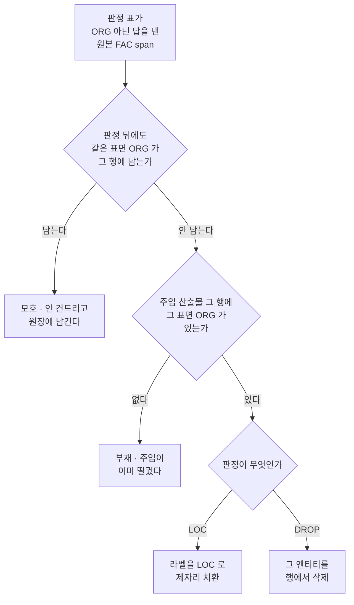

# issue-239: EN FAC 분할 디스크 코퍼스 이동

- Issue: https://github.com/groovallstar/ner-pipeline/issues/239
- PR: https://github.com/groovallstar/ner-pipeline/pull/242
- 브랜치: `feat/issue-239-en-fac-disk-corpus-migration`
- 승인일: 2026-08-31

## 배경 (왜)

#236 이 EN 변환기를 canonical §3 대로 고쳤다. 원본 `FAC` 를 전량 `ORG` 로
태우던 것을 표면별 판정 표로 갈라 **개별 구조물은 `ORG`, 여러 지점을 잇는
경로는 `LOC`** 로 낸다. 그런데 그 이슈는 코드·골든·문서만 바꾸고
`data/ontonotes_en/` 는 건드리지 않았다.

그래서 머지 직후 디스크 코퍼스는 코드와 어긋난 채 남았다. 학습에 실제로
들어가는 파일은 병합본 `origin.jsonl` 이고, 그 파일은 옛 `FAC`→`ORG` 라벨을
갖고 있었다. **검사는 이 어긋남을 안 잡는다.** `test_corpus_invariants` 의
변환 검사는 원천에서 매번 다시 변환하므로 새 골든과 맞고,
`test_injection_replays_exactly`·`test_merged_corpus` 는 디스크 파일만 읽으므로
옛 라벨끼리 일관돼 초록이다. 양쪽 다 초록인데 학습 데이터만 낡아 있었다.

옮기는 일이 별건인 것은 위험의 축이 다르기 때문이다. 변환 계층의 위험은
"판정이 옳은가" 인 반면, 디스크 이동의 위험은 셋이다.

- **재생 경로 오염** — 주입 산출물의 엔티티를 주입 코드로 다시 뽑아 만들면,
  바로 그 경로로 기대치를 만드는 앵커 테스트가 항진명제가 된다
- **원장 지문 부재** — 되돌리기가 원장 자신을 재현하는 정의상 참이 된다
- **행 안 대응 모호** — 엉뚱한 엔티티를 뒤집어도 아무 검사가 안 걸린다

주입 텍스트는 LLM 산출이라 되돌릴 수 없어, 한 번 잘못 옮기면 복구 경로가 없다.

## 목적

`data/ontonotes_en/` 의 주입·병합 산출물을 #236 의 판정 표대로 맞추고, 손댄
것을 지문 있는 원장으로 남겨 저장소만으로 반증 가능하게 한다.

## 범위

- 포함: 마이그레이션 스크립트 · 커밋되는 원장 · 원장을 보는 검사 · 병합본
  골든 갱신 · 디스크 코퍼스 실물 이동
- 제외:
  - **변환 계층** — 판정 표·`resolve`·변환 골든·문서 동기화는 #236 이 닫았다
  - **EN 재학습·재측정** — gold 지문이 바뀌어 `ner.validity.comparability` 가
    기존 EN 실험과의 비교를 자동 거부한다. 별건으로 정한다

## 수락 기준

- [x] **1. 재생 경로를 쓰지 않는다.** 마이그레이션은 `label` 제자리 치환과 행
  안 유일 대응 삭제 둘만 하고, 남는 span 의 `(start_char, end_char, text)` 는
  한 자리도 다시 계산하지 않는다. 집행은 둘이다 — 스크립트가 주입 모듈을
  import 하지 않는다는 AST 검사와, 원장 역적용이 마이그레이션 전 파일을
  **바이트 단위로** 재현한다는 검사
- [x] **2. 대상을 행 `id` + 행 안 유일 대응으로 정하고, 모호하면 건드리지
  않는다.** 대상은 낡은 디스크 파일이 아니라 원천 + 판정 표에서 도출한다.
  모호로 분류된 자리 수를 골든으로 박는다(실측 0)
- [x] **3. 원장에 전·후 지문을 박고 범위를 pii 코퍼스로 한정한다.** 변환
  산출물은 원장이 손대지 않고 지문만 남겨 재현성 앵커로 쓴다
- [x] **4. 이동·제거량을 병합본 안에서 세고, 나머지 불변식을 값으로 박는다.**
  등식 셋으로 가른다

## 판정이 디스크에 닿는 길

**대상을 원천에서 다시 도출하는 것이 요점이다.** 디스크 파일을 기준으로 삼으면
그 파일이 이미 손상돼 있어도 알 수 없다. 판정 표의 키는 원본 토큰의 공백
조인인데 주입 산출물에는 자연문 표면만 남으므로, 표를 `text` 에 직접 먹이면
복원이 손대는 표면(`Vermont - Slauson`·`U.S. 460`)이 통째로 안 걸린다. 그래서
원천을 변환기와 같은 경로로 지나 `(행 id, 자연문 표면)` 을 얻고, 그 쌍으로
주입 산출물의 행을 찾는다.

**`id` 는 행만 정하고 행 안 어느 엔티티인지는 안 정한다.** `(id, offset)` 은
주입이 문장을 다시 써 어긋나고, `(id, text)` 는 공존 표면에서 모호하다 —
`Wall Street` 가 한 행에 `FAC` 유래와 원본 `ORG` 유래로 함께 있으면 손대기 전
라벨도 `text` 도 같다. 그래서 판정 뒤에도 같은 표면의 `ORG` 가 그 행에 남는
자리는 모호로 보고 건드리지 않는다.

## 현 상태 (fact)

### 손댄 양

| 판정 | 표가 요구 | 실제 적용 | 안 한 이유 |
|---|---|---|---|
| `LOC` (경로) | 277 | **274** 이동 | 3 은 주입이 그 gold 를 떨궜다 |
| `DROP` (비-entity) | 17 | **15** 제거 | 2 는 주입이 그 gold 를 떨궜다 |
| 모호 | | **0** | |

### 병합본의 변화

| 값 | 전 | 후 |
|---|---|---|
| 행 | 76,378 | 76,378 |
| 그룹 (`orig`) | 70,641 | 70,641 |
| span 전량 | 167,871 | 167,856 |
| `LOC` | 21,671 | 21,945 |
| `ORG` | 17,379 | 17,090 |
| `LOC` + `ORG` | 39,050 | 39,035 |

`PER`·`DAT`·`PROD`·`EVT` 와 PII 4 종은 한 span 도 안 움직였다.

### 표가 버린 15 span

주입 산출물에 남아 있던 것은 원본 태깅 오류(`had a flea`·`passed away`·
`two`·`your apostolate`·`Cailion`·`The Reserve`)와 canonical 상 다른 범주
(`Great Wall` 카드 브랜드 · `"Progress M-24"` 우주선 · `"the West Wing"` TV
프로그램 · `Don`·`Bilbrey` 유전·유정)다. 제거 뒤 엔티티가 하나도 없어진 행이
둘 생겼는데, 병합본에는 그런 행이 이미 만 개 넘게 있어(주입이 gold 를 떨군
행) 새로운 모양이 아니다.

## 결정 로그 (append-only)

- **2026-08-31**: 수락 기준 1·4 를 문면대로 두면 통과할 수 없어 개정했다.
  판정 표가 버린 `FAC` 17 span 중 **15 가 주입 산출물에 살아 있어**, 라벨만
  치환하면 재생 대조가 `missing`·`ner_mismatch` 를 15 씩 낸다(시뮬레이션으로
  확인). 개정 전 기준은 `GOLDEN_SPANS`·`LOC+ORG` 를 불변으로 못 박아 그 15 를
  남기라는 뜻이었다. 사람이 "함께 제거" 를 골랐다
- **2026-08-31**: 기준 4 의 등식을 하나에서 셋으로 갈랐다. 이동과 제거가
  `ORG` 감소분에 함께 들어가 하나로는 둘을 못 가른다 — 이동 하나를 제거로
  바꿔도 `ORG` 감소분은 그대로다
- **2026-08-31**: 등식의 비교 상대를 역적용 복원본이 아니라 **마이그레이션
  직전 판의 리터럴**로 정했다. 역적용은 원장대로 되돌리므로 복원본에서 세면
  차이가 언제나 원장 행 수가 되어 등식이 정의상 참이 된다

## 구현 결과

### 마이그레이션 순서

| 단계 | 명령 | 하는 일 |
|---|---|---|
| 1 | `python -m ner.augmenters.ontonotes_en` | `{split}.jsonl` 을 현행 코드로 다시 만든다 |
| 2 | `python -m ner.scripts.migrate_en_fac_disk_corpus` | 주입 산출물을 옮기고 병합본을 다시 만들고 원장을 쓴다 |

2 단계는 1 단계가 안 끝났으면 멈춘다. `{split}.jsonl` 이 현행 변환기의 산물인지
지문으로 확인하고, 낡아 있으면 실행할 명령을 찍어주고 비영으로 끝난다. 주입
쪽만 옮기면 재생 대조가 어긋나는데, 그 실패는 여기서 멈추는 편이 읽기 쉽다.

### 원장이 담는 것

`src/ner/augmenters/ontonotes_en/data/fac_disk_migration_ledger.json` 이
손댄 자리마다 행 `id`·변환 산출물 기준 offset·주입 산출물 기준 offset·행 안
엔티티 인덱스·before→after 라벨을 적고, 네 파일(`pii/{split}.jsonl` 셋 +
병합본)의 전·후 SHA256 과 변환 산출물 셋의 SHA256 을 함께 적는다.

**지문이 없으면 역적용은 정의상 참이다.** 원장을 되돌려 나온 코퍼스를 원장이
선언한 개수로 다시 재면, 역적용이 원장대로 뒤집었으니 차이가 언제나 원장 행
수가 된다. 그래서 역적용의 대조 상대는 원장이 아니라 마이그레이션 전 파일의
해시다 — 원장에 없는 변경이 섞였거나 있는 변경이 빠졌으면 그 해시가 안 나온다.
KO 원장이 `gold_sha256` 을 갖는 이유와 같다.

후 지문은 반대편을 막는다. `data/**` 는 gitignore 라 나중에 조용히 편집해도
diff 에 안 남는데, 실물과 원장이 갈리면 검사가 붉어진다.

### 파일

| 파일 | 무엇 |
|---|---|
| `src/ner/scripts/migrate_en_fac_disk_corpus.py` | 대상 도출 · 적용 · 역적용 · 원장 쓰기 |
| `src/ner/augmenters/ontonotes_en/data/fac_disk_migration_ledger.json` | 커밋되는 원장 |
| `tests/.../test_fac_disk_migration_ledger.py` | 원장 검사 아홉 |
| `tests/.../test_merged_corpus.py` | 병합본 골든 갱신 + 등식 셋 |

## 검증

| 수락 기준 | 무엇으로 | 결과 |
|---|---|---|
| 1 | 스크립트 import 를 AST 로 훑어 `ner.augmenters.pii` 유입 0 | ✅ |
| 1·3 | 역적용 → 네 파일 전 지문 재현 (바이트) | ✅ |
| 2 | 원장 모집단 == 원천 + 판정 표에서 다시 도출한 집합 | ✅ |
| 2 | 모호 0 · 부재 5 · 이동 274 · 제거 15 골든 | ✅ |
| 3 | 현 코퍼스 == 후 지문 | ✅ |
| 3 | 변환 산출물을 원천에서 다시 만들면 같은 바이트 | ✅ |
| 4 | 등식 셋 (아래) | ✅ |

등식 셋은 병합본에서 실제로 센 값을 마이그레이션 직전 판의 리터럴과 비교한다.

- `LOC` 증가분 `21,945 − 21,671 = 274` == 원장 `move` 행 수
- `ORG` 감소분 `17,379 − 17,090 = 289` == 원장 `move` + `remove` 행 수
- 전량 감소분 `167,871 − 167,856 = 15` == 원장 `remove` 행 수

나머지 불변식(행 수·그룹 수·PII 4 종·안 건드린 NER 타입 넷)은 아무것도 안
옮겨도 전부 성립하므로, 마이그레이션이 실제로 일어났는지를 재는 것은 이 셋뿐이다.

재생 대조(`test_injection_replays_exactly`)는 마이그레이션 뒤에도 `missing` 0 ·
`ner_mismatch` 0 으로 통과한다. 이 검사가 이 이슈의 외부 앵커인데, 원장이 아니라
주입 코드로 기대치를 만들기 때문이다.

`pytest tests/ner/augmenters/ontonotes_en/` 전량 통과.

## 관련 커밋

- `feat(augmenters)`: 스크립트 · 원장 · 원장 검사 · 병합본 골든 갱신
- `docs(issues)`: 설계와 검증 결과 · 반박자 비차단 기록

## 후속 작업

반박자가 PASS 와 함께 남긴 권고 둘이다. 막는 사유가 아니라 이 이슈에서
고치지 않았다.

- **재실행 가드** — 스크립트는 이미 옮긴 코퍼스에 다시 돌려도 멈추지 않는다.
  그때는 대상 294 자리가 전부 "부재" 로 분류돼 원장이 빈 판으로 덮인다.
  다만 `GOLDEN_MOVED` 와 병합본 등식이 즉시 붉어지고 원장은 커밋돼 있어
  되돌릴 수 있으므로, 조용한 실패가 아니라 시끄러운 실패다. 원장의
  `before_sha256` 이 현 파일과 같을 때 중단하게 하면 이 자리가 없어진다
- **옛 gold 로 잰 수치의 표시** — `certified/classifier/en/**` 의 기존
  실험은 이 이슈 전 gold 로 잰 것인데 그 사실이 어디에도 안 적혀 있다.
  `ner.validity.comparability` 가 `data_fingerprint` 로 새 EN run 과의
  비교를 자동 거부하므로 잘못된 비교가 통과하지는 않지만, EN 재측정 이슈를
  열 때 함께 남기는 편이 낫다

반박자가 막지 않고 기록만 한 자리도 둘 남는다. **모호 분기**는 실측이 0 이라
"안 걸렸다" 와 "분기가 안 돈다" 가 원장 검사만으로는 안 갈리는데, 분기가
죽어 엉뚱한 쪽을 뒤집으면 재생 대조가 `ner_mismatch` 를 내므로 안전한 쪽으로
실패한다. **`data/` 없는 환경**에서는 지문 검사 다섯이 skip 되어 개수만 맞춘
원장 변조가 그때는 지나가는데, gitignore 코퍼스의 구조적 한계라 skipif 사유에
공개해 둔다.
