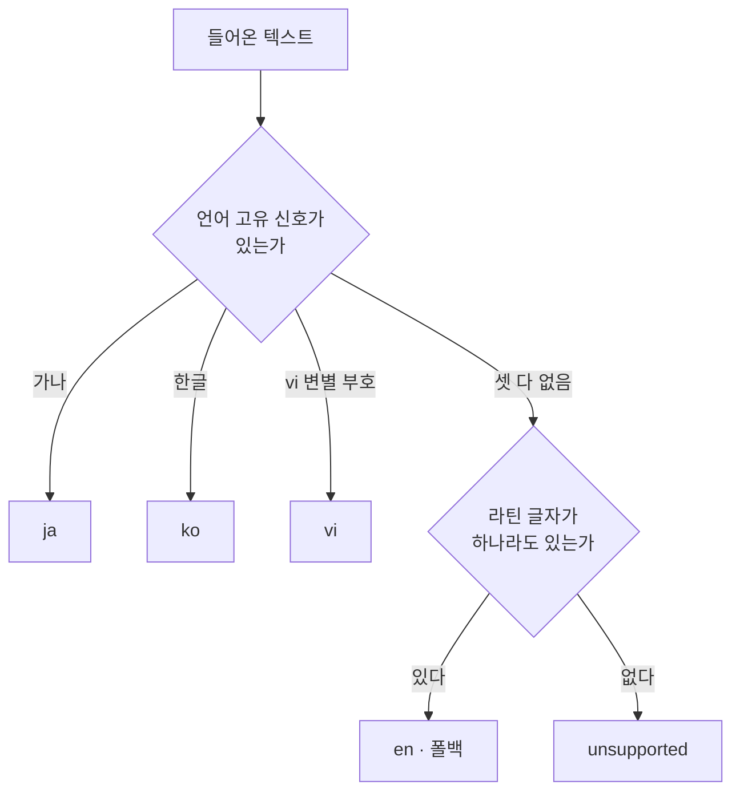

# 언어 자동 감지

> **이 문서가 하는 일**: REST API 가 `lang` 없이 들어온 텍스트의 언어를 어떻게
> 정하는지 — 언어마다 무엇을 신호로 삼고 무엇을 못 잡는지 — 를 한 곳에 고정한다.
> **대상 코드**: `src/server/detect.py` (호출부 `app.py` 의 `_resolve_lang`)
> **테스트**: `tests/server/test_detect.py`
> **API 계약**: `docs/manual/rest-api-spec.md` §4 (요청·응답 스키마·상태 코드)

## 1. 감지의 자리와 책임 경계

`POST /v1/ner` 요청이 `lang` 을 생략했을 때만 돈다. `lang` 을 명시하면 감지는 아예
호출되지 않고 그 언어 모델이 곧장 불린다.

`detect_lang(text)` 이 돌려주는 값은 `ja`·`ko`·`vi`·`en`·`unsupported` 다섯이다.
`unsupported` 는 에러가 아니라 정상 응답이다 — 서버는 모델을 부르지 않고
`200 {lang:"unsupported", entities:[]}` 를 준다. 배치에서는 항목마다 따로 판정돼
지원 언어 항목만 추론되고 미지원 항목은 빈 결과로 남아 입력 순서가 보존된다.

판정은 두 단을 지난다.



첫째 단은 **감지**다. 세 언어를 각각 **언어 고유 신호**, 곧 그 언어에만 나오고
다른 언어에는 안 나오는 글자나 부호로 잡으므로, 여기서 나온 답은 신호를 실제로
본 결과다. 둘째 단은 **폴백**이다. 라틴 글자가 있다는 사실은 영어라는 증거가
아니라 "지원 언어의 신호가 없다"는 사실일 뿐이라, `en` 은 본 것이 아니라 남은
것이다.

### 양성 감지와 폴백을 가른 이유

초기 구현은 "가나가 있으면 ja, 나머지는 전부 vi" 였다. 이러면 영어·중국어·
프랑스어가 모두 조용히 vi 로 흘러들어 vi 모델이 엉뚱한 텍스트를 라벨링하고,
응답의 `lang` 필드까지 거짓이 된다. 클라이언트는 응답만 보고서는 그 판정이 신호에
근거한 것인지 폴백에 걸린 것인지 구별할 수 없다.

그래서 신호를 실제로 가진 언어와 그렇지 않은 언어를 **다른 단으로 갈랐다.**
고유 신호를 가진 언어는 첫째 단에서 양성으로 잡고, 그런 신호가 없는 라틴 언어는
애초에 변별할 방법이 없으므로 감지 대상에서 빼고 둘째 단의 폴백으로 받는다.
폴백을 감지기 목록에 섞지 않는 것이 이 구분을 코드에 남기는 방법이다(§3).

`en` 을 폴백으로 받는 대가는 오분류다. 인도네시아어·로마자로 적은 일본어·부호를
뗀 베트남어가 모두 `en` 으로 간다(§7). 그 대가를 받아들인 것은 라틴 텍스트가 빈
결과로 끝나는 쪽이 더 나쁘다고 봤기 때문이다.

## 2. 고유 신호로 잡는 세 언어

첫째 단의 신호는 서로 겹치지 않는다.

| 언어 | 신호 | 판정 조건 | 술어 |
|---|---|---|---|
| `ja` | 가나 | 히라가나·가타카나가 한 글자라도 있음 | `_has_kana` |
| `ko` | 한글 | 한글 음절 또는 자모가 한 글자라도 있음 | `_has_hangul` |
| `vi` | vi-변별 부호 | horn·hook-above·dot-below 결합부호 또는 `đ` 가 있음 | `has_vi_mark` |

비율이 아니라 **존재**로 판정한다. 한 글자라도 걸리면 그 언어로 확정하며, 문장
전체에서 그 신호가 차지하는 비중은 보지 않는다.

### 가나로 잡는 일본어

| 블록 | 코드포인트 | 내용 |
|---|---|---|
| 히라가나 | `3040`–`309F` | あいうえお |
| 가타카나 | `30A0`–`30FF` | アイウエオ · 중점 `・` · 장음부 `ー` |
| 가타카나 음성확장 | `31F0`–`31FF` | 아이누어 표기용 작은 가나 |
| 반각 가타카나 | `FF66`–`FF9D` | ｱｲｳｴｵ |

가나는 일본어에서만 쓰는 문자라 한 글자만 있어도 판정이 확정된다. `東京は晴れです。`
는 `は`·`れ` 로, `トヨタ自動車` 는 앞머리 가타카나로 걸린다.

가타카나 블록에는 중점 `・`(U+30FB)과 장음부 `ー`(U+30FC)도 들어 있어, `Jon・Grant`
처럼 라틴 문자만 있고 중점 하나만 섞인 입력도 `ja` 가 된다. 중점이 일본어 고유
구두점이라 양성 신호로 받아들인 결과다.

**한자는 신호가 아니다.** `東京都千代田区` 처럼 한자만 있는 입력은 라틴 글자도 없어
`unsupported` 로 떨어진다 — 일본어와 한국어가 한자를 공유하므로 한자의 존재는 어느
쪽도 가리키지 않는다. 가나·한글처럼 그 언어에만 나오는 글자만 신호로 쓰는 이유가
이것이다. 로마자로 옮겨 적은 일본어(`Watashi wa gakusei desu`)도 가나가 없어 첫째
단에서 안 걸리며, 라틴 글자가 있으므로 `en` 폴백으로 간다.

### 한글로 잡는 한국어

| 블록 | 코드포인트 | 내용 |
|---|---|---|
| 자모 | `1100`–`11FF` | 조합용 초·중·종성 |
| 호환자모 | `3130`–`318F` | 낱자 표기 `ㄱ` `ㅋ` |
| 자모 확장A | `A960`–`A97F` | 옛한글 초성 |
| 음절 | `AC00`–`D7A3` | `가`–`힣` |
| 자모 확장B | `D7B0`–`D7FF` | 옛한글 중·종성 |
| 반각 한글 | `FFA0`–`FFDC` | 반각 낱자 |

**음절 블록만으로는 부족하다.** `가`–`힣` 만 검사하면 `ㅋㅋㅋ` 같은 낱자 표기와
옛한글이 통째로 빠진다. 그래서 자모·호환자모·확장 블록까지 넣었고, 그 경로는 단위
테스트로 고정돼 있다.

반각 한글(`FFA0`–`FFDC`)은 반각 가타카나(`FF66`–`FF9D`)와 구간이 떨어져 있어, 두
술어가 같은 글자를 두고 다투는 일이 없다.

한글과 한자가 섞인 문장(`大韓民國 국민은 모두 평등하다.`)은 가나가 없으므로 `ko`
다. 반대로 한자만 남으면 일본어와 같은 이유로 `unsupported` 가 된다.

**한국어 신호에는 gold 측정이 없다.** 감지 벤치(§8)는 한국어 서빙이 열리기 전의
것이고, 한글 신호는 그 뒤에 들어왔다. 근거는 측정이 아니라 한글 블록이 다른 언어와
겹치지 않는다는 사실과 `tests/server/test_detect.py` 의 단위 테스트뿐이다.

### 변별 부호로 잡는 베트남어

베트남어는 라틴 문자를 쓰므로 스크립트 블록으로는 갈라지지 않는다. 대신 **다른
라틴 언어가 쓰지 않는 부호**만 신호로 삼는다.

| 신호 | 코드포인트 | 나타나는 글자 |
|---|---|---|
| horn | U+031B | `ơ` `ư` |
| hook above | U+0309 | `ả` `ẻ` `ỉ` |
| dot below | U+0323 | `ạ` `ẹ` `ị` |
| `đ` `Đ` | U+0111 / U+0110 | 분해되지 않는 독립 자모 |

술어를 이렇게 좁게 잡은 것은 **범-라틴 부호를 신호로 쓰면 프랑스어·포르투갈어·
독일어·스페인어·터키어가 전부 베트남어로 잡히기 때문**이다. circumflex·acute·
grave·tilde·움라우트·cedilla 는 베트남어도 쓰지만 그 언어들도 쓴다. 위 넷은
베트남어 쪽에만 있어 오인이 나지 않는다.

검사 전에 텍스트를 NFD(결합부호를 글자에서 떼어 놓는 정규화)로 바꾼다. 그래서
사전조합으로 들어온 `ạ`(한 코드포인트)와 분해조합으로 들어온 `a` + dot-below(두
코드포인트)가 똑같이 걸린다.

부호에 기대는 신호라 **부호를 뗀 베트남어(không dấu)는 잡지 못한다.** 짧은 문장에
변별 부호가 한 번도 안 나오는 경우도 마찬가지다 — `Xin chào` 는 grave 뿐이다. 둘 다
라틴 글자는 있으므로 `en` 폴백으로 떨어진다(§7).

## 3. 라틴 폴백으로 가는 en

첫째 단의 세 술어가 모두 False 이면 라틴 글자가 있는지 본다. 있으면 `LATIN_FALLBACK`
상수의 값인 `en` 이다.

`en` 은 감지 결과가 아니라 **남은 자리**라는 것이 이 값의 뜻이다. 라틴 스크립트에는
영어만 쓰는 고유 코드포인트가 없어서, 스크립트를 보고 영어라고 말할 방법이 애초에
없다. 그래서 `en` 이 나왔다는 것은 "영어의 신호를 봤다"가 아니라 "지원 언어의 신호가
없는데 라틴 글자는 있다"를 뜻한다.

### 라틴 글자로 세는 구간

| 블록 | 코드포인트 | 왜 넣었는가 |
|---|---|---|
| Basic Latin 대문자 | `0041`–`005A` | ASCII 영문자 |
| Basic Latin 소문자 | `0061`–`007A` | 〃 |
| Latin-1 Supplement | `00C0`–`00D6` · `00D8`–`00F6` · `00F8`–`00FF` | 서유럽 문자 |
| Latin Extended-A·B | `0100`–`024F` | 동유럽·터키 문자 |
| Latin Extended Additional | `1E00`–`1EFF` | 베트남어 사전조합 글자와 점 부호 라틴 |
| 전각 라틴 | `FF21`–`FF3A` · `FF41`–`FF5A` | 전각으로 입력된 영문자 |

**Latin-1 을 통짜(`00C0`–`00FF`)로 잡지 않고 세 구간으로 쪼갠 것은 곱셈 기호
`×`(U+00D7)와 나눗셈 기호 `÷`(U+00F7)를 빼기 위해서다.** 통짜로 잡으면 `× ÷` 처럼
수식 기호만 있는 입력이 라틴 글자를 가진 것으로 세어져 영어 모델을 탄다. 두 기호는
Latin-1 구간 안에 있지만 글자가 아니다.

**Latin Extended Additional 을 넣은 것은 베트남어 때문이다.** `ế`·`ộ` 같은 사전조합
글자가 그 블록에 살아서, 빼면 ASCII 를 한 자도 안 낀 베트남어 문장이 "라틴 글자가
있으면 en" 이라는 서술과 어긋나게 `unsupported` 로 간다.

IPA 확장과 Latin Extended-C·D·E 는 자연어 문장에 단독으로 오지 않아 뺐다. 글자마다
유니코드 이름을 조회하는 것보다 정수 비교 아홉 번이 싸서 `unicodedata.name` 대신
코드포인트 구간을 쓴다.

### 폴백을 감지기 목록 밖에 둔 이유

폴백 술어를 `DETECTORS` 리스트의 마지막 원소로 넣어도 지금 당장은 같은 결과가
나온다. 그런데 그렇게 두면 **나중에 감지기를 추가하는 사람이 리스트 끝에 append
하는 순간 그 감지기가 catch-all 뒤로 밀려 영영 돌지 않는다** — 라틴 글자가 한 자만
섞여도 폴백이 먼저 삼키기 때문이다.

그래서 폴백은 `detect_lang` 의 루프 *뒤* 에 둔다. 새 감지기가 어디에 추가되든 언제나
폴백보다 앞에서 돌아, "새 언어 추가는 한 줄" 이라는 확장 계약(§6)이 유지된다.
이 배선을 고정하는 테스트가 `test_registry_detector_wins_over_latin_fallback` 이고,
폴백성 술어가 리스트에 몰래 들어오는 것을 막는 테스트가
`test_detectors_hold_only_exclusive_script_signals` 다.

## 4. 신호 없음의 unsupported

첫째 단의 세 술어가 모두 False 이고 라틴 글자도 없을 때 나오는 값이다. 어떤 언어인지
알아내지 못했다는 뜻이지 특정 언어라는 뜻이 아니다. 여기로 떨어지는 입력은 이렇다.

- **한자만 있는 텍스트** — 중국어, 그리고 가나·한글이 빠진 일본어·한국어
- **라틴이 아닌 다른 스크립트** — 키릴·아랍처럼 감지기가 등록되지 않은 스크립트
- **숫자·기호만 있는 입력** — `12345 !!!`
- **공백만 있는 입력과 빈 문자열**

즉 `unsupported` 는 라틴 글자마저 없는 잔여다. 라틴 텍스트는 §3 의 폴백이 먼저
가져가므로 여기까지 오지 않는다.

## 5. 신호 우선순위와 혼합 입력

`DETECTORS` 는 (신호 함수, 언어 코드) 를 순서대로 담은 목록이고, 위에서부터 처음
맞은 언어로 확정한다.

```python
DETECTORS = [
    (_has_kana, 'ja'),
    (_has_hangul, 'ko'),
    (has_vi_mark, 'vi'),
]
```

한 언어만 든 입력에서는 순서가 결과를 바꾸지 않는다 — 세 신호가 서로소라 어차피
하나만 맞는다. 순서가 실제로 갈리는 자리는 한 텍스트에 둘 이상의 신호가 섞인 코드
스위칭이다.

| 입력 | 결과 | 이유 |
|---|---|---|
| 가나 + 한글 | `ja` | 가나가 목록 위에 있다 |
| 한글 + vi 부호 | `ko` | 스크립트 신호가 부호 신호보다 위다 |
| vi 부호 + 한자 | `vi` | 가나·한글이 없어 vi 만 맞는다 |
| vi 부호 + 라틴 | `vi` | 첫째 단이 맞으면 폴백까지 가지 않는다 |

스크립트 신호를 부호 신호보다 위에 둔 것은 스크립트 블록이 부호보다 확실한 근거이기
때문이다. 섞인 입력을 세그먼트로 쪼개 언어별로 나눠 추론하는 기능은 없다 — 텍스트
하나에 언어 하나다.

## 6. 새 언어 등록

고유 신호를 가진 언어를 늘리는 것은 `DETECTORS` 에 한 줄 더하는 일이다.

```python
DETECTORS = [
    (_has_kana, 'ja'),
    (_has_hangul, 'ko'),
    (has_vi_mark, 'vi'),
    (has_cyrillic, 'ru'),   # 추가
]
```

`tests/server/test_detect.py::test_registry_extension_is_local` 이 이걸 실제로
시험한다 — 키릴 술어를 붙이면 그전까지 `unsupported` 이던 러시아어가 `ru` 로 잡히고
기존 판정은 그대로다. 라틴이 섞인 입력에서도 새 감지기가 폴백을 이긴다는 것은
`test_registry_detector_wins_over_latin_fallback` 이 따로 고정한다.

**등록 대상이 못 되는 언어가 있다.** 라틴 문자를 쓰면서 고유 코드포인트가 없는
언어(인도네시아어 같은)는 스크립트만으로 변별할 방법이 없어 감지기를 붙일 수 없다.
베트남어처럼 부호로 갈리는 예외가 아니면 라틴 폴백이 받아 `en` 이 된다.

**감지를 늘리는 것과 서빙을 늘리는 것은 다르다.** 감지기만 등록하고 모델을 안
올리면 그 언어로 판정된 요청이 추론 단계에서 `503 model for lang ... is not loaded`
를 받는다. 서빙까지 열려면 `config.py` 의 `SUPPORTED_LANGS` 와 모델 로드가 따로
필요하다.

**언어를 늘릴 때는 문서의 2 원소 열거를 손으로 훑는다.** 문서·주석·웹 UI 에 복제된
언어 목록은 `tests/server/test_docs_language_lists.py` 가 서버 상수와 대조하지만,
그 검사의 하한이 3 원소라 `ja·ko 가 한자를 공유한다` 같은 두 언어짜리 서술은 조용히
낡는다.

## 7. 수용된 한계

첫째 단의 술어를 좁게 잡아 false-accept 를 0 으로 둔 대가다. 세 경우 모두 요청에
`lang` 을 직접 지정하면 우회된다.

| 한계 | 무엇이 일어나는가 | 왜 복구하지 않는가 |
|---|---|---|
| 부호 없는 베트남어(không dấu) | `Mot so nguoi co the...` → `en` | 부호를 떼면 영어와 글자가 같아, 복구하려면 라틴 언어를 통째로 vi 로 오인할 위험을 진다 |
| 변별 부호가 없는 짧은 베트남어 | `Xin chào` → `en` | `chào` 는 grave 뿐이다. 문장이 길면 변별 부호가 거의 반드시 나와 실사용에서는 드물다 |
| 한자만 있는 일본어·한국어 | `本目` → `unsupported` | 가나·한글이 없으면 중국어와 스크립트가 같아 어느 감지기도 가를 수 없다 |

**앞 둘의 결말이 라틴 폴백 도입으로 바뀌었다.** 전에는 부호 없는 베트남어가
`unsupported` 로 떨어져 빈 결과를 받았지만, 지금은 `en` 으로 판정돼 영어 모델을
탄다. 술어가 못 잡는다는 사실은 그대로인데 그 대가가 "결과 없음" 에서 "다른 언어로
추론됨" 으로 옮겨간 것이다. 로마자로 적은 일본어와 인도네시아어도 같은 자리에 있다.

**범위 밖의 부호 중복도 있다.** dot-below 는 요루바어와 음성 전사 표기에서, `đ` 는
크로아티아어·세르비아어 라틴 표기에서도 쓴다. 현재 지원셋에 그 언어들이 없어
문제가 안 되지만, 나중에 넣으면 vi 술어를 다시 재야 한다.

## 8. 손규칙 채택 근거

지금의 코드포인트 검사(손규칙)는 fastText 언어 식별 모델(`lid.176.ftz`)과 견줘
고른 것이다. 2026-06-26, 일본어와 베트남어만 지원하던 시점에 FLORES-200 dev 에서
뽑은 gold 1,398문장(자연어 10종 + 파생 4종)으로 둘을 같은 셋에 태웠다.

**두 후보 모두 하드 목표를 충족했다** — 가나 있는 일본어 recall 100%, 범-라틴 5종의
vi false-accept 0, 부호 있는 베트남어 recall 100%. 갈린 곳은 không dấu 한 자리뿐
이다. 손규칙은 그 100문장을 전부 미지원으로 놓아 "부호 없는 베트남어는 수용된
한계" 라는 결정과 정확히 맞았고, fastText 는 그중 7%를 vi 로 되살려 결정을 어겼다.
그것도 일관되게 되살리는 게 아니라 일부만이라 클라이언트가 결과를 예측할 수 없게
만든다.

측정 지표가 어디서도 뒤지지 않으면서 938KB 모델 의존과 numpy 2 마찰이 없고 판정
근거를 코드로 그대로 읽을 수 있어 손규칙을 택했다. fastText 의 유일한 잠재 이점은
라틴 스크립트 언어의 *존재* 를 알아보는 것인데, 그 자리는 그 뒤 라틴 폴백이 훨씬
싼 방법으로 메웠다.

**그 측정은 채택 시점의 3 클래스 세계를 잰 것이다.** 그때 감지기가 내는 값은 세
가지뿐이었고, 한글 신호와 라틴 폴백은 나중에 들어왔다. 그래서 위 recall 을 지금
숫자로 읽으면 안 된다 — 버킷별 표와 출하 감지기 사이의 간극은
`docs/reports/language-detection-benchmark.md` 가 따로 적는다.

측정에 쓴 하네스와 gold, 원시 결과는 채택이 확정된 뒤 폐기했다. 재실행 트리거가
없는 1회성 도구였고 결론은 `detect.py` 의 구현으로 남기 때문이다. 다시 재야 하면
git 히스토리에서 되살린다 — gold 는 공개 데이터에서 seed 42 로 결정적으로
생성됐다(`git show 87dbd9f^:src/server/scripts/lang_detect/`).

## 9. 테스트

`tests/server/test_detect.py` 가 고정하는 것.

| 무엇 | 어떤 입력으로 |
|---|---|
| 세 언어 양성 감지 | 히라가나·가타카나 → ja, 음절·자모 → ko, horn·dot·`đ` → vi |
| 신호 우선순위 | 가나+한글 → ja, vi 부호+한자 → vi |
| 한자만 → unsupported | `東京都千代田区` |
| 범-라틴 부호가 vi 신호가 아님 | `café`·`naïve`·`Zürich`·`mañana`·`João` |
| 라틴 폴백 | 영어·fr·de·pt·es·tr·không dấu·romaji 여덟 표본이 모두 en |
| 라틴 없는 잔여 | 중국어·한자만·키릴·아랍·숫자기호·공백 → unsupported |
| 빈 문자열 | `''` → unsupported |
| 수용된 한계 | `Xin chào` → en |
| NFD 입력 동등성 | 분해조합 `Việt` → vi |
| 라틴 술어 단위 검사 | `×`·`÷` 는 False, 전각 `Ａ`·`ế`·`ḃ` 는 True |
| 레지스트리 확장 | 키릴 술어 한 줄 등록으로 ru 감지, 기존 판정 불변 |
| 폴백 배선 | 새 감지기가 라틴 섞인 입력에서도 폴백을 이김 |
| 레지스트리 위생 | 등록된 술어가 `hello world` 에 반응하지 않음 |

API 층까지 걸친 계약(자동 감지 `unsupported` 는 200, 명시 미지원 `lang` 은 400,
배치 순서 1:1 보존)은 `tests/server/test_api.py` 에 있다.

---

**관련 문서**: API 계약 `docs/manual/rest-api-spec.md` · 모듈 오리엔테이션
`src/server/CLAUDE.md` · 감지기 후보 비교 측정
`docs/reports/language-detection-benchmark.md` · 설계 경위
`docs/issues/issue-149-supported-lang-detect.md` (양성 감지 도입) ·
`docs/issues/issue-232-ko-rest-api.md` (한글 신호 추가) ·
`docs/issues/issue-250-en-restapi-serving.md` (라틴 폴백 추가).
