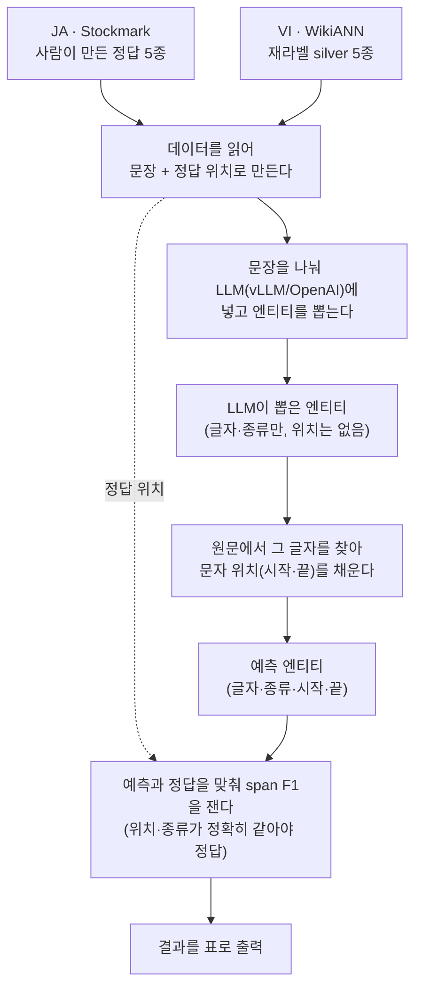
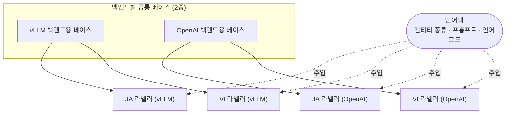

# 1. 라벨링 — LLM NER 라벨러 + 벤치마크 평가

> **이 단계가 하는 일**: 원천 텍스트를 LLM(vLLM/OpenAI 호환 API)으로 NER
> 라벨링하고, gold와 비교해 span-level F1을 측정한다.
> **대상 코드**: `src/ner/labelers/{ja,vi}`, `src/ner/llm_eval`,
> `src/ner/metrics`
> **라벨 정의 단일 출처**: `docs/manual/data/canonical-entity-schema.md`

**한 문장 요지** — JA·VI는 **char-offset span 단일 경로**를 쓴다(KO만 음절
BIO). LLM이 `{"text","type"}`로 위치 없이 반환하면 span 매처가 원문에서
문자 오프셋을 채워 `{text,type,start,end}`를 만들고, gold와 4-튜플 exact
match로 비교한다. BIO 변환·seqeval·TagAligner를 전부 우회한다.

## 전체 흐름

데이터 출처만 JA/VI로 갈리고, 라벨링→매칭→평가는 한 경로로 합류한다.



각 단계가 하는 일:

1. **로딩** — `DatasetLoader`가 JSONL을 읽어 `{text, gold_spans}` 레코드로
   만든다(JA=사람 gold, VI=재라벨 silver).
2. **라벨링** — 문장 분할 후 언어별 프롬프트로 vLLM/OpenAI를 호출해 위치
   없는 raw span `{text, type}`을 받는다(§1·§2).
3. **매칭** — `match_spans`가 원문에서 문자 오프셋을 채워 pred span
   `{text,type,start,end}`으로 만든다(JA·VI 공용, §3).
4. **평가** — `compute_offset_span_f1`이 gold와 4-튜플 exact match로
   P/R/F1을 내고 `ReportGenerator`가 표로 출력한다(§4).

## 목차

1. [공통 아키텍처 — 베이스 라벨러](#1-공통-아키텍처--베이스-라벨러)
2. [엔티티 태그·프롬프트](#2-엔티티-태그프롬프트)
3. [JA·VI 분기 — 데이터 출처와 판정](#3-javi-분기--데이터-출처와-판정)
4. [평가 — offset-span F1](#4-평가--offset-span-f1)
5. [KO 경로와의 대비](#5-ko-경로와의-대비)
6. [설계 의사결정 요약](#6-설계-의사결정-요약)

---

## 1. 공통 아키텍처 — 베이스 라벨러

ko/ja/vi 라벨러는 백엔드별 추상 베이스 2종을 상속하고 **언어팩**
(`entity_types`, 프롬프트 템플릿, `lang`)만 주입한다. 서브클래스는
`__init__`만 오버라이드해 `super().__init__(..., lang=<lang>)`을 호출한다.



### 공개 메서드 (JA·VI가 쓰는 것)

| 메서드 | 반환 | 용도 |
|---|---|---|
| `label_spans(text, split=True)` | raw span 리스트 | **JA·VI 평가 경로.** BIO 변환 없이 span 직행 |
| `label(text)` | BIO 태그 레코드 | KO 경로 전용(문장 분할 후 BIO) |
| `label_records(records)` | 배치 결과 | `text` 필드 다건 처리 |

- OpenAI 베이스는 `label_spans`가 sync 래퍼이고 내부 `alabel_spans`가
  async 처리를 맡는다(`asyncio.run`).
- **백엔드 차이**: vLLM은 `SINGLE_PROMPT_TEMPLATE`로 문장마다 개별 호출
  (`asyncio.Semaphore(concurrency)` 동시성 제한), OpenAI는 문장을 인덱스
  키로 묶어 한 호출로 보내고 `{"0":[...],"1":[...]}` dict로 되받는다
  (`_parse_batch_response`; 파싱 실패 시 문장 수만큼 빈 span 폴백).

> **함정 — HF 베이스라인은 이 경로에 없다.** `labelers/hf_ner_labeler.py`
> (`HFNERLabeler`)는 KO BIO 경로 베이스라인이라 `label_spans`가 없다. JA
> CLI는 hf 백엔드를 거부하고, VI에 줘도 offset-span 평가가 동작하지 않는다.

공통 헬퍼는 `labelers/llm_helpers.py`에 있다: `split_sentences`(ja만
`。！？`, 그 외 `.!?`), `parse_spans`(`<think>` 제거 + 배열/래핑 dict/정규식
폴백), `spans_to_bio`(KO용 exact→substring 2단계 BIO 변환).

---

## 2. 엔티티 태그·프롬프트

엔티티 정의·LOC/ORG 경계·원어 라벨→canonical 매핑·모호 사례 결정표는
`docs/manual/data/canonical-entity-schema.md` 단일 출처다. 라벨러는
canonical **영문 약어**(`PER/LOC/ORG/PROD/EVT` + PII 5종)를 그대로 출력한다.

### 프롬프트 템플릿 — 백엔드별 2종

| 템플릿 | 용도 | 사용 클래스 |
|---|---|---|
| `SINGLE_PROMPT_TEMPLATE` | 문장 단위 라벨링(다중 호출) | `VllmNERLabeler` |
| `SYSTEM_PROMPT` + `USER_PROMPT_TEMPLATE` | OpenAI 채팅(다문 묶음) | `OpenAINERLabeler` |

### 공통 라벨링 규칙(프롬프트 명시)

- **조사·직함 제외** — 부착된 조사/경칭/직함 제거, 이름만
- **JSON 배열만 출력** — 설명 금지, 없으면 `[]`
- **복합 명칭 통합** — 분리 없이 한 덩어리
- **영문 태그만** — 원어 라벨(`人名`/`地名` 등) leakage 금지

> **함정 — JA OpenAI만 안전 도입부.** JA OpenAI `SYSTEM_PROMPT`는 합성 PII
> 벤치마크에서 거부 응답을 피하려 "인공 합성 데이터·정보 추출 전용" 도입부를
> 추가로 넣는다(VI엔 없음).

---

## 3. JA·VI 분기 — 데이터 출처와 판정

라벨링→매칭→평가 경로는 §전체 흐름 그대로 공유하고, **데이터 출처와 gold
성격**만 갈린다.

| 항목 | JA (Stockmark) | VI (WikiANN) |
|---|---|---|
| 입력 | `data/stockmark/{train,test}.jsonl` · `pii_*.jsonl` | `data/wikiann_vi/test.jsonl`(silver) |
| gold 성격 | 사람 gold 5종(+PII 주입 시 10종) | 재라벨 silver(단계 2 생성) |
| 로더 | `JapaneseDatasetLoader` | `VietnameseDatasetLoader` |
| gold 진입점 | `loader.load()` | `_load_gold()` (llm_eval/__main__) |
| 토큰 단위 | 형태소(canonical 덤프) | 단어(word) |
| HF 원본 로딩 | 없음(덤프 직접) | **단계 2 재라벨 파이프라인**이 담당 |

라인 스키마는 공통 `{id, text, entities:[{label, start_char, end_char,
text}]}`이며, PII 주입 산출물의 `start/end`·`type` 표기도 동일 스키마로
흡수한다(`label|type`, `start_char|start`, `end_char|end` 허용).

> WikiANN HF 원본(`{tokens, ner_tags}` 단어 BIO)을 읽어 silver로 만드는
> 책임은 **단계 2**(`augmenters/wikiann_vi`)에 있다. 벤치마크 평가 gold는
> 이미 materialize된 silver를 읽는다 — 두 경로를 혼동하지 말 것.

### 판정 우선순위 (모호 시)

프롬프트는 조사 제외·JSON 배열만·복합 명칭 통합·영문 라벨을 명시하고,
모호할 때 아래 순위로 판정한다(상세·근거는 canonical-entity-schema.md).

| 순위 | 판정 | 대상 | 예 |
|---|---|---|---|
| 1 | ORG | 조직·법인·공권력·인공 시설 전부 | `早稲田大学`, `東京駅`, `米軍` |
| 2 | LOC | 지리적 위치만(국가·행정구역·자연·주소) | `富士山`, `東京都千代田区` |
| 3 | PROD | 상품·서비스·작품·방송 | `iPhone`, `NHKスペシャル` |
| 4 | EVT | 일회성 행사·전쟁·조약·대회 | `関ヶ原の戦い` |

few-shot은 JA 12개(NER 5종+PII 5종+EMAIL TLD 누락·번지 주소 함정), VI 약
10개다. VI는 성조 부호 정확 유지("Hà Nội"→"Ha Noi" 금지), 다중 단어 통합
("Thành phố Hồ Chí Minh"=1 LOC), 직함 제외("Ông"/"Bà"/"Chủ tịch" 등)를
추가 명시한다.

### match_spans — 문자 오프셋 매칭 (JA·VI 공용)

LLM은 위치 없이 `{"text","type"}`만 낸다. `match_spans`
(`labelers/span_matcher.py`)가 원문에서 오프셋을 부여한다:

1. **길이 역순 정렬** — 긴 엔티티 먼저(부분 문자열 충돌 방지)
2. **3단계 매칭** — exact → 공백 제거 → 조사 제거(`_strip_particles`)
3. **충돌 방지** — `consumed` 집합으로 매칭된 인덱스 추적, 겹치지 않는
   최좌측 후보 선택 → 원래 순서 복원

조사(`は/が/を/に…`)·접미사(`氏/さん/様…`)는 길이 역순으로 벗기고,
텍스트가 조사·접미사보다 길 때만 제거한다(1글자 엔티티 보호).

> **함정 — VI 태그 정규화는 LLM 경로에 없다.** `_TAG_NORMALIZE_MAP_VI`
> (`PERSON→PER` 등)는 **HF 베이스라인·KO BIO 추출 경로에서만** 쓴다. VI LLM
> offset-span 경로는 정규화를 거치지 않아, LLM이 `PERSON`을 내면 약어로
> 변환되지 않고 타입 불일치 FP가 된다(프롬프트가 영문 약어를 강제하는 이유).

> **함정 — 10종 출력공간 vs 3종 gold(VI).** 라벨러는 PII 주입본과 코드를
> 공유하므로 항상 10종 출력공간을 유지한다. WikiANN 3종 gold로 평가하면
> PROD/EVT/PII 출력이 FP로 잡혀 precision이 인위적으로 내려가는 의도된
> trade-off다.

---

## 4. 평가 — offset-span F1

### CLI

```bash
python -m ner.llm_eval --lang ja \
    --models "vllm:Qwen/Qwen3.5-27B" --max-samples 200
python -m ner.llm_eval --lang vi \
    --models "vllm:cyankiwi/gemma-4-31B-it-AWQ-8bit" --max-samples 200
```

`__main__.py` → `BenchmarkRunner(eval_mode='offset_span')` →
`_run_offset_span()`. `_eval_mode_for_lang('ja'|'vi')='offset_span'`(KO만
BIO). ja·vi는 `--local-file PATH`로 PII 주입 gold를 직접 평가할 수 있다.

### compute_offset_span_f1 — `metrics/span_metrics.py`

문자 오프셋 기반 span-level F1(seqeval 미사용). `(sent_idx, start, end,
type)` 4-튜플 exact match면 TP:

```python
key = (sent_idx, s["start"], s["end"], s["type"])
tp        = len(all_gold & all_pred)
precision = tp / len(all_pred)
recall    = tp / len(all_gold)
f1        = 2 * precision * recall / (precision + recall)
```

micro-average + per-entity(타입별 P/R/F1/support) breakdown.

> **핵심 — 단계 4(분류)와 동일 함수.** `train_eval.py`도 이 함수를 import
> 한다. LLM 라벨러와 BERT 분류기 결과를 직접 비교할 수 있는 이유다.

**속도·2단계 평가** — 벤치마크는 F1과 함께 `TPS·Sec/Sample·Samples·
Errors`를 출력한다. 라벨↔평가를 분리하려면 `span_evaluator_cli.py`가 미리
만든 예측 JSONL(`gold_spans`/`pred_spans`)을 소비해 재평가를 빠르게 한다.

---

## 5. KO 경로와의 대비

| 항목 | KO (KLUE) | JA (Stockmark) | VI (WikiANN) |
|---|---|---|---|
| 데이터셋 | `klue` config=`ner` | `stockmark/ner-wikipedia-dataset` | `unimelb-nlp/wikiann` `vi` |
| split | `validation` | `test` | `test` |
| gold 종수 | 6 (PS/LC/OG/DT/TI/QT) | 5 canonical | 3 (PER/LOC/ORG) |
| 라벨러 출력 | 6 | 10 평면 | 10 평면 |
| 토큰 수준 | 음절+공백 | 형태소 | 단어 |
| gold 형식 | 음절 BIO | offset span | offset span |
| span→태그 | `spans_to_bio()` | `match_spans()` | `match_spans()` |
| 평가 메트릭 | Span Match+seqeval+Char Span F1 | Offset Span F1 | Offset Span F1 |
| TagAligner | 필수 | 미사용 | 미사용(정규화 맵만) |

요컨대 **JA·VI는 offset-span 단일 경로**, KO만 음절 BIO·seqeval 경로다.

---

## 6. 설계 의사결정 요약

| 단계 | 결정 | 이유 | 대안(미채택) |
|---|---|---|---|
| 데이터 | offset span 형식 유지 | 원본이 offset span, 변환 정보손실 회피 | BIO 변환 |
| 데이터 | canonical JSONL 덤프 전용(JA) | 매핑·세이프티 정정을 1회성 도구에 격리 | HF 자동 로딩+런타임 매핑 |
| 프롬프트 | canonical 영문 10종 평면 | 다국어 라벨 공간 일관 + 평면 단순화 | 원어 라벨(leakage) |
| 프롬프트 | LOC=지리만, ORG=인공시설 전부 | 시설/조직 경계 모호성 제거 | 시설/조직 분리 |
| 라벨링 | `match_spans()` 별도 모듈 | 위치 없는 LLM 출력 ↔ 위치 있는 gold 브릿지 | BIO 변환 후 비교 |
| 라벨링 | 3단계 매칭(exact→공백→조사) | 조사·공백 부착 단계적 해결 | exact만 |
| 평가 | offset span F1 단일 | 분류기와 동일 함수로 직접 비교 | 다중 메트릭/seqeval |

---

**다음 단계** → [2. 증강](2-augmentation.md): 라벨링 산출(또는 원천 gold)에
PII를 주입하고, VI는 3종 silver를 5종으로 재라벨해 학습 코퍼스를 만든다.
