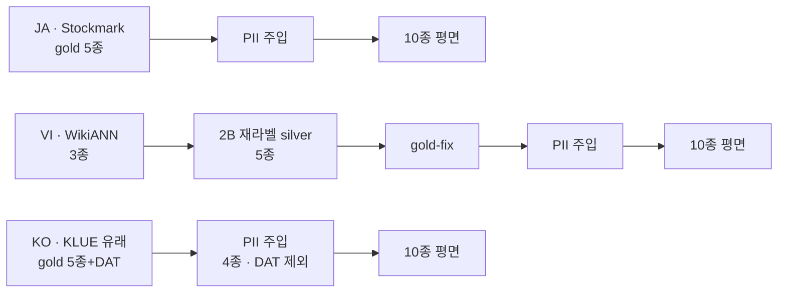
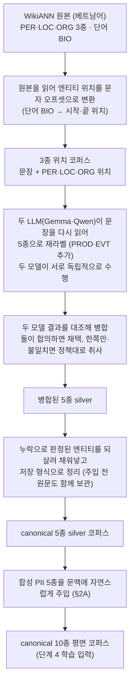

# 2. 증강 — 합성 PII 주입 + VI 재라벨 silver

> **이 단계가 하는 일**: 학습 코퍼스를 만든다. (a) 모든 언어에서 합성 PII
> 5종을 자연 주입하고, (b) VI는 그 전에 WikiANN 3종 gold를 canonical 5종
> silver로 LLM 재라벨한다.
> **대상 코드**: `src/ner/augmenters/pii`, `src/ner/augmenters/wikiann_vi`
> **산출**: `data/{stockmark,wikiann_vi}/pii_*.jsonl` (canonical 10종 평면)

두 하위 파이프라인이 언어별로 다르게 연결된다.



각 레인이 하는 일:

- **JA** — 사람 gold 5종에 PII 5종만 자연 주입(재라벨 불필요).
- **VI** — WikiANN 3종을 재라벨 silver 5종으로 끌어올린 뒤(§2B) gold-fix·
  PII 주입까지 거치는, 증강이 가장 무거운 레인이다.
- **KO** — KLUE 유래 gold(`DAT` 이미 보유)에 PII 4종만 주입, 검증 없이
  원본 gold를 보존한다.

## 목차

1. [2A. 합성 PII 주입 (공통)](#2a-합성-pii-주입-공통)
2. [2B. VI 재라벨 silver (VI 전용)](#2b-vi-재라벨-silver-vi-전용)
3. [산출 계약 — 단계 4 입력](#3-산출-계약--단계-4-입력)

---

## 2A. 합성 PII 주입 (공통)

### 왜 합성 PII 주입인가

이 파이프라인의 목표 중 하나가 **PII 검출·마스킹**이다. PII를 검출하도록
학습하려면 PII가 라벨된 데이터가 필요한데, 공개 NER 데이터셋엔 PII가
없거나(JA Stockmark) 라벨 공간이 좁다(VI WikiANN 3종). 그래서 PII를 데이터
증강으로 합성 주입한다. 목표 라벨 공간은 canonical 10종 평면 = NER 5종 +
PII 5종(`EMAIL/PHONE/DAT/ID_NUM/CREDIT_CARD`).

### 주입 방식 — LLM 자연 주입(표준)

모든 언어에서 **LLM 자연 주입**을 표준으로 쓴다(`LLMInjector`,
`--mode llm`). LLM에 "원문에 PII를 자연스러운 문맥으로 삽입하라"고 요청하고,
생성 텍스트에서 string match로 PII span 오프셋을 추출한다. 주입 후
`harden_pii_format_collisions`로 무라벨 CC·ID_NUM 포맷 열을 일관 relabel.
프롬프트는 언어별(`_INJECTION_PROMPT_JA`·`_INJECTION_PROMPT_VI` …),
`_INJECTION_PROMPTS` dict에서 `lang`로 선택.

> **왜 단순 규칙 삽입이 아닌가**: 문두·문말·랜덤 위치에 PII를 끼우면 "문장
> 가장자리의 숫자열·@ = PII"라는 위치 기반 shortcut을 학습해 문중 자연
> 등장 PII에 일반화하지 못한다. 또 trigger phrase(「担当の○○」「연락처는
> ○○」)가 사라져 실문서 감지력이 떨어진다.

규칙 기반 **suffix 모드**(`PIIInjector`, `--mode suffix`: 문장 끝 단서어 +
합성 값 접미, LLM 없이 결정론적)도 CLI에 남아 있으나 현재 언어별
파이프라인에서는 미사용.

### 2단계 구조 — 주입 + 교차 검증

LLM 주입 출력을 그대로 학습에 쓰지 않고 **독립한 두 번째 LLM**으로 재라벨해
교차 검증한다(검증 정책·메트릭 상세는 [3. 검증](3-verification.md)).

| 단계 | 모듈 | 역할 |
|---|---|---|
| 1. Inject | `LLMInjector` / `PIIInjector` | PII 삽입 + span 오프셋 산출 |
| 2. Verify | `PIIVerifier` | 독립 재라벨로 span이 PII·원본 엔티티에서 재검출되는지 확인 |

검증기는 `label_spans(split=False)`로 호출해 문맥을 보존하고 각 span을
**confirmed / missed / conflict**로 분류한다. `--inject-url/--inject-model`과
`--verify-url/--verify-model`을 분리해 서로 다른 모델을 배치할 수 있다.

> **검증을 생략하는 경우**: 주입기의 span 추출이 오프셋 정확성을 보장할 때
> (KO — 자연 주입 `extract_spans`가 오프셋을 정확 산출)는 verify를 건너뛰어
> 사람이 만든 원본 gold를 그대로 보존한다.

### 정책

검증 정책(`--verify-policy`)과 라벨 병합:

| 정책 | 동작 |
|---|---|
| `drop_span`(기본) | `missed`+`conflict` span 제거, 레코드는 보존(학습 품질 우선) |
| `drop_record` | `missed`·`conflict` 하나라도 있으면 레코드 통째 제거(보수적) |
| `keep_all` | 분류만, 모두 유지(진단용) |

라벨 병합(`config.py::DEFAULT_MERGE_RULES`): canonical 정렬을 위해
`NAME → PER`, `ADDRESS → LOC` 무조건 병합 — 학습 데이터에 `NAME`·`ADDRESS`
라벨은 존재하지 않는다.

### 생성기·밀도

언어별 PII 생성기는 `generate_pii(label, lang, rng)`(`generators/base.py`가
디스패치)로 호출되고, 언어 모듈 `generators/{ja,vi,ko}.py`가 실제 값을
생성한다: 이름/전화/주소/날짜/ID/이메일/카드.

- 내부 PII 토큰(병합 전): `NAME, PHONE, ADDRESS, DAT, ID_NUM, EMAIL,
  CREDIT_CARD`(7종)
- KO 주민등록번호는 **체크섬 무효**로 생성(실유효 번호 비생성)
- 주입 밀도 기본 분포 `P(0)=0.2, P(1)=0.4, P(2)=0.3, P(3)=0.1`(문장당
  PII 수), `--pii-max`로 상한 조정, `--seed`로 결정론성

### CLI

```bash
# JA — Stockmark에 LLM 자연 주입 + 교차 검증
python -m ner.augmenters.pii --source stockmark --lang ja \
    --output data/stockmark/pii_test.jsonl --n-samples 1000 \
    --mode llm --vllm-url http://localhost:8081/v1 \
    --vllm-model Qwen/Qwen3.5-27B \
    --verify vllm --verify-policy drop_span

# KO — KLUE gold에 PII 4종만(DAT 제외) 자연 주입, verify 없음
python -m ner.augmenters.pii --source jsonl --input data/klue/origin.jsonl \
    --lang ko --pii-labels EMAIL PHONE ID_NUM CREDIT_CARD --mode llm \
    --inject-url http://localhost:8081/v1 \
    --inject-model cyankiwi/gemma-4-31B-it-AWQ-8bit \
    --output data/klue/pii_all.jsonl
```

`--source`는 `stockmark`/`jsonl`(크롤링 등 임의)/`hf`(HF Hub) 어댑터
(`loaders.py`). `--pii-labels`로 주입 PII 라벨을 제한(미지정 시
`DEFAULT_PII_LABELS` 전체).

### 언어별 적용

- **JA** — Stockmark 5종 NER에 PII 5종 자연 주입 → 10종 평면(검증 적용)
- **VI** — 재라벨 silver(5종) 위에 PII 5종 자연 주입(검증 적용) — silver
  생성은 §2B 상류 단계
- **KO** — KLUE 유래 gold에 PII 4종(`DAT` 제외, 이미 존재) 자연 주입,
  검증 없이 원본 gold 보존

---

## 2B. VI 재라벨 silver (VI 전용)

WikiANN-vi 원본은 NER **3종(PER/LOC/ORG)** 자동 silver다. canonical 5종으로
끌어올리려면 LLM 재라벨이 필요하다. `augmenters/wikiann_vi/`가 이를 전담한다.

### 흐름도



각 단계의 실제 함수·파일명은 아래 소섹션(재라벨·병합·gold-fix)이 상술한다.
분류기 기본 입력은 `data/wikiann_vi/origin.jsonl`이고 분할은 분류기 내부
group K-fold가 맡는다(중간 split 파일 경로는 데이터 재정리로 변동).

> 재라벨 품질 측정(kappa·Wikidata anchor·WikiANN gold 비교)은 데이터를
> 바꾸지 않는 **독립 검증**이라 [3. 검증](3-verification.md)에서 다룬다.
> 여기서는 *코퍼스를 만드는* merge·gold-fix만 설명한다.

### 재라벨 — Relabeler

`python -m ner.augmenters.wikiann_vi`(CLI)가 HF 원본을 읽어
`Relabeler`(`relabel.py`)로 재라벨한다. async vLLM 클라이언트
(`--concurrency`, `--batch-size` N개 레코드/BATCH 프롬프트). 출력 스키마:
`{id, text, gold_spans, gold_spans_relabel, relabel_model}`.

```bash
python -m ner.augmenters.wikiann_vi \
    --model cyankiwi/gemma-4-31B-it-AWQ-8bit \
    --base-url http://localhost:8081/v1 \
    --split test --max-samples 1000 \
    --output data/wikiann_vi/gemma_test.jsonl
```

프롬프트(`wikiann_vi/prompts.py`)는 canonical-entity-schema.md §2~3의 경계
규칙을 추가 명시한다: 정기 리그/대회=ORG·특정 연도판=EVT, 작품(음악·영화·
책·만화·게임·TV)=PROD, "Danh sách…" 무시, Latin binomial 학명 무시, 모델
번호 단독 무시, 인프라 운영=ORG·노선=LOC.

### 이중 모델 + 신뢰도 병합 — merge_confidence

Gemma·Qwen 두 모델을 **독립 재라벨**한 뒤 출력을 비교해 신뢰도 4
카테고리로 분류한다(`merge_confidence.py`):

```
high          두 모델 동일 span+type
medium_recall gemma_only — Gemma만 단독 검출 (recall 측)
medium_prec   qwen_only  — Qwen만 단독 검출 (precision 측)
conflict      같은 offset, type 불일치
```

7 정책 중 선택(`--policy`, CLI 기본 `recall`). silver 빌드 권장값은
`recall_strict`:

| 정책 | PER/LOC/ORG | PROD/EVT |
|---|---|---|
| `recall`(CLI 기본) | high + medium_recall | high + medium_recall |
| `precision` | high + medium_prec | high + medium_prec |
| `high_only` | high만 | high만 |
| `full` | 전체(conflict 포함) | 전체 |
| **`recall_strict`(빌드 권장)** | **high + medium_recall** | **high만** |

(+ strict 변형 2종: `recall_strict_evt`=EVT 구제, `recall_strict_prod`=PROD를
high+medium_recall로 완화.) PROD/EVT는 희소·고난도라 strict로 정밀도를
지키고, PER/LOC/ORG는 recall을 살린다.

### gold-fix — silver_gap

`silver_gap.apply_silver_gap`은 **외부에서 이미 판정된**(adjudicated) FP→TP
케이스를 surface 일치·비-겹침 재검증 후 **additive 삽입**한다(etype별 개별
호출, 기본 `EVT`). 의미적 재감사·판정 자체는 본 함수 밖이며, 그 판정을 만든
1회성 도구는 폐기돼 재현 경로가 닫혀 있다(방법만 기록). 상세 정량은
`docs/reports/vietnamese-ner-silver-quality.md`.

### 이중 silver 인식 (해석 주의)

- WikiANN 원본 = Wikipedia 인터링크 기반 자동 silver
- 본 5종 라벨 = WikiANN silver를 LLM이 재분류한 추가 silver
- → **이중 silver**. 절대 F1 비교는 부적합하고, 모델 간 상대 순위·
  cross-model kappa·Wikidata anchor agreement만 해석 대상([3. 검증](3-verification.md)).

---

## 3. 산출 계약 — 단계 4 입력

증강 산출 JSONL은 단계 4(분류)가 그대로 소비하는 **계약**이다.

```jsonl
{"text": "...",
 "entities": [{"label":"PER","start_char":0,"end_char":3,"text":"..."}],
 "id": "..."}
```

- `label` ∈ canonical 10종, `start_char`/`end_char`는 반-개구간 `[start,end)`
- VI 코퍼스는 행마다 **주입 전 원문 `orig` 필드**를 보유한다 — 단계 4의
  원문 단위 group K-fold(cross-fold 누출 차단)의 핵심 키다([3. 검증](3-verification.md)·[4. 분류](4-classification.md)). 단,
  §2A 표준 주입기(`pii/schema.py`의 `Record`)는 `text/entities/id`만
  보존하고 입력의 `orig`를 떨군다 — VI의 `orig`는 원문을 함께 실어 주는 VI
  전용 빌드가 부여한 것이지 표준 CLI 산물이 아니다.
- pii CLI는 출력 JSONL 외에 `*.stats.json`(라벨 빈도·char coverage·PII
  없는 샘플 비율)을, verify 시 `*.verify.json` 리포트를 부산물로 남긴다.
- 로딩: JA는 `JapaneseDatasetLoader.load_local(path)`, 분류기는
  `classifier/data_utils.load_jsonl(path)`(canonical 10종 검증 포함).

시점별 산출 경로·레코드 수는 데이터 재정리로 바뀌므로 본문에 박지 않는다.
구체 수치는 `docs/reports/{japanese,vietnamese}-ner-pii-benchmark.md`.

---

**다음 단계** → [3. 검증](3-verification.md): 만든 silver·주입 데이터의
품질과 분류 평가의 무결성(cross-fold 누출)을 독립적으로 검증한다.
