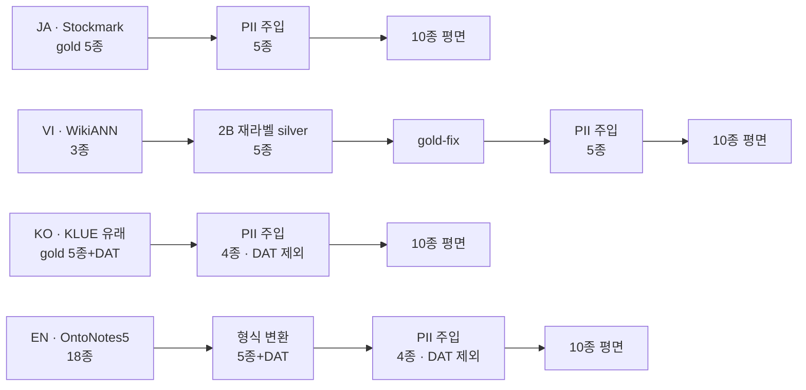
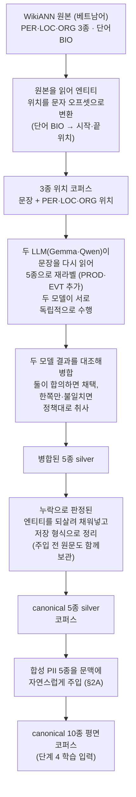

# 2. 증강 — 합성 PII 주입 + VI 재라벨 silver

> **이 단계가 하는 일**: 학습 코퍼스를 만든다. (a) 네 언어 모두에 합성 PII를
> 자연 주입하고, (b) VI는 그 전에 WikiANN 3종 gold를 canonical 5종 silver로
> LLM 재라벨한다.
> **대상 코드**: `src/ner/augmenters/pii`, `src/ner/augmenters/wikiann_vi`,
> `src/ner/augmenters/ontonotes_en`
> **산출**: `data/{stockmark,wikiann_vi,klue,ontonotes_en}/*.jsonl`
> (canonical 10종 평면)

네 레인이 언어별로 다르게 연결된다.



**주입할 PII 가 4종인지 5종인지는 원천이 날짜를 갖고 있는지가 정한다.** ko·en 은
원천 gold 에 날짜가 이미 있어 `DAT` 를 주입하지 않고, ja·vi 는 없어서 `DAT` 까지
주입한다.

각 레인이 하는 일:

- **JA** — 사람 gold 5종에 PII 5종만 자연 주입(재라벨 불필요).
- **VI** — WikiANN 3종을 재라벨 silver 5종으로 끌어올린 뒤(§2B) gold-fix·
  PII 주입까지 거치는, 증강이 가장 무거운 레인이다.
- **KO** — KLUE 유래 gold(`DAT` 이미 보유)에 PII 4종만 주입, 검증 없이
  원본 gold를 보존한다.
- **EN** — 재라벨이 없다. OntoNotes5 18종을 canonical 6종으로 매핑하고 자연문을
  복원하는 형식 변환만 거친 뒤 PII 4종을 주입한다. 원본 `FAC` 는 표면별 판정
  표로 `ORG`(개별 구조물)·`LOC`(경로)·비-entity 로 갈린다. 현 코퍼스는 주입 뒤
  EMAIL 일부를 괄호·따옴표 등에 한 번 붙여 두었다(§EMAIL 붙은 문맥).

## 목차

1. [2A. 합성 PII 주입 (공통)](#2a-합성-pii-주입-공통)
2. [2B. VI 재라벨 silver (VI 전용)](#2b-vi-재라벨-silver-vi-전용)
3. [산출 계약 — 단계 4 입력](#3-산출-계약--단계-4-입력)

---

## 2A. 합성 PII 주입 (공통)

### 왜 합성 PII 주입인가

이 파이프라인의 목표 중 하나가 **PII 검출·마스킹**이다. PII를 검출하도록
학습하려면 PII가 라벨된 데이터가 필요한데, 공개 NER 데이터셋엔 PII가
없거나(JA Stockmark) 라벨 공간이 좁다(VI WikiANN 3종). 그래서 PII를 데이터
증강으로 합성 주입한다. 목표 라벨 공간은 canonical 10종 평면 = NER 5종 +
PII 5종(`EMAIL/PHONE/DAT/ID_NUM/CREDIT_CARD`).

### 주입 방식 — LLM 자연 주입(표준)

모든 언어에서 **LLM 자연 주입**을 표준으로 쓴다(`LLMInjector`,
`--mode llm`). LLM에 "원문에 PII를 자연스러운 문맥으로 삽입하라"고 요청하고,
생성 텍스트에서 string match로 PII span 오프셋을 추출한다. 주입 후
`harden_pii_format_collisions`로 무라벨 CC·ID_NUM 포맷 열을 일관 relabel.
프롬프트는 언어별(`_INJECTION_PROMPT_JA`·`_INJECTION_PROMPT_VI` …),
`_INJECTION_PROMPTS` dict에서 `lang`로 선택.

> **왜 단순 규칙 삽입이 아닌가**: 문두·문말·랜덤 위치에 PII를 끼우면 "문장
> 가장자리의 숫자열·@ = PII"라는 위치 기반 shortcut을 학습해 문중 자연
> 등장 PII에 일반화하지 못한다. 또 trigger phrase(「担当の○○」「연락처는
> ○○」)가 사라져 실문서 감지력이 떨어진다.

규칙 기반 **suffix 모드**(`PIIInjector`, `--mode suffix`: 문장 끝 단서어 +
합성 값 접미, LLM 없이 결정론적)도 CLI에 남아 있으나 현재 언어별
파이프라인에서는 미사용.

### 2단계 구조 — 주입 + 교차 검증

LLM 주입 출력을 그대로 학습에 쓰지 않고 **독립한 두 번째 LLM**으로 재라벨해
교차 검증한다(검증 정책·메트릭 상세는 [3. 검증](3-verification.md)).

| 단계 | 모듈 | 역할 |
|---|---|---|
| 1. Inject | `LLMInjector` / `PIIInjector` | PII 삽입 + span 오프셋 산출 |
| 2. Verify | `PIIVerifier` | 독립 재라벨로 span이 PII·원본 엔티티에서 재검출되는지 확인 |

검증기는 `label_spans(split=False)`로 호출해 문맥을 보존하고 각 span을
**confirmed / missed / conflict**로 분류한다. `--inject-url/--inject-model`과
`--verify-url/--verify-model`을 분리해 서로 다른 모델을 배치할 수 있다.

> **검증을 생략하는 경우**: 주입기의 span 추출이 오프셋 정확성을 보장할 때
> (KO — 자연 주입 `extract_spans`가 오프셋을 정확 산출)는 verify를 건너뛰어
> 사람이 만든 원본 gold를 그대로 보존한다.

### 정책

검증 정책(`--verify-policy`)과 라벨 병합:

| 정책 | 동작 |
|---|---|
| `drop_span`(기본) | `missed`+`conflict` span 제거, 레코드는 보존(학습 품질 우선) |
| `drop_record` | `missed`·`conflict` 하나라도 있으면 레코드 통째 제거(보수적) |
| `keep_all` | 분류만, 모두 유지(진단용) |

라벨 병합(`config.py::DEFAULT_MERGE_RULES`): canonical 정렬을 위해
`NAME → PER`, `ADDRESS → LOC` 무조건 병합 — 학습 데이터에 `NAME`·`ADDRESS`
라벨은 존재하지 않는다.

### 생성기·밀도

언어별 PII 생성기는 `generate_pii(label, lang, rng)`(`generators/base.py`가
디스패치)로 호출되고, 언어 모듈 `generators/{ja,vi,ko}.py`가 실제 값을
생성한다: 이름/전화/주소/날짜/ID/이메일/카드.

- 내부 PII 토큰(병합 전): `NAME, PHONE, ADDRESS, DAT, ID_NUM, EMAIL,
  CREDIT_CARD`(7종)
- KO 주민등록번호는 **체크섬 무효**로 생성(실유효 번호 비생성)
- 주입 밀도 기본 분포 `P(0)=0.2, P(1)=0.4, P(2)=0.3, P(3)=0.1`(문장당
  PII 수), `--pii-max`로 상한 조정, `--seed`로 결정론성

### EMAIL 로컬파트 표면형

`local@domain` 의 `@` 앞부분을 **형태·대소문자·숫자** 세 축으로 나눠 각각
독립 추첨한다. 축이 독립이라 형태마다 대소문자 표를 다시 만들 필요가 없고,
한 축의 비율을 조정해도 나머지 두 축이 흔들리지 않는다. 목표값은
`generators/base.py` 의 `LOCAL_PART_FORM_WEIGHTS`·`LOCAL_PART_*_RATE` 가
단일 출처이며 아래 표는 그 사본이다.

형태 축은 이름 두 토큰을 무엇으로 잇는지가 정한다.

| 형태 | 비율 | 예 |
|---|---|---|
| 점 연결 | 30% | `emily.thompson` |
| 붙여쓰기 | 22% | `emilythompson` |
| 단일 토큰 | 20% | `emily` |
| 이니셜 + 성 | 15% | `ethompson` |
| 밑줄 연결 | 8% | `emily_thompson` |
| 하이픈 연결 | 5% | `emily-thompson` |

| 축 | 값 | 비율 |
|---|---|---|
| 대소문자 | 전부 소문자 | 90% |
| | 토큰 첫 글자 대문자 | 10% |
| 숫자 | 없음 | 72% |
| | 접미 1~4자리 | 26% |
| | 접두 1~2자리 | 2% |

**이름은 표기 이름이 아니라 로케일별 ASCII 이름 목록에서 뽑는다**
(`EMAIL_GIVEN_NAMES`·`EMAIL_FAMILY_NAMES`). 로컬파트가 ASCII 만 받으므로
`generate_name()` 의 표기 이름을 그대로 넣으면 ko·ja 는 한글·한자가 전량
탈락해 무작위 글자만 남고, en·vi 는 공백이 점으로 바뀌어 점 100% 가 된다.
ko·ja 목록은 표기 이름 목록과 같은 순서의 로마자 표기다.

**숫자 접두를 0 으로 두지 않는 이유**는 숫자로 시작하는 이메일이 드물지만
실재하기 때문이다. 학습에서 완전히 지우면 그 표면형이 분포 밖이 되어, 지금
없는 구멍이 반대편에 생긴다.

생성기를 고치기 전에 만든 네 코퍼스도 EMAIL span 의 로컬파트만 이 분포로 한 번
다시 만들었다. 도메인·문맥·다른 라벨은 건드리지 않고 길이 차이만큼 뒤따르는
엔티티 오프셋만 밀었다. 생성기가 같은 분포를 내므로 다시 주입해도 로컬파트 분포는
그대로다. EN 은 이 출력 위에 아래 붙은 문맥 치환을 한 번 더 했다.

### EMAIL 붙은 문맥 (EN)

EN 은 주입한 EMAIL 가운데 일부를 공백이 아닌 글자 뒤에 둔다. en 모델의 토크나이저
(RoBERTa 바이트 BPE)는 공백 뒤 단어에 `Ġ` 표지를 붙여 다른 토큰으로 쓴다. 그래서
`at alice@x.com` 의 로컬파트는 `Ġalice` 한 토큰이지만 `<alice@x.com>` 의 로컬파트는
`al` + `ice` 다. LLM 자연 주입은 주소를 거의 언제나 공백 뒤에 둔다(치환 전
24,105건 중 3건만 예외). 그래서 모델이 뒤쪽 모양을 보지 못했고, 괄호·`mailto:` 뒤
주소의 앞쪽을 놓쳤다.

| 종류 | 바꾼 모양 | 비율 |
|---|---|---|
| 꺾쇠 | `at <alice@x.com> today` | 5% |
| 괄호 | `at (alice@x.com) today` | 3% |
| 큰따옴표 | `at "alice@x.com" today` | 3% |
| `mailto:` | `at mailto:alice@x.com today` | 2% |
| 단서어 콜론 | `email alice@x.com` → `email:alice@x.com` | 단서어 뒤 주소의 30% |

위 비율은 EN 코퍼스에 한 번 적용한 치환의 값이다. 적용 뒤 EN gold 에서 공백 아닌
글자 뒤의 주소가 14.3% 가 됐다. 콜론을 단서어 뒤에만 넣는 것은 단서어 없이 넣으면
`at:alice@x.com` 같은 없는 표기가 되기 때문이다.

**위 §주입 방식이 경계하는 규칙 삽입과는 다르다.** 그 경계는 PII 를 문두·문말로
옮겨 단서어 없이 끼우는 방식을 향한다. 이 치환은 LLM 이 둔 자리와 앞의 단서어
(`at`·`email`)를 그대로 두고 주소 둘레에 글자만 더하므로 위치 분포가 바뀌지 않는다.
남는 위험은 "괄호 안 = EMAIL" 같은 지름길이다. 이메일이 아닌 내용을 같은 자리에 넣은
음성 probe(`tests/server/test_en_email_probe.py`)가 그것을 잰다.

문자열 첫 자리와 개행·탭 뒤는 코퍼스로 다루지 않는다. 그 자리는 토크나이저 쪽의
앞 공백과 공백류 정규화가 맡는다([4. 분류](4-classification.md) §2). 코퍼스에
문두 주소를 넣으면 이 문서가 경계하는 위치 지름길이 된다.

**이 치환은 주입기에 없다.** 기존 EN 코퍼스에 한 번 적용한 뒤 치환 도구를 지웠다.
그래서 EN 을 다시 주입하면 공백 아닌 글자 뒤의 주소가 치환 전처럼 거의 없는 분포로
돌아가고, 괄호·`mailto:` 뒤 주소의 앞쪽을 놓치는 결함이 다시 열린다. 다시 주입할
때는 위 표의 규칙을 주입 경로에 먼저 넣는다.

### VI DAT 표면형

베트남어의 일상 날짜 표기는 `ngày 15 tháng 3 năm 2024` 처럼 낱말을 끼운 서술형인데,
예전 생성기는 `15/03/2024` 류 숫자 표기 세 가지만 냈다. 그래서 학습 커버리지가 0 이
되어 배포 모델이 서술형 날짜를 통째로 놓쳤다. 조각 span 은 미탐지보다 나쁘다 —
마스킹이 `15` 만 가리고 나머지를 그대로 흘린다.

아래 표는 현 VI 코퍼스의 DAT 표면형 비율이다. 숫자와 서술형은 생성기
(`generators/vi.py` 의 `VIETNAMESE_DAT_PATTERNS`)가 낸다.

| 형식 | 비율 | 예 | span |
|---|---|---|---|
| 숫자 3종 | 60% | `ngày 26/05/1988` | `26/05/1988` |
| `D tháng M năm Y` | 30% | `ngày 26 tháng 5 năm 1988` | `26 tháng 5 năm 1988` |
| `tháng M năm Y` | 10% | `được cấp tháng 5 năm 1988` | `tháng 5 năm 1988` |

**앞에 붙는 시간 낱말은 그것을 떼고도 날짜로 읽히면 span 밖에 둔다.** `ngày` 뒤에
완전한 날짜가 오는 자리는 `ngày` 를 빼도 날짜라 밖에 남기고, `tháng 5 năm 1988` 은
`tháng` 을 빼면 `5 năm 1988` 이 되어 날짜로 안 읽히므로 안에 넣는다. 앞 규칙은 기존
코퍼스가 `ngày` + 숫자 날짜 3,708 자리를 예외 없이 그렇게 두고 있던 관례 그대로다.

**월-연 표기는 생성기가 내지 않는다.** 생성기는 값 문자열만 돌려주고 그 앞에 `ngày`
가 붙을지는 LLM 주입기가 정하는데, 생성기가 그것을 통제하지 못해
`ngày tháng 5 năm 1988`("날 5월 1988년") 같은 깨진 문맥이 나온다. 그래서 생성기는
숫자와 `D tháng M năm Y` 를 60:40 으로만 낸다.

**연도 단독 `năm Y` 는 주입하지 않는다.** 베트남어 사건명이 `Bầu cử liên bang Úc
năm 2004` 처럼 연도로 끝나는 꼴이 흔해 그 자리의 옳은 라벨이 `EVT` 이고, 본문의
`năm YYYY` 도 무라벨로 남아 있다. 연도 단독을 `DAT` 으로 주입하면 모델이 "연도
단독은 DAT, 단 사건명 꼬리일 때는 EVT" 를 배워야 해서, 얻는 커버리지보다 `EVT` 를
잃을 위험이 크다.

현 코퍼스는 DAT span 의 표면만 이 분포로 한 번 다시 만들었다. 문맥·다른 라벨은
건드리지 않고 길이 차이만큼 뒤따르는 엔티티 오프셋만 밀었다. 월-연으로 바꾼
자리에서만 앞의 `ngày` 를 함께 먹었고, 먹을 `ngày` 가 없거나 앞 낱말이
`năm`·`tháng` 인 자리는 숫자 표기로 남겼다.

**월-연 표기는 앞 글자까지 함께 보는 이 치환에서만 나왔고, 그 도구는 지웠다.** 그래서
VI 를 다시 주입하면 월-연 표기가 0 이 되어 숫자와 서술형만 60:40 으로 남는다. 다시
주입할 때는 앞 `ngày` 를 다루는 위 규칙을 주입 경로에 먼저 넣는다.

### CLI

```bash
# JA — Stockmark에 LLM 자연 주입 + 교차 검증
python -m ner.augmenters.pii --source stockmark --lang ja \
    --output data/stockmark/pii_test.jsonl --n-samples 1000 \
    --mode llm --vllm-url http://localhost:8081/v1 \
    --vllm-model Qwen/Qwen3.5-27B \
    --verify vllm --verify-policy drop_span

# KO — KLUE gold에 PII 4종만(DAT 제외) 자연 주입, verify 없음
python -m ner.augmenters.pii --source jsonl --input <주입 전 KLUE gold> \
    --lang ko --pii-labels EMAIL PHONE ID_NUM CREDIT_CARD --mode llm \
    --inject-url http://localhost:8081/v1 \
    --inject-model cyankiwi/gemma-4-31B-it-AWQ-8bit \
    --output data/klue/origin.new.jsonl
mv data/klue/origin.new.jsonl data/klue/origin.jsonl   # 검토 후 gold 로 승격
```

`--source`는 `stockmark`/`jsonl`(크롤링 등 임의)/`hf`(HF Hub) 어댑터
(`loaders.py`). `--pii-labels`로 주입 PII 라벨을 제한(미지정 시
`DEFAULT_PII_LABELS` 전체).

**입력이 자리표시자인 것은 주입 전 파일을 보관하지 않기 때문이다.** 언어마다
디스크에 두는 gold 는 `data/<데이터셋>/origin.jsonl` 하나이고 그것이 주입까지
끝난 상태다. 다시 돌려야 하면 상류(§2B)에서 주입 전 gold 를 새로 만들어
입력으로 준다. 출력을 곧장 `origin.jsonl` 로 쓰지 않고 임시 이름으로 받아
승격하는 것도 같은 이유다 — 입력과 출력이 같은 경로면 실패한 실행이 gold 를
덮어쓴다.

### 언어별 적용

- **JA** — Stockmark 5종 NER에 PII 5종 자연 주입 → 10종 평면(검증 적용)
- **VI** — 재라벨 silver(5종) 위에 PII 5종 자연 주입(검증 적용) — silver
  생성은 §2B 상류 단계
- **KO** — KLUE 유래 gold에 PII 4종(`DAT` 제외, 이미 존재) 자연 주입,
  검증 없이 원본 gold 보존

---

## 2B. VI 재라벨 silver (VI 전용)

WikiANN-vi 원본은 NER **3종(PER/LOC/ORG)** 자동 silver다. canonical 5종으로
끌어올리려면 LLM 재라벨이 필요하다. `augmenters/wikiann_vi/`가 이를 전담한다.

### 흐름도



각 단계의 실제 함수·파일명은 아래 소섹션(재라벨·병합·gold-fix)이 상술한다.
분류기 기본 입력은 `data/wikiann_vi/origin.jsonl`이고 분할은 분류기 내부
group K-fold가 맡는다(중간 split 파일 경로는 데이터 재정리로 변동).

> 재라벨 품질 측정(kappa·Wikidata anchor·WikiANN gold 비교)은 데이터를
> 바꾸지 않는 **독립 검증**이라 [3. 검증](3-verification.md)에서 다룬다.
> 여기서는 *코퍼스를 만드는* merge·gold-fix만 설명한다.

### 재라벨 — Relabeler

`python -m ner.augmenters.wikiann_vi`(CLI)가 HF 원본을 읽어
`Relabeler`(`relabel.py`)로 재라벨한다. async vLLM 클라이언트
(`--concurrency`, `--batch-size` N개 레코드/BATCH 프롬프트). 출력 스키마:
`{id, text, gold_spans, gold_spans_relabel, relabel_model}`.

```bash
python -m ner.augmenters.wikiann_vi \
    --model cyankiwi/gemma-4-31B-it-AWQ-8bit \
    --base-url http://localhost:8081/v1 \
    --split test --max-samples 1000 \
    --output data/wikiann_vi/gemma_test.jsonl
```

프롬프트(`wikiann_vi/prompts.py`)는 canonical-entity-schema.md §2~3의 경계
규칙을 추가 명시한다: 정기 리그/대회=ORG·특정 연도판=EVT, 작품(음악·영화·
책·만화·게임·TV)=PROD, "Danh sách…" 무시, Latin binomial 학명 무시, 모델
번호 단독 무시, 인프라 운영=ORG·노선=LOC.

### 이중 모델 + 신뢰도 병합 — merge_confidence

Gemma·Qwen 두 모델을 **독립 재라벨**한 뒤 출력을 비교해 신뢰도 4
카테고리로 분류한다(`merge_confidence.py`):

```
high          두 모델 동일 span+type
medium_recall gemma_only — Gemma만 단독 검출 (recall 측)
medium_prec   qwen_only  — Qwen만 단독 검출 (precision 측)
conflict      같은 offset, type 불일치
```

7 정책 중 선택(`--policy`, CLI 기본 `recall`). silver 빌드 권장값은
`recall_strict`:

| 정책 | PER/LOC/ORG | PROD/EVT |
|---|---|---|
| `recall`(CLI 기본) | high + medium_recall | high + medium_recall |
| `precision` | high + medium_prec | high + medium_prec |
| `high_only` | high만 | high만 |
| `full` | 전체(conflict 포함) | 전체 |
| **`recall_strict`(빌드 권장)** | **high + medium_recall** | **high만** |

(+ strict 변형 2종: `recall_strict_evt`=EVT 구제, `recall_strict_prod`=PROD를
high+medium_recall로 완화.) PROD/EVT는 희소·고난도라 strict로 정밀도를
지키고, PER/LOC/ORG는 recall을 살린다.

### gold-fix — silver_gap

`silver_gap.apply_silver_gap`은 **외부에서 이미 판정된**(adjudicated) FP→TP
케이스를 surface 일치·비-겹침 재검증 후 **additive 삽입**한다(etype별 개별
호출, 기본 `EVT`). 의미적 재감사·판정 자체는 본 함수 밖이며, 그 판정을 만든
1회성 도구는 폐기돼 재현 경로가 닫혀 있다(방법만 기록). 상세 정량은
`docs/reports/vietnamese-ner-silver-quality.md`.

### 이중 silver 인식 (해석 주의)

- WikiANN 원본 = Wikipedia 인터링크 기반 자동 silver
- 본 5종 라벨 = WikiANN silver를 LLM이 재분류한 추가 silver
- → **이중 silver**. 절대 F1 비교는 부적합하고, 모델 간 상대 순위·
  cross-model kappa·Wikidata anchor agreement만 해석 대상([3. 검증](3-verification.md)).

---

## 3. 산출 계약 — 단계 4 입력

증강 산출 JSONL은 단계 4(분류)가 그대로 소비하는 **계약**이다.

```jsonl
{"text": "...",
 "entities": [{"label":"PER","start_char":0,"end_char":3,"text":"..."}],
 "id": "..."}
```

- `label` ∈ canonical 10종, `start_char`/`end_char`는 반-개구간 `[start,end)`
- VI 코퍼스는 행마다 **주입 전 원문 `orig` 필드**를 보유한다 — 단계 4의
  원문 단위 group K-fold(cross-fold 누출 차단)의 핵심 키다([3. 검증](3-verification.md)·[4. 분류](4-classification.md)). 단,
  §2A 표준 주입기(`pii/schema.py`의 `Record`)는 `text/entities/id`만
  보존하고 입력의 `orig`를 떨군다 — VI의 `orig`는 원문을 함께 실어 주는 VI
  전용 빌드가 부여한 것이지 표준 CLI 산물이 아니다.
- pii CLI는 출력 JSONL 외에 `*.stats.json`(라벨 빈도·char coverage·PII
  없는 샘플 비율)을, verify 시 `*.verify.json` 리포트를 부산물로 남긴다.
- 로딩: JA는 `JapaneseDatasetLoader.load_local(path)`, 분류기는
  `classifier/data_utils.load_jsonl(path)`(canonical 10종 검증 포함).

시점별 산출 경로·레코드 수는 데이터 재정리로 바뀌므로 본문에 박지 않는다.
구체 수치는 `docs/reports/{japanese,vietnamese}-ner-pii-benchmark.md`.

---

**다음 단계** → [3. 검증](3-verification.md): 만든 silver·주입 데이터의
품질과 분류 평가의 무결성(cross-fold 누출)을 독립적으로 검증한다.
