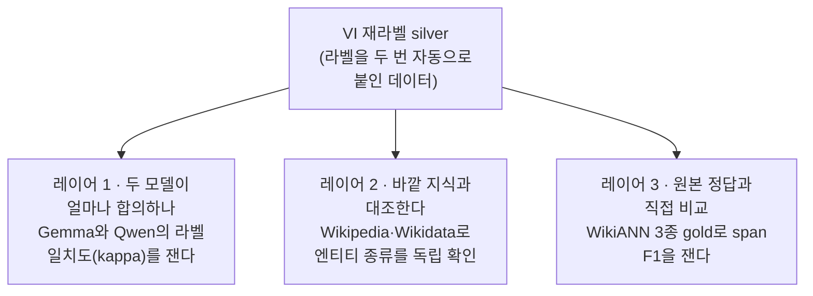
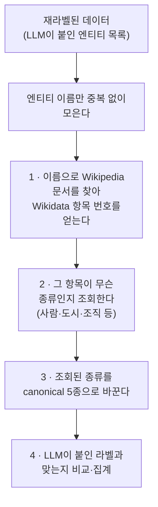
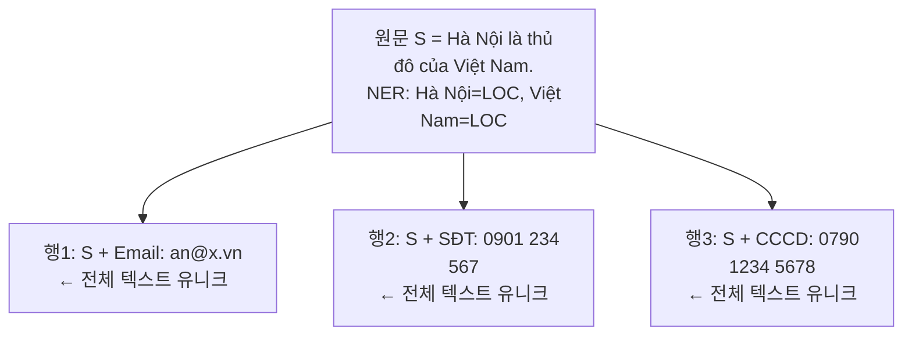
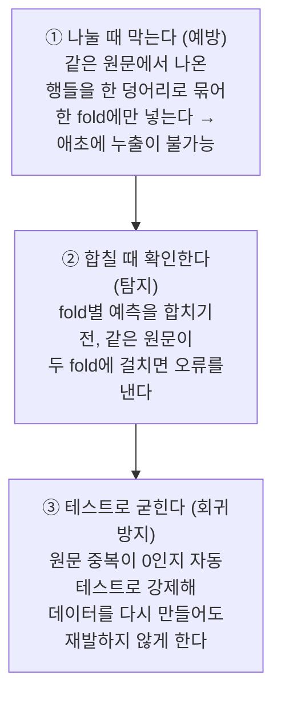

# 3. 검증 — silver 품질 · 측정 무결성

> **이 단계가 하는 일**: 데이터를 **바꾸지 않고** 품질과 측정의 무결성을
> 독립적으로 검증한다. 세 갈래다 — (3A) VI silver 품질, (3B) 분류 평가의
> cross-fold 누출, (3C) PII 주입 교차검증.
> **대상 코드**: `augmenters/wikiann_vi/{kappa,wikidata_anchor,
> merge_confidence}`, `llm_eval/{vi_silver_quality,wikiann_vi_gold}`,
> `classifier/kfold_pool` + `data_utils.split_kfold_stratified`,
> `augmenters/pii/verifier`

핵심 원칙 — **검증은 라벨을 바꾸지 않는다.** 통계와 불일치 샘플을 리포트로
남길 뿐 원본 JSONL은 불변이다(증강 단계의 merge/gold-fix와 직교).

| 갈래 | 대상 | 언어 | 산출 |
|---|---|---|---|
| 3A silver 품질 | 재라벨 silver | VI | kappa·anchor agreement·gold span F1 |
| 3B 측정 무결성 | 분류 K-fold 평가 | VI(JA 적용 가능) | cross-fold 누출 0 보장 |
| 3C PII 주입 | 주입 span | JA·VI | confirmed/missed/conflict |

## 목차

1. [3A. VI silver 품질 — 3중 검증 레이어](#3a-vi-silver-품질--3중-검증-레이어)
2. [3B. 측정 무결성 — cross-fold 누출 차단](#3b-측정-무결성--cross-fold-누출-차단)
3. [3C. PII 주입 교차검증](#3c-pii-주입-교차검증)

---

## 3A. VI silver 품질 — 3중 검증 레이어

VI 재라벨 silver(단계 2B)는 **이중 silver**라 절대 F1이 무의미하다. 대신
세 독립 레이어로 신뢰도를 본다.



### 레이어 1 — Cross-model agreement (kappa)

Gemma·Qwen 두 LLM이 독립 라벨링한 결과로 Cohen kappa + per-type 합의율을
계산한다(`kappa.py`). 두 모델이 같은 판단을 내릴수록 라벨이 모델
파라미터의 우연이 아니라 신호임을 시사한다. 이 합의 구조가 단계 2B의
`merge_confidence` 4 카테고리(high/medium_recall/medium_prec/conflict)의
근거이기도 하다.

### 레이어 2 — Wikidata anchor

LLM이 붙인 라벨이 외부 지식 베이스(Wikipedia·Wikidata) 기준과 얼마나
정합한지 **사후(post-hoc) 검증**한다. LLM과 무관한 두 번째 증거를 만들기
위해 Wikipedia 페이지 → Wikidata Q-ID → P31(`instance of`)로 엔티티의
"종류"를 역추정한다.

- 소스: `augmenters/wikiann_vi/wikidata_anchor.py`
- 실행: `python -m ner.augmenters.wikiann_vi.wikidata_anchor`
- 리포트: `docs/reports/vietnamese-ner-silver-quality.md` §5

#### 파이프라인



| 단계 | 함수 | 엔드포인트/테이블 | 비고 |
|---|---|---|---|
| 1 | `fetch_qids(titles)` | `vi.wikipedia.org` pageprops | 배치 50, 0.2s sleep, 리다이렉트 `_resolve_title` 역추적 |
| 2 | `fetch_p31(qids)` | `wikidata.org` wbgetentities | `claims.P31[*].mainsnak.datavalue.value.id` |
| 3 | `anchor_type(p31)` | `WIKIDATA_TO_CANONICAL`(약 163 Q-ID) | P31 순차 스캔 첫 매칭 |
| 4 | `run_anchor(...)` | — | match/mismatch, per-type agreement |

#### 중요한 구분 — 타입 Q-ID만 큐레이션

수작업 매핑 테이블은 **엔티티 Q-ID가 아니라 "타입" Q-ID(P31 값)** 목록이다.

| 구분 | 예 | 테이블에 넣는가 |
|---|---|---|
| 엔티티 Q-ID | `Q1858`(Hà Nội), `Q8447`(Hồ Chí Minh) | ❌ |
| 타입 Q-ID(P31 값) | `Q515`(city), `Q5`(human), `Q43229`(organization) | ✅ 5종 매핑 |

데이터에 새 지명이 등장해도 그 P31(예: `Q515` city)이 테이블에 있으면
자동으로 `LOC`로 앵커링된다 — 테이블 확장은 **새 *타입*이 등장했을 때만**.
섹션 헤더(`# FAC`/`# CORP`/`# POL`)는 가독성용이며 매핑 값은 모두 5종
(`FAC/CORP/POL → ORG`, 시설은 LOC가 아닌 ORG).

#### 캐시

- 캐시: `data/wikiann_vi/wikidata_cache.json`,
  스키마 `{'qid': {표면형: Q-ID}, 'p31': {Q-ID: [P31,...]}}`
- 캐시에 없는 항목만 네트워크 호출. 매핑 테이블(3단계)은 코드 내장이라
  **테이블만 확장해 재실행하면 네트워크 재호출 없이 분 단위 재집계** 가능.

#### 한계

1. **커버리지 ~50%** — Wikipedia 미등재 개별 인물/세부 지명/제품은 검증
   불가. "앵커 일치율"은 매핑 가능 부분집합의 지표.
2. **수작업 테이블** — 누락 타입이 체계적 에러를 만들 수 있다.
3. **리다이렉트 왜곡** — 노래→가수 리다이렉트로 엉뚱한 Q-ID(PER) 할당 등.
4. **P31 복수 해석** — 첫 매칭 규칙이라 city/former country 같은 모호
   케이스는 스캔 순서에 좌우된다.
5. **네트워크 의존** — 신규 실행은 수 분, 실패는 `reason='network'` 소프트
   폴백.

상세 설정 상수·실행 예·표준출력 포맷은 §3A 코드(`wikidata_anchor.py`)와
리포트 §5 참조.

### 레이어 3 — WikiANN gold 직접 비교

silver의 PER/LOC/ORG만 필터링해 WikiANN 3종 gold와 span F1을 본다
(`llm_eval/vi_silver_quality.py`, `wikiann_vi_gold.py`). 5종 중 원천에서
검증 가능한 3종에 대한 하한 신호다. 평가 대상 span은
`SILVER_SPAN_KEYS = ('gold_spans_relabel_merged', 'gold_spans_relabel')`
우선순위로 고른다 — merge 결과가 있으면 그것을, 없으면 단독 재라벨을 본다.

---

## 3B. 측정 무결성 — cross-fold 누출 차단

분류(단계 4) K-fold 평가에서 **원문 cross-fold 누출**(같은 원문 문장이
train·test fold에 동시에 걸려 모델이 일반화 대신 암기로 점수를 올리는
현상)을 구조적으로 차단한다.

- 근본 코드: `classifier/data_utils.py`(`split_kfold_stratified(group_key=)`),
  `classifier/kfold_pool.py`(원문 가드), `classifier/__main__.py`(`--group-key`)
- 영구 아카이브: `docs/issues/issue-124-vi-ner-crossfold-leak.md`
- 정량 출처: `docs/reports/vietnamese-bert-classifier-{benchmark,history}.md`

용어 — **cross-fold 누출**: test fold 정보가 학습에 새어 점수가 낙관적으로
부풀려지는 결함. **group K-fold**: 같은 그룹(여기선 원문) 파생 샘플을 통째로
한 fold에 배정해 그룹이 분할선을 못 넘게 하는 방식. **pooled micro span
F1**: fold별 F1 평균이 아니라 전체 fold의 test를 한 코퍼스로 합쳐 char-offset
span 단위로 계산한 micro-average.

### 왜 이 구조에서 누출이 생기나

합성 PII 주입은 **한 원문에서 여러 행을 파생**시킨다(같은 문장 + 행마다
다른 PII). NER 라벨은 원문에서 그대로 오므로 파생 행들은 NER span을
공유한다.



행 단위 분할이면 행1→train, 행3→test로 흩어져 모델이 train에서 S의 NER
라벨을 암기 → test에서 재현 → F1 부풀림.

> **full-text dedup의 맹점**: 꼬리 PII가 달라 행들이 "서로 다른 문자열"이라
> dedup이 1개도 못 지운다. 'cross-split 중복 0' 재검증도 *주입 텍스트*
> 기준이라 통과해버린다 — **파생 텍스트로 dedup하면 원천 누출을 가린다.**

### 측정 설계 — 변수 1개만 교체

코퍼스를 고정하고 **분할만** leaked(행 단위) ↔ grouped(원문 group-kfold)로
바꿔 누출 효과만 단독 분리한다(dedup+재학습은 누출 제거와 데이터 손실을
함께 바꿔 교란).

```
[leaked] 행 단위 round-robin (group_key=None)
  행1→fold0(train)  행2→fold2(train)  행3→fold3(TEST)   ❌ S가 train·test 양쪽
[grouped] 원문 group-kfold (group_key='orig')
  {행1,행2,행3} ───► fold3 (TEST 전용)                  ✅ train에 S 없음
```

### 3중 차단

예방(split)·탐지(pooling)·회귀(pytest)가 직교하게 겹쳐 막는다.



- **BC**: `group_key=None`이면 unit=행 1개라 기존 행 단위 분할과 bit-for-bit
  동일. 다만 `--group-key`는 **필수**이며, 행 단위를 원하면 `none`을 명시해야
  한다 — 미측정 분할이 깨끗한 분할로 읽히면 안 된다.
- 층화(PROD/EVT 보유)·라운드로빈·결정성은 행 단위와 동일하되, 층화 기준은
  unit 안 strat_labels의 **합집합**.
- **고유한 필드는 그룹 키가 될 수 없다.** 값이 전부 다르면 unit이 전부
  싱글턴이라 그룹 보호가 no-op이 되는데, 같은 필드로 누출을 세면 중복이 0이라
  "누출 없음"으로 잘못 읽힌다. `validate_group_key`가 선언된 키보다 행을 더
  강하게 묶는 후보 필드를 찾아 이를 거부한다.
- **`id`의 뜻은 데이터셋마다 다르다.** KO는 KLUE 원본 인덱스(전부 고유,
  형제 없음), VI는 행 일련번호(전부 고유, 형제는 `orig`가 묶음), JA는 한 원문
  파생 다행이 공유(5,270행 / 고유 5,166 → **형제를 묶는 유일한 필드**). 따라서
  그룹 키는 코드가 못 박을 수 없고 데이터가 선언해야 한다.
- `text` 전체 문장 중복 fallback은 **신뢰 근거가 아니다.** PII 주입이 문장을
  재작성하는 코퍼스(KO·VI)에서는 형제끼리 글자가 전부 달라 하나도 못 잡는다.
  `pooled_metrics.json`의 `leak_check_basis`가 판정 근거(`group`/`orig`/`text`/
  `none`)를 남기고, `validity`는 `text`·`none`을 미검증으로 취급한다.

### 정량 결과 (영구 인용)

자연 코퍼스 37,706행 **고정**, 분할만 leaked(행 단위 stratified 5-fold) ↔
grouped(원문 group-kfold). 둘 다 전수 1회 test, pooled micro char-offset
span F1.

| 모델 | overall | NER 5종 micro | PII 5종 micro |
|---|---:|---:|---:|
| phobert leaked → grouped | 0.9506 → 0.9437 (**+0.69**) | 0.9198 → 0.9086 (**+1.12**) | 0.9985 → 0.9983 (+0.02) |
| xlm-r leaked → grouped | 0.9517 → 0.9430 (**+0.87**) | 0.9226 → 0.9083 (**+1.43**) | 0.9972 → 0.9974 (−0.02) |

per-entity strict F1 (leaked → grouped, 인플레 pp):

| ent | phobert (Δpp) | xlm-r (Δpp) | support |
|---|---|---|---:|
| EVT | 0.8372 → 0.7973 (**+3.98**) | 0.8242 → 0.7713 (**+5.29**) | 559 |
| ORG | 0.8882 → 0.8647 (**+2.35**) | 0.8901 → 0.8557 (**+3.44**) | 8,033 |
| PROD | 0.7362 → 0.7076 (**+2.86**) | 0.7116 → 0.6811 (**+3.05**) | 2,314 |
| PER | 0.9235 → 0.9145 (+0.90) | 0.9382 → 0.9254 (+1.28) | 21,848 |
| LOC | 0.9506 → 0.9443 (+0.63) | 0.9457 → 0.9394 (+0.63) | 22,141 |
| PII 5종 | 0.998~1.000 (±0.05) | 0.997~1.000 (±0.06) | ~35,500 |

해석
- **NER 5종 절대값 인플레 확정**: micro +1.1~1.4pp, 저support·고난도
  엔티티(EVT/ORG/PROD)에 집중. 암기는 희소·어려운 엔티티에서 가장 크게
  작동한다.
- **PII 5종 불변(±0.05pp)** — 행별 랜덤값이라 train·test 값 비중복(누출 0
  주장 검증).
- **가드 실측**: grouped `cross_fold_orig_dups=0`, leaked=6,973.

출처: `results/classifier/vi/leak_audit/{leaked,grouped}/<model>/fold{0..4}`
+ `pooled_metrics.json` + `leak_inflation_summary.json`(results는 gitignore
이므로 위 표가 영구 인용 출처).

### 재현

```bash
# 누출-free group-kfold
for fold in 0 1 2 3 4; do
  python -m ner.classifier --lang vi \
    --data-jsonl results/.../pii_all.jsonl \
    --kfold 5 --fold-index ${fold} --group-key orig \
    --output-dir results/.../grouped/<model>/fold${fold}
done
# pooled 평가 — 원문 cross-fold 누출 있으면 ValueError
python -m ner.classifier.kfold_pool \
  --fold-dirs results/.../grouped/<model>/fold{0,1,2,3,4} \
  --output results/.../grouped/<model>/pooled_metrics.json
# 누출 baseline을 일부러 잴 때만: --group-key 생략 + kfold_pool --allow-cross-fold-leak
```

### 교훈 (일반화)

- **분할은 "불변 키"(원문 그룹) 단위로** — 증상(겉보기 중복)이 아니라 누출
  단위 자체를 분할 단위로 삼아야 구조적으로 막힌다.
- **측정은 변수 1개만** — 코퍼스 고정·분할만 교체해야 인플레를 누출 단독에
  귀속할 수 있다.
- **이중 가드 + 회귀 테스트** — split 차단(예방)과 pooling 검증(탐지)은
  직교. 둘 다 pytest로 박아야 reshape마다 재발하지 않는다.

---

## 3C. PII 주입 교차검증

단계 2A의 주입 출력을 독립 LLM(`PIIVerifier`)으로 재라벨해 각 span을
**confirmed / missed / conflict**로 분류하고 정책(`drop_span`/`drop_record`/
`keep_all`)으로 솎아낸다. 검증기는 `label_spans(split=False)`로 호출해
문맥을 보존한다. 정책 표·생략 조건은 [2. 증강 §2A](2-augmentation.md#2a-합성-pii-주입-공통).

> KO는 자연 주입 `extract_spans`가 오프셋을 정확 산출하므로 verify를
> 생략하고 사람 gold를 보존한다(검증 불필요가 정당한 유일 경로).

---

**다음 단계** → [4. 분류](4-classification.md): 검증을 통과한 canonical
10종 평면 코퍼스로 BERT를 파인튜닝하고 char-offset span F1로 평가한다.
