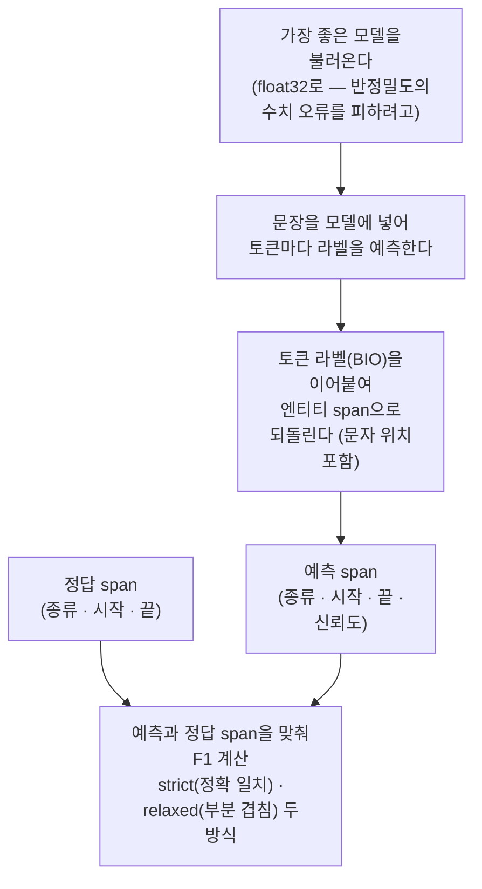

# 4. 분류 — canonical 10종 평면 BERT 파인튜닝

> **이 단계가 하는 일**: 증강·검증을 통과한 canonical 10종 평면 JSONL로
> BERT 토큰 분류기를 파인튜닝하고 char-offset span F1로 평가한다.
> **대상 코드**: `src/ner/classifier/`
> **산출**: `results/classifier/{ja,vi}/`(best 모델 + `metrics.json` +
> `thresholds.json`)

### 책임 경계

- **포함**: 데이터 로딩(JSONL contract 소비) / wordpiece 정렬·BIO 변환 /
  HF Trainer 래퍼 / span 디코드 / 메트릭 산출 / 신뢰도 임계값 / 오류 분석
- **제외**: 데이터 증강, 라벨러, 평가용 LLM 백엔드, HF Hub 업로드, 추론
  서빙(서빙은 `src/server/`)
- **결합도**: 얕음 — augmenters와 import 결합 없이 파일(JSONL)만 소비.
  `src/ner/metrics`만 공용 import(단계 1 라벨러와 동일 함수).

### 전체 흐름

입력 JSONL이 토크나이즈·분할·학습·평가를 거쳐 배포 산출물이 된다(각 노드의
괄호가 상세 섹션).


## 목차

1. [입력 계약·라벨 셋](#1-입력-계약라벨-셋)
2. [토크나이저 3-way 분기 (JA/VI 핵심)](#2-토크나이저-3-way-분기-javi-핵심)
3. [데이터 분할](#3-데이터-분할)
4. [학습](#4-학습)
5. [평가](#5-평가)
6. [신뢰도 임계값 운영점](#6-신뢰도-임계값-운영점)
7. [오류 분석·K-fold pooling](#7-오류-분석k-fold-pooling)
8. [산출물·배포](#8-산출물배포)
9. [JA/VI 분기 요약](#9-javi-분기-요약)
10. [CLI·테스트](#10-cli테스트)

---

## 1. 입력 계약·라벨 셋

augmenters/pii·augmenters/wikiann_vi 출력(단계 2)을 그대로 소비한다.

```jsonl
{"text": "...",
 "entities": [{"label":"PER","start_char":0,"end_char":3,"text":"..."}],
 "id": "..."}
```

- `label` ∈ canonical 10종, `start_char`/`end_char`는 반-개구간 `[start,end)`
- `data_utils.load_jsonl`이 라벨이 canonical 10종 안에 있는지 검증, 위반 시
  `ValueError`

### 라벨 셋 — BIO 21-class

`build_label_maps()`가 canonical 10종을 BIO로 펼친다: `O` + 10×`B-` +
10×`I-` = **21 labels**.

```
O
B-PER  I-PER    B-LOC I-LOC    B-ORG I-ORG    B-PROD I-PROD  B-EVT I-EVT
B-DAT  I-DAT    B-EMAIL I-EMAIL  B-PHONE I-PHONE  B-ID_NUM I-ID_NUM
B-CREDIT_CARD I-CREDIT_CARD
```

단일 출처: `docs/manual/data/canonical-entity-schema.md`.

---

## 2. 토크나이저 3-way 분기 (JA/VI 핵심)

**JA·VI가 갈리는 핵심 지점.** slow tokenizer는 `offset_mapping`을 지원하지
않아 char-span을 수동 정렬해야 한다. `encode_row`(`data_utils.py`)가
토크나이저 capability로 분기한다:

```python
if getattr(tokenizer, 'is_fast', False):
    enc, offs = _encode_vi(...)        # fast 경로 (lang 무관)
elif _is_phobert(tokenizer):
    enc, offs = _encode_phobert(...)   # PhoBERT 전용
else:
    enc, offs = _encode_ja(...)        # JA slow (BertJapanese)
```

| 분기 | 조건 | 모델 예 | 정렬 방식 | 의존성 |
|---|---|---|---|---|
| **fast** | `tokenizer.is_fast` | XLM-R, mmBERT, DeBERTa-V3 | `return_offsets_mapping=True` + `_trim_offset` | — |
| **PhoBERT** | `_is_phobert` | vinai/phobert | pyvi 단어분절 → 단어별 BPE, 단어 char-span | `pyvi` |
| **JA slow** | 그 외 slow | tohoku-nlp/bert-base-japanese-v3 | `tokenize()` → `text.find()` greedy, `##` strip | `fugashi`+`unidic-lite` |

### fast 경로 — offset trim (`_trim_offset`)

SentencePiece 계열이 char-offset을 어긋나게 하는 두 경우를 교정한다:

1. DeBERTa-V3는 `▁` 토큰 offset에 **선행 공백**을 포함시켜 entity 첫 토큰
   start가 1 작아진다.
2. 다국어 SentencePiece는 숫자형 entity 끝과 문장부호를 한 토큰으로
   병합한다(`'568.'` → 끝이 경계 초과).

선행 공백 + 후행 `.`/`,`(`_TRAIL_PUNCT`)를 trim하면 토크나이저 무관하게
정렬되고, 이미 분리하는 XLM-R 계열엔 사실상 no-op이다. `)`·`:` 등은 entity에
정당히 포함될 수 있어 trim 대상에서 제외. `--legacy-no-offset-trim`으로 끌
수 있다(진단·구 동작 재현).

### BIO 라벨 부여 (`_bio_labels_from_offsets`)

토큰 span `[s,e)`가 entity span `[es,ee)`에 **완전히 포함**되면 그 entity
라벨 부여, 직전 토큰이 동일 entity면 `I-`, 아니면 `B-`. `(s,e)=(0,0)`
특수토큰은 `-100`(loss ignore).

> DeBERTa-V3는 정렬은 정상이나 표준 레시피 학습 실패로 벤치 제외(리포트
> 참조). 실제 토크나이저 round-trip 검증은 `tests/.../test_encode.py`.

---

## 3. 데이터 분할

`data_utils.py`가 네 분할 전략을 제공한다.

| 함수 | 용도 | 비고 |
|---|---|---|
| `split_train_valid_test` | 기본 3-way(80/10/10) | unit shuffle 후 test/valid/train |
| `split_kfold_stratified` | 층화 K-fold 교차검증 | PROD/EVT 보유로 층화 |
| `split_holdout_deploy` | 배포용 단일 분할 | n_test 홀드아웃 + 적격 필터 |
| `validate_group_key` | 그룹 키 사전 검증 | 고유 키·필드 부재·null 거부 (학습 전) |

셋 다 `group_key`로 형제 행(한 원문 파생 다행)을 한 split에 묶는다.
`_build_units`가 공용 unit 구성을 담당한다.

### 3-way 기본 분할

unit shuffle → 앞 test, 다음 valid, 나머지 train. 같은 seed면 결정적. 기본
`valid_ratio=0.1, test_ratio=0.1, seed=42`. test는 학습/모델선택 어디에도
노출되지 않고 최종 span F1 측정에만 쓴다(valid는 epoch best 선택용).
`group_key=None`이면 unit=행 1개라 기존 행 단위 분할과 bit-for-bit 동일.

### 층화 K-fold (`--kfold N --fold-index K`)

PROD/EVT 보유 여부로 층화해 N개 fold에 라운드로빈 배정. test=fold K,
valid=fold (K+1)%N, train=나머지. `fold_index`를 0..N-1로 돌리면 모든 행이
정확히 한 번 test에 등장. `N≥3` 필수. fold 모드는 test 예측을
`test_predictions.json`으로 저장 → `kfold_pool` 입력. `--no-stratify`로
층화를 꺼서 label-invariant 분할(층화 효과 before/after 비교용)을 만들 수
있다.

### 누출-free 분할 (`--group-key`, 필수)

합성 PII 주입과 재라벨은 한 원문에서 여러 행을 파생시킨다(형제 행). 행 단위
분할은 형제가 train·test로 갈려 누출이 생긴다. `--group-key <필드>`는 같은
값을 공유하는 행을 한 **unit**으로 묶어 통째로 한 split에 배정 → split
단계에서 누출이 구조적으로 불가능. **3-way·K-fold 두 경로 모두 적용된다.**

`--group-key`는 필수이며, 형제가 없으면 `none`을 명시한다. 그룹 키의 이름은
데이터셋마다 다르다(KO `id`·VI `orig`·JA `id`) — 코드가 못 박을 수 없다.
고유한 필드를 선언하면 그룹 보호가 no-op이 되면서 누출 카운터는 0을 내므로,
`validate_group_key`가 학습 전에 거부한다(더 강하게 묶는 후보 필드 탐지).

`none`이면 누출 카운터는 `0`이 아니라 `null`(미측정)로 기록되고,
`metrics.variance.compare`는 이를 `INVALID`로 판정한다. 발견·정량·가드
상세는 [3. 검증 §3B](3-verification.md#3b-측정-무결성--cross-fold-누출-차단).

> **BC**: `group_key=None`(기본)이면 unit=행 1개라 기존 행 단위 분할과
> bit-for-bit 동일(같은 seed → 동일 결과).

### 배포용 홀드아웃 (`split_holdout_deploy`)

한 모델을 만들어 고정 test로 최종 점검하는 배포 시나리오용(K-fold는 교차검증
추정). `test_require_types`(예: canonical 전체 → 빈 샘플 제외)·
`test_min_context_words`(엔티티+1~2단어 단편 제외)로 test 적격을 거른다.
`group_key`로 원문 누출도 차단.

> 현재 `split_holdout_deploy`는 **라이브러리 함수**다 — `python -m
> ner.classifier` CLI에는 연결돼 있지 않고(테스트·외부 호출용), 본 학습 CLI는
> `split_train_valid_test`·`split_kfold_stratified`를 쓴다.

---

## 4. 학습

`train_eval.fine_tune()` — HF `Trainer` 래퍼. best 모델을 `output_dir/best`에
저장(선택 기준 valid `eval_loss`, 낮을수록 좋음).

```python
elapsed, best_dir = fine_tune(
    model_name=..., train_features=..., eval_features=...,
    label2id=..., id2label=..., output_dir=...,
    epochs=5, batch_size=16, lr=5e-5,
    class_weights=None, init_model_path=None,
    precision='fp16', train_seed=None,
)
```

주요 `TrainingArguments`: `eval_strategy='epoch'`, `save_strategy='epoch'`,
`load_best_model_at_end=True`, `metric_for_best_model='eval_loss'`,
`save_total_limit=1`.

### WeightedTrainer — class-weighted CE

`WeightedTrainer`(Trainer 서브클래스)가 class-weighted cross-entropy를
적용한다(`class_weights=None`이면 표준 CE와 동일). `boundary_weights_tensor`로
`B-`/`I-`/`O` 토큰별 weight를 줘 entity 경계 학습을 강조할 수 있고, CLI
`--boundary-b-weight`/`--boundary-i-weight`로 노출된다(미지정 시 1.0 = 표준
CE).

### NER warmup curriculum

`mask_pii_in_features`가 features의 PII BIO 라벨을 모두 `O`로 치환한 새
리스트를 만든다(원본 불변, `-100` 보존). 1단계에서 NER만 학습 → 2단계에서
`init_model_path`로 이어 PII 포함 전체 학습하는 curriculum용. CLI
`--curriculum --curriculum-stage1-epochs N`으로 기동한다.

### 재현성·정밀도

- `train_seed`(기본 `None`): `None`이면 헤드 init을 시드하지 않는 기존
  동작(BC). 값을 주면 모델 생성 *전에* `set_seed`로 헤드 init·dropout·셔플을
  고정해 재현 가능한 run. `from_pretrained`의 새 분류 헤드 random init이
  Trainer 내부 `set_seed`보다 먼저 일어나므로 여기서 시드해야 헤드까지 제어.
- GPU FP 비결합에 따른 seed-내 잔여 비결정성(loss ~1e-4)은 effect size 대비
  무시 가능 — 비교는 양 팔을 같은 `train_seed`로 고정하거나 multi-seed
  paired로 본다.
- `precision`: `fp16`(기본) / `bf16`(DeBERTa 계열 권장). 학습 설정·
  `train_seed`·`precision`은 `metrics.json`에 기록.

### fold 붕괴 (희귀·분할의존)

10-fold 일부 분할에서 koelectra가 드물게(~0.3~3%) 학습 붕괴(F1≈0). 검증된
근본 수정은 없고, F1≈0 fold만 `train_seed`를 바꿔 재실행한다(full-determinism은
붕괴를 막지 못하고 재현만 하며 ~1.9× 비용이라 비채택). 상세:
`docs/reports/korean-bert-classifier-fold-collapse.md`.

---

## 5. 평가

`train_eval.evaluate_model()` — best 모델 로드 → predict → BIO decode →
strict + relaxed span F1.



| 메트릭 | 매칭 | 비고 |
|---|---|---|
| **strict** | `(start, end, type)` 정확 일치 | 게이트 측정 default |
| **relaxed** | type 일치 + char-offset overlap 시 0.5점 | SemEval'13 Partial |

- 주 메트릭은 **char-offset span F1**(`metrics.span_metrics`) — **단계 1
  LLM 라벨러와 동일 함수**라 LLM·BERT 결과를 직접 비교 가능.
- per-entity: 10종 각각 micro-F1·precision·recall·support.
- `return_spans=True`면 `gold_spans_list`/`pred_spans_list` 추가(kfold
  pooled 평가용), `capture_timing=True`면 load/infer 초.
- 실험 간 per-entity F1 변화가 노이즈인지 실측인지는 `metrics.variance`로
  판정한다 — 재학습 없이 기존 `fold*/metrics.json`·`pooled_metrics.json`만
  읽는다. 세 축: **같은 자**(비교 가능성)·**누출**·**노이즈 밴드**.
- **같은 자(비교 가능성)**: `RULER = (lang, data_fingerprint, kfold,
  group_key, seed, stratify)`. `data_fingerprint`는 데이터 내용의 순서 민감
  해시라 **경로가 아니라 test gold 정체성**을 비교한다 — 경로가 같아도 gold 를
  고치면 지문이 달라 비교 거부(INVALID), 경로만 rename 하면 통과. 지문 없는 옛
  산출물은 fail-loud INVALID. gold 를 바꾼 뒤 옛 값과 비교하려면 **옛 모델을
  새 gold 로 재채점**해 같은 지문의 baseline 을 만든다. seed·stratify 는 fold
  멤버십을 정하므로 자에 포함(paired 비교의 전제).
- **누출**: pooled 의 그룹 단위 cross-fold 카운터가 신뢰 근거(`leak_check_basis`
  ∈ group·orig)로 센 0 일 때만 통과. 미측정·약한 근거는 INVALID, 관측된 누출은
  근거가 약해도 FAIL(§3B).
- **노이즈 밴드**: 점추정 = pooled per-entity F1 Δ(리포트 헤드라인과 일치),
  밴드 = band_k × σ. σ 는 σ_repro override 있으면 그것, 없으면 σ_fold(fold 간
  표준편차). Δ 가 밴드 밖이면 magnitude gain/regression. 타깃이 올라도 다른
  엔티티가 밴드 밖 회귀면 FAIL.
- **방향 일관성 게이트(조이기 전용)**: magnitude gain 이라도 후보가 fold 승률
  2/3 미만이면 한 fold 가 pooled 를 끌어올린 것으로 보고 INCONCLUSIVE 로 내린다.
  gain 을 내릴 뿐 절대 올리지 않고 regression 은 안 건드려 false PASS 를 못
  만든다. paired-SEM 밴드로 좁히지 않는 이유: SEM 은 fold 별 Δ 가 일정하면 0 으로
  붕괴하고, k-fold Δ 는 iid 가 아니라 분산을 과소추정해 anticonservative 하다 —
  넓은 σ_fold 는 노이즈 게이트에겐 안전한 방향이다.
- **σ_repro 는 수요기반**으로만 측정한다 — 판정이 `INCONCLUSIVE`이고 그 후보를
  **실제로 채택**할 때만 GPU 를 쓴다. cheap-first: 대표 fold 하나를 시드 M회
  (`--train-seed`) 재학습해 학습 노이즈부터 잡고, 부족할 때 전체로 올린다.
  측정한 σ_repro 는 `variance repro --out` 로 setup 당 한 번 캐시하고 이후
  `compare --sigma-repro <cache>` 로 재사용한다.

### decode_bio_to_spans

BIO id 시퀀스 + char offsets → `{type,start,end}` span. 동일 char span 반복은
`max(end)`로 병합. `B-` 누락된 `I-`는 새 span 시작으로 관용 처리. `confs`를
주면 각 span에 `score`(구성 토큰 신뢰도 평균 conf_mean)를 부착(임계값 fit/apply용,
미입력 시 score 키 없음 → BC).

---

## 6. 신뢰도 임계값 운영점

`--fit-threshold`: 학습 후 valid에서 NER 4종(ORG/LOC/EVT/PROD) **클래스별
신뢰도 임계값**을 greedy(overall P·R≥`--threshold-target`, 기본 0.93)로 찾아
`thresholds.json`에 저장하고 test에 적용한 운영점을 `metrics.json`의
`confidence_threshold` 블록에 기록한다. **opt-in·default OFF** — 미지정 시
기존 동작과 완전 동일(BC), `overall`/`overall_strict`는 항상 임계값 미적용
baseline으로 보존.

- 신뢰도 = span 토큰 max-softmax 평균(conf_mean). 저신뢰 예측이 FP에
  편중돼 있어 임계값으로 그 꼬리를 잘라 리콜 여유를 정밀도로 바꾼다.
- **모델 개선이 아니라 운영점** — baseline F1 천장은 불변. 임계값은 모델
  종속이라 재학습 시 반드시 재-fit(하드코딩 금지).
- 코드: `confidence_threshold.py`(`fit_thresholds` greedy / `apply_thresholds`
  / `save_thresholds`·`load_thresholds`).

```bash
python -m ner.classifier --lang ja --fit-threshold
python -m ner.classifier --lang ja --confidence-thresholds path/to/thresholds.json
```

`--data-extra-train-jsonl PATH`는 별 JSONL을 train split에만 합치고
valid/test는 `--data` 원본 split 유지(oversampling 보강 시 leak 방지, BC).

---

## 7. 오류 분석·K-fold pooling

### error_analysis.py

test-set 오답을 추출해 **BOUNDARY / TYPE_MISMATCH / MISS / HALLUCINATION**로
분류하고 사람 검수용 stratified 샘플을 뽑는다. 두 입력 경로: (1) 단일 모델
추론(`--model-path`), (2) K-fold pooled 예측 재진단(`--from-predictions
--fold-dirs ...`, 재추론 없이 fold별 `test_predictions.json` 소비).

```bash
python -m ner.classifier.error_analysis --model-path results/classifier/ja/best ...
```

### kfold_pool.py

fold별 test 예측을 합쳐 **pooled span F1**을 산출하고 원문(`orig`) 단위
cross-fold 누출을 사후 검증한다(누출 시 `ValueError`, `--allow-cross-fold-leak`로
카운트만). 누출 가드 상세는 [3. 검증 §3B](3-verification.md#3b-측정-무결성--cross-fold-누출-차단).

```bash
python -m ner.classifier.kfold_pool \
    --fold-dirs results/classifier/ja_sweep/<실험>/fold{0..9}
```

---

## 8. 산출물·배포

```
results/classifier/{ja,vi,ko}/
├── best/            # best 체크포인트 (HF model dir)
├── checkpoint-*/    # 중간 (save_total_limit=1)
├── metrics.json     # 학습 설정 + overall/per-entity strict·relaxed F1
│                    #   (+--fit-threshold 시 confidence_threshold 블록)
└── thresholds.json  # --fit-threshold 시 per-class 임계값 + meta
```

### JA 출하 (deploy)

학습은 CLI(`python -m ner.classifier`)에 흡수하고 배포 추론만 분리한다
(별도 `train_*` 스크립트 없음).

| 아티팩트 | 위치 | 역할 |
|---|---|---|
| 배포 추론 | `src/ner/scripts/eval_ja_ner_test.py`(`.sh`=uv 래퍼) | 학습 없이 고정 test + 저장 `thresholds.json`으로 추론·태깅·P/R/F1. 절대경로만. 기본 레이아웃 `/data/ner/ja/{model,data/test.jsonl,thresholds.json}` |
| 출하 번들 | `data/stockmark/ja_ner_prod_seed1/` | `model/` + `data/{train,valid,test}.jsonl` + `metrics.json` + `thresholds.json` + `MODEL_CARD.md` |
| 출하 스펙 | `docs/reports/japanese-bert-classifier-spec.md` | 모델·데이터·엔티티·평가지표 단일 출처(10-fold pooled 0.9361 / raw 0.9273) |

> 배포 추론은 "책임 경계 제외(추론 서빙)"와 직교 — `scripts/`의 독립 도구로
> classifier 패키지를 import만 한다(패키지에 서빙 코드 없음). 상시 REST
> 서빙은 `src/server/`(본 단계 범위 밖).

---

## 9. JA/VI 분기 요약

| 항목 | JA | VI |
|---|---|---|
| 기본 모델 | `tohoku-nlp/bert-base-japanese-v3` | `xlm-roberta-base` |
| 토크나이저 | slow(BertJapanese, MeCab) → `_encode_ja` | fast(XLM-R) → `_encode_vi`; PhoBERT 시 `_encode_phobert` |
| 의존성 | `fugashi`+`unidic-lite` | (XLM-R 없음) / PhoBERT 시 `pyvi` |
| 기본 데이터 | `data/stockmark/pii_all.jsonl` | `data/wikiann_vi/origin.jsonl` |
| 누출-free | (원문 중복 적음) | `--group-key orig` 필수(WikiANN 원문 중복) |
| 출하 | 번들 + `eval_ja_ner_test.py` | `eval_vi_ner_test`(`/data/ner/vi`) |

KO는 `kakaobank/kf-deberta-base`(DeBERTa 계열, `--precision bf16` 권장),
`data/klue/pii_all.jsonl`.

---

## 10. CLI·테스트

```bash
# 본 학습
python -m ner.classifier --lang ja
python -m ner.classifier --lang vi --epochs 5 --batch-size 16
python -m ner.classifier --lang ko --precision bf16

# 스모크 (100/25/50, 1 epoch — CI·dev)
python -m ner.classifier --lang ja --smoke

# 모델·데이터 override
python -m ner.classifier --lang vi \
    --model-name vinai/phobert-base \
    --data data/wikiann_vi/origin.jsonl --max-length 256 --lr 5e-5

# 층화 K-fold (누출-free)
for fold in 0 1 2 3 4 5 6 7 8 9; do
  python -m ner.classifier --lang ja \
      --data data/stockmark/pii_all_phonediv.jsonl \
      --kfold 10 --fold-index ${fold} --group-key orig \
      --output-dir results/classifier/ja_sweep/<실험>/fold${fold}
done
python -m ner.classifier.kfold_pool \
    --fold-dirs results/classifier/ja_sweep/<실험>/fold{0..9}
```

기본값: `--valid-ratio 0.1 --test-ratio 0.1 --seed 42 --max-length 256
--epochs 5 --batch-size 16 --lr 5e-5`. 콘솔 출력 모드는 `--metric-mode
{strict,relaxed,both}`(기본 both) — `metrics.json`은 항상 양쪽 저장이라
영향은 콘솔 한정.

### 테스트

```bash
python -m pytest tests/ner/classifier/ -q
```

- `test_data_utils.py` — 라벨 맵 / BIO 정렬 / span 디코드 / split 결정성 /
  층화·group K-fold 무결성·BC / curriculum mask
- `test_encode.py` — 실제 토크나이저(JA·VI·DeBERTa-V3·PhoBERT) round-trip
- `test_error_analysis.py` — span 오류 분류·집계·검수 샘플링
- `test_kfold_pool.py` — pooled F1 손계산 일치 / cross-fold 누출 검출·카운트
- `test_confidence_threshold.py` — scored decode·apply·fit·save/load
- `test_boundary_weights.py` — `boundary_weights_tensor` B-/I-/O weight 산출

---

이전 단계 ← [3. 검증](3-verification.md) | 개요 ← [README](README.md)
