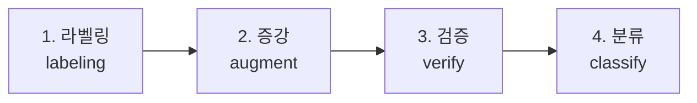
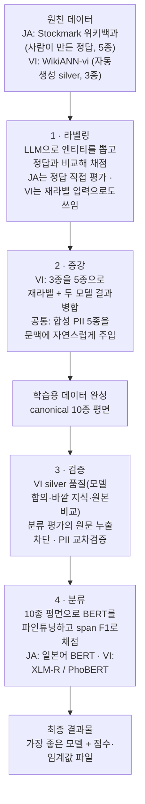
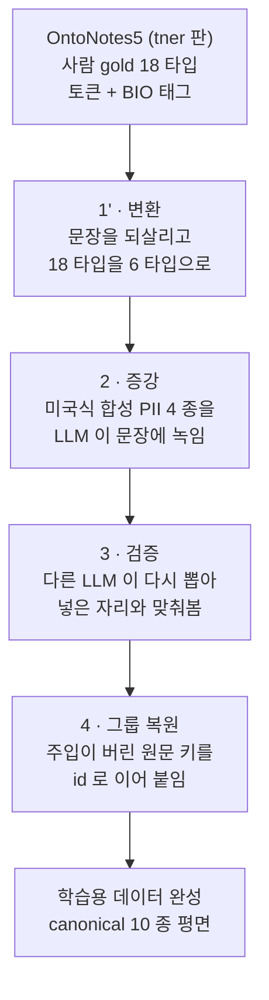

# NER 파이프라인의 단계별 구현 맵

일본어(JA)·베트남어(VI) NER 파이프라인을 **단계 축**으로 정리한 구현
맵이다. 파이프라인은 네 단계로 흐른다:



각 단계 문서는 **그 단계 안에서 JA/VI가 갈리는 지점**을 분기 섹션으로
다룬다. 한국어(KO)는 코드가 공유되는 지점에서만 비교용으로 언급한다(KO
전용 트랙 문서는 `docs/manual/data/korean-ner.md`).

- 엔티티 정의·경계 규칙·canonical 매핑의 **단일 출처**:
  `docs/manual/data/canonical-entity-schema.md`
- 서빙(REST API)은 본 단계 문서 범위 밖이다 — `docs/manual/server-implementation.md` 참조.

---

## 전체 흐름 (end-to-end)



핵심 관통 원리 — **char-offset span 이 단계 간 공통 통화(currency)**다.
라벨링·분류의 평가 메트릭이 동일 함수(`compute_offset_span_f1`)라 LLM
라벨러와 BERT 분류기 결과를 직접 비교할 수 있다(단계 1·4 공유).

---

## 단계 ↔ 코드 ↔ 언어 분기 매트릭스

| 단계 | 핵심 코드 | JA 분기 | VI 분기 | 문서 |
|---|---|---|---|---|
| **1 라벨링** | `labelers/{ja,vi}`, `labelers/span_matcher`(ja·vi·ko 공용), `llm_eval`, `metrics` | Stockmark gold | WikiANN, offset-span 경로 | [1-labeling.md](1-labeling.md) |
| **2 증강** | `augmenters/pii` | PII 주입만 | **재라벨 silver(도구 삭제) → PII 주입** | [2-augmentation.md](2-augmentation.md) |
| **3 검증** | `classifier/kfold_pool`, `pii/verifier` | PII 교차검증 | **PII 교차검증 + cross-fold 누출** | [3-verification.md](3-verification.md) |
| **4 분류** | `classifier/` | BertJapanese (slow) | XLM-R (fast) / PhoBERT (pyvi) | [4-classification.md](4-classification.md) |

**비대칭성** — 코퍼스를 만들 때 증강·검증은 VI 쪽이 무거웠다. VI는 원천 gold가
3종 silver뿐이라 5종 재라벨·이중 silver 검증이 필요했던 반면, JA는 5종 사람
gold라 재라벨·anchor 검증이 불필요했다. VI 재라벨·검증 도구는 코퍼스를 만든 뒤
지웠다. 단계 문서는 언어별로 쪼개지 않고 단계당 1개로 두되 분기 섹션으로
비대칭을 드러낸다.

---

## 공통 라벨 스키마

네 언어 공통으로 **canonical 10종 평면**을 목표 라벨 공간으로 쓴다.

```
NER 5종:  PER  LOC  ORG  PROD  EVT
PII 5종:  DAT  EMAIL  PHONE  ID_NUM  CREDIT_CARD
```

- BERT 분류기는 이를 BIO 21-class (`O` + 10×B + 10×I)로 학습한다(단계 4).
- 엔티티 정의·LOC/ORG 경계·데이터셋 원어 라벨 매핑·모호 사례 결정표는
  모두 `docs/manual/data/canonical-entity-schema.md` 단일 출처.

---

## 단계 하나가 빠지는 영어 경로

EN 은 위 네 단계를 그대로 타지 않는다. **1 단계(라벨링)가 없다.** 아래는 현 EN
코퍼스를 만든 경로이며, 변환·그룹 복원 코드는 코퍼스를 만든 뒤 지웠다. 지우기 전
코드는 커밋 `ec1c8eb` 의 `src/ner/augmenters/ontonotes_en/` 에 남아 있다.



### 라벨링이 빠지는 이유

JA·VI 가 LLM 라벨러를 거친 이유는 서로 다르다 — JA 는 사람 gold 5 종을
LLM 과 **비교해 채점**했고, VI 는 silver 3 종을 5 종으로 **재라벨해 만들어냈다**.
EN 은 둘 다 필요 없다. OntoNotes5 가 `PRODUCT`·`WORK_OF_ART`·`EVENT` 를
이미 갖고 있어 만들어낼 것이 없기 때문이다.

**네 언어 중 EN 만 원천이 넘친다.** 그래서 이 파이프라인의 위험도 반대편에
있다 — ja·vi 는 "없는 것을 지어내다 틀리는" 위험이었지만 EN 은 "있는 것을
버리다 잃는" 위험이다. 18 타입 중 9 타입(28,418 span)을 실제로 버린다.
코퍼스를 만들 때 그 위험은 매핑표 전수성 게이트와 타입별 span 카운트 고정이
막았다. 매핑의 정본은 canonical §4.3 이다.

### 1' 변환 단계가 한 일

| 한 일 | 필요했던 이유 |
|---|---|
| 자연문 복원 | 원본이 토큰 배열이라 이 저장소의 공용 통화인 char-offset span 이 안 나온다. 영어는 복원 규칙이 결정적이라 가능하다 |
| 18 → 6 매핑 | 대부분은 canonical 규칙이 이미 강제하던 것이지만 인프라 경계는 고른 것이라(KO 는 인공 시설을 통째로 버린다) 기준 파일에 §4.3 으로 적었다. EN 은 §3 대로 **개별 구조물은 `ORG`, 여러 지점을 잇는 경로는 `LOC`** 이며, 원본 `FAC` 가 둘을 한 타입에 담아 판정이 표면별이다 |
| 엔티티↔원본 토큰 대조 | 변환기가 자기 결과를 자기가 통과시키지 못하게 했다 — 비교 상대가 우리가 만들지 않은 원본 토큰 배열이었다 |

### 검증에서 갈리는 지점

주입과 검증에 **다른 모델**을 쓴다. 같은 모델로 넣고 같은 모델로 확인하면
확인이 독립적이지 않다. 그리고 EN 은 `DAT` 을 주입하지 않는다 — 원본
`DATE` 가 gold 로 주기 때문이며 KO 와 같은 구조다.

**검증이 판정하는 것은 주입한 PII 뿐이다**(`--verify-labels`). 원본 gold 까지
판정 대상에 넣으면 검증 모델의 recall 부족이 사람 주석을 지운다 — 이 조치를
만들게 한 실측에서 gold NER 의 27% 가 그렇게 사라졌고 `DAT` 은 54% 가 날아갔다
(`verify_labels` 도입 전 실행의 값이라 현 산출물로는 재현되지 않는다. 지금
수치는 `docs/issues/issue-209-*.md` §현 상태). 주입값은 우리가
무엇을 어디에 넣었는지 알아 "못 찾았다" 가 곧 "어긋났다" 지만, 원본 gold 는
그렇지 않다.

상세: `src/ner/augmenters/AGENTS.md` · `src/ner/labelers/AGENTS.md`.

---

## 관련 문서

| 분류 | 문서 |
|---|---|
| 엔티티 스키마(단일 출처) | `docs/manual/data/canonical-entity-schema.md` |
| 데이터셋 스펙 | `docs/manual/data/{korean-ner-datasets,ner-dataset-formats-comparison}.md` |
| KO 트랙 | `docs/manual/data/korean-ner.md`, `docs/manual/bio-tagging-impl.md` |
| 벤치마크 수치(영구 인용) | `docs/reports/{japanese,vietnamese,korean,english}-*-benchmark.md`, `*-spec.md` |
| 모듈 API 상세 | 각 `src/ner/**/AGENTS.md` |
| 서빙(REST API) | `docs/manual/server-implementation.md` |

> 본 단계 문서는 **방법론·구현 맵**이다. 시점별 벤치 수치·모델 선택은
> 본문에 박지 않고 `docs/reports/`에 위임한다(데이터 재정리로 경로·행 수가
> 바뀌어도 방법론 문서는 불변이도록).
