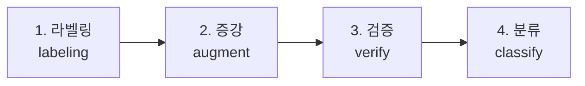
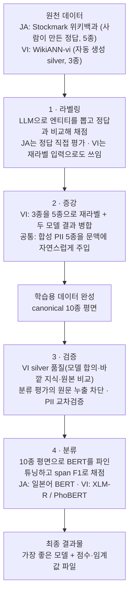

# NER 파이프라인 — 단계별 구현 맵 (일본어·베트남어)

일본어(JA)·베트남어(VI) NER 파이프라인을 **단계 축**으로 정리한 구현
맵이다. 파이프라인은 네 단계로 흐른다:



각 단계 문서는 **그 단계 안에서 JA/VI가 갈리는 지점**을 분기 섹션으로
다룬다. 한국어(KO)는 코드가 공유되는 지점에서만 비교용으로 언급한다(KO
전용 트랙 문서는 `docs/manual/data/korean-ner.md`).

- 엔티티 정의·경계 규칙·canonical 매핑의 **단일 출처**:
  `docs/manual/data/canonical-entity-schema.md`
- 서빙(REST API)은 본 단계 문서 범위 밖이다 — `src/server/CLAUDE.md` 참조.

---

## 전체 흐름 (end-to-end)



핵심 관통 원리 — **char-offset span 이 단계 간 공통 통화(currency)**다.
라벨링·분류의 평가 메트릭이 동일 함수(`compute_offset_span_f1`)라 LLM
라벨러와 BERT 분류기 결과를 직접 비교할 수 있다(단계 1·4 공유).

---

## 단계 ↔ 코드 ↔ 언어 분기 매트릭스

| 단계 | 핵심 코드 | JA 분기 | VI 분기 | 문서 |
|---|---|---|---|---|
| **1 라벨링** | `labelers/{ja,vi}`, `llm_eval`, `metrics` | Stockmark gold, `ja/span_matcher` | WikiANN, offset-span 경로 | [1-labeling.md](1-labeling.md) |
| **2 증강** | `augmenters/pii`, `augmenters/wikiann_vi` | PII 주입만 | **재라벨 silver → PII 주입** | [2-augmentation.md](2-augmentation.md) |
| **3 검증** | `wikiann_vi/{kappa,wikidata_anchor,merge_confidence}`, `classifier/kfold_pool`, `pii/verifier` | PII 교차검증 | **kappa + anchor + silver quality + cross-fold 누출** | [3-verification.md](3-verification.md) |
| **4 분류** | `classifier/` | BertJapanese (slow) | XLM-R (fast) / PhoBERT (pyvi) | [4-classification.md](4-classification.md) |

**비대칭성** — 증강·검증 단계는 VI 쪽이 무겁다. VI는 원천 gold가 3종
silver뿐이라 5종 재라벨·이중 silver 검증이 필요한 반면, JA는 5종 사람
gold라 재라벨·anchor 검증이 불필요하다. 그래서 단계 문서를 언어별로 쪼개지
않고 단계당 1개로 두되 분기 섹션으로 비대칭을 드러낸다.

---

## 공통 라벨 스키마

KO·JA·VI 공통으로 **canonical 10종 평면**을 목표 라벨 공간으로 쓴다.

```
NER 5종:  PER  LOC  ORG  PROD  EVT
PII 5종:  DAT  EMAIL  PHONE  ID_NUM  CREDIT_CARD
```

- BERT 분류기는 이를 BIO 21-class (`O` + 10×B + 10×I)로 학습한다(단계 4).
- 엔티티 정의·LOC/ORG 경계·데이터셋 원어 라벨 매핑·모호 사례 결정표는
  모두 `docs/manual/data/canonical-entity-schema.md` 단일 출처.

---

## 관련 문서

| 분류 | 문서 |
|---|---|
| 엔티티 스키마(단일 출처) | `docs/manual/data/canonical-entity-schema.md` |
| 데이터셋 스펙 | `docs/manual/data/{korean-ner-datasets,bio-dataset-spec-registry,ner-dataset-formats-comparison}.md` |
| KO 트랙 | `docs/manual/data/korean-ner.md`, `docs/manual/bio-tagging-impl.md` |
| 벤치마크 수치(영구 인용) | `docs/reports/{japanese,vietnamese,korean}-*-benchmark.md`, `*-spec.md` |
| 모듈 API 상세 | 각 `src/ner/**/CLAUDE.md` |
| 서빙(REST API) | `src/server/CLAUDE.md` |

> 본 단계 문서는 **방법론·구현 맵**이다. 시점별 벤치 수치·모델 선택은
> 본문에 박지 않고 `docs/reports/`에 위임한다(데이터 재정리로 경로·행 수가
> 바뀌어도 방법론 문서는 불변이도록).
