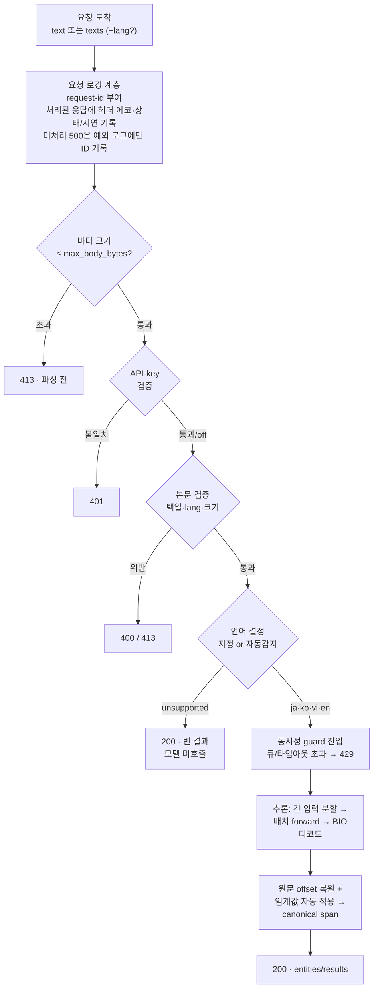

# NER REST API 명세서

> **이 문서가 하는 일**: `src/server/`가 제공하는 ja·ko·vi·en NER 추론 REST API의
> 계약(엔드포인트·요청/응답 스키마·상태 코드·에러·설정)을 한 곳에 고정한다.
> **대상 코드**: `src/server/` (`app.py`·`config.py`·`inference.py`·
> `detect.py`·`concurrency.py`·`chunking.py`)
> **소비자**: 내부망 별도 프로세스 클라이언트(레퍼런스: `server.scripts.
> example_client`). 배포는 `docker/server/`.

FastAPI가 런타임에 자동 생성하는 OpenAPI 문서(`GET /docs`·`GET
/openapi.json`)가 기계 계약의 단일 출처이고, 이 문서는 그 계약을 사람이 읽는
명세로 풀어 쓴 것이다. 스키마가 어긋나면 코드(`app.py`의 Pydantic 모델)가
정답이다.

## 목차

1. [개요·책임 경계](#1-개요책임-경계)
2. [기동·설정](#2-기동설정)
3. [엔드포인트 목록](#3-엔드포인트-목록)
4. [`POST /v1/ner` — 추론](#4-post-v1ner--추론)
5. [`GET /health` — 상태](#5-get-health--상태)
6. [에러 규격](#6-에러-규격)
7. [인증](#7-인증)
8. [동시성·크기 한도](#8-동시성크기-한도)
9. [로깅·요청 추적](#9-로깅요청-추적)
10. [엔티티 라벨 셋](#10-엔티티-라벨-셋)
11. [요청 처리 흐름](#11-요청-처리-흐름)
12. [사용 예시](#12-사용-예시)
13. [검증·테스트](#13-검증테스트)

## 1. 개요·책임 경계

학습된 BERT 토큰 분류기(`{model_root}/{lang}/model/`)를 감싸 HTTP로 NER
추론을 제공한다. 입력은 원문 텍스트(단일 또는 배치), 출력은 프로젝트
canonical span(`{label, start_char, end_char, text}`)으로 `.jsonl`
데이터 관례와 1:1이라 API 결과를 파이프라인에 그대로 되먹일 수 있다.

- **지원 언어**: `ja`(일본어)·`ko`(한국어)·`vi`(베트남어)·`en`(영어) 4종.
  `lang` 생략 시 텍스트별 자동 감지, 언어 고유 신호도 라틴 글자도
  없으면 `unsupported`(에러 아님, §4 참조).
- **핸들러 무상태**: 모든 가변 상태는 부팅 때 로드한 모델 registry 안에
  있고 요청은 그것을 읽기만 한다.
- **포함**: 요청 검증 / 언어 감지 / 긴 입력 분할 / 배치 forward / BIO
  디코드 / canonical 변환 / 신뢰도 임계값 적용 / 동시성 제어.
- **제외**: 학습·평가(`src/ner/classifier/`), 라벨링(`src/ner/labelers/`),
  모델 업로드. 서버는 `ner.classifier`의 인코딩·디코드·임계값 함수만
  import하고 학습·평가 모듈은 건드리지 않는다.

## 2. 기동·설정

```bash
python -m server                                   # 0.0.0.0:8008, /data/ner 로드
python -m server --host 127.0.0.1 --port 9000 --model-root /abs/root
bash src/server/scripts/run_local.sh --port 9000   # 로컬 GPU 0 고정 기동
```

부팅 시 지원 언어 모델을 모두 로드한다. 일부 언어 로드에 실패해도 서버는
떠서 해당 언어 요청에만 503을 돌려준다(graceful — `/health`가 `degraded`로
보고).

런타임 동작은 `NER_SERVER_*` 환경변수로 조정한다(미설정 시 기본값). CLI는
`--host`·`--port`·`--model-root`만 덮어쓴다.

| 환경변수 | 기본값 | 의미 |
|---|---|---|
| `NER_SERVER_MODEL_ROOT` | `/data/ner` | 모델 루트. `{root}/{lang}/model`·`{root}/{lang}/thresholds.json` 레이아웃 |
| `NER_SERVER_MAX_LENGTH` | `256` | 모델 토큰 한도. 초과 입력은 문장·공백 경계로 나누며 필요하면 문자 중간에서 추가 분할(§11) |
| `NER_SERVER_MAX_CHARS` | `20000` | 텍스트 1건 char 상한(초과 → 413) |
| `NER_SERVER_MAX_BATCH` | `64` | 배치 텍스트 개수 상한(초과 → 413) |
| `NER_SERVER_MAX_TOTAL_CHARS` | `100000` | 배치 전체 char 합산 상한 — 요청당 작업량 가드(초과 → 413) |
| `NER_SERVER_MAX_BODY_BYTES` | `2097152` | 요청 바디 바이트 상한(2MB) — 파싱·인증 전 전송 계층 가드(초과 → 413) |
| `NER_SERVER_MAX_CONCURRENCY` | `8` | 동시 추론 상한(전역 세마포어) |
| `NER_SERVER_MAX_QUEUE` | `32` | 대기 큐 깊이 상한(초과 → 429) |
| `NER_SERVER_ACQUIRE_TIMEOUT_S` | `10.0` | 세마포어 대기 타임아웃 초(초과 → 429) |
| `NER_SERVER_API_KEY` | (없음) | 설정 시 `X-API-Key` 헤더 검증. 미설정이면 인증 off |
| `NER_SERVER_LOG_LEVEL` | `INFO` | 루트 로그 레벨. `DEBUG`면 성공 요청까지 요청별 상세로 남는다(§9) |
| `NER_SERVER_LOG_FILE` | `/tmp/ner-server.log` | 회전 파일 로그 경로(주 1회 회전·직전 1주치 보관). 빈 값이면 stderr만(§9) |
| `NER_SERVER_HOST` | `0.0.0.0` | 바인드 호스트 |
| `NER_SERVER_PORT` | `8008` | 바인드 포트 |

`NER_SERVER_TRANSLATE_*`(웹 데모 번역)는 이 표에 없다 — 그 엔드포인트가 이
계약(§3)에 없기 때문이다. 기본 비활성이며 켜도 `/v1/ner` 동작·응답은 바뀌지
않는다(동시성 예산도 분리 — §8). 설정 표면은 `docs/manual/server-implementation.md`, 구현
레퍼런스(마스킹-복원·설정 검증)는 `docs/manual/web-demo-translation.md`.

## 3. 엔드포인트 목록

| 메서드·경로 | 인증 | 설명 |
|---|---|---|
| `POST /v1/ner` | API-key(설정 시) | 단일 또는 배치 NER 추론 |
| `GET /` | 없음 | 내부 개발·데모용 NER 추론 웹 페이지(자족적 HTML, 동일 출처로 `/v1/ner` 호출). **OpenAPI/Swagger 미노출** |
| `GET /health` | 없음 | 언어별 모델 로드 상태·임계값 존재. **OpenAPI/Swagger 미노출**(운영 헬스체크 전용) |
| `GET /docs` | 없음 | Swagger UI(FastAPI 자동) |
| `GET /openapi.json` | 없음 | OpenAPI 스키마(FastAPI 자동) |

## 4. `POST /v1/ner` — 추론

### 요청

`Content-Type: application/json`. 본문은 단일과 배치를 겸한다 — `text`와
`texts` 중 **정확히 하나**를 넣는다(둘 다 또는 둘 다 아님 → 400).

| 필드 | 타입 | 필수 | 설명 |
|---|---|---|---|
| `text` | string | 택일 | 단일 텍스트. `texts`와 상호배타 |
| `texts` | string[] | 택일 | 배치 텍스트. `text`와 상호배타 |
| `lang` | string | 선택 | `ja`\|`ko`\|`vi`\|`en`. 생략 시 텍스트별 자동 감지. 지원 외 값 → 400 |

신뢰도 임계값은 모델이 임계값 파일을 로드한 경우 **자동 적용**된다(요청
파라미터 없음). 임계값 파일이 없는 배포·언어는 raw span을 그대로 반환한다.

### 응답 — 단일(`text`)

`200 OK`. `lang`은 지정값 또는 감지 결과를 에코한다.

```jsonc
{
  "lang": "ja",
  "entities": [
    {"label": "PER", "start_char": 0, "end_char": 4,
     "text": "織田信長"}
  ]
}
```

### 응답 — 배치(`texts`)

`200 OK`. `results`는 **입력 순서와 1:1**이며 각 항목은 단일 응답과 같은
`{lang, entities}` 구조다.

```jsonc
{
  "results": [
    {"lang": "ja", "entities": [/* ... */]},
    {"lang": "ko", "entities": [/* ... */]},
    {"lang": "vi", "entities": [/* ... */]}
  ]
}
```

### `Span` 스키마

| 필드 | 타입 | 설명 |
|---|---|---|
| `label` | string | canonical 엔티티 타입(§10의 10종 중 하나) |
| `start_char` | int | 원문 시작 char offset(포함) |
| `end_char` | int | 원문 끝 char offset(제외) — `text[start_char:end_char]` |
| `text` | string | 원문에서 잘라낸 표면형 |

`start_char`/`end_char`는 **원문 char 기준**이라 긴 입력이 내부적으로 분할돼
추론되더라도 글로벌 offset으로 복원돼 반환된다. 입력은 서버에서 **NFC로
정규화**되므로 offset은 NFC 기준이다 — NFC 입력은 무변, NFD(분해형) 입력만
정규화 후 위치가 잡힌다(결합부호 분리로 인한 span 깨짐 방지).

### 언어 처리 규칙

`lang`을 어떻게 주느냐에 따라 미지원 입력의 처리가 갈린다 — 자동 감지의
미지원은 정상 응답, 명시한 미지원은 계약 위반이다.

| 상황 | 결과 |
|---|---|
| `lang` 명시 = `ja`\|`ko`\|`vi`\|`en` | 감지 없이 해당 모델로 추론 |
| `lang` 명시 = 그 외 | **400** `unsupported lang '{lang}'` (클라이언트 계약 위반) |
| `lang` 생략, 감지 = `ja`\|`ko`\|`vi`\|`en` | 감지 언어로 추론, 응답에 에코 |
| `lang` 생략, 감지 = `unsupported` | **200** `{lang:"unsupported", entities:[]}` — 모델 미호출 |

배치에서 자동 감지 `unsupported` 항목은 빈 결과로 두고 지원 언어 항목만
추론한다(**부분 성공** — 입력 순서·`lang` 1:1 보존).

**자동 감지 규칙**(`detect.py`)은 두 단이다. 첫째 단은 언어 고유 신호의
양성 감지다 — 가나(히라가나·가타카나) → `ja`, 한글(음절 또는 자모) → `ko`,
vi-변별 결합부호(horn·hook-above·dot-below) 또는 `đ` → `vi`. 셋의 신호는
서로소이고, 한 문장에 둘 이상 있으면 위 순서대로 먼저 맞은 언어가 이긴다.
셋이 모두 실패하면 둘째 단으로 내려가 라틴 글자가 있으면 → `en`, 라틴
글자도 없으면 → `unsupported` 다.

**둘째 단은 감지가 아니라 폴백이다.** 영어는 라틴 스크립트에 고유
코드포인트가 없어 스크립트만으로 변별되지 않으므로, `en` 은 "영어 신호를
봤다" 가 아니라 "지원 언어 신호가 없는데 라틴 글자는 있다" 를 뜻한다. 대가는
오분류다 — **부호를 뗀 베트남어**(không dấu)와 **로마자로 적은 일본어**가
`en` 으로 가 영어 모델을 탄다. 그런 입력은 `lang` 을 직접 지정해야 한다.

`unsupported` 로 남는 것은 라틴 글자마저 없는 입력이다. **한자만 있는
텍스트**가 대표적인데, ja·ko 가 한자를 공유해 어느 쪽도 가리키지 않는
데다 라틴 글자도 없기 때문이다. 언어별 신호·코드포인트 구간·수용된 한계는
`docs/manual/language-detection.md` 가 정본이다.

**배포 전제** — 자동 감지가 라틴 텍스트를 `en` 으로 보내므로,
`/data/ner/en/model` 이 없는 배포에서는 영어 입력이 200 이 아니라 503 이고
라틴 항목이 섞인 배치는 통째로 503 이다. §2 의 graceful 로드 서술과 위 배치
부분 성공 서술 둘 다에 대해 새로 생긴 예외다 — 서버는 뜨지만 그 언어 요청이
503 이고, 배치는 부분 성공이 아니라 통째로 실패한다.

## 5. `GET /health` — 상태

인증 없이 언어별 모델 로드 상태와 임계값 파일 존재 여부를 보고한다. 운영·
오케스트레이터 헬스체크 전용이라 **OpenAPI/Swagger 에는 노출하지 않는다**
(`include_in_schema=False` — 엔드포인트 자체는 정상 동작).

```jsonc
{
  "status": "ok",           // 요청된 모든 언어가 loaded면 "ok", 아니면 "degraded"
  "langs": {
    "ja": {"loaded": true,  "thresholds": true},
    "vi": {"loaded": true,  "thresholds": false},
    "ko": {"loaded": true,  "thresholds": false},
    "en": {"loaded": true,  "thresholds": false}
  }
}
```

- `loaded`: 해당 언어 모델이 부팅 때 로드됐는지. 미로드 언어도 `false`로
  보고한다(요청 목록 기준).
- `thresholds`: `thresholds.json`이 존재해 임계값이 적용되는지(없으면 raw).
- `status`: 요청된 모든 언어가 `loaded`면 `ok`, 하나라도 미로드면
  `degraded`(로드된 언어가 하나도 없어도 `degraded`).

### `GET /` — 웹 데모 UI

내부 개발·데모용 단일 웹 페이지를 반환한다(자족적 HTML+vanilla JS,
`src/server/static/index.html`). 서버 프로세스와 **동일 출처**로 서빙되므로
브라우저가 CORS 없이 `POST /v1/ner`를 직접 호출한다 — 별도 정적 호스팅·빌드
스텝·신규 의존성이 없다(`python -m server` 하나로 API + UI 동시 제공).

- **입력**: 텍스트 1건 + 언어 셀렉터(`자동감지`/`ja`/`ko`/`vi`/`en`). 수동
  선택 시 요청에 `lang`을 실어 자동감지를 우회한다 — 무부호 vi·romaji ja 는
  자동감지가 `en` 으로 보내므로 이 우회가 유일한 수단이다.
- **출력**: 추출 개체를 원문 위 라벨별 색상 하이라이트로 표시(canonical 10종
  색상 맵 + 범례). 표시 텍스트를 **NFC 정규화**해 하이라이트 offset이 서버
  offset과 정합한다. 자동감지 `unsupported`는 안내 문구로 표시한다.
- **번역**: 백엔드가 가용하면 ja·vi·en 추론 결과에 한국어 번역 버튼을 제공하고
  번역 결과를 표시한다. 번역 API와 설정은 [웹 데모 번역 문서](web-demo-translation.md)를
  따른다.
- **범위**: 개체 하이라이트와 선택적 한국어 번역을 제공한다(배치 UI·엔티티 표·JSON 뷰·score 미표시). 인증 없이
  접근 가능하며(`API_KEY` 설정 시 브라우저 호출 인증은 범위 밖), OpenAPI/Swagger
  에는 노출하지 않는다.

## 6. 에러 규격

모든 에러는 구조화된 형태로 반환된다:

```jsonc
{"error": {"status": 400, "message": "provide exactly one of 'text' or 'texts'"}}
```

| 상태 | 트리거 | `message` 예시 |
|---|---|---|
| **400** | `text`·`texts` 택일 위반 | `provide exactly one of 'text' or 'texts'` |
| **400** | 명시 `lang`이 지원 외 | `unsupported lang 'th'` |
| **401** | API-key 설정됐는데 헤더 불일치/누락 | `invalid or missing API key` |
| **413** | 요청 바디가 `max_body_bytes` 초과(파싱·인증 전) | `request body exceeds max_body_bytes (2097152)` |
| **413** | 텍스트 1건이 `max_chars` 초과 | `text exceeds max_chars (20000)` |
| **413** | 배치 개수가 `max_batch` 초과 | `batch exceeds max_batch (64)` |
| **413** | 배치 char 합이 `max_total_chars` 초과 | `batch total chars N exceeds max_total_chars (100000)` |
| **404** | 존재하지 않는 경로 | `Not Found` |
| **405** | 경로는 있으나 메서드 불일치(예: `GET /v1/ner`) | `Method Not Allowed` |
| **422** | 요청 본문이 Pydantic 스키마 위반(타입 오류 등) | `request validation failed (N error(s))` |
| **429** | 대기 큐 초과 또는 세마포어 타임아웃 | `queue full (>= 32 waiting)` / `acquire timed out (10.0s)` |
| **500** | 미처리 서버 오류(추론 예외 등) | `internal server error` |
| **503** | 요청 언어 모델이 미로드 | `model for lang 'vi' is not loaded` |

`unsupported` 입력(자동 감지)은 에러가 아니라 **200 + 빈 결과**임에 유의
(위 §4). 모든 에러는 위 봉투 형식으로 통일된다 — Pydantic 스키마 위반(`422`)·
미처리 예외(`500`)도 프레임워크 기본형(`{detail:[...]}`·평문)이 아니라
`{error:{status,message}}`로 감싸며, `500`은 내부 예외 메시지·트레이스백을
응답에 노출하지 않는다. 요청 바디가 `max_body_bytes`를 넘으면 파싱·인증
이전에 `413`으로 거절한다(chunked 우회 포함 — §8).

핸들러가 판정하는 에러뿐 아니라 **라우터가 내는 `404`·`405`도 같은 봉투**다.
소비자는 상태 코드와 무관하게 에러 파싱 경로를 하나만 두면 된다. 다만 `405`
응답에는 봉투와 별개로 `Allow` 헤더(예: `Allow: POST`)가 함께 실린다 —
RFC 7231이 요구하는 프로토콜 헤더라 봉투로 감싸면서도 보존한다.

> **구현 메모** — 봉투 통일은 예외 핸들러를 부모 클래스
> `starlette.exceptions.HTTPException`에 걸어 얻는다. 자식인
> `fastapi.HTTPException`에만 걸면 핸들러가 직접 던지는 `400`·`401`·`413`은
> 잡히지만, 라우터가 부모 클래스를 직접 던지는 `404`·`405`는 매칭되지 않고
> FastAPI 기본 핸들러로 새어 `{"detail": ...}`가 된다.

### 429 과부하 응답과 재시도

`POST /v1/ner`는 다음 두 경우에 429를 반환한다. 아래 숫자는 기본 설정이며
배포 설정에 따라 달라질 수 있다.

| 발생 조건 | 기본 설정 | `error.message` 예시 |
|---|---|---|
| 추론 슬롯이 모두 사용 중이고 대기 큐도 가득 찬 상태에서 추가 요청이 도착한다. | 동시 추론 8건, 대기 32건 | `queue full (>= 32 waiting)` |
| 대기 큐에 들어간 요청이 제한 시간 안에 추론 슬롯을 얻지 못한다. | 대기 시간 10초 | `acquire timed out (10.0s)` |

단건과 배치는 모두 HTTP 요청 하나당 추론 슬롯 하나를 사용한다. 초당 요청
횟수 제한이 아니라 현재 추론·대기 상태에 따른 거절이다. 자동 감지 결과가
모두 `unsupported`인 요청은 추론 슬롯을 사용하지 않는다.

두 경우 모두 HTTP 429와 `error.status`·`error.message`를 담은 JSON 본문을
반환한다. 응답에는 `Retry-After: 1` 헤더가 포함된다.

OpenAPI·Swagger에도 429의 `ErrorResponse` 스키마와 `Retry-After` 헤더를
선언한다. 예제 `NERClient`는 기본적으로 재시도하지 않으며, `max_retries`를
지정하면 429에 한해 지정한 횟수만큼 추가 요청한다. 상한에 도달하면 마지막
429 응답을 그대로 반환한다.

```http
HTTP/1.1 429 Too Many Requests
Content-Type: application/json
Retry-After: 1

{"error":{"status":429,"message":"queue full (>= 32 waiting)"}}
```

재시도하는 클라이언트는 `Retry-After` 헤더에 지정된 초만큼 대기한 뒤 동일
요청을 다시 보낸다. 현재 서버는 1초를 안내하며, 1초 뒤의 성공을 보장하는
것은 아니다. 재시도 여부는 HTTP 상태 코드로 판단하고 `message` 문구를
분기 조건으로 사용하지 않는다. 즉시 반복 재시도는 피하고, 재시도 횟수나
전체 대기 시간은 호출자의 정책에 따라 제한한다.

## 7. 인증

`NER_SERVER_API_KEY`가 설정된 경우에만 `POST /v1/ner`가 `X-API-Key` 헤더를
검증한다(미설정이면 인증 off — 내부망 신뢰 전제 배포용). 헤더가 없거나
불일치면 **401**. `GET /health`·`GET /docs`·`GET /openapi.json`은 항상 인증
없이 접근 가능하다.

```bash
curl -H 'X-API-Key: <secret>' -H 'Content-Type: application/json' \
  -X POST localhost:8008/v1/ner -d '{"text":"..."}'
```

## 8. 동시성·크기 한도

단일 GPU 추론은 직렬에 가까워, 무제한 동시 요청은 지연 절벽·OOM을 부른다.
추론 `ConcurrencyGuard`가 이를 bound한다(웹 데모 번역은 자기 guard·자기 예산을
따로 갖는다 — `/v1/ner`의 슬롯을 잠식하지 않는다):

- **동시 in-flight ≤ `max_concurrency`**(전역 세마포어). 초과 요청은 대기.
- **대기 큐 ≤ `max_queue`**. 슬롯이 없어 대기해야 하는데 큐가 가득이면
  즉시 **429** `queue full`. (빈 슬롯이 있으면 큐 상한과 무관하게 즉시 진입 —
  `max_queue=0`은 "대기 불허"이지 "처리 불허"가 아니다.)
- **대기 타임아웃 `acquire_timeout_s`**. 시간 내 슬롯을 못 얻으면 **429**
  `acquire timed out`.
- **429 재시도 안내**. `Retry-After: 1`을 반환한다. 클라이언트 처리 방법은
  §6의 429 과부하 응답과 재시도 절을 따른다.
- **대기 중 연결 종료**. 슬롯 획득 직후 연결 종료가 확인되면 추론하지 않고
  슬롯을 반환한다. 해당 요청은 로그에 499로 남는다. 실행 중 추론을 취소하거나
  대기 큐에서 즉시 제거하는 것은 아니다.

검증·언어 감지는 guard 밖에서 빠르게 처리하고, 무거운 추론만 guard 안
`run_in_threadpool`로 실행한다. 크기 한도(`max_chars`·`max_batch`·
`max_total_chars`)는 요청당 작업량을 미리 잘라 과부하를 예방한다(§6의 413).

크기 한도가 파싱된 필드를 보는 **논리 가드**인 것과 별도로, 요청 바디는
파싱·인증보다 **앞선 전송 계층**에서 `max_body_bytes`(기본 2MB)로 먼저
잘린다 — Content-Length 조기 거절 + Content-Length 없는 chunked 바디도
수신 바이트 누적으로 거절(우회 차단)해, 대용량 바디를 통째로 버퍼링하는
메모리 고갈을 막는다. 인증 이전 단계라 비인증 요청도 이 한도에 걸린다.

## 9. 로깅·요청 추적

서버 로그는 **평상시 조용, 필요할 때 상세**를 원칙으로 한다. 성공 요청까지
상시 남기면 로그량이 처리량에 비례해 늘고, 그 안에서 정작 조치가 필요한
거절이 묻히기 때문이다.

| 결과 | 레벨 | 남는 내용 |
|---|---|---|
| 성공(2xx) | `DEBUG` | 지연·언어·배치 크기·개체 수·request-id. 기본 레벨 `INFO`에선 침묵 |
| 거절(400·401·413·422·429·503) | `WARNING` | 상태·사유 태그·경로·request-id. 상시 기록 |
| 그 밖의 4xx(404·405) | `WARNING` | 같은 형식이나 사유 태그는 `error`로 뭉뚱그림 |
| 미처리 예외(500) | `ERROR` | 트레이스백 + request-id |

거절만 상시 남기는 이유는 그것이 운영에서 실제로 손이 가야 하는 사건이기
때문이다 — 인증 실패(401)·부하 셰딩(429)·모델 미로드(503)는 클라이언트가
알려주지 않아도 로그만으로 드러나야 한다. `503`은 5xx지만 서버 결함이 아니라
거절로 분류한다. `500`의 트레이스백은 로그에만 남고 응답 본문에는 내부
메시지를 노출하지 않으므로(§6), 원인 추적은 서버 로그가 유일한 경로다.

### 응답 헤더 `X-Request-ID`

정상 응답과 처리된 에러 응답(전송 계층의 413 포함)에 실린다. 미처리 예외의
500 응답에는 현재 이 헤더가 없으며, 요청 ID는 서버의 예외 로그에만 남는다.
요청에 비어 있지 않은 `X-Request-ID`를 보내면 서버가 앞 64자까지 에코하므로
호출자 쪽 추적 ID와 서버 로그를 이어 붙일 수 있다. 헤더가 없거나 값이 비어
있으면 서버가 8자리 16진수 값을 생성한다. 응답에 요청 ID 헤더가 있으면 장애
신고 시 그 값을 함께 전달한다. 미처리 500 응답에는 이 헤더가 없으므로,
호출자가 요청에 ID를 지정했다면 그 값의 앞 64자를 전달해 서버 로그와 대조한다.

### 출력·보관

로그는 stderr로 스트리밍하는 동시에 `NER_SERVER_LOG_FILE`(기본
`/tmp/ner-server.log`)에 파일로도 남는다. 파일은 **매주 월요일 회전해 직전
1주치만 보관**하고 그보다 오래된 파일은 자동 삭제한다 — 장기 실행 서버에서
로그가 디스크를 무한정 먹지 않게 하는 상한이다. 빈 값을 주면 stderr만 쓴다.
파일 열기에 실패해도(경로 권한 등) 경고 한 줄만 남기고 stderr 로깅으로 계속
기동한다 — 로그 설정 문제가 서비스 자체를 막지 않게 한 선택이다.

컨테이너의 `/tmp`는 컨테이너-로컬이라 재시작하면 사라진다. 호스트에 보존하려면
볼륨 마운트 경로로 `NER_SERVER_LOG_FILE`을 바꾼다(스트리밍 로그 자체는
`docker/server/logs.sh`로도 본다. 인자가 없으면 Compose 서비스 로그를,
컨테이너 이름을 인자로 주면 해당 컨테이너의 로그를 조회한다).

## 10. 엔티티 라벨 셋

`label`은 ja·ko·vi·en 공통 canonical **10종 평면** 중 하나다.

| 구분 | 라벨 |
|---|---|
| NER 5종 | `PER` · `LOC` · `ORG` · `PROD` · `EVT` |
| PII 5종 | `DAT` · `EMAIL` · `PHONE` · `ID_NUM` · `CREDIT_CARD` |

정의·경계 규칙은 단일 출처 `docs/manual/data/canonical-entity-schema.md`
참조.

## 11. 요청 처리 흐름

요청이 검증·감지를 거쳐 모델 추론으로, 응답이 canonical span으로 나오기까지.



**추론 내부**(`inference.py`): 입력을 토큰 한도에 맞게 문장·공백 경계로 분할한다.
단어 자체도 한도를 넘으면 문자 중간에서 추가 분할하며 각 조각의 길이를 다시
확인한다. PhoBERT 길이 계산은 실제 인코딩과 같은 pyvi 분절을 사용한다.
강제 분할 경계의 엔티티 보존은 보장하지 않는다.

전 chunk를 `[N, max_length]` 한 배치로 묶어 1 forward → softmax·argmax로
토큰별 예측·confidence → BIO 디코드로 span 추출 → chunk base offset을 더해
NFC 정규화한 입력 전체의 offset 복원 → 임계값 로드 시 자동 적용 → canonical
변환. 배치 요청은 같은 언어끼리 묶어 한 forward로 추론하며 입력 순서를
보존한다. 서빙은 fp32를 사용하고 단건·배치 결과의 일치 여부는 테스트로
검증한다. 입력은 NFC로 정규화한다.

BIO 디코더는 연속한 동일 offset의 첫 서브워드 라벨을 따른다. 뒤따르는
동일 타입의 B/I는 이어 붙이고 충돌하는 라벨은 무시한다. 다른 타입의 I로
전환되면 직전 span을 보존한 뒤 새 span을 시작한다. 이 규칙은 추론과
평가에서 공용으로 사용한다.

## 12. 사용 예시

```bash
# 단일(자동 감지) — ja
curl -s -X POST localhost:8008/v1/ner \
  -H 'Content-Type: application/json' \
  -d '{"text":"織田信長は東京都千代田区に住んでいた。"}'
# → {"lang":"ja","entities":[
#      {"label":"PER","start_char":0,"end_char":4,"text":"織田信長"},
#      {"label":"LOC","start_char":5,"end_char":12,"text":"東京都千代田区"}]}

# 배치(혼합 언어, 텍스트별 감지)
curl -s -X POST localhost:8008/v1/ner \
  -H 'Content-Type: application/json' \
  -d '{"texts":["トヨタは日本の会社です。","삼성전자는 수원에 있다.","Hà Nội là thủ đô.","Barack Obama was born in Hawaii."]}'
# → {"results":[{"lang":"ja","entities":[...]},{"lang":"ko","entities":[...]},
#               {"lang":"vi","entities":[...]},{"lang":"en","entities":[...]}]}

# 언어 명시(자동 감지 대신 직접 지정)
curl -s -X POST 'localhost:8008/v1/ner' \
  -H 'Content-Type: application/json' -d '{"text":"...","lang":"ja"}'

# 단일(자동감지) — en (라틴 폴백)
curl -s -X POST localhost:8008/v1/ner \
  -H 'Content-Type: application/json' \
  -d '{"text":"Barack Obama was born in Hawaii in 1961."}'

# 미지원 입력(한자만 등) → 200 + 빈 결과(에러 아님, 모델 미호출)
curl -s -X POST localhost:8008/v1/ner \
  -H 'Content-Type: application/json' -d '{"text":"東京都千代田区"}'
# → {"lang":"unsupported","entities":[]}

# 계약 에러: 택일 위반 → 400 (status 코드만 확인)
curl -s -o /dev/null -w '%{http_code}\n' -X POST localhost:8008/v1/ner \
  -H 'Content-Type: application/json' -d '{}'

# 헬스 / OpenAPI UI
curl -s localhost:8008/health   # {"status":"ok","langs":{...}}
# 브라우저: GET /docs
```

내부 소비자용 최소 파이썬 클라이언트는 `server.scripts.example_client`
(`NERClient`)를 레퍼런스로 삼는다.

## 13. 검증·테스트

검사 명령과 자원 조건은 [서버 검증 지침](../../src/server/AGENTS.md#검증)을
따른다. 모델 없는 기본 검사와 전체 검사를 구분하며, skip과 명시적으로 제외한
경로는 실모델 검증 성공으로 계산하지 않는다.

- **계약·전송 pytest**: 모델 없는 기본 명령은 live·모델 통합 파일을 제외한다.
  API와 NER→번역 연결은 모델 대역으로
  검사하며, 실모델 품질이나 실제 backend 가용성을 증명하지 않는다.
- **전체 pytest**: `uv run pytest tests/server -q -rs`는 로컬 자원과 설정에 따라
  실모델을 로드하고 서버를 기동한다. 실행 전에 모델·GPU·번역 설정을 확인한다.
- **소비자 예제·자기검증**: `uv run python -m server.scripts.example_client
  --base-url http://localhost:8008`은 단일·배치·미지원·계약 에러를 검사한다.
  429 검사는 동시 부하를 발생시키고 서버 설정에 의존하므로 공유 서버의 일반
  준비성 검사로 무조건 실행하지 않는다. 주소는 실제 대상에 맞게 지정한다.
- **실서버 pytest**: `uv run pytest tests/server/test_live_server.py -q -rs`는
  현재 설정으로 서버를 기동해 준비성·NER을 확인하고 기동 로그를 보관한다.
  번역 흐름까지 검사하려면 backend를 준비하고 `NER_SERVER_TEST_LIVE_TRANSLATE=1`을
  명시한다. 세부 조건과 한계는 [번역 테스트 맵](web-demo-translation.md#7-테스트-맵)을
  따른다.

---

**관련 문서**: 모듈 오리엔테이션 `docs/manual/server-implementation.md` · 엔티티 스키마
`docs/manual/data/canonical-entity-schema.md` · 언어 감지 벤치
`docs/reports/language-detection-benchmark.md` · 배포 `docker/server/AGENTS.md`.
