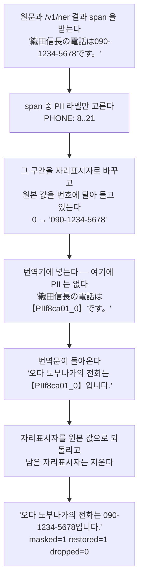
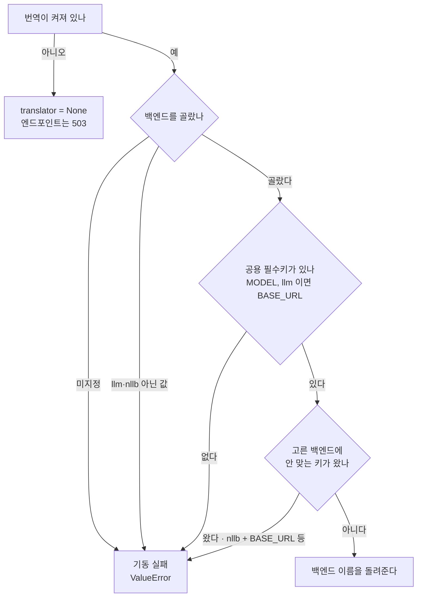
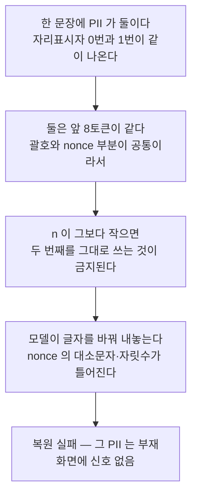
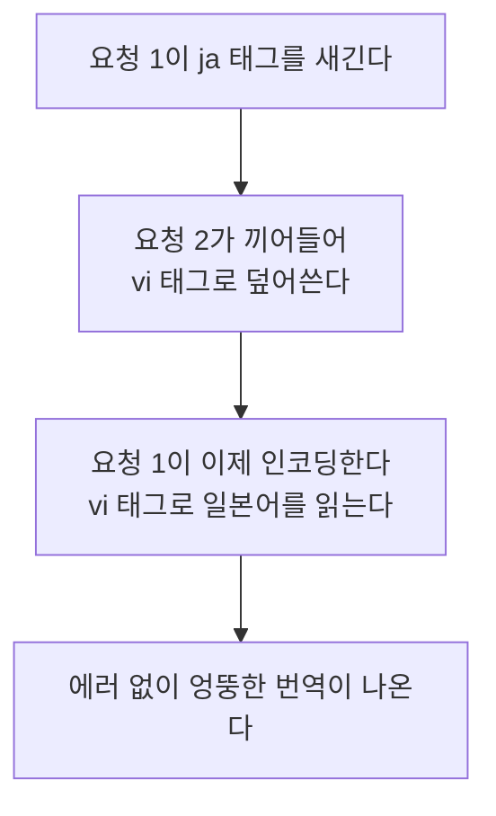
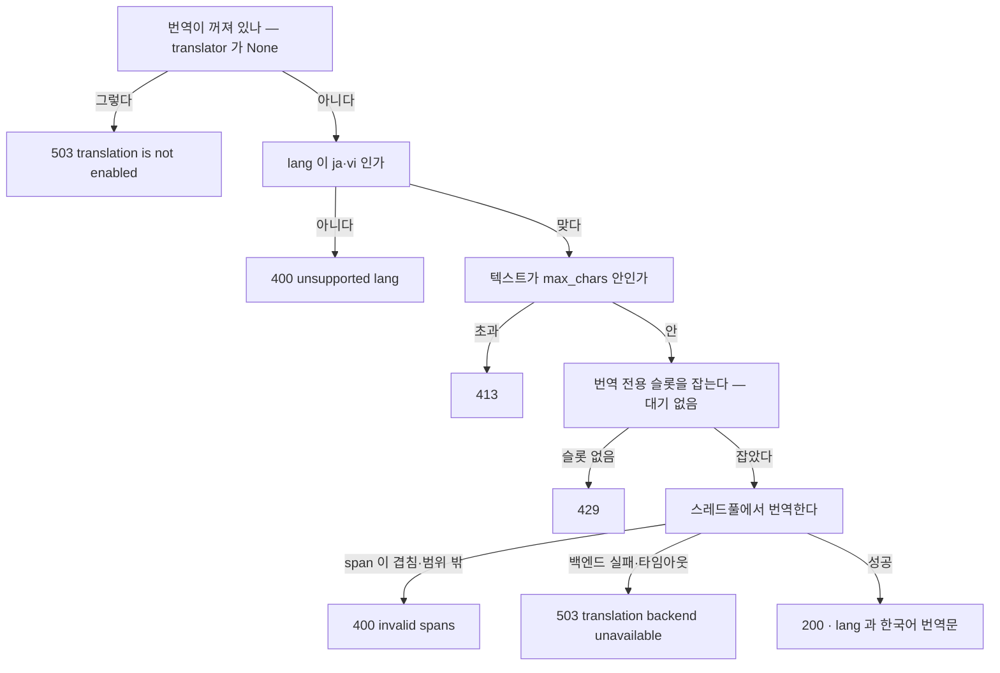

# 웹 데모 번역 — 마스킹-복원 · 백엔드 선택

> **이 문서가 하는 일**: 웹 데모 번역(`/v1/translate`)의 구현을 함수·알고리즘
> 수준에서 고정한다 — 마스킹-복원 계약, 백엔드 선택·검증, NLLB 엔진 속성,
> 인프로세스에서 생기는 동시성 불변식.
> **대상 코드**: `src/server/translate.py` · `translate_nllb.py` ·
> `app.py`(엔드포인트·guard) · `config.py`(설정 필드)
> **테스트**: `tests/server/test_translate.py` ·
> `tests/server/test_translate_nllb.py`

이 문서가 **안 하는** 일도 적어 둔다. env 설정 표면과 "왜 그렇게 갈랐나"의
정본은 `src/server/CLAUDE.md` §번역 백엔드이고, 여기서는 목록을 다시 싣지 않고
가리키기만 한다. `/v1/translate` 는 외부 소비자 계약(`docs/manual/rest-api-
spec.md`)에 **없다** — 웹 데모 전용이라 OpenAPI 에도 노출하지 않는다. 설계 경위와
실측 원본은 `docs/issues/issue-189-web-ja-vi-ko-gloss.md`(마스킹-복원 도입) ·
`docs/issues/issue-197-translate-backend-option.md`(백엔드 선택)에 있다.

## 1. 설계 제약 — 왜 이 모양인가

데모 UI 를 보는 사람이 ja·vi 를 못 읽으면 하이라이트가 맞는지 판단할 수 없다.
"원문을 한국어로도 보여 준다"가 요구지만, 두 제약이 구현 형태를 거의 다 정한다.

| 제약 | 따라오는 결론 |
|---|---|
| 외부 번역 API 금지 — 입력 원문 PII 를 제3자로 보낼 수 없다 | 번역기는 온프렘(원격 사내 LLM 또는 인프로세스 NMT) |
| PII 는 원문 그대로 보존, 고유명사는 한글 음차 | 방향이 반대인 두 요구라 통짜 번역으로는 불가 — PII 만 가리고 나머지는 통과시킨다 |

두 번째가 **마스킹-복원**의 근거다. `090-1234-5678` 은 한 글자도 바뀌면 안 되지만
`織田信長` 은 "오다 노부나가"가 돼야 쓸모가 있다. 번역기를 타이르는 대신, PII 는
아예 넘기지 않고 고유명사만 통과시킨다.

## 2. 구성 요소

| 파일 | 역할 |
|---|---|
| `src/server/translate.py` | 마스킹-복원 코어(`_mask`·`_restore`·`SentinelFormat`) + 원격 백엔드 `LLMTranslator` + 백엔드 선택·검증(`_resolve_backend`·`build_translator`) |
| `src/server/translate_nllb.py` | 인프로세스 백엔드 `NLLBTranslator` + 엔진 속성(ASCII sentinel · 문장 분할 · 반복 억제 하한) |
| `src/server/app.py` | `/v1/translate`·`/v1/translate/status` 라우트, 번역 전용 `ConcurrencyGuard` |
| `src/server/config.py` | `translate_*` 설정 필드(공용/백엔드 전용) |
| `src/server/static/index.html` | 온디맨드 "한국어 번역 보기" 버튼 |

두 translator 는 같은 계약을 낸다 — `translate(text, lang, spans) ->
TranslationResult` 와 `available() -> bool`. 그래서 엔드포인트는 어느 쪽이
꽂혔는지 몰라도 된다.

## 3. 마스킹-복원

### 3.1 흐름



| 단계 | 함수 | 파일 |
|---|---|---|
| PII 선별·치환 | `_mask` | `translate.py` |
| 자리표시자 문자열 생성 | `SentinelFormat.token` | 〃 |
| 번역 호출 | `LLMTranslator.translate` · `NLLBTranslator.translate` | `translate.py` · `translate_nllb.py` |
| 복원·잔여 제거·회계 | `_restore` | `translate.py` |

PII 탐지는 이 모듈이 하지 않는다. 호출자(웹 페이지)가 `/v1/ner` 결과 span 을
그대로 넘기고, 여기서는 그중 PII 라벨만 고른다 — 즉 **PII 보존은 NER recall 에
종속된다**(설계 시점에 감수한 한계, issue-189 결정 로그).

```python
PII_LABELS = frozenset({'DAT', 'EMAIL', 'PHONE', 'ID_NUM', 'CREDIT_CARD'})
```

고유명사(`PER`·`LOC`·`ORG`·`PROD`·`EVT`)는 일부러 마스킹하지 않는다 —
마스킹하면 원문이 그대로 남아 음차가 안 된다.

### 3.2 자리표시자 표기 — `SentinelFormat`

표기는 `{괄호}{프로세스 nonce}{번호}{괄호}` 세 조각이다.

```python
_SENTINEL_TAG = f'PII{secrets.token_hex(3)}_'   # 프로세스 기동 시 1회

@dataclass(frozen=True)
class SentinelFormat:
    left: str = '【'
    right: str = '】'

    def token(self, i: int) -> str:
        return f'{self.left}{_SENTINEL_TAG}{i}{self.right}'

    def pattern(self) -> re.Pattern:
        """이 표기의 sentinel 만 잡는 정규식 — 자연 텍스트 괄호는 비대상."""
        return re.compile(
            rf'{re.escape(self.left)}{re.escape(_SENTINEL_TAG)}'
            rf'(\d+){re.escape(self.right)}')
```

| 조각 | 왜 그렇게 |
|---|---|
| 괄호 | **번역기 토크나이저에 종속**돼 갈아끼울 수 있어야 한다(§5.1). 기본값 lenticular bracket 은 LLM 경로 생존율 100% |
| nonce | 프로세스마다 다르고 응답에 안 실려 **클라이언트가 예측할 수 없다.** 없으면 `【PII0】` 을 원문에 심어 복원의 전역 치환을 오염시킬 수 있다 |
| 번호 | 매핑 키. 복원은 이 번호로 원본 값을 찾는다 |

> **핵심 — nonce 는 성능이 아니라 신뢰 경계 장치다.** 표기는 두 번 진화했다.
> 최초 `【PII0】` 은 일본어 자연 표기(`【重要】`·`【9】`)와 충돌해 잔여 청소가 원문을
> 지웠고, 접두를 분리한 뒤에도 클라이언트가 형식을 **일부러** 심는 경로가 남아
> nonce 가 들어왔다(issue-189 refuter 라운드 1·2).

### 3.3 `_mask` — 계약

```python
def _mask(text, spans, fmt=DEFAULT_SENTINEL) -> tuple[str, Dict[int, str]]:
```

| 규칙 | 이유 |
|---|---|
| `PII_LABELS` 인 span 만 대상, `start_char` 오름차순 정렬 | 비PII 는 번역기를 통과해야 한다 |
| 범위 밖(`0 <= start < end <= len(text)` 위반) → `ValueError` | 잘못된 슬라이스는 PII 조각 노출로 이어진다 |
| 겹치는 span → `ValueError` | `/v1/ner` 은 비중첩만 생성한다. 겹친 채 자르면 원본 슬라이스가 어긋난다 |
| **오른쪽 span 부터** 치환 | 앞에서부터 바꾸면 길이 차이만큼 뒤쪽 오프셋이 밀린다 |

반환은 `(마스킹된 텍스트, {번호: 원본 문자열})`. PII 가 없으면 원문과 빈 매핑을
그대로 돌려준다. 두 `ValueError` 는 엔드포인트에서 400 으로 매핑된다(§7).

### 3.4 `_restore` — 계약

```python
def _restore(translated, id2val, fmt=DEFAULT_SENTINEL) -> tuple[str, int, int]:
```

번역문에서 각 자리표시자를 원본 값으로 치환하고 `(복원된 텍스트, 복원 수, 소실
수)`를 낸다. 매핑에 없는 잔여 자리표시자(환각·부분 소실)는 화면 노이즈이므로
`fmt.pattern()` 으로 지우는데, **그 정규식은 nonce 를 포함한 우리 형식만
잡는다** — 원문에 있던 `【N】` 같은 자연 표기는 건드리지 않는다.

### 3.5 보장의 범위

> **핵심 보장** — PII 는 **보존되거나 부재하거나** 둘 중 하나이며, 훼손·유출되지
> 않는다. 자리표시자가 번역 중 사라지면 그 PII 는 결과 문장에 안 나올 뿐,
> 잘못된 값으로 바뀌거나 번역기에 노출되지는 않는다.

이 보장이 **좁다는 점이 중요하다.** 소실이 에러가 아니라 '부재'라 호출자에게
신호가 없다 — §5.1 의 조용한 실패가 여기서 나온다. 회계는 `TranslationResult`
가 들고 있고, `dropped_pii > 0` 이면 두 백엔드 모두 `logger.warning` 을 남긴다.

```python
@dataclass
class TranslationResult:
    lang: str
    translation: str
    masked_pii: int
    restored_pii: int
    dropped_pii: int
```

## 4. 백엔드 선택

### 4.1 설정 표면 — 공용 키와 전용 키

키 목록·기본값의 정본은 `src/server/CLAUDE.md` §기동 이다. 여기서는 **구현이
의존하는 성질** 하나만 고정한다.

> **핵심 — 백엔드 전용 키는 `config.py` 에서 기본값 없이 `Optional[...] = None`
> 이다.** 검사하려는 것은 "`nllb` 를 골랐는데 `BASE_URL` 이 설정돼 있다" 같은
> 어긋난 조합인데, config 가 기본값을 채우면 "안 준 것"과 "그 값을 준 것"이
> 구별되지 않아 그 검사가 성립하지 않는다. 실효 기본값은 값을 아는 쪽이 나중에
> 넣는다 — timeout 30·device `cuda:0` 은 `translate.py`(`DEFAULT_TIMEOUT_S`·
> `DEFAULT_DEVICE`), 반복 억제 하한은 토크나이저를 쥔 `translate_nllb.py`.
> compose 도 같은 이유로 번역 키에 기본값을 주지 않는다(`${VAR:-}`).

env 이름과 config 속성의 대응은 한 표에 묶여 있고, 검증이 이 표만 읽는다.

```python
_BACKEND_KEYS = {
    'llm': (
        ('NER_SERVER_TRANSLATE_BASE_URL', 'translate_base_url'),
        ('NER_SERVER_TRANSLATE_API_KEY', 'translate_api_key'),
        ('NER_SERVER_TRANSLATE_TIMEOUT_S', 'translate_timeout_s'),
    ),
    'nllb': (
        ('NER_SERVER_TRANSLATE_DEVICE', 'translate_device'),
        ('NER_SERVER_TRANSLATE_NO_REPEAT_NGRAM', 'translate_no_repeat_ngram'),
    ),
}
BACKENDS = tuple(_BACKEND_KEYS)
```

### 4.2 `_resolve_backend` — 기동 시점에 실패시키는 네 조건



네 번째 조건이 이 설계의 성격을 보여 준다. 안 맞는 키를 조용히 무시해도 동작에는
지장이 없지만, 무시하는 순간 **설정 파일이 실제 동작과 어긋난 채 남는다** — 이
기능이 없애려던 실패가 정확히 그것이었다(`TRANSLATE_BASE_URL` 이
`http://localhost:8081/v1` 기본값을 갖던 시절, base_url 없이 번역을 켜면 그 포트에
떠 있던 아무 모델이나 번역기가 됐다).

```python
    foreign = sorted(
        env for other, keys in _BACKEND_KEYS.items() if other != backend
        for env, attr in keys if getattr(config, attr, None) is not None)
    if foreign:
        raise ValueError(
            f'{", ".join(foreign)} does not apply to translation backend '
            f'{backend!r}')
```

`is not None` 이 곧 "사용자가 줬다"의 판정이다 — §4.1 의 `None` 규약이 여기서
집행된다.

### 4.3 `build_translator` — 분기와 지연 임포트

```python
def build_translator(config):
    if not getattr(config, 'translate_enabled', False):
        return None
    backend = _resolve_backend(config)
    if backend == 'llm':
        timeout_s = config.translate_timeout_s
        return LLMTranslator(
            base_url=config.translate_base_url, model=config.translate_model,
            api_key=config.translate_api_key,
            timeout_s=DEFAULT_TIMEOUT_S if timeout_s is None else timeout_s,
        )
    # torch·transformers 를 여기서 처음 끌어온다 — llm 경로는 안 지나간다.
    from server import translate_nllb
    return translate_nllb.NLLBTranslator(
        model_id=config.translate_model,
        device=config.translate_device or DEFAULT_DEVICE,
        no_repeat_ngram=config.translate_no_repeat_ngram,
    )
```

> **참고 — 모듈을 가른 이유는 기동 비용이다.** `translate_nllb` 는 torch·
> transformers 를 끌고 오는데 `backend=llm` 으로 뜨는 서버가 그 무게를 질 이유가
> 없다. 그래서 임포트가 함수 안, `nllb` 분기에만 있다.

### 4.4 두 백엔드 비교

| | `llm` | `nllb` |
|---|---|---|
| 어디서 도나 | 원격 HTTP(vLLM 등 OpenAI 호환) | **서버 프로세스 안**(transformers) |
| 필수 키 | `MODEL` · `BASE_URL` | `MODEL`(HF 모델 ID) |
| 전용 키 | `API_KEY` · `TIMEOUT_S` | `DEVICE` · `NO_REPEAT_NGRAM` |
| `available()` | 3초 타임아웃으로 모델 목록 조회 성공 여부 | 로드 성공이 곧 가용 — 항상 `True` |
| 자리표시자 괄호 | `【…】` | `[…]`(ASCII) |
| 고유명사 음차 | 프롬프트로 지시 | 지시 수단 없음(프롬프트가 없는 모델) |
| 요청 타임아웃 | `TIMEOUT_S` | 없음(원격 호출이 아니라 걸 데가 없다) |
| GPU | NER 과 분리 | **NER 과 공유**(§6) |

`LLMTranslator` 의 프롬프트는 세 규칙을 준다 — ① `{left}…{right}` 자리표시자는
위치·형태를 바꾸지 말 것 ② 고유명사는 한글 음차 ③ 번역문만 출력. 호출 실패·
타임아웃은 원인을 로그에만 남기고 `TranslationUnavailable` 로 올린다(내부 정보
비노출).

## 5. NLLB 에만 붙는 엔진 속성 셋

전용 NMT 를 그대로 끼우면 세 군데가 깨진다. 셋 다 실측에서 나온 실패를 막는
장치이며, **백엔드를 고르면 자동으로 따라온다** — 사람이 켜고 끄는 옵션이 아니다.

### 5.1 ASCII 자리표시자

NLLB 의 SentencePiece 어휘에 `【` `】` 이 없어 양쪽 괄호가 `<unk>` 로 죽는다.
자리표시자 본체는 멀쩡히 통과하는데 복원이 괄호째 매칭하므로 **전량 실패**로
집계된다 — 현행 표기 0/186, ASCII 괄호 186/186(출처:
`certified/translate_bench/nllb-1.3b-sentinel-ascii-2080ti/summary.json`).

```python
ASCII_SENTINEL = SentinelFormat(left='[', right=']')
```

> **엣지케이스 — 이 실패는 조용하다.** §3.5 대로 소실은 에러가 아니라 '부재'다.
> 화면에서 전화번호·이메일이 그냥 사라지고 아무 신호가 없다. 그래서 표기 선택을
> 사람 손에 두지 않고 백엔드에 딸려 자동으로 바뀌게 했다.

### 5.2 문장 단위 분할 — `split_sentences`

NLLB 는 문장 단위 모델이라 여러 문장을 통짜로 주면 뒷문장을 통째로 버린다.

```python
_JA_BOUNDARY = re.compile(r'(?<=[。！？])')
_LATIN_BOUNDARY = re.compile(r'(?<=[.!?])\s+')
_ABBREV_TAIL = re.compile(r'(?:^|[\s(\[])[A-Za-zÀ-ỹ]\.$')
```

경계 규칙은 "마침표류 + 공백"을 기본으로 두고 **한 글자 약어**(`T. Nguyen`·
`D. C.`)만 예외로 되붙인다 — 반대로 "경계인 경우"를 열거하면 연도·자리표시자·닫는
따옴표에서 샌다. 못 나누면 통짜 하나를 그대로 돌려준다(빈 조각은 버린다).

### 5.3 반복 억제 하한 — `resolve_no_repeat_ngram`

억제 없이 beam search 를 돌리면 한 어절을 `max_new_tokens` 까지 되풀이해 출력을
통째로 버리는 레코드가 나온다(실측: 같은 어절 99회). 그런데 `no_repeat_ngram_size`
를 작게 잡으면 **자리표시자 자체가 반복 금지에 걸린다.**



실모델 sweep(ja·vi 인라인 픽스처, PII 5종)에서 n=3·9 는 5개 중 2개 소실, n=10 은
1개 소실, n=12(계산된 하한) 이상은 소실 0 이었다(전체 표: issue-197 §검증).

n 을 자리표시자 토큰 길이 위로 올리면 사라지는 문제인데, **그 길이는 상수로 못
박는다** — nonce 가 프로세스마다 달라 토큰화 길이가 변하기 때문이다. 그래서
생성자가 실제 토크나이저로 자리표시자를 재고, `길이 + _NGRAM_MARGIN(2)` 를 하한으로
쓴다.

```python
def resolve_no_repeat_ngram(configured, sentinel_tokens: int) -> int:
    floor = sentinel_tokens + _NGRAM_MARGIN
    if configured is None:      # 미설정 → 하한(억제는 켜되 PII 보존을 안 깬다)
        return floor
    if configured <= 0:         # 0 → 명시적 opt-out
        return 0
    if configured < floor:      # 너무 약함 → 하한으로 올리고 경고
        logger.warning(
            'no_repeat_ngram_size %d raised to %d so PII sentinels stay '
            'copyable', configured, floor)
        return floor
    return configured
```

여유분 2 도 실측에서 나왔다 — 하한을 자리표시자 길이에 정확히 맞추면 앞뒤 문맥이
한 토큰만 겹쳐도 다시 걸린다(길이 10 인 자리표시자가 n=10 에서 하나 소실).

## 6. 인프로세스라서 따라오는 것

`llm` 은 원격 호출이라 "번역은 NER 추론과 독립"이 공짜로 성립했다. `nllb` 는
서버 프로세스 안에 모델을 올려 **NER 과 같은 GPU 를 쓴다.** 그 전제가 깨지면서
넷이 함께 움직인다.

| 무엇이 깨지나 | 어떻게 받았나 | 코드 |
|---|---|---|
| 번역이 NER 예산을 잠식한다 | 번역 전용 `ConcurrencyGuard`(상한 기본 2, **큐 없음**) — 초과는 대기 없이 429 | `app.py` `create_app` |
| 긴 입력이 VRAM 피크를 밀어 올린다 | 한 요청의 문장을 8개씩 끊어 태운다 | `sentence_batches` |
| "백엔드가 살아 있나"를 물을 원격 대상이 없다 | `available()` 의 정의를 백엔드가 각자 쓴다 | 두 translator |
| 번역기 상태가 요청 사이에 공유된다 | 토크나이저를 만지는 구간을 하나의 잠금으로 직렬화 | `_encode`·`_decode` |

큐를 두지 않은 것은 UX 판단이다 — 번역은 온디맨드 버튼이라 수십 초 기다리게
하느니 즉시 429 로 돌려보내고 UI 가 NER 결과만 보여 주는 편이 낫다.

문장 배치 상한의 효과는 실측돼 있다: 120문장 입력에서 torch 할당 피크가 상한 8
에서 2795 MiB, 상한 없이 한 배치면 5113 MiB(대신 지연 3.6s vs 0.6s). NER 8 워커 +
번역 4 워커 동시 부하의 단일 GPU 피크는 4778 MiB 로 2080Ti 예산 11264 MiB 안에
들었다(issue-197 §검증 — 측정 박스는 A6000 이라 2080Ti 실측은 아니다).

### 토크나이저 잠금 불변식

NLLB 토크나이저는 소스 언어 태그를 **인스턴스 속성**(`src_lang`)에 새겨 두고
인코딩할 때 읽는다. 번역이 동시에 둘 돌 수 있으므로 잠그지 않으면 이렇게 된다.



에러가 아니라 **잘못된 출력**이라는 점에서, 이 기능이 없애려던 실패(조용한
오배선)와 같은 부류다. 디코딩도 같은 잠금 안에 있다 — 태그를 읽지 않아 처음엔
밖에 뒀는데, fast 토크나이저가 내부 상태를 Rust 쪽에서 빌려 쓰는 탓에 한쪽이
디코드하는 동안 다른 쪽이 `src_lang` 을 갈면 `Already borrowed` 로 터진다.

```python
    def _generate(self, sentences, lang):
        out = []
        for chunk in sentence_batches(sentences):   # 8문장씩
            enc = self._encode(chunk, lang)         # 잠금 안
            ...
            with self._torch.inference_mode():
                ids = self._model.generate(...)     # 잠금 밖 — 여기가 오래 걸린다
            out.extend(self._decode(ids))           # 잠금 안
        return out
```

> **핵심 — 잠금은 토크나이저 구간에만 건다.** 8문장 디코드는 밀리초 단위라
> 직렬화 비용이 무시할 만하고, 오래 걸리는 `generate` 는 잠금 밖이라 동시성
> 이득이 남는다.

그 밖에 `NLLBTranslator` 가 고정하는 값들: dtype 은 device 를 따르고(CUDA→fp16,
그 외→fp32), 목표 언어는 `forced_bos_token_id` 로 한국어(`kor_Hang`)에 고정하며,
그 토큰이 어휘에 없으면 기동 시 `RuntimeError` 로 실패한다. 인코더 입력은 512
토큰에서 자른다(문장 단위라 넉넉하다).

## 7. 엔드포인트 배선

둘 다 `include_in_schema=False` — 외부 소비자 계약은 여전히 `/v1/ner` 하나다.

### `POST /v1/translate`

| | |
|---|---|
| 요청 | `{text: str, lang: 'ja'\|'vi', spans: [Span]}` — `spans` 는 `/v1/ner` 결과 그대로 |
| 응답 | `{lang, translation}` |
| 인증 | `require_key`(env `API_KEY` 설정 시에만 검증) |



크기 상한은 `/v1/ner` 과 같은 `max_chars` 를 재사용한다(`_check_text`). 동기
번역 호출은 `run_in_threadpool` 로 감싸 이벤트 루프를 막지 않는다.

### `GET /v1/translate/status`

`{enabled, available}` 를 낸다. `enabled` 는 서버 토글, `available` 은 "지금
번역할 수 있음"인데 **무엇을 확인하는지는 백엔드가 정한다**(§4.4). UI 가 페이지
로드 시 1회 조회해 버튼을 켜거나 끄며, 폴링하지 않는다.

### 웹 UI 쪽 배선

`static/index.html` 의 "한국어 번역 보기" 버튼이 온디맨드로 `/v1/translate` 를
부른다. 클라이언트 타임아웃은 `AbortController` 로 45초이고, 503 을 받으면 버튼을
다시 끄고 안내 문구로 바꾼다 — NER 하이라이트는 그대로 남는다(graceful degrade).

## 8. 테스트 맵

```bash
uv run pytest tests/server/test_translate.py tests/server/test_translate_nllb.py
# 실모델 경로까지 켜려면(미지정이면 해당 3건 skip):
HF_HOME=/data/ner/_hf_cache \
NER_SERVER_TEST_NLLB_MODEL=facebook/nllb-200-distilled-1.3B \
  uv run pytest tests/server/
```

| 묶음 | 대표 테스트 | 검증 내용 |
|---|---|---|
| 마스킹-복원 코어 | `test_mask_hides_pii_from_translator` · `test_restore_preserves_pii_verbatim` · `test_dropped_sentinel_absent_not_corrupted` | PII 미노출 · verbatim 복원 · 소실은 '부재'(훼손 아님) |
| 오프셋·선별 | `test_multiple_pii_offsets_preserved` · `test_non_pii_spans_not_masked` | 오른쪽부터 치환 · 고유명사 통과 |
| 자연 표기 충돌 | `test_natural_bracket_text_preserved` · `test_literal_sentinel_lookalike_in_source_untouched` | 원문 `【…】` 보존 · 클라이언트가 심은 유사 표기 무해 |
| span 거절 | `test_overlapping_spans_rejected` · `test_out_of_bounds_span_rejected` | `ValueError` → 400 |
| 표기 교체 | `test_alternate_sentinel_format_round_trips` · `test_default_sentinel_unchanged_by_format_parameter` | `SentinelFormat` 이 괄호만 바꾼다 |
| 설정 검증 | `test_backend_is_required_when_enabled` · `test_unknown_backend_rejected` · `test_llm_requires_base_url` · `test_llm_rejects_nllb_only_keys` · `test_nllb_rejects_llm_only_keys` | §4.2 의 네 조건 |
| 백엔드 배선 | `test_llm_backend_builds_llm_translator` · `test_nllb_backend_defaults` · `test_nllb_explicit_keys_pass_through` | 실효 기본값 주입 · 인자 전달 |
| 엔드포인트 계약 | `test_translate_disabled_returns_503` · `test_translate_unsupported_lang_400` · `test_translate_backend_unavailable_503` · `test_status_*` | §7 상태코드 · `available` 의미 |
| 동시성 | `test_translate_concurrency_bounded_and_excess_rejected` · `test_ner_saturation_does_not_block_translation` | 상한 포화 시 429 · 두 guard 의 예산 독립 |
| 문장 분할 | `test_ja_splits_on_fullwidth_stop` · `test_single_letter_abbreviation_is_not_a_boundary` · `test_decimal_and_year_do_not_split` · `test_sentinel_survives_splitting` | §5.2 경계 규칙 |
| 억제 강도 | `test_repeat_suppression_on_by_default` · `test_too_small_suppression_raised_to_floor` · `test_repeat_suppression_can_be_disabled` | §5.3 하한 계산 |
| 잠금 불변식 | `test_encode_holds_source_language_tag_under_concurrency` · `test_tokenizer_access_is_serialized_across_encode_and_decode` | 동시 인코딩 시 언어 태그 불변 · 인코딩↔디코딩 직렬화 |
| 배치·통합(스텁) | `test_sentence_batches_bound_generate_size` · `test_all_sentences_reach_output` · `test_pii_restored_across_sentences` | 배치 상한 · 뒷문장 유실 없음 |
| 실모델 | `test_real_model_preserves_pii_verbatim` · `test_real_model_keeps_trailing_sentence` | ja·vi PII 5종 verbatim · 뒷문장 유지(가중치 필요) |

> **참고 — 잠금 테스트는 뮤테이션으로 확인됐다.** 같은 시나리오를 no-op 잠금으로
> 돌리면 인코딩 10건 중 5건이 상대 언어 태그로 인코딩되고, `_decode` 의 잠금만
> 지워도 직렬화 테스트가 곧바로 실패한다(issue-197 §검증).

## 9. 관련 문서

| 문서 | 무엇을 |
|---|---|
| `src/server/CLAUDE.md` | env 설정 표면 · 모듈 오리엔테이션 · 백엔드 결정 근거(정본) |
| `docs/manual/rest-api-spec.md` | 외부 소비자 계약 — `/v1/translate` 는 여기 **없다** |
| `docs/issues/issue-189-web-ja-vi-ko-gloss.md` | 마스킹-복원 도입 · 엔진 선정 벤치 · sentinel 표기 진화 경위 |
| `docs/issues/issue-197-translate-backend-option.md` | 백엔드 선택 설계 · 억제 강도 sweep · VRAM 실측 |
| `docs/reports/translate-engine-lightweight-benchmark.md` | 경량 번역 엔진 측정 경위(하네스는 제거됨) |
