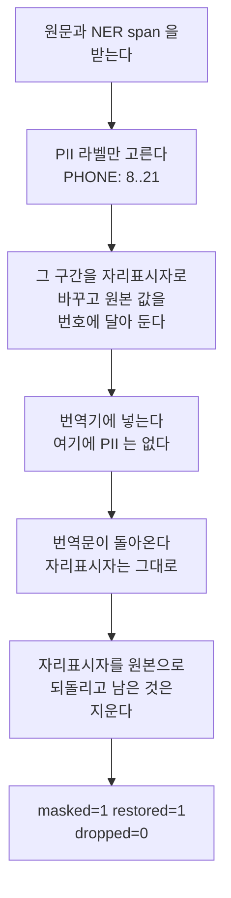
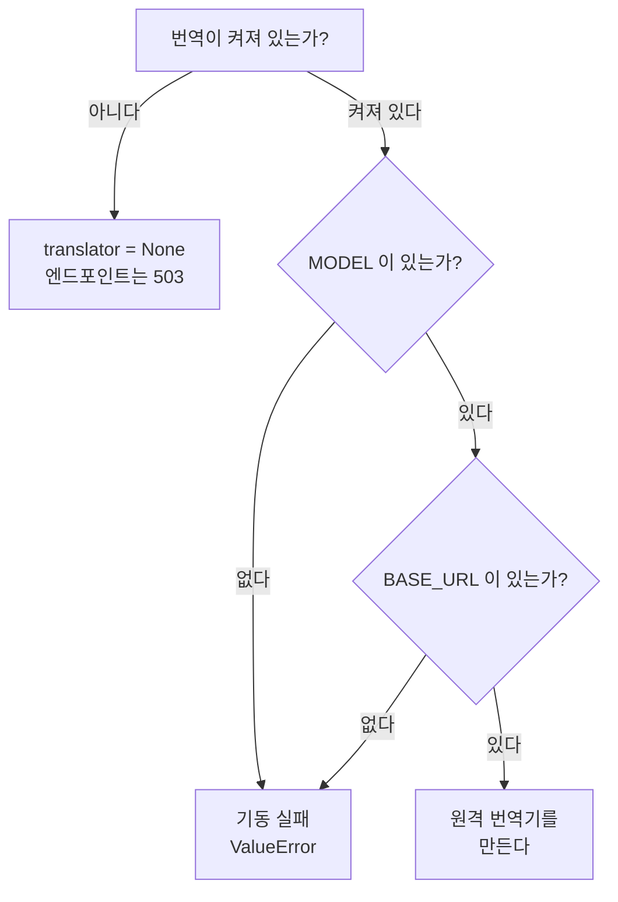
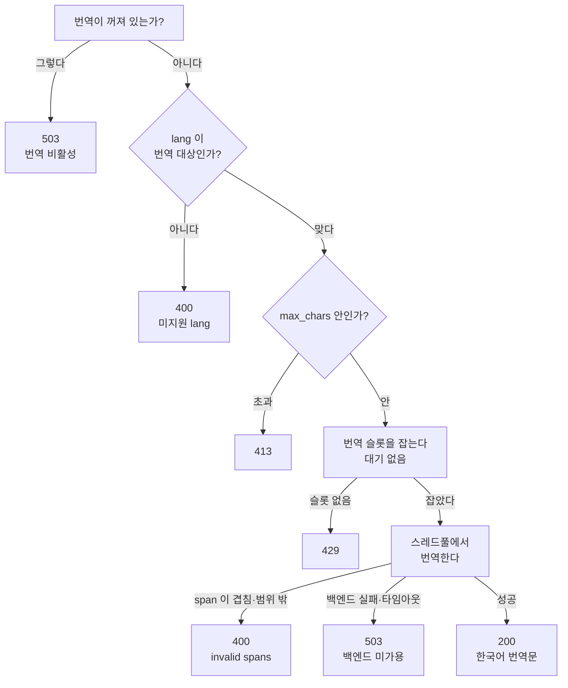

# 웹 데모 번역 구현

> **이 문서가 하는 일**: 웹 데모 번역(`/v1/translate`)의 구현을 함수·알고리즘
> 수준에서 고정한다 — 마스킹-복원 계약, 설정 검증, 동시성·엔드포인트 배선.
> **대상 코드**: `src/server/translate.py` · `app.py`(엔드포인트·guard) ·
> `config.py`(설정 필드)
> **테스트**: `tests/server/test_translate.py`

이 문서가 **안 하는** 일도 적어 둔다. env 설정 표면과 "왜 그렇게 갈랐나"의
정본은 `src/server/CLAUDE.md` §번역 설정 표면이고, 여기서는 목록을 다시 싣지 않고
가리키기만 한다. `/v1/translate` 는 외부 소비자 계약(`docs/manual/rest-api-
spec.md`)에 **없다** — 웹 데모 전용이라 OpenAPI 에도 노출하지 않는다. 설계 경위와
실측 원본은 `docs/issues/issue-189-web-ja-vi-ko-gloss.md` 에 있다.

## 1. 설계 제약

데모 UI 를 보는 사람이 번역 대상 언어를 못 읽으면 하이라이트가 맞는지 판단할 수
없다. "원문을 한국어로도 보여 준다"가 요구지만, 두 제약이 구현 형태를 거의 다
정한다.

| 제약 | 따라오는 결론 |
|---|---|
| 외부 번역 API 금지 — 입력 원문 PII 를 제3자로 보낼 수 없다 | 번역기는 온프렘 LLM(사내 vLLM 등 OpenAI 호환) |
| PII 는 원문 그대로 보존, 고유명사는 한글 음차 | 방향이 반대인 두 요구라 통짜 번역으로는 불가 — PII 만 가리고 나머지는 통과시킨다 |

두 번째가 **마스킹-복원**의 근거다. `090-1234-5678` 은 한 글자도 바뀌면 안 되지만
`織田信長` 은 "오다 노부나가"가 돼야 쓸모가 있다. 번역기를 타이르는 대신, PII 는
아예 넘기지 않고 고유명사만 통과시킨다.

## 2. 구성 요소

| 파일 | 역할 |
|---|---|
| `src/server/translate.py` | 마스킹-복원 코어(`_mask`·`_restore`·`_sentinel`) + 번역기 `LLMTranslator` + 설정 검증(`_validate`·`build_translator`) |
| `src/server/app.py` | `/v1/translate`·`/v1/translate/status` 라우트, 번역 전용 `ConcurrencyGuard` |
| `src/server/config.py` | `translate_*` 설정 필드 |
| `src/server/static/index.html` | 온디맨드 "한국어 번역 보기" 버튼 |

엔드포인트는 번역기 구현을 모른다 — `create_app` 이 주입받는 객체가
`translate(text, lang, spans) -> TranslationResult` 와 `available() -> bool`
둘만 내면 된다. 테스트가 stub 을 꽂아 전 경로를 모델 없이 도는 것도 이 계약
덕분이다.

## 3. 마스킹-복원

### 3.1 전체 흐름



```text
원문   : 織田信長の電話は090-1234-5678です。
마스킹 : 織田信長の電話は【PIIf8ca01_0】です。
번역   : 오다 노부나가의 전화는 【PIIf8ca01_0】입니다.
복원   : 오다 노부나가의 전화는 090-1234-5678입니다.
```

| 단계 | 함수 |
|---|---|
| PII 선별·치환 | `_mask` |
| 자리표시자 문자열 생성 | `_sentinel` |
| 번역 호출 | `LLMTranslator.translate` |
| 복원·잔여 제거·회계 | `_restore` |

PII 탐지는 이 모듈이 하지 않는다. 호출자(웹 페이지)가 `/v1/ner` 결과 span 을
그대로 넘기고, 여기서는 그중 PII 라벨만 고른다 — 즉 **PII 보존은 NER recall 에
종속된다**(설계 시점에 감수한 한계, issue-189 결정 로그).

```python
PII_LABELS = frozenset({'DAT', 'EMAIL', 'PHONE', 'ID_NUM', 'CREDIT_CARD'})
```

고유명사(`PER`·`LOC`·`ORG`·`PROD`·`EVT`)는 일부러 마스킹하지 않는다 —
마스킹하면 원문이 그대로 남아 음차가 안 된다.

### 3.2 자리표시자 표기

표기는 `{괄호}{프로세스 nonce}{번호}{괄호}` 세 조각이며, 셋 다 고정이다.

```python
_SENTINEL_TAG = f'PII{secrets.token_hex(3)}_'   # 프로세스 기동 시 1회
_SENTINEL_LEFT = '【'
_SENTINEL_RIGHT = '】'
_SENTINEL_RE = re.compile(
    rf'{re.escape(_SENTINEL_LEFT)}{re.escape(_SENTINEL_TAG)}'
    rf'(\d+){re.escape(_SENTINEL_RIGHT)}')


def _sentinel(i: int) -> str:
    return f'{_SENTINEL_LEFT}{_SENTINEL_TAG}{i}{_SENTINEL_RIGHT}'
```

| 조각 | 왜 그렇게 |
|---|---|
| 괄호 | lenticular bracket 은 LLM 경로 생존율 100% 다. 프롬프트가 "이 표기를 그대로 두라"고 지시하므로 표기와 프롬프트는 함께 움직인다 |
| nonce | 프로세스마다 다르고 응답에 안 실려 **클라이언트가 예측할 수 없다.** 없으면 `【PII0】` 을 원문에 심어 복원의 전역 치환을 오염시킬 수 있다 |
| 번호 | 매핑 키. 복원은 이 번호로 원본 값을 찾는다 |

> **핵심 — nonce 는 성능이 아니라 신뢰 경계 장치다.** 표기는 두 번 진화했다.
> 최초 `【PII0】` 은 일본어 자연 표기(`【重要】`·`【9】`)와 충돌해 잔여 청소가 원문을
> 지웠고, 접두를 분리한 뒤에도 클라이언트가 형식을 **일부러** 심는 경로가 남아
> nonce 가 들어왔다(issue-189 refuter 라운드 1·2).

### 3.3 `_mask` 의 계약

```python
def _mask(text, spans) -> tuple[str, Dict[int, str]]:
```

| 규칙 | 이유 |
|---|---|
| `PII_LABELS` 인 span 만 대상, `start_char` 오름차순 정렬 | 비PII 는 번역기를 통과해야 한다 |
| 범위 밖(`0 <= start < end <= len(text)` 위반) → `ValueError` | 잘못된 슬라이스는 PII 조각 노출로 이어진다 |
| 겹치는 span → `ValueError` | `/v1/ner` 은 비중첩만 생성한다. 겹친 채 자르면 원본 슬라이스가 어긋난다 |
| **오른쪽 span 부터** 치환 | 앞에서부터 바꾸면 길이 차이만큼 뒤쪽 오프셋이 밀린다 |

반환은 `(마스킹된 텍스트, {번호: 원본 문자열})`. PII 가 없으면 원문과 빈 매핑을
그대로 돌려준다. 두 `ValueError` 는 엔드포인트에서 400 으로 매핑된다(§6).

### 3.4 `_restore` 의 계약

```python
def _restore(translated, id2val) -> tuple[str, int, int]:
```

번역문에서 각 자리표시자를 원본 값으로 치환하고 `(복원된 텍스트, 복원 수, 소실
수)`를 낸다. 매핑에 없는 잔여 자리표시자(환각·부분 소실)는 화면 노이즈이므로
`_SENTINEL_RE` 로 지우는데, **그 정규식은 nonce 를 포함한 우리 형식만 잡는다** —
원문에 있던 `【N】` 같은 자연 표기는 건드리지 않는다.

### 3.5 보장의 범위

> **핵심 보장** — PII 는 **보존되거나 부재하거나** 둘 중 하나이며, 훼손·유출되지
> 않는다. 자리표시자가 번역 중 사라지면 그 PII 는 결과 문장에 안 나올 뿐,
> 잘못된 값으로 바뀌거나 번역기에 노출되지는 않는다.

이 보장이 **좁다는 점이 중요하다.** 소실이 에러가 아니라 '부재'라 호출자에게
신호가 없다 — 화면에서 전화번호·이메일이 그냥 사라지고 아무 표시가 남지 않는다.
회계는 `TranslationResult` 가 들고 있고, `dropped_pii > 0` 이면
`logger.warning` 을 남긴다.

```python
@dataclass
class TranslationResult:
    lang: str
    translation: str
    masked_pii: int
    restored_pii: int
    dropped_pii: int
```

## 4. 설정 검증

### 4.1 미설정과 설정의 구별

키 목록·기본값의 정본은 `src/server/CLAUDE.md` §번역 설정 표면이다. 여기서는
**구현이 의존하는 성질** 하나만 고정한다.

> **핵심 — 선택 키는 `config.py` 에서 기본값 없이 `Optional[...] = None` 이다.**
> 기본값을 config 가 채우면 "안 준 것"과 "그 값을 준 것"이 구별되지 않는다.
> 실효 기본값은 값을 아는 쪽이 나중에 넣는다 — timeout 30 은 `translate.py` 의
> `DEFAULT_TIMEOUT_S`. compose 도 같은 이유로 번역 키에 기본값을 주지 않는다
> (`${VAR:-}`).

### 4.2 기동 시점에 실패시키는 두 조건



둘 다 기본값을 두지 않은 것이 이 검증의 전부다. 예전에는
`NER_SERVER_TRANSLATE_BASE_URL` 이 `http://localhost:8081/v1` 을 기본으로 가져,
주소 없이 번역을 켜도 서버가 뜨고 그 포트에 떠 있던 아무 모델이나 번역기가 됐다.
설정 파일만 보고 무엇을 부르는지 알 수 없는 상태였고, 기동 실패는 그 상태를
없애려고 고른 대가다.

### 4.3 `build_translator` 와 번역기 계약

```python
def build_translator(config):
    if not getattr(config, 'translate_enabled', False):
        return None
    _validate(config)
    timeout_s = config.translate_timeout_s
    return LLMTranslator(
        base_url=config.translate_base_url, model=config.translate_model,
        api_key=config.translate_api_key,
        timeout_s=DEFAULT_TIMEOUT_S if timeout_s is None else timeout_s,
    )
```

`LLMTranslator` 의 프롬프트는 세 규칙을 준다 — ① `【…】` 자리표시자는 위치·형태를
바꾸지 말 것 ② 고유명사는 한글 음차 ③ 번역문만 출력. 호출 실패·타임아웃은 원인을
로그에만 남기고 `TranslationUnavailable` 로 올린다(내부 정보 비노출). `available()`
은 3초 타임아웃으로 모델 목록을 한 번 조회해 엔드포인트 liveness 를 본다.

## 5. 번역과 NER 의 예산 분리

`app.py` 가 `ConcurrencyGuard` 를 **둘** 만든다 — NER 용과 번역 전용(상한
`TRANSLATE_MAX_CONCURRENCY`, 기본 2)이다. 번역 한 건은 원격 LLM 응답을 초 단위로
기다리므로, 예산을 함께 쓰면 그동안 추론 슬롯이 막힌다. 두 guard 가 서로의 예산을
잠식하지 않는다는 것을 양방향으로 고정해 둔다(§7 동시성).

**번역 guard 에는 큐를 두지 않는다**(`max_queue=0`). 번역은 온디맨드 버튼이라
수십 초 기다리게 하느니 즉시 429 로 돌려보내고 UI 가 NER 결과만 보여 주는 편이
낫다. NER guard 는 반대로 큐를 두고 기다린다 — 그쪽은 소비자 API 라 거절보다
지연이 낫기 때문이다.

## 6. 엔드포인트 배선

둘 다 `include_in_schema=False` — 외부 소비자 계약은 여전히 `/v1/ner` 하나다.

### 6.1 `POST /v1/translate`

| | |
|---|---|
| 요청 | `{text: str, lang: 'ja'\|'vi'\|'en', spans: [Span]}` — `spans` 는 `/v1/ner` 결과 그대로 |
| 응답 | `{lang, translation}` |
| 인증 | `require_key`(env `API_KEY` 설정 시에만 검증) |



크기 상한은 `/v1/ner` 과 같은 `max_chars` 를 재사용한다(`_check_text`). 동기
번역 호출은 `run_in_threadpool` 로 감싸 이벤트 루프를 막지 않는다.

### 6.2 `GET /v1/translate/status`

`{enabled, available}` 를 낸다. `enabled` 는 서버 토글, `available` 은 번역
엔드포인트 liveness 다. UI 가 페이지 로드 시 1회 조회해 버튼을 켜거나 끄며,
폴링하지 않는다.

### 6.3 웹 UI 쪽 배선

`static/index.html` 의 "한국어 번역 보기" 버튼이 온디맨드로 `/v1/translate` 를
부른다. 클라이언트 타임아웃은 `AbortController` 로 45초이고, 503 을 받으면 버튼을
다시 끄고 안내 문구로 바꾼다 — NER 하이라이트는 그대로 남는다(graceful degrade).

## 7. 테스트 맵

```bash
uv run pytest tests/server/test_translate.py
```

가중치도 원격 엔드포인트도 필요 없다 — 번역기가 원격 호출 하나라 stub 으로 전
경로가 상시 돈다.

| 묶음 | 대표 테스트 | 검증 내용 |
|---|---|---|
| 마스킹-복원 코어 | `test_mask_hides_pii_from_translator` · `test_restore_preserves_pii_verbatim` · `test_dropped_sentinel_absent_not_corrupted` | PII 미노출 · verbatim 복원 · 소실은 '부재'(훼손 아님) |
| 오프셋·선별 | `test_multiple_pii_offsets_preserved` · `test_non_pii_spans_not_masked` | 오른쪽부터 치환 · 고유명사 통과 |
| 자연 표기 충돌 | `test_natural_bracket_text_preserved` · `test_literal_sentinel_lookalike_in_source_untouched` | 원문 `【…】` 보존 · 클라이언트가 심은 유사 표기 무해 |
| span 거절 | `test_overlapping_spans_rejected` · `test_out_of_bounds_span_rejected` | `ValueError` → 400 |
| 표기 고정 | `test_sentinel_uses_lenticular_brackets` | 괄호와 nonce 가 프롬프트가 지시하는 표기 그대로 |
| 설정 검증 | `test_disabled_builds_nothing` · `test_model_is_required` · `test_base_url_is_required` | §4.2 의 두 조건 · 비활성은 `None` |
| 배선 | `test_valid_config_builds_translator` | 필수 둘이 갖춰지면 번역기가 만들어진다 |
| 엔드포인트 계약 | `test_translate_disabled_returns_503` · `test_translate_unsupported_lang_400` · `test_translate_backend_unavailable_503` · `test_status_*` | §6 상태코드 · `available` 의미 |
| 번역 대상 언어 | `test_translate_rejects_ko_even_though_ner_supports_it` · `test_web_ui_translatable_list_matches_the_server` | ko 는 400 · UI 목록과 서버 목록의 일치 |
| 동시성 | `test_translate_concurrency_bounded_and_excess_rejected` · `test_ner_saturation_does_not_block_translation` | 상한 포화 시 429 · 두 guard 의 예산 독립 |

## 8. 관련 문서

| 문서 | 무엇을 |
|---|---|
| `src/server/CLAUDE.md` | env 설정 표면 · 모듈 오리엔테이션 · 설계 근거(정본) |
| `docs/manual/rest-api-spec.md` | 외부 소비자 계약 — `/v1/translate` 는 여기 **없다** |
| `docs/issues/issue-189-web-ja-vi-ko-gloss.md` | 마스킹-복원 도입 · 엔진 선정 벤치 · sentinel 표기 진화 경위 |
| `docs/issues/issue-254-drop-inprocess-translate-backend.md` | 인프로세스 백엔드 폐기 경위(설정 표면이 단일 경로로 줄어든 이유) |
