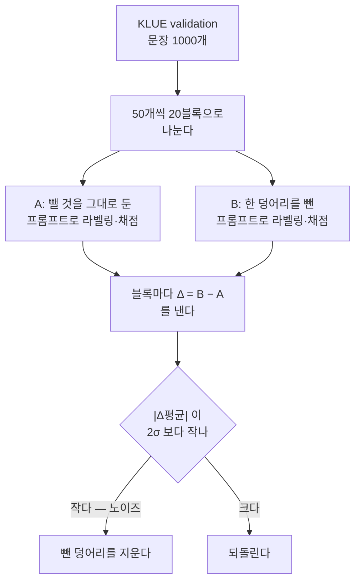

# 한국어 NER 프롬프트 — 중복 지시문 제거 ablation

<!-- certified: llm_labeler/ko/issue210-prompt-dedup -->

| | |
|---|---|
| 측정 서버 | gemma4 (`localhost:8081`, `cyankiwi/gemma-4-31B-it-AWQ-8bit`, GPU 1) |
| 데이터 | KLUE validation 앞 1000 문장 |
| 채점 | `BenchmarkRunner`(`eval_mode=bio`) pooled strict span F1 |
| 원본 산출물 | `certified/llm_labeler/ko/issue210-prompt-dedup/` |

## 왜 쟀나

한국어 프롬프트가 규칙 추가로 계속 자라 컨텍스트 예산을 넘겼고, ko 벤치마크가 전건
400 으로 실패했다(#210). 예산을 되찾는 가장 값싼 길은 **지시문 안에서 같은 규칙을 두 번
말하는 자리**를 걷는 것이다 — 그런 자리가 실제로 있었다. 다만 LLM 프롬프트에서 중요
규칙의 반복은 준수율을 올리기도 하므로, 빼도 되는지는 **빼보고 F1 을 재야** 안다.

재야 하는 또 다른 이유가 있다. 원장(`certified/`)에는 classifier 와 번역 벤치마크만
있고 **LLM 라벨러 프롬프트 자체의 metric 이 없었다.** 그래서 프롬프트를 손볼 때마다
"이게 나빠졌나" 를 판단할 기준이 매번 없었다. 이 측정이 그 첫 기준이다.

## 어떻게 쟀나 — 기준을 재기 전에 못 박았다

같은 문장으로 A(그 덩어리를 그대로 둔 구성)와 B(그 덩어리를 뺀 구성)를 각각 돌려
블록마다 Δ 를 낸다. 재고 나서 기준을 정하면 유리한 쪽을 고르게 되므로, 판정식과 블록
크기를 **측정 전에 이슈에 등록했다.**

**두 측정은 이어 붙였다 — ORG 쪽은 증분 측정이다.** 규칙 5번 측정의 A 는 손대지 않은
원본이지만, ORG 측정의 A 는 **규칙 5번을 이미 뺀 구성**(= 앞 측정의 B)이다. 그래서 ORG
측정이 답하는 것은 *채택 구성 위에서* ORG 중복을 더 걷어도 되는가이다.



- **σ 는 50샘플 블록별 Δ 의 표준편차**다. 블록을 키우면 σ 가 작아져 기준이 엄격해지고
  줄이면 헐거워지므로, 크기를 바꿔 유리한 결과를 만들 수 없게 50 으로 먼저 고정했다.
- `band_k = 2.0` 은 이 저장소가 노이즈 밴드에 이미 쓰는 값이다(`src/ner/validity/`).
- `temperature=0` 이지만 **완전 결정적이지는 않다.** 같은 프롬프트(규칙 5번 측정의 B 와
  ORG 측정의 A)를 다른 실행에서 돌린 결과가 20블록 중 6블록에서 갈렸다 — 차의 평균
  −0.00089, 표준편차 0.00220 으로 ORG 효과의 3분의 1쯤 된다. 배치 구성이 달라지며 생기는
  부동소수점 비결정성이다. 이 실행 노이즈는 **블록 간 σ 안에 이미 들어 있다** — Δ 를
  서로 다른 두 실행의 차로 재기 때문이다. 그래서 σ 를 시드 반복이 아니라 블록 간 분산으로
  잡았고, 판정은 그대로 선다.

### 무엇을 뺐나 — 프롬프트 수술의 정확한 자리

측정 스크립트는 `results/`(gitignore·휘발) 에 있었으므로, 재현에 필요한 정의를 여기 남긴다.
두 경우 모두 원문을 문자열 치환 한 번으로 바꿨고 나머지는 손대지 않았다.

| 측정 | A | B = A 에서 바꾼 것 |
|---|---|---|
| 규칙 5번 | 원본 | "핵심 규칙" 5번 항목을 통째로 삭제하고 6·7번을 5·6번으로 재번호 |
| ORG 중복 | 규칙 5번 제거본 | ORG 절 마지막 주의줄의 목록·예시를 걷고 가리키는 문장만 남김 (아래) |

```
- 주의: 민간 회사·기업·은행("삼성전자")·언론/방송사("엠비씨")·스포츠 구단/리그("두산 베어스",
  "프리미어리그", "LPGA")·군·군부대·법원·검찰·종교조직은 ORG 아님(아래 비-entity).
  사건명("부림사건")·대회명은 EVT, 프로그램명("황금어장")·작품명·상품명은 PROD
+ 주의: 정부·정치 기관이 아닌 조직은 ORG 아님 — 목록은 아래 비-entity (2).
  사건명("부림사건")·대회명은 EVT, 프로그램명("황금어장")·작품명·상품명은 PROD
```

토큰 수는 **문장을 뺀 고정 지시문** 기준이다(gemma 토크나이저): 원본 5623 → 규칙 5번
제거 5320 → ORG 중복 제거 5268. 문장을 넣어 재면 그 문장의 토큰만큼 일제히 올라가므로,
어느 기준으로 재는지를 섞으면 차이가 안 맞는다.

## 결과 — 두 덩어리 모두 노이즈 안

<!-- certified: llm_labeler/ko/issue210-prompt-dedup/summary.json -->

| 뺀 덩어리 | 뺀 토큰 | Δ평균 | σ | 2σ | 판정 |
|---|---|---|---|---|---|
| 핵심 규칙 5번 | 303 | −0.00059 | 0.00342 | 0.00685 | 통과 |
| ORG 절의 중복 목록 | 52 | −0.00242 | 0.00533 | 0.01067 | 통과 |

### 핵심 규칙 5번 — EVT·PROD 절의 재진술

"핵심 규칙" 섹션 524 토큰 중 5번 한 항목이 303 토큰이었다. 내용은 위 EVT·PROD 절을
통째로 다시 쓴 것이고, 거기서만 나오는 새 정보는 *"모호하면 우선순위
LOC→ORG→PROD→EVT"* 한 줄뿐이었다. 블록별 Δ 의 부호가 양 7 · 음 8 · 동일 5 로 거의
균등하게 갈렸고, 더 엄격한 2SE(0.00153)로 재도 통과한다. **제거 확정.**

### ORG 절의 중복 목록 — 비-entity 절이 이미 적고 있다

ORG 절이 *"민간 회사·언론/방송·스포츠 구단… 은 ORG 아님(아래 비-entity)"* 라고
가리키면서 목록을 다 적고, 바로 아래 비-entity 절이 같은 목록을 또 적었다. 목록·예시만
걷고 가리키는 문장과 그 줄에만 있는 정보(사건명→EVT, 프로그램·작품·상품명→PROD)는
남겼다.

**사전 등록 기준으로는 통과라 제거했다. 다만 규칙 5번과 모양이 다르다.** 점추정이
4배 크고 음수이며, 부호가 음으로 기울었고(양 3 · 음 8 · 동일 9), 규칙 5번이 여유롭게
넘긴 참고 지표 2SE 를 아슬아슬하게 못 넘는다(0.00242 vs 0.00239).

그럼에도 제거한 것은 **판정식을 결과를 본 뒤에 바꾸지 않기 위해서**다. 2σ 는 측정 전에
등록한 기준이고 2SE 는 참고로 함께 본 값이다. 결과가 나온 다음 더 엄격한 쪽을 골라
결론을 뒤집으면, 다음번에는 반대 방향으로 고를 수 있게 된다 — 기준을 미리 못 박는
장치가 그 순간 무의미해진다.

**대신 이 경계는 기록으로 남긴다.** 이 정리로 F1 이 실제로 0.002 남짓 내려갔을
가능성은 배제되지 않았다. 얻은 것은 52 토큰이고, 프롬프트를 더 손볼 때 이 표를 기준선
삼아 같은 절차로 재면 된다.

## 이 결과의 한계

**52 토큰은 예산 문제가 아니다.** `max_tokens` 를 1024 로 낮추면 실제 한계는 7168
토큰이고 규칙 5번을 뺀 지시문이 5320 이라 1848 여유가 있다. ORG 중복 제거가 버는
52 토큰은 그 여유의 3% 다 — 이 측정이 답한 것은 예산이 아니라 **중복 진술을 걷어도
준수율이 안 떨어지나** 라는 프롬프트 위생 문제다.

**절대 F1 이 0.46 대인 것은 모델이 나빠서가 아니다.** KLUE gold 에 있는 QT·TI 를
프롬프트가 아예 뽑지 않아 생기는 구조적 miss 이며, A·B 양쪽에 똑같이 걸리므로 Δ 비교는
유효하다.

**두 측정 모두 라벨러 결함이 고쳐지기 전에 돌았다.** 동기 API 가 호출마다 이벤트 루프를
새로 만들어 연결 풀이 첫 루프에 묶이는 결함 때문에 1000 샘플 중 몇 건이 전송 오류로
빠졌다. 다만 **A·B 가 같은 블록에서 같은 개수만큼 빠져** paired 구조는 유지됐다(순차
처리라 실패 위치가 결정적이다). 재측정하지 않은 것은 이 때문이다.

**토크나이저마다 토큰 수가 다르다.** 위 토큰 수는 gemma 기준이며, 최종 지시문 5268 이
Qwen3.6 에서는 4947 토큰이다. 예산 검사는 이 차이를 흡수하도록 벽에서 한 벌 물러나
잡는다(`tests/ner/labelers/test_prompt_token_budget.py`).

## 남은 것

- **few-shot 예시 16개는 이번 대상이 아니다.** 예시는 반복이 정상이라 지시문 중복과
  성격이 다르다.
- 엔티티 설명 절의 편중(EVT 1250 · PROD 680 토큰으로 전체의 34%)은 손대지 않았다.
  중복이 아니라 규칙 자체의 양이라, 줄이려면 규칙을 바꿔야 한다.
