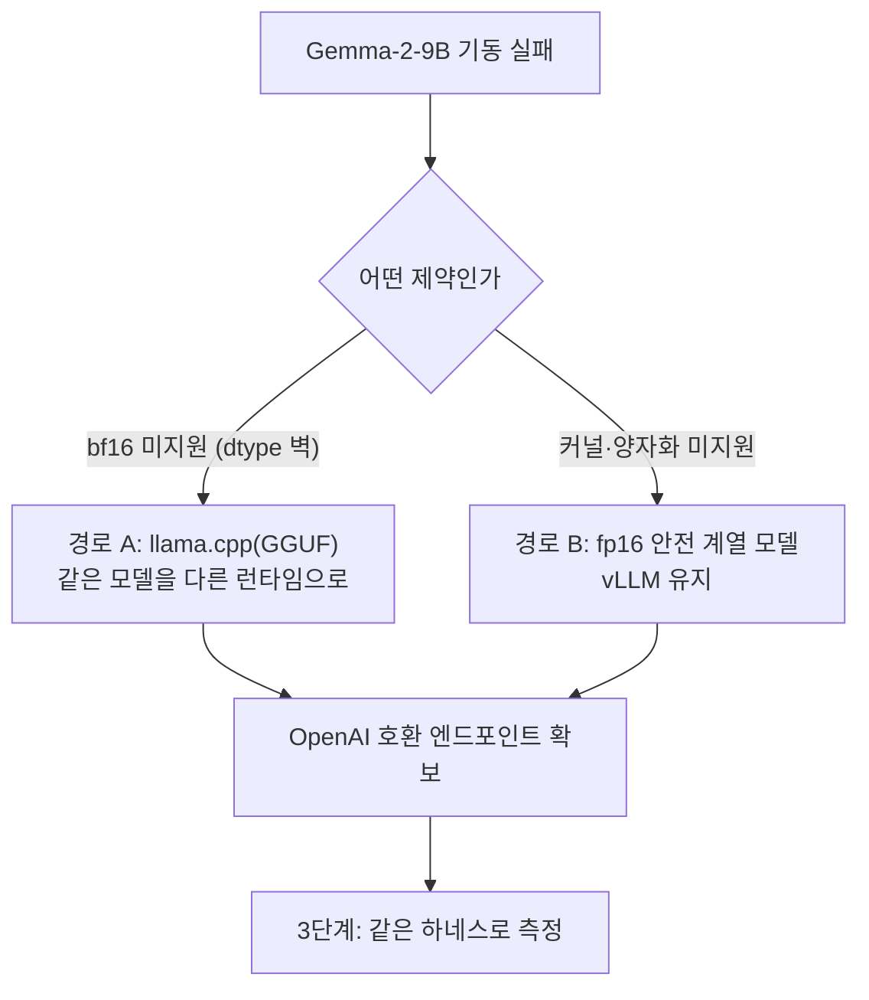

# 2080Ti 번역 엔진 실측 런북 (임시)

> **이 파일은 임시다.** 2080Ti 실측이 끝나면 결과를
> `translate-engine-lightweight-benchmark.md` 에 흡수하고 **PR 시 삭제**한다.
> 작업 대상 브랜치: `chore/translate-lightweight-model-bench`.

A6000 박스에서 경량 번역 엔진 후보를 스윕해 품질 순위는 확정했으나, 실제 배포
대상인 **2080Ti(Turing, cc 7.5)에서 무엇이 뜨는지**는 예측만 있고 실측이 없다.
이 문서는 그 박스에서 돌릴 절차·확인사항이다. 예측을 더 쌓지 말고 **실기 에러
로그로 판단한다.**

## 지금까지 확정된 것 (A6000, 재측정 불필요)

28문장(ja 14 / vi 14, PII 24 span) 평가셋 기준. 상세는
`translate-engine-lightweight-benchmark.md`.

| 엔진 | 4-bit VRAM | PII 보존 | 뜻전달 ja/vi | 음차 ja/vi | VI 중국어오염 |
|---|---|---|---|---|---|
| Gemma-4-31B(천장) | ~31GB(8bit) | 24/24 | 87% / 91% | 97% / 99% | 0 |
| Gemma-2-9B | ~6GB | 24/24 | 73% / 63% | 100% / 96% | 0 |
| Qwen2.5-14B | ~10GB | 24/24 | 71% / 63% | 84% / 76% | 5/14 |
| Qwen2.5-7B | ~5.5GB | 24/24 | 36% / 43% | 83% / 74% | 4/14 |

- PII 보존은 **모델 크기와 무관하게 전원 100%** — 마스킹-복원의 구조적 보장.
  즉 PII 안전은 엔진 선택 기준이 **아니다**.
- 품질 1위 Gemma-2-9B 는 vLLM 에서 **bf16 전용**이라 Turing 에 안 올라갈
  것으로 보인다(A6000 에서 fp16 거부·fp32 커널 실패 확인). **이 예측을 실기에서
  확인하는 것이 1단계다.**
- Qwen 계열은 크기 무관 VI→KO 중국어 코드스위칭으로 탈락 — 2080Ti 에서 뜨더라도
  되살리지 않는다.

## 열린 질문 (이 박스에서 답할 것)

1. Gemma-2-9B 가 정말 안 뜨나? (뜨면 최선 시나리오 — 곧장 3단계)
2. 안 뜨면 무엇이 뜨나? — llama.cpp(GGUF) 백엔드 / fp16 안전 계열 모델
3. 문장당 지연은? (A6000 값은 이전 불가 — Turing 은 Marlin·FA2 폴백)
4. NER 추론과 **동시 상주** 시 VRAM 피크는?
5. 품질이 A6000 결과와 같은가? (커널이 다르면 `temperature=0` 이라도 갈릴 수
   있음)

## 절차

### 0) 준비

```bash
git fetch origin && git checkout chore/translate-lightweight-model-bench
uv sync
nvidia-smi --query-gpu=index,name,memory.total,memory.free --format=csv
```

평가셋은 커밋돼 있으므로 **재생성하지 않는다**(`build_eval_set` 불필요 —
같은 셋을 써야 A6000 결과와 비교된다). HF 접근이 막힌 망이면 모델을 미리
받아 `/work/.huggingface`(마운트 경로)에 넣어둔다.

### 1) 블로커 확인 — 2분

```bash
cd docker/vllm && CUDA_VISIBLE_DEVICES=0 ./start-gemma2-9b.sh
docker logs -f vllm-gemma2-9b
```

- **실패 예상**: bf16 미지원(`compute capability ... 8.0`) 류. → 2단계로.
- **성공하면**: 예측이 틀린 것이니 그대로 3단계(가장 좋은 결과).
- 에러 줄은 그대로 기록한다 — 어느 제약에 걸렸는지가 대안을 가른다.

### 2) 대안 띄우기 (1단계 실패 시)



**경로 A — llama.cpp(GGUF)**: `llama-server` 도 OpenAI 호환
`/v1/chat/completions` 를 제공하므로 `server.translate` 와 벤치 하네스는 **손대지
않는다**. Gemma-2 를 Turing 에서 돌리는 현실적 경로이고, 품질 순위를 그대로
승계할 수 있어 **우선 시도 대상**이다.

**경로 B — fp16 안전 계열**: vLLM 을 유지하되 모델을 바꾼다. Qwen2.5 는 fp16 으로
돌지만 VI→KO 오염으로 이미 탈락했으므로 미시험 후보(Llama-3.1-8B·EXAONE-3.5-7.8B
·Qwen3-8B 계열의 AWQ/GPTQ 4-bit 빌드)가 대상이다. 정확한 repo id 는 HF 에서
확인한다. 기동 예:

```bash
docker run -d --name vllm-cand --gpus all -e CUDA_VISIBLE_DEVICES=0 \
  -v /work/.huggingface:/root/.cache/huggingface --ipc host -p 8081:8081 \
  vllm/vllm-openai:v0.23.0 --model <repo-id> --dtype float16 \
  --gpu-memory-utilization 0.85 --max-model-len 4096 --host 0.0.0.0 --port 8081
```

### 3) 벤치 — 엔진이 무엇이든 동일

```bash
# 지연만(로컬 판정자 없음)
uv run python -m server.scripts.translate_bench.run_bench \
  --engine <이름> <모델> http://localhost:8081/v1 --no-judge

# 품질까지: 판정자를 A6000 박스로 (LAN 도달 시)
#   --judge-url http://<A6000-IP>:8082/v1 \
#   --judge-model cyankiwi/Qwen3.6-35B-A3B-AWQ-4bit
```

산출: `results/translate_bench/{summary.json,bench_results.jsonl,dump.md}`
(gitignore·휘발). 품질 대조는 A6000 `summary.json` 과 나란히 놓고 본다.

### 4) NER 공존 VRAM

번역과 NER 을 **다른 카드**에 둔다(NER ~2GB, BERT 라 KV 없음).

```bash
cd docker/server && NER_SERVER_GPU=1 docker compose up -d
nvidia-smi --query-gpu=index,memory.used,memory.free --format=csv
# 동시 부하: NER 예제 클라이언트와 벤치를 함께 돌려 피크 확인
uv run python -m server.scripts.example_client --base-url http://localhost:8008
```

## 기록할 것 (체크리스트)

- [ ] `nvidia-smi` 출력(카드·VRAM·드라이버) — 11GB 인지 22GB 개조판인지
- [ ] 1단계 실패/성공 + **에러 줄 원문**
- [ ] 최종 채택 엔진: 런타임(vLLM/llama.cpp)·모델·양자화·dtype·`max-model-len`
- [ ] 지연: `summary.json` 의 `latency_mean_s`·`latency_max_s`(ja/vi)
- [ ] 품질: `adequacy_mean`·`translit_mean` + A6000 대비 차이
- [ ] VI 출력 오염 여부(중국어 혼입·프롬프트 에코) — `dump.md` 육안 확인
- [ ] NER 공존 시 카드별 VRAM 피크
- [ ] 온디맨드 UX 유지 가능한 지연인지 판단(현행 기준 수 초)

## 함정 (A6000 세션에서 실제로 겪은 것)

- **vLLM 동시 기동 금지** — 여러 컨테이너를 한꺼번에 올리면 inductor 컴파일이
  경합해 OOM·로드 정체가 난다. 하나가 `/v1/models` 에 응답한 뒤 다음을 올린다.
- **`--rm` 쓰지 말 것** — 죽으면 로그까지 사라져 원인 파악이 불가능하다.
  `docker rm -f` 로 직접 정리한다.
- **KV 예산** — `gpu-memory-utilization` 이 낮으면 가중치 적재 후 KV 가 부족해
  `estimated maximum model length` 에러로 죽는다. 11GB 전담 카드면 util 0.85 +
  `max-model-len` 4096 에서 시작한다.
- **`pkill -f "...run_bench"` 자기매칭** — 명령줄에 같은 문자열이 있어 셸이
  자신을 죽인다. `pkill -f "[r]un_bench"` 처럼 대괄호를 쓴다.
- **stdout 버퍼링** — 백그라운드 벤치는 `PYTHONUNBUFFERED=1` 없이는 로그가
  끝날 때까지 안 보인다.
- **gemma2 dtype 벽** — vLLM 이 `float16` 을 모델 타입 수준에서 거부하고
  (`does not support float16`), `float32` 는 Marlin 커널에서
  `c must be passed for W4A8-FP4` 로 실패한다(A6000 에서도 재현). 즉 bf16
  외 경로가 없다.

## 마무리

결과가 나오면 `translate-engine-lightweight-benchmark.md` 에 "2080Ti 실측" 절을
더하고(측정 환경·엔진·지연·VRAM·품질 대조), **이 런북 파일은 삭제**한 뒤 PR 을
올린다.
