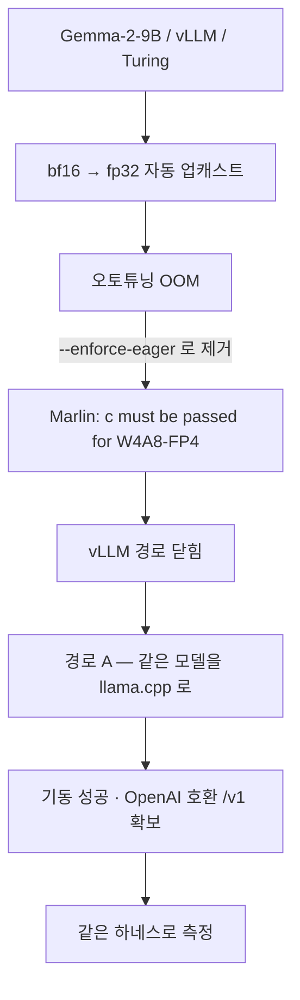

# 경량 번역 엔진 벤치마크 — 소형 GPU 온프렘 배포 후보 선정

- 측정일: 2026-07-24
- 대상: `Gemma-4-31B`(천장) vs `Gemma-2-9B` / `Qwen2.5-14B` / `Qwen2.5-7B`,
  모두 4-bit, JA·VI→KO
- 실행: `uv run python -m server.scripts.translate_bench.build_eval_set` →
  `uv run python -m server.scripts.translate_bench.run_bench --engine <name>
  <model> <base_url> …`

웹 데모 한국어 글로스(issue-189)가 채택한 온프렘 LLM 번역기 `Gemma-4-31B`를,
**2080Ti 급 소형 GPU(11GB, NER 추론과 VRAM 공유)** 환경에서 돌릴 수 있는
경량 후보로 대체 가능한지 측정했다.

결론은 둘로 갈린다:

- **품질·크기**: **Gemma-2-9B(4-bit)** 가 소형 후보 중 최적이다 — 품질 최고
  + VI→KO 신뢰성 100% + VRAM/속도 최적(~6GB).
- **배포 가능 범위**: 그러나 이 모델은 vLLM 에서 **bf16 전용**이라 **2080Ti
  (Turing)에는 올라가지 않는다**(실측 확인). 2080Ti 는 런타임 교체
  (llama.cpp/GGUF) 또는 fp16 안전 계열 재스윕이 필요하다 — §권고 참조.

> 이 벤치는 issue-189의 미해결 질문("평가셋·벤치 하네스 repo 승격")도 함께
> 해소한다. 하네스는 `src/server/scripts/translate_bench/`로 승격됐다.

## 배경 — 왜 다시 재나

issue-189은 마스킹-복원 PII 보존 + 음차 품질을 근거로 온프렘 `Gemma-4-31B`
(vLLM `:8081`)를 채택했다. 그러나 이 모델은 AWQ-8bit로도 ~31GB라 **2080Ti
두 장(11GB×2)에는 올라가지 않는다.** 게다가 같은 박스가 NER 추론(BERT,
~2GB)도 돌려야 하므로, 실질 예산은 22GB가 아니라 **번역 전담 단일 카드
~9–10GB**다(카드 하나는 NER, 하나는 번역). 이 예산에 맞으면서 PII 보존과
VI→KO 품질을 지키는 최소 모델을 찾는 것이 목표다.

## 방법 (동결)

- **하드웨어**: 번역 품질은 원칙적으로 하드웨어 독립(같은 가중치·같은 양자화면
  같은 출력)이라 유휴 **RTX A6000**(GPU0)에서 측정했다. 다만 Turing(2080Ti)은
  커널이 폴백되므로 출력이 미세하게 갈릴 수 있어 **품질도 실기에서 재확인**
  대상이다(§캐비엇). 후보는 2080Ti 정합을 위해 **4-bit 양자화**(AWQ /
  compressed-tensors)로 서빙했다. 지연은 A6000 값이며 2080Ti엔 그대로
  이전되지 않는다.
- **하네스**: `src/server/scripts/translate_bench/`. 프로덕션
  `server.translate.LLMTranslator`(실 nonce-sentinel 마스킹-복원)를 그대로
  태워 후보만 교체 — 벤치가 배포 코드 경로와 동일하다.
- **평가셋**: NTREX-128(뉴스, CC BY-SA 4.0) 유래 28문장(ja 14 / vi 14, 길이
  9–257자), 절반에 canonical PII 5종 suffix 주입(gold span 코드 보장, 총 24
  span). `data/eval_set.jsonl`로 동결. 빌더 `build_eval_set.py`.
- **지표**:
  - PII 보존(객관) — 원본 PII가 출력에 verbatim 생존한 수 / 마스킹 수
  - adequacy·translit — 중립 LLM-judge(`Qwen3.6-35B-A3B`, 후보 아님)로 뜻
    전달·고유명사 음차를 1–5 채점(표는 %환산; 원값 summary.json)
  - 지연 — 문장당 왕복 wall-clock
  - VI→KO 오염률(객관) — 출력의 중국어(Han) 혼입·프롬프트 에코 빈도
- **후보**: Gemma-4-31B(천장, 기존 배포) / Gemma-2-9B / Qwen2.5-14B /
  Qwen2.5-7B. 모두 `dtype=auto`(AWQ→fp16), `max-model-len` 8192(gemma9b는
  KV 예산상 4096).
- 수치 ↔ `results/translate_bench/summary.json`(휘발 scratch).

## 결과

VRAM은 4-bit 가중치 근사치. adequacy·translit는 judge 1–5 평균의 %환산
(ja / vi). 지연은 평균(ms).

| 엔진 | 4-bit VRAM | PII 보존 | adequacy ja/vi | translit ja/vi | 지연 ja/vi | 지연 max |
|---|---|---|---|---|---|---|
| **Gemma-4-31B** (천장) | ~31GB(8bit) | 24/24 | 87% / 91% | 97% / 99% | 3080 / 2680ms | 7890ms |
| **Gemma-2-9B** | ~6GB | 24/24 | **73% / 63%** | **100% / 96%** | 840 / 670ms | 2650ms |
| Qwen2.5-14B | ~10GB | 24/24 | 71% / 63% | 84% / 76% | 1150 / 1090ms | 2730ms |
| Qwen2.5-7B | ~5.5GB | 24/24 | 36% / 43% | 83% / 74% | 580 / 530ms | 1640ms |

두 가지가 즉시 드러난다:

- **PII 보존은 모델 크기와 무관하게 전원 24/24(100%)다.** 마스킹-복원이
  구조적으로 보장하는 부분이라 7B로도 sentinel을 지켜냈다 — 즉 PII 안전은
  모델 선택 기준이 아니다.
- **뜻전달(adequacy)은 크기 따라 급락한다.** 7B는 ja 36%로 낙제, 9B·14B가
  소형 최소선(63–73%), 31B(87–91%)와는 확연한 갭. **VI→KO가 더 어려워** 모든
  소형 모델이 vi 63%에서 상한에 걸린다.

## VI→KO 신뢰성 — 평균이 가린 실패

adequacy 평균만 보면 Qwen-14B(71/63%)와 Gemma-2-9B(73/63%)가 비슷해 보인다.
그러나 **VI 출력을 객관적으로 뜯어보면 Qwen 계열은 크기 무관 심각한 코드
스위칭 실패를 낸다** — 한국어 대신 중국어로 새거나 프롬프트를 그대로 에코한다.

| 엔진 | 중국어 혼입 | 프롬프트 에코 | 한글<50% | (VI 14문장 중) |
|---|---|---|---|---|
| Gemma-4-31B | 0 | 0 | 0 | 깨끗 |
| **Gemma-2-9B** | **0** | 0 | 0 | 깨끗 |
| Qwen2.5-14B | **5** | 2 | 4 | **36% 오염** |
| Qwen2.5-7B | 4 | 1 | 3 | 오염 |

실제 사례(같은 VI 문장):

- **Qwen-14B**: `"…교수가 시라큐스 대학교 맥마스터 학교的政治科学教授格兰特·里赫尔对《希尔》杂志…电子邮件：…"` — 문장 중간부터 중국어로 파탄.
- **Qwen-7B**: 번역 대신 프롬프트 규칙(`규칙: 1) 문장에 있는 【…】…`)을 그대로 출력.
- **Gemma-2-9B**: `"일부 일은 다시 할 수 없는 일이 있다," 그랜트 리허, 시라큐즈 대학교 맥스웰 학교 정치학 교수는…"` — 불완전해도 한국어를 끝까지 유지.

프로덕션 번역 기능에서 **VI 입력 3건 중 1건이 중국어로 나오는 것은 치명적**
이다. Gemma 계열(9B·31B)은 오염 0%로, 불완전할지언정 항상 한국어를 낸다.

## 권고 — Gemma-2-9B (4-bit)

세 축 모두에서 소형 최적이다:

1. **품질**: 소형 후보 중 adequacy 최고(ja 73%, 더 큰 14B도 앞섬), translit
   최고(ja 100% / vi 96%).
2. **신뢰성**: VI→KO 중국어 오염 0% — Qwen 탈락 사유를 정면으로 피한다.
3. **Fit**: ~6GB로 가장 작아 소형 카드의 NER 공존 예산(단일 카드 ~9–10GB)에
   KV 여유까지 남기고, 속도도 가장 빠르다(840/670ms). 단 이 fit 이 실현되는
   범위는 Ampere 이상이다(아래).

- **Qwen2.5-14B·7B 탈락**: 크기와 무관한 중국어 코드스위칭. 7B는 뜻전달까지
  붕괴(ja 36%).
- **배선 비용 0**: `server.translate`가 OpenAI 호환이라 `NER_SERVER_TRANSLATE_
  {BASE_URL,MODEL}`만 Gemma-2-9B 엔드포인트로 바꾸면 코드 변경 없이 교체된다.

### 단, 배포 가능 범위는 Ampere 이상이다 (실측 확인)

**Gemma-2-9B w4a16 은 vLLM 에서 bf16 전용이라 2080Ti(Turing, cc 7.5)에는
올라가지 않는다.** 세 dtype 을 모두 시험한 결과다.

| dtype | 결과 | 근거 |
|---|---|---|
| bf16(`auto`) | **동작** — 위 벤치가 이 경로 | Ampere 이상 전용(Turing 미지원) |
| float16 | **거부** | vLLM 설정 검증: `model type 'gemma2' does not support float16. Reason: Numerical instability` |
| float32 | **실패** | Marlin 커널: `RuntimeError: c must be passed for W4A8-FP4` (A6000 에서도 재현) |

float16 거부는 **모델 타입 수준**이라 양자화를 바꿔도 남고, Turing 은 bf16 이
없으니 남는 선택지가 float32뿐인데 그 경로가 커널에서 깨진다. 따라서 이 권고는
**Ampere 이상 배포에 한정**된다.

**2080Ti 대안** — 둘 중 하나를 골라야 한다.

1. **런타임 교체**: llama.cpp(GGUF) `llama-server` 도 OpenAI 호환
   `/v1/chat/completions` 를 제공하므로 `server.translate` 는 그대로 두고
   백엔드만 바꾼다. Gemma-2 를 Turing 에서 돌리는 현실적 경로.
2. **모델 교체**: fp16 이 안전한 계열로 후보를 다시 스윕한다(Qwen2.5 는 fp16
   으로 돌지만 §VI→KO 신뢰성에서 탈락했으므로 Llama-3.1-8B·EXAONE-3.5·
   Qwen3-8B 등 미시험 후보가 대상). 같은 하네스로 재현 가능하다.

## 캐비엇

- **N=28(PII 24 span) 소규모** — 방향성 신호이지 정밀 순위가 아니다.
- **지연은 A6000 값이다**: 위 지연·순위는 이 카드 기준의 상대 비교다. 다른
  카드(특히 Turing 은 Marlin·FlashAttention-2 가 없어 폴백)에 배포하면
  **절대 지연·VRAM 공존은 실기에서 재측정**해야 한다. 커널이 다르면 수치가
  미세하게 달라져 `temperature=0`이라도 출력이 갈릴 수 있으므로, 최종 배포
  엔진은 **품질도 실기에서 같은 하네스로 재확인**한다(판정자만 이 박스
  엔드포인트로 붙여 두 결과의 `summary.json`을 대조).
- **Turing 배포 불가(확인됨)**: Gemma-2-9B w4a16 은 vLLM 에서 bf16 전용이라
  2080Ti 에 올라가지 않는다 — 상세·대안은 §권고의 "배포 가능 범위" 참조. 기동
  스크립트 `docker/vllm/start-gemma2-9b.sh` 는 Ampere 이상 기준(`dtype=auto`)
  이다.
- **judge 편향은 결론을 위협하지 않는다**: 판정자가 Qwen 계열이라 Qwen에
  유리할 텐데도 Gemma-2-9B가 judge 점수·오염률 모두에서 이겼다 — 편향 방향이
  결론과 반대라 오히려 강건하다.
- **소형 공통 한계**: VI→KO adequacy가 9B·14B 모두 63%에서 막힌다(31B는
  91%). Gemma-2-9B는 "실용 가능"이지 "31B 대체"가 아니다 — 자동 번역 대신
  현행 온디맨드 버튼 UX를 유지하고 품질 기대치를 조정하는 편이 맞다.
- **gemma9b 기동 주의**: `gpu-memory-utilization`이 낮으면(관측: 0.18) 가중치
  후 KV 예산이 부족해 기동 실패한다 — `max-model-len` 축소(4096)나 util 상향
  필요. 2080Ti 공존 배포 시 이 튜닝이 핵심 변수다.

## 2080Ti 실측

- 측정일: 2026-07-27
- 목적: 위 §권고가 남긴 미해결 질문 — 실제 배포 대상인 Turing 에서 **무엇이
  뜨는가** — 를 예측이 아니라 실기 로그로 확정한다.
- 평가셋은 A6000 과 **같은 동결본**(`data/eval_set.jsonl`, 28문장)을 재생성 없이
  그대로 썼다. 하네스·`server.translate` 도 무수정이다 — 바뀐 것은 엔진뿐이라
  두 박스의 수치가 나란히 놓인다.
- 수치 ↔ `certified/translate_bench/2080ti-gemma2-9b-gguf-q4km/summary.json`.

### 측정 환경

| 항목 | 값 |
|---|---|
| GPU | NVIDIA GeForce RTX 2080 Ti (Turing, cc 7.5) **11264 MiB × 2** — 22GB 개조판 아님 |
| 드라이버 / CUDA | 580.126.09 / 13.0 |
| 카드 배치 | GPU0 = NER 서버(상주), GPU1 = 번역 엔진 |

카드가 두 장이라 §권고가 상정한 "번역 전담 단일 카드" 예산이 그대로 성립한다.

### 1단계 — Gemma-2-9B(vLLM)는 뜨지 않는다 (확인됨)

`docker/vllm/start-gemma2-9b.sh` 를 GPU1 에서 그대로 돌렸다. **결론은 §권고의
예측대로 기동 실패**지만, **걸린 지점이 예측과 달랐다.**

예측은 "vLLM 이 `float16` 을 모델 타입 수준에서 거부한다"였다. 실제로는 v0.23.0
이 거부 대신 **bf16 → float32 자동 업캐스트**를 했다:

```
WARNING [model.py:2030] Your device 'NVIDIA GeForce RTX 2080 Ti' (with compute
        capability 7.5) doesn't support torch.bfloat16. Falling back to
        torch.float32 for compatibility.
INFO    [model.py:2077] Upcasting torch.bfloat16 to torch.float32.
INFO    [compressed_tensors_wNa16.py:112] Using MarlinLinearKernel for CompressedTensorsWNA16
ERROR   [fa_utils.py:171] Cannot use FA version 2 is not supported due to FA2 is
        only supported on devices with compute capability >= 8
INFO    [cuda.py:378] Using TRITON_ATTN attention backend out of potential
        backends: ['TRITON_ATTN', 'FLEX_ATTENTION']
```

FA2 미지원은 TRITON_ATTN 폴백으로 흡수돼 기동을 막지 않았다. 대신 그 fp32 가
두 단계로 연달아 벽을 만들었다:

| 시도 | 설정 | 죽은 지점 | 에러 원문 |
|---|---|---|---|
| ① | `dtype=auto`, `max-model-len` 4096 | inductor 오토튜닝 | `torch._inductor.exc.InductorError: RuntimeError: Failed to run autotuning code block: CUDA out of memory. Tried to allocate 3.42 GiB. GPU 0 has a total capacity of 10.57 GiB of which 2.61 GiB is free.` |
| ② | `+ --enforce-eager`, `max-model-len` 2048 | Marlin GEMM | `RuntimeError: c must be passed for W4A8-FP4` (`vllm/_custom_ops.py:1397` `marlin_gemm`) |

①은 fp32 업캐스트로 가중치가 7.95 GiB 를 점유한 뒤 오토튜닝이 3.42 GiB 를 더
요구해 11GB 카드에서 터진 것이다. 이건 커널 문제가 아니라 예산 문제라
`--enforce-eager` 로 오토튜닝 자체를 제거해 한 번 더 시도했고, 그러자 **가려져
있던 진짜 벽**이 드러났다 — A6000 에서 예고한 Marlin 의
`c must be passed for W4A8-FP4` 다. util 상향·컨텍스트 축소로는 넘을 수 없는
지점이므로 **vLLM 경로는 여기서 닫힌다.**

기록 가치가 있는 차이는 이것이다 — 벽의 **존재**는 예측대로였지만 **도달 경로**는
달랐다. fp32 업캐스트가 OOM 을 먼저 일으켜 커널 실패를 가리므로, `--enforce-eager`
없이 로그만 보면 "VRAM 만 더 있으면 된다"로 오독하기 쉽다.

### 2단계 — 채택 엔진: llama.cpp(GGUF)

§권고의 경로 ① 을 먼저 시도했고 **한 번에 떴다.** 경로 ②(fp16 안전 계열
재스윕)는 불필요해져 시행하지 않았다.



| 항목 | 값 |
|---|---|
| 런타임 | llama.cpp `server-cuda` (빌드 `b10143-88b47a755`) |
| 모델 | `bartowski/gemma-2-9b-it-GGUF:Q4_K_M` → 실제 파일 `gemma-2-9b-it-Q4_K_M-fp16.gguf` |
| 양자화 / dtype | GGUF Q4_K_M (출력·임베딩 텐서 fp16 변형) — **fp32 업캐스트 없음** |
| 컨텍스트 | `-c 4096`, 슬롯 4개 (`n_ctx_slot` 4096) |
| 오프로드 | `-ngl 99` (전 레이어 GPU) |

llama.cpp 는 Turing 에서 bf16 을 요구하지 않고 Q4_K 커널이 cc 7.5 를 직접
지원하므로, vLLM 을 막은 두 벽(업캐스트·Marlin)이 **둘 다 발생하지 않는다.**
`server.translate` 와 벤치 하네스는 손대지 않았다 — llama-server 가 OpenAI 호환
`/v1/chat/completions` 를 그대로 제공해 엔드포인트 교체만으로 끝났다.

### 3단계 — 지연·PII (28문장, 판정자 없음)

```bash
uv run python -m server.scripts.translate_bench.run_bench \
  --engine gemma2-9b-gguf bartowski/gemma-2-9b-it-GGUF:Q4_K_M \
  http://localhost:8081/v1 --no-judge
```

28행 0에러. 지연 단위는 초.

| lang | n | PII 보존 | lat_mean | lat_p50 | lat_max |
|---|---|---|---|---|---|
| ja | 14 | 12/12 (100%) | 1.25 | 1.22 | 3.03 |
| vi | 14 | 12/12 (100%) | 1.07 | 1.09 | 1.80 |

PII 보존은 A6000 의 모든 후보와 같이 **24/24** 다 — 마스킹-복원이 구조적으로
보장하는 부분이라 런타임·양자화를 바꿔도 그대로였다. §결과가 이미 짚었듯 이건
엔진 선택 기준이 아니므로, 이 실측에서도 판단에 쓰지 않는다.

콜드 스타트는 별개로 보아야 한다. `--no-warmup` 으로 띄우면 **첫 요청 1회만
약 32초**(CUDA 커널 초기화)가 걸리고 이후 정상 상태로 떨어진다. 상주 서비스라
사용자가 겪는 값은 위 표지만, 배포 시 워밍업을 켜거나 기동 직후 더미 요청 한
번을 흘려 이 1회를 흡수하는 편이 낫다.

### 품질 — 판정자 미도달, 객관 지표로 대체

**adequacy·translit 는 이번에 측정하지 못했다.** 중립 판정자
(`Qwen3.6-35B-A3B-AWQ-4bit`)가 A6000 박스에만 있고 이 박스에서 도달하지 않아
`--no-judge` 로 돌렸다 — `summary.json` 의 `adequacy_mean`·`translit_mean` 은
`null` 이다. 따라서 **A6000 대비 품질 차이는 이 실측으로 확정되지 않는다.**

대신 판정자가 필요 없는 객관 지표로 출력을 검사했다. §VI→KO 신뢰성이 Qwen 탈락
근거로 삼은 것과 같은 축이다(`dump.md` 육안 + 스크립트 집계).

| 축 | vi (14) | ja (14) | A6000 Gemma-2-9B |
|---|---|---|---|
| 중국어(Han) 혼입 | 0 | — | 0 |
| 프롬프트 에코 | 1 | 0 | 0 |
| 한글 <50% | 0 | 0 | 0 |
| 본문에 원문 문자 잔류 | 0 | 2 | (미집계) |

읽어야 할 것은 두 가지다.

- **VI→KO 오염 0 은 유지됐다.** Qwen 계열을 탈락시킨 중국어 코드스위칭이
  llama.cpp/Q4_K_M 경로에서도 나타나지 않았다 — 채택의 핵심 근거가 런타임 교체를
  건너 살아남았다.
- **A6000 에 없던 흠 두 가지가 새로 보인다.** 프롬프트 에코 1건은 PII 가 아예
  없는 문장(`ntrex-vi-0952`, `has_pii=False`)인데 출력 앞에 마스킹 마커
  `【PII…】` 가 환각으로 붙었다. 원문 문자 잔류 2건은 ja 본문에 가나·한자가
  남은 것이다(`아이브로ックス`, `司法委員会`) — PII 로 verbatim 복원된 문자열은
  제외하고 센 값이라 복원 동작과는 무관한 번역 실패다.

이 흠들이 **양자화 차이(w4a16 → Q4_K_M) 때문인지, 런타임 차이 때문인지, 아니면
N=14 의 표집 요동인지는 이 데이터로 가릴 수 없다.** 판정자를 붙여 같은 축으로
재기 전까지는 "A6000 대비 열화"라고 말할 근거가 없고, 반대로 "동등"이라고 말할
근거도 없다.

### 4단계 — NER 공존 VRAM

NER 서버(GPU0)와 번역 엔진(GPU1)에 **동시에** 부하를 걸고 1초 간격으로 75회
샘플링했다(번역 8스트림 × 6요청, NER 은 예제 클라이언트의 동시 200요청 과부하
시나리오 포함). 두 부하 모두 정상 완료했다(NER `DEMO PASS`, 과부하 구간 429 정상).

| 카드 | 역할 | 피크 (MiB) | 총량 대비 | 여유 (MiB) |
|---|---|---|---|---|
| GPU0 | NER 서버 (BERT ja·vi) | 1524 | 14% | 9740 |
| GPU1 | 번역 (Gemma-2-9B Q4_K_M) | 8182 | 73% | 3082 |

GPU1 은 부하와 무관하게 8182 로 **일정하다** — llama.cpp 가 기동 시 KV 캐시를
선할당하기 때문이라, 동시 요청이 늘어도 VRAM 이 자라지 않는다. 즉 이 배치의
VRAM 위험은 런타임에 있지 않고 기동 파라미터(`-c`, 슬롯 수)에 있다.

카드가 분리돼 있어 두 서비스는 서로의 예산을 잠식하지 않는다. 한 장에 합치면
1524 + 8182 ≈ 9706 MiB 로 11264 안에 들어가는 것처럼 보이지만, 이 구성은
측정하지 않았으므로 권고 근거로 쓰지 않는다.

### 판단 — 온디맨드 UX 유지 가능

평균 1.25/1.07초, 최악 3.03초다. 현행 웹 데모의 **온디맨드 번역 버튼** UX
(사용자가 눌러야 번역이 시작되고 스피너를 보는 방식)에는 충분하다 — 버튼을 누른
뒤 3초 안에 끝나므로 기다림이 상호작용의 일부로 읽힌다. 반면 **자동 번역**
(입력·NER 결과에 따라 저절로 도는 방식)으로 바꾸기에는 느리다. §캐비엇이 이미
"자동 번역 대신 온디맨드 버튼 UX 유지"를 권했는데, 그 권고가 2080Ti 실측에서도
같은 방향으로 지지된다.

### 2080Ti 실측의 캐비엇

- **A6000 지연과 직접 비교하지 말 것.** A6000 의 840/670ms 는 vLLM + w4a16
  경로 값이고 여기 1.25/1.07초는 llama.cpp + Q4_K_M 경로 값이다. 하드웨어·런타임
  ·양자화가 **동시에** 바뀌었으므로 두 값의 차이를 카드 성능 차로 귀속할 수 없다.
  이 표는 "2080Ti 에서 실제로 이만큼 걸린다"는 절대값으로만 쓴다.
- **품질은 열린 채로 남았다** — 위 §품질 참조. 판정자에 도달하는 망에서
  `--judge-url` 을 붙여 같은 하네스로 한 번 더 돌리면 그대로 채워진다.
- **N=28 소규모**는 A6000 과 동일한 한계다. 새로 관측된 에코 1건·잔류 2건은
  방향 신호이지 비율 추정이 아니다.
- **경로 ②(fp16 안전 계열 스윕)는 미시행**이다. 경로 ① 이 성공해 불필요해졌을
  뿐, 그쪽이 더 나은지는 측정하지 않았다.

## 다음

하네스는 순수 HTTP 클라이언트라 GPU 를 쓰지 않는다 — 후보 서버만 띄우면 어느
박스에서든 같은 명령으로 돈다. 지연을 재려면 번역 서버와 같은 박스에서 돌린다.

```bash
# 후보 서빙(Ampere 이상) → 벤치
cd docker/vllm && CUDA_VISIBLE_DEVICES=0 VLLM_PORT=8093 ./start-gemma2-9b.sh
until curl -sf localhost:8093/v1/models >/dev/null; do sleep 5; done
uv run python -m server.scripts.translate_bench.run_bench \
  --engine <name> <model> http://localhost:8093/v1 \
  --judge-url http://localhost:8082/v1 \
  --judge-model cyankiwi/Qwen3.6-35B-A3B-AWQ-4bit    # 지연만 재면 --no-judge
```

- **Ampere 이상 배포**: Gemma-2-9B 로 진행 — 서버 번역
  env(`NER_SERVER_TRANSLATE_{BASE_URL,MODEL}`)를 이 엔드포인트로 배선한다.
- **2080Ti 배포**: 해결됨 — §2080Ti 실측 참조. 경로 ①(llama.cpp/GGUF)로
  확정했고 지연·VRAM 공존 피크를 실측했다. 기동은 위 vLLM 스크립트가 아니라
  llama.cpp 서버로 한다:

  ```bash
  docker run -d --name llamacpp-gemma2-9b --gpus all \
    -e CUDA_VISIBLE_DEVICES=1 -e LLAMA_CACHE=/root/.cache/huggingface/llamacpp \
    -v /work/.huggingface:/root/.cache/huggingface -p 8081:8081 \
    ghcr.io/ggml-org/llama.cpp:server-cuda \
    -hf bartowski/gemma-2-9b-it-GGUF:Q4_K_M \
    --host 0.0.0.0 --port 8081 -ngl 99 -c 4096
  ```

  `NER_SERVER_TRANSLATE_{BASE_URL,MODEL}` 을 이 엔드포인트로 배선하면 코드
  변경 없이 붙는다. 남은 일은 **품질 재확인 하나** — 판정자에 도달하는 망에서
  `--judge-url` 을 붙여 같은 하네스로 돌린다.
